[TOC]


# 一. 文档声明

 

一个基本的完整的HTML代码如下:

```
<!DOCTYPE html>
<html lang="en">
<head>
    <meta charset="UTF-8">
    <title>Title</title>
</head>
<body>

</body>
</html>
```


## 说明:

1. `<!DOCTYPE html>`  是html文档声明, 告诉浏览器当前的页面是HTML5页面, 让浏览器按照HTML5的语法格式去解析.  
2. html文档声明必须放在HTML文档的最前面, 不能省略, 省略了会出现兼容性问题
3. HTML5 的文档声明比 HTML4.01/ XHTML1.0 简洁非常多


# 二. HTML 元素

 

1. `html` 元素是HTML文档的根元素, 一个文档中只能有一个, 其它的所有元素都必须放在它里面
2. W3C 标准建议为html 元素增加一个 `lang ` 属性
   - lang属性的作用是帮助语言合成工具确定要使用的发音. 
   - 帮助翻译工具确定要使用的翻译规则

> 1. 比如说盲人, 他在浏览网页的时候是看不见网页的, 但是针对盲人其实是有些设备是可以帮助他们浏览网页的, 比如说有些语音合成工具, 它一浏览这个网页的时候就解析里面的文字, 解析里面的语言, 将内容转换成声音播放给盲人听
> 2. 比如说, 你使用google浏览器, html 标签中设置了 lang=en 的网页, 那么浏览器就会自动的提示你要不要使用google 插件将当前网页内容翻译成中文 

 


# 三. head 元素


1. head元素里面的内容是一些 `元数据`  *(元数据: 描述数据的数据)*

   >  一般用于描述网页的各种信息, 比如: `字符编码`  `网页标题` `网页图标` 等

   ```
   <head>
       <meta charset="UTF-8">
       <meta name="viewport"
             content="width=device-width, user-scalable=no, initial-scale=1.0, maximum-scale=1.0, minimum-scale=1.0"> 
       <title>Document</title>
   </head>
   ```

   


## 1. title 元素

title 元素是网页的标题


## 2. meta 元素

1. meta用于设置网页的字符编码, 让浏览器 

 


# 四. 文本相关CSS 属性


## 1. text-decoration 属性 (上中下划线)

> text-decoration 用于设置文字的装饰线 (上划线/ 下划线/ 清除下划线)
>
> 一般情况下, 文字的装饰线的颜色和文字的颜色是一样的, 如果需要单独设置需要使用ccs 的 text-decoration-color, 不过这个属性有兼容性问题

- none 无任何装饰线
  - 可以去除a元素默认的下划线
- underling 下划线
- overline 上划线
- line-through 中划线(删除线)

`u` `ins` 元素默认就设置了 text-decoration 为 underline

 


## 2. letter-spacing / word-spacing 属性 (文字间距)

> letter-spacing 和 word-spacing 分别用于设置字母和单词之间的间距
>
> 默认为0, 可以设置负数

- letter-spacing 用于控制字母与字母之间的间距的(中文/英文/标点都可以)

- word-spacing 用于控制单词与单词之间的间距, 只要是被空格分开的一段连续的字符, 都被它识别为单词


## 3. text-transform 属性(大小写转换)

> text-transform 属性用于设置文字的大小转换

- capitalize  将单词的首字母转换成大写
- uppercase 将所有字母转换成大写
- lowercase 将所有的字母转成小写


## 4. text-indent 属性(首行缩进)

> 首行文字缩进

- `text-indent: 10px`  首行缩进10px

- `text-indent: 2em` 首行缩进 2个文字大小


```
绝对单位: px
相对单位: em 
em单位是相对于font-size 进行计算的
2em 相当于font-size * 2
1em 相当于font-size * 1
```


## 5. text-align 属性 (水平

## 内容对齐方式)

>  设置内容在水平方向上的对齐方式

- left 左对齐
- center 居中对齐
- right 右对齐
- justify 两端对齐

注意: 是这只内容在水平方向上的对齐方式

> - 文字和图片都是内容
>- 这个属性会被子元素继承
> - 当内容的宽度超过或者等于元素的宽度时, 这个属性就不好使了 (这个是局限性)


# 五. 字体相关css属性


## 1. font-size属性

> font-size 属性决定文字的大小

常用的设置

- 具体数值 + 单位

  - 比如: 100px
  - 也可以使用 `em` 单位. eg: 1em代表100% , 2em代表200%, 0.5em代表50%

  

- 百分比

  - 基于父元素的font-size 计算, 比如: 50% 表示等于父元素 font-size的一半

```
div{
	font-size:2em;  // 此时的em 是相对父元素的font-size来参考的 // 相当于2 *父元素的font-size
	height: 2m;   // 此时的em 是相对于自己的font-size来参考的 // 相当于4 *父元素的font-size
}
```

>  一般给body设置font-size就代表设置网页的默认字体大小
>
> - 其它元素可以基于父元素设置字体大小
> - 到时候,只需要改变body的字体大小, 其它元素都会按照比例改变


## 2. font-family 属性

> 用于设置文字的字体名称
>
> - 可以设置1个或者多个字体的名称(从左向右顺序选择字体, 直到找到可用的字体就停止)

```
 div{ 
 	// 可以设置多个字体, 字体之间以逗号分割, 先从左往右找, 找到了就停止
   font-family:"Courier New", "微软雅黑";
 } 
```

如果想要中文显示中文字体, 英文显示英文字体, 需要将英文字体写在前面, 中文字体写在后面.


## 3. @font-face 导入字体


> @font-face 可以让网页支持自定义字体, 不再局限于系统自带字体.

常见的字体类型

- TrueType字体: 拓展名为 `.ttf`
- OpenType字体: 拓展名为 `.ttf` `.otf`  建立在TrueType字体之上
- Embedded OpenType字体: 拓展名为 `.oet` , OpenType 字体的压缩版
- SVG字体, 拓展名师`.svg` `.svgz`
- web开发字体: 拓展名是`.woff` , 建立在TrueType字体之上


并不是所有的浏览器都支持以上的字体, 使用时要多加测试

字体下载: http://font.chinaz.com


**具体使用步骤:  导入自定义字体并设置字体名字 -> 在选择器中通过自定义字体名使用自定义字体** 

```
<style>
		//1. 导入字体, 并给字体取名字
    @font-face{
    	// 字体文件的位置
    	src : url('font/miniCut.ttf');   // 可以有多个url, 之间使用逗号分割 
    	// 定义字体的名字
    	font-family: '迷你剪纸字体'
    }
    
    // 2. 在对应的选择器中使用自定义字体
    div{
    	font-family :'迷你剪纸字体'
    }
</style>
```


## 4. font-weight 属性

> font-weight 用于设置文字的粗细(重量)


可以设置下面的值

- `100` `200` `300` `400` `500` `600` `700` `800` `900`  每一个数字表示一个重量

- `normal` 等于400 的重量
- `bold`  等于是700的重量


一般开发中, 我们使用 数字来设置字体的重量, 这样比较明确.


实际上很多元素默认就是 `bold` 的重量:

```
strong	b	h1~h6 等标签默认的 font-weight 就是 bold
```


## 5. font-style 属性

> font-style 属性是用于设置文字的常规/ 斜体显示

可以使用的值

- normal  常规显示 (一般默认就是这种样式)
- italic 用字体的斜体样式    `(italic 是斜体的意思)`
- oblique 文本倾斜显示 ` (oblique 是倾斜的意思)`

**说明: ** 

一个字体可能包含正规字体/ 斜体, 也可能不支持斜体, 也就是说, 如果你使用的是 `italic` 那么 只有在当前使用的字体有斜体字时, 文字才会有 倾斜效果,否则没有. 

如果你使用的是 `oblique`那么不论当前使用的字体有没有斜体样式, 字体都会被倾斜显示


下面元素中的字体默认就是使用的是斜体 `italic`

```
em	i	cite	address	var	dfn 等   
```


## 6. font-variant 属性

> font-variant 可以影响小写字母的显示形式
>
> variant 是变体的意思

可以设置如下的值

- normal 常规显示
- small-caps 将小写字母替换为缩小的大写字母


```
div{
	font-variant: small-caps;
}

<body>
    Hello Good morning
    <div>
        Hello Good morning 
    </div> 
</body>
```

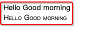 


## 7. font 属性


- **font** 是一个缩写属性(shorthand property)

  - 比如: `font-style`  `font-variant` `font-weight` `font-size/line-height` `font-family`

  ```
  div {
  	// 注意: font-size 与 line-height 之间的 / 不能省 
  	font: italic small-caps 700 20px/40px "微软雅黑";
  }
  ```

  > font-styly: 设置字体是否显示斜体
  >
  > font-variant: 设置字体中小写字母的样式, 要不要将小写现成成缩小的大写
  >
  > font-weight: 设置字体的重量 (粗细程度)
  >
  > font-size: 设置字体的大小
  >
  > line-size: 设置字体的最小行高
  >
  > font-family: 设置字体

  > 注意:
  >
  > - font 属性连写时, 书写书序是有要求的 , 一般按照  `font-style`  `font-variant` `font-weight` `font-size/line-height` `font-family` 的顺序书写, 连写时其中前面三个 `font-style`  `font-variant` `font-weight` 可以省略也可以调换顺序但是只能放在前面
  > - `/line-height` 可以省略, 如果不省略必须写在 `font-size` 后面 
  > - 也就是说font属性连写时,最重要的就是 **font-size 和 font-family**  不能省, 也不能 调换顺序

  ```
  div {
  	font: 20px "微软雅黑"; // 这是最简单的写法
  }
  ```

  


# 六 . CSS 选择器 selector

选择器的种类繁多, 大概可以归纳为: 

- 通用选择器   `*`
- 元素选择器 `div` `p` `span` 
- 类选择器 `.nav` `.box` 
- id选择器 `#header` 
- 属性选择器 `[attr=val]` `[attr~=val]` `[attr$=val]` `[attr|=val]` `[attr*=val]` `[attr^=val]` 
- 组合选择器 `div p`  `div>p` ` div+p`  `div~p` `div.one`  `div~p`


 


## 1. 标签选择器 (type Selector)

也有些地方称标签选择器为类型选择器.  写上标签名元素名即可

```
div{
	color: red;
}
```


## 2. 通用选择器 (Universal selector)

通用选择器, 选择所有的元素

```
*{
	color : red;
}
```

一般来说, 通用选择器的效率比较低,尽量不要使用


## 3. id 选择器 (id selector)

**使用场景:**

什么时候会使用`id选择器` , 如果想在一个HTML文档中给`唯一一个`的元素设置属性, 就可以使用id选择器. 注意是唯一一个.

**示例:** 

```
<style>
	#main-content{
		color:red;
	}
</style>
```

```
<body>
<div id="main-content">

</div>
</body>
```


**注意点:**

1. 一个HTML 文档里面的`id`值是唯一的,不能重复 *(即, 一个HTML文件里不能出现重复的id名)* 

2. id值如果由多个单词组成, 单词之间用中划线`-` 下划线`_` , 也可以是使用驼峰命名法.  根据html文档和css的特点, 建议使用中划线`-` 

3. 最好不要使用标签名作为id值, id名一般要写的有意义.

    

> 中划线 `-` 又叫连字符 (`hyphen`) , 在有些文章中有这个单词


## 4. 类选择器 (class selector)

注意: 

类选择器不是类型选择器, 类选择器是根据类型来选择, 而类型选择器是根据标签元素名来选择. 


**使用场景:**

 如果想给多个标签设置一坨相同的样式, 就可一个定义一个类选择器, 给多个标签添加这个类, 这样多个标签就设置了相同的一坨样式属性了


**示例: ** 

```
<style>
	.content{
		color: red;
	}
</style>
```


```
<p> 我是段落1 </p>
<p class="content"> 我是段落2 </p>
<p class="content"> 我是段落3 </p>
<p class="content"> 我是段落4 </p>
<p> 我是段落5 </p> 
```


> 一个标签可以有多个类, 不同的类之间使用 空格 隔开

```
<p class="one two three"> 我是段落 </p>
```


**总结:**

类选择器的特点, 把一些共性的样式抽到一个类里面, 随想要使用这个共性, 就在标签里面填

 

## 5. 属性选择器 ([attr = val]) 等于val

属性值等于val的选择器

```
[title="one"]{ // 属性名为title, title的值为 'one' 的选择器
	color: red;
}
[title="two"]{
	color: blue;
}
[id='username']{ //属性名为id, 属性值为 username的选择器 
	color: pink;
}
```

```
<div title='one'>title='one'</div>
<div title='two'>title='two'</div>
<div id="username">id="username"</div>
```

 

 

> `#test` 和 `[id='test']`  看起来好像一样, 其本质是不一样的


 

## 6. 属性选择器 ([attr ~= val]) 包含val单词

属性值包含 `val单词`的选择器, 且多个单词之间必须使用空格隔开

```
[title ~= 'one']{
	color: red;
}
```


```
<div title='testonetwo'> testonetwo</div>
<div title='testone two'>testone two </div>
<div title='test onetwo'> test onetwo</div>
<div title='test one two'> test one two</div>
```


 


## 7. 属性选择器 ([attr |= val])等于或val-开头

属性值恰好等于val或者以val开头且紧跟连字符的元素

```
[title |="one"]{
	color: red;
}
```


```
<div title='one'>one</div>
<div title='one-two'>title=one-two</div>
<div title='one two'>one two</div>
<div title='onetwo'>onetwo</div>
```

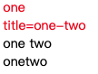 

 一般这个属性选择器 [attr |= val] 选择器是用在 `lang` 属性上面, 用于语言的区分

```
[lang |= 'zh']{
	color: red;
}
```

```
<div>
<span lang="en-US">美国英语</span>
<span lang="en-bz">巴西英语</span>
<span lang="zh">中文</span>
<span lang="zh-tw">繁体中文</span>
</div>
```


## 8. 属性选择器 ([attr ^= val]) 以val开头

属性值单词以 val 开头的元素

```
[title ^="one"]{ // 属性名为title, 属性值 以 one 开头的 所有元素
	color: red;
}
```


主要使用场景, 根据不同数据来源对展示做去区分.

比如: http与https 的连接不同, http存在安全风险, 在展示时根据内容提示用户

```
 [href ^="mailto://"]{
 	color: red;
 	background-color: green;
 }
```


```
<a href ="https://www.baidu.com"> 百度</a>
<a href ="https://www.baidu.com"> 网易</a>
<a href ="mailto://3588710396@qq.com"> 发邮件</a>
<a href ="mailto://690852195@qq.com"> 发邮件1</a>
```

 


## 9. 属性选择器 ([attr $= val]) 以val结尾

属性值以 val 结尾的选择器

```
[title $= "one"]{
	color: red;
}
```

```
<div title="one"> one</div>
<div title="twoone">twoone</div>
<div title="two one">two one</div>
<div title="two-one">two-one</div>
```

 


## 10. 属性选择器 ([attr *= val])包含val

属性值只要包含 val 就可以

```
[title *= 'usse']{ // 只要title 属性中包含 'user' 就可以
	color: red;
}
```


## 11. 后代选择器 (div p) 


> 后代选择器也被叫做后代选择器 .  只要是后代全部选中 

```
div span { // 找出div 元素里面的span元素, 包括直接, 间接元素, 只要,div里面的span就会被选择出来
	color: red;
}
```

```
<div>
	我是div	
	<span> span1</span>
	<p> <span> span2 </span> 我是p </p> 
</div>
```


## 12. 子组合选择器 (div>p)

>  资组合选择器, 也叫直接子元素选择器 (不包括间接元素)
>
> - 建议, 一般 `v` 符号两遍不要留空格,紧挨着就好, 否则容易和后代选择器搞混


```
div>span{   
	color: red;
}
```


```
<div>
	<span> 直接子元素1</span>
	<p> <span> 间接子元素</span> </p>
	<span> 直接子元素2</span>
</div>
```

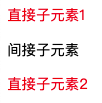 


## 13. 相邻兄弟组合选择器 (div+p)


> div 元素后面紧挨着的平元素 (div和p元素必须是兄弟关系)
>
> 相邻兄弟选择器, 也称为紧挨着兄弟选择器 

```
div+p{
	color: red;
}
```


```
<p>段落1</p>
<div>我是div</div>
<p>我是段落2</p>
<div>我是div</div>
<span>我是span</span>
<p>我是段落3</p>
```

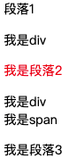 


## 14. 全体兄弟组合 (div~p)


> div 后面的平元素, div 与 p 之间必须是兄弟关系

```
div~p{
	color:red;
}
```

```
<p>段落1</p>
    <div>
        <p>段落2</p>
    </div>
    <p>段落3</p>
    <p>段落4</p>
    <span> span</span>
    <p>段落5</p>
```

 

 


## 15. 选择器组-交集 (div.one)

> 选择div元素里面有`.one` 类 的元素
>
> - 注意:  `div` 和 `.one` 之间是没有空格的, 紧挨着

```
div.one{ // 既要是div 元素, class 中也要有个 one
	color: red;
}

div.one[title='test']{// 既要是div元素, class里面又要有个one 且 title属性为 'test'
	color:blue;
}
```

```
<div class="one"> div.one </div>
<div class="two">div.two</div>
<div class="three">div.three</div>
<div class="one" title="test"> div.one  test </div>
```

 


## 16. 选择器组-并集(div,p,a)

> 选择器之间使用逗号`,` 隔开

```
div, .one, [title='test']{ // 这些选择器中只要符合一个就可
	color: red;
}

// 上面的写法等价于分开写, 如下
div{  
	color: red;
}
.one{  
	color: red;
}
 [title='test']{  
	color: red;
}
```


## 17. 伪类选择器 


### 1. 常见的伪类选择器 


伪类选择器的作用是给已经存在的类选择器增加一些额外的选择功能, 比如:

1. 可以通过`动态伪类`为已经存在的选择器增加一种`动态选择`的功能. **根据状态选择元素**
2. 可以通过`结构伪类` 根据html文档内的`元素的书写结构` 来选择对应的元素. **根据结构选择元素** 

3. 可以通过`否定伪类` 来排除要选择的元素. **排除一些不想选的,其它全选中**


> 说明, 所有的伪类选择器前面(即`:前`)可有有其它的选择器, 也可以没有单独使用, 如下: 

```
div:nth-child(1){ // 表示选择第一个子元素, 且必须是div类型
	color:red;
}

:nth-child(1){ // 表示选择所有的第一个元素, 只要是第一个子元素即可
	color:red;
}
```


 


##### 1. 动态伪类选择器

*动态伪类细节比较多* 

`:link` `:visited`  `:hover` `:active` `:focus` 

>  为已经存在的选择器增加一种**动态选择** 的功能
>
> - 除了`a` 元素, `:hove` `:active` 也能用在其它元素上, hover表示的是鼠标挪到了元素上, active表示鼠标左键按照元素上
> - `:hover` 必须放在 `:link` 和 `visited` 的后面才能生效
> - `:active` 必须放在`:hover` 的后面才能生效
>
> 建议顺序:  `:link` `:visited` `hover` `:active`   女朋友看到LV宝宝haha大笑
>
> - `:focus` 伪类, 聚焦动作选择器, 一般为`input` `textarea` 标签增加聚焦的选择, 也可用用在`a` 标签上, 如果用在`a` 标签上就和`:active`  差不错
>
> 因此, `a` 标签可以有5中伪类状态` :link` `:visited` `:focus` `:hover` `:actived` , 为了便于记忆, 女朋友看见LV宝宝(疯)一样的ha ha 大小


使用举例:

```
a:link{ // 未访问的连接
	color: red;
}
a:visited{ // 已访问的连接
	color: gree;
}
a:hover{ // 鼠标挪动到连接上
	color: orange;
}
a:active{ // 鼠标在连接上长按未松开, 鼠标左键按下不松开
	color:cyran;
}

input:focus{ // 文本框聚焦时选中
	color: blue;
}
```


>  提示:
>
> 因为默认情况下可以通过键盘上的`tab键` 在HTML网页中的多个 `input标签`  `a标签` `textarea标签`  之间切换, 让对应的`input标签` `textarea标签`  `a标签` 进入`:focus` 聚焦状态(外边显示蓝边), 这是浏览器的默认行为(google chrome 有这种行为, safar没这种行为)
>
> 为了决绝这种键盘上的`tap键` 让`a标签` 也出现蓝边这种行为, 只需要给`a标签` 设置`tabindex` 为`-1` 

 

```
// tabindex 是用于控制tab键被按下的选择顺序的, 当为-1 是表示不允许tab键切换
<input type="text" tabindex="1">
<input type="text" tabindex="2">
<input type="text" tabindex="3">
<input type="text" tabindex="4" >

<a tabindex="-1" href="http://baidu.com">afasd</a>
<a tabindex="-1" href="http://baidu.com">afasd</a>
<a tabindex="-1" href="http://baidu.com">afasd</a>
<a tabindex="-1" href="http://baidu.com">afasd</a>

// 注意: 通过选择器给a标签设置 tabindex 是不会生效的, 需要在 a标签内直接设置才会生效
```


**a标签样式细节**

如果, 我们想要`a` 标签在显示时, 所有的状态颜色都一样, 我们可以直接个`a` 标签设置`color` 属性, 相当于给` a:link` `a:visited` `a:focus` `a:hover` `a:active` 同时设置了`color`, 如下: 

```
a{ // 这样 link visited focus hover active 下的color就都为red了
	color: red; 
}
```

如果通过 `a{color:red;}` 设置了统一的颜色后还要有其它的状态颜色, 在后面使用伪类单独设置即可.

 

#####2. 结构伪类选择器

*所谓结构伪类, 就是根据元素的结构情况来选择对应的元素* 

`:nth-child()`  `:nth-last-child()` 

`:nth-of-type()` `:nth-last-of-type()`

`:first-child` `:last-child`

`:first-of-type` `:last-of-type`

`:root` `only-child` `only-of-type` `:empty`


- **:nth-child(num)** 

> 选择span元素, 并且span元素是他父元素中的第一个子元素 (直接子元素)
>
> **1. 如果span不是父元素的第1个元素就不选**  
>
> **2.如果发现span是父元素的第一个元素就选上, 与父元素的类型无关, 只要是父元素的第1个就可以** 

```
pan:nth-child(1){ // 只要是父元素的第一个元素是span 就选中, 与父元素的类型无关
	color:red;
}
```

```
<div>
    <span>div 我是span1</span>
    <span>div 我是span2</span>
    <span>div 我是span3</span>
    <p>
        <span>p  我是span1</span>
        <span>p  我是span2</span>
        <span>p  我是span3</span>
    </p>
</div><div>
    <span>我是span1</span>
    <span>我是span2</span>
    <span>我是span3</span>
    <span>我是span4</span>
    <span>我是span5</span>
</div>
```

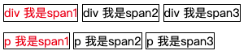 

> `:nth-child(num)` 的高级用法
>
> 1. 可以这样用 `span:nth-child(2n)` n 代表从0 开始的正整数 0,1,2,3,4,5…,  `span:nth-child(2n)` 表示取 2,4,6,8 ..位上的span子元素
> 2. 也可以这样用 `span:nth-child(even)` 等价于`span:nth-child(2n)`  evnt 是偶数的意思
> 3. 还可以这样写 `span:nth-child(2n+1)` n 代表从0 开始的正整数 0,1,2,3,4,5…,   `span:nth-child(2n+1)` 表示取 1,3,5,7. ..位上的span子元素
> 4. 也可以这么写 `span:nth-child(odd)`  等价于 `span:nth-child(1n)`  odd 是奇数的意思


**总结:**

1. `:nth-child()` 的完整使用的格式是 `:nth:child(an+b)`
   - `an+b` 表示的是选择父元素中的第 `an+b` 个子元素
   - `n` 代表任意正整数和0
   - `a` `b`  需要给出具体的数值, 可是`正整数` `负整数` 和 `0` 
2. 最重要的是css选择器在选择子元素时, 子元素的序号是从`1` 开始计算, 也就是说css在选择子元素时, 不存在选择 `第0` 位的子元素, 子元素最小的序号是`1`
3. 注意: 不要写成` :nth-child(2+n)` 变量 `n` 要写在前面, 否则失效


> **思考**
>
> 如何使用 `:nth:child()` 取出最前面的2个子元素
>
>  
>
> 答案: 
>
> span:nth-child(-n + 2){	// n 从0开始, -n表示 0, -1, -2,-3 
>
> ​	color:red;
>
> }
>
> 这里主要是利用的css选择器在选择子元素时, 子元素的序号为 大于0 的正整数, 小于1的整数都视为无效. 


- **nth-last-child(num)** 

> `:nth-last-child()` 的语法根`nth-child()` 类似, 不同点是`:nth-last-child()`  是从最后一个元素倒着查找, 其它的都一样. 只是反着数数而已


> **思考:**
>
> 如果想要达到前几个不选, 最后几个不选怎样实现
>
>  
>
> 答案: 使用 `nth:child()` 和 `nth-last-child()` 组合选择器完成
>
> span:nth-child(n+2):nth-last-child(n+2){	// 前2个不选, 后2个不选, 中间的选中
>
> ​	color:red;
>
> }


- **:nth-of-type(num)**

> `span:nth-of-type(num) `  是这样来查找的, 第一, 找出父元素内的所有的 `span` 元素, 如果所有的`span` 元素中有第`num` 个元素, 那么这个`span` 元素就是要找的元素. (直接子元素)
>
> 注意: 
>
> `span:nth-of-type(num)` 这种方式查找与`span` 元素前面有没有其他的元素没关系, 是要是父元素中的`span`类型的第`num` 个元素即可 


**总结:** 

1. `:nth-of-type(num)` 的完整格式是`:nth-of-type(an+b)` ,  其中  `an+b` 的计算与使用原理与`:nth-child(an+b)` 中的`an+b` 的使用和计算原理是一样的


- **:nth-last-of-type(num)**

> 使用方法同 `:nth-of-type(num)` 的用法是一样的, 只是索引的序号是倒着数.


- **:first-child()**

> `span:first-child` 表示找第一个子元素, 且子元素的类型必须是 span类型
>
> `span:first-child` 等价于`span:nth-child(1)` 


- **:last-child**

> 功能与`:first-child` 类似, 只是选择最后一个 

 

- **:root** 

> 根元素选择器, 一般表示的是获取 html 元素


- **empty**

> `:empty` 代表里面完全是空白的元素, 开始标签和结束标签之间没有任何内容

```
p{
  width: 100px;
  height:50px;
  background-color: green;
  margin: 10px;
  float: left;
}

p:empty{ // 选择完全没有内容的 p 元素
	border: 2px solid #f00;
}
```

```
<p></p>   							 // 完全空白
<p> 我是段落1</p> 
<p>   </p> 							// 空格也算内容
<p><span></span></p> 		// 其它标签也算内容
<p>我是段落2</p>
```

 


##### 3.否定伪类

> 含义: 否定伪类`:not(selector)` ,表示排除 `selector` 选择的元素后的所有元素
>
> 否定伪类选择器只支持简单选择, 不支持组合. 也就是说selector只能是`标签选择器,  类选择器 , 通用选择器, 属性选择器, 伪类选择器, id选择器`  
>
>  比如: 下面的写法是支持的

```
div:not(div.one){ // 错误写法
	color:red;
}
:not(div .one){   // 错误写法
	color:red;
}

:not(p):not(body):not(html){ // 表示选择所有, 除了p 除了body 除了 html 
	color:red;
}
```


**注意: ** 

*如果要同时排除一些元素, 必须要连着写, 如果分开就就失效了*  

*比如: 同时排除 p, body, html 就得按照下面连着写* 

```

:not(p):not(body):not(html){  
	border: 5px solid #000;
}
```


这样分开写, 就失效了

```
:not(p){  // 排除了p, 包含了body 和 html
	border: 5px solid #000;
}
:not(body){ // 排除了body, 包含了p 和 html
	border: 5px solid #000;
}
:not(html){  //// 排除了 html,包含了 p, body
	border: 5px solid #000;
}
```

 


##### 4. 目标伪类选择器

`:target` 


##### 5.  语言伪类选择器

`:lang()`


##### 6.  元素状态伪类选择器

- 元素状态伪类主要有以下3个,有时我们要根据元素的状态的不同现实不同的状态, 就需要用到元素状态伪类

  >  `:enabled` `:disabled` `:checked` 

  ```
  <style>
    input:enabled {
      background-color: pink;
    }
    input:disabled {
      background-color: red;
    }
    input:checked {
      outline: 2px solid #f00;
    }
  </style>
  ```

  ```
  <input  type="text" >
  <input type="text" disabled>
  男: <input type="checkbox" > 女: <input type="checkbox" checked>
  ```

  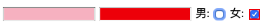 


# 七. 伪元素 


## 1. 常用的伪元素介绍

`:first-line` `::first-line`   

`:first-letter` `::first-letter` 

`:before` `::before`

`:after` `::after`

**伪元素前面可以写1个冒号, 也可以使用2个冒号, 是一样的意思**, 为了区分伪元素和伪类, 建议伪元素使用2个冒号, eg: `::first-line` 


伪类一般是代表**某种状态** 或者**某种位置** 或者**某种条件** 的, 而伪元素代表一种元素.


## 2. 伪元素 ::first-line (首行文字伪元素)


> `::first-line`  可以针对 **首行文本**  设置属性 

```
 div {
 	border: 1px solid #000;
 }
// 为首行文字设置背景色
div::first-line{
	background-color: #f00;
}
```

```
 <div>
 我是div 我是div 我是div 我是div 我是div 我是div 我是div 我是div 我是div 我是div 我是div 我是div 我是div 我是div
 </div>
```

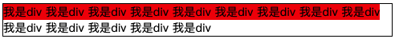 


**注意:** 

不是所有的属性都可以应用到 `::first-line` 伪元素上. 

只有, **字体属性**  **颜色属性**  **背景属性**   才能应用到`::first-line` 微元素上, 如下等等, 不知道试一下就好 

`word-spacing` `letter-spacing` `text-decoration` `text-transform` `line-height` `color` `background-color` 


## 3. 伪元素::first-letter (首字母伪元素)


> 首个字母微元素`::first-letter` 和首行字母伪元素的用法是一样的, 只是范围是首字母而已

```
 div {
 	border: 1px solid #000;
 }
// 为首个字母添加背景色和设置文字大小
div::first-letter{
	background-color: #f00;
	font-size:30px;
}
```

``` 
<div> 
我是div 我是div 我是div 我是div 我是div 我是div 我是div  我是div我是div  我是div 我是div 我是div  我是div我是div  我是div
</div>
```

 

**注意:**

并不是所有的属性都可以应用在 `::first-letter` 首个字母伪元素上.

一般只有字体属性, margin属性, padding属性,boder属性, 颜色属性,背景属性


## 4. 伪元素 ::before 和 ::after (第一个元素和最后一个元素伪元素)


> `::before和::after` 伪元素, 用来在一个元素的内容之前或者之后插入其他内容 (可以是文字, 图片)
>
> `::before 和::after` 伪元素中的content 可以是`字符串`, `可以是URL`, `可以是同果attr(属性名)获取的属性值`

```
 div {
   margin-top:100px;
   border: 1px solid #000;
 }

div::before{
  content: '我是插入的文字 ';
  color: #0f0;
}
div::after{
  content: url('a.jpg');
}

p::before{
  content: attr(class);
  color: orange;
}
p::after{
  content: attr(name);
  color: purple;
}
```


```
 <div>我是div</div>
 <p class="stu" name="zhangsan"> 我 是段落 </p>
```

 


 **::before 和 ::after 伪元素主要应用场景说明** 

1. 这2个微元素在网页中的应用场景其实还是比较的的, 比如: 常用来清除浮动, 显示超链接的详细地址等等

```
// 在超链接的末尾添加上连接详细地址
// 如果想要在 attr(属性名) 的前面插入其他内容, 直接使用 字符串即可, 如下: 

a[href^="http"]::after{ //[href^="http"] 表示选择要有http属性的
	content: " [ "     attr(href) " ] ";
}

<a href="http://baidu.com">百度一下</a> <br><br>
<a href="http://sina.com">新浪</a>
```

 


# 八. Emmet 插件


## 1.  插件 (Plugin) 插件介绍

1. 基于某个系统或者某个软件平台开发的程序, 只能在指定的平台运行, 不能脱离指定的平台单独运行. 
2. 插件的定位是开发实现原平台不具备的功能, 新增功能 
3. 插件是一种可插拔的拓展程序, 为其他应用程序增加额外的功能
4. Emmet提供了一种非常简洁的语法规则, 按下`tab键` 就可以生成一堆对应的 HTML/ CSS 代码,webstorm 已经内置了Emmet 插件


## 2. Emmet 插件语法


 

#### Emmet 结构语法


其实Emmet的语法规则和CSS 中的组合选择器差不多

- `>` 表示的是 子元素 `div>ul>li  `

```
<div>
    <ul>
        <li></li>
    </ul>
</div>
```

- `+`表示的是相邻兄弟 `div+ul+p`

``` 
<div></div>
<ul></ul>
<p></p> 
```

- `*` 表示几个兄弟 `div*2` `span*2`

```
<div></div>
<div></div>

<span></span><span></span>
```

- `^`  一个`^` 表示和相邻兄弟的父元素时兄弟关系

  2个`^` 表示和相邻兄弟的父元素的父元素是兄弟关系

  `div>ul>li*2+p^h1`

```
<div>
    <ul>
        <li></li>
        <li></li>
        <p></p>
    </ul>
    <h1></h1>
</div>

<div>
    <ul>
        <li></li>
        <li></li>
        <p></p>
    </ul>
</div>
<h1></h1>
```

- `()`  表示的是整体的意思 `div+(div>li+p)+span+p` `div>(ul+p)*2`	

```
<div></div>
<div>
    <li></li>
    <p></p>
</div>
<span></span>
<p></p>

<div>
    <ul></ul>
    <p></p>
    <ul></ul>
    <p></p>
</div> 
```


#### Emmet 属性语法

- `#` 为紧挨着的元素添加id属性  `div#box`

  同一个元素如果有多个id属性,直接挨着写就可以了 `div#box#user`

```
<div id="box"></div>

<div id="box user"></div>
```

- `.` 为紧挨着的元素添加class属性 ` div.header`

  同一个元素如果有多个id属性,直接挨着写就可以了  `div.btn.corner`

```
<div class="header"></div>

<div class="btn corner"></div>
```

- `[属性名=属性值]` 为紧挨着的元素指定属性名和属性值 `div[title='userinfo"]`

  如果有多个指定名字属性,可以多个`[属性名1=val1]` 挨着写, 也可以写在一个 `[]` 中

  `div[name='user'][type="password"]`   div[name='user' type="password"]

```
<div title="userinfo"></div>

<div name="user" type="password"></div>
<div name="user" type="password"></div>
```

- `[属性名]` 为挨着的元素设置属性名, 属性值自动为`""`

  可以这样写`[属性名1   属性名2]` 也可以 `[属性名1][属性名2]`

  `div[name type]`  `div[name][type]`

  ```
  <div name="" type=""></div>
  <div name="" type=""></div>
  ```


- 多个属性之间可以连着写

  `div#use#stu.box.red[title='hongse']`

  ```
  <div id="use stu" class="box red" title="hongse"></div>
  ```

  


#### Emmet 序号递增语法  

- $`  为紧挨着的字符添加递增序号

  `div.box$*3`  `div.box$$*3`

  ```
  <div class="box1"></div>
  <div class="box2"></div>
  <div class="box3"></div>
  
  <div class="box01"></div>
  <div class="box02"></div>
  <div class="box03"></div>
  ```

- `@` 表示递增序号从多少开始, 一般和`$` 配合使用

  `div.box$@2*3` `div.box$@-2*3` 负数表示倒着排 `div.box$@5test*3`

  ```
  <div class="box2"></div>
  <div class="box3"></div>
  <div class="box4"></div>
  
  // 倒着排
  <div class="box4"></div>
  <div class="box3"></div>
  <div class="box2"></div>
  
  // 数字在中间
  <div class="box5test"></div>
  <div class="box6test"></div>
  <div class="box7test"></div>
  ```

  

#### Emmet 内容语法

- `{}`  声称该标签之间的内容

  `div{我 是 div}` `div{我 是 div}*3` `div{我 是 div$}*3` 

  ```
  <div>我 是 div</div>
  
  <div>我 是 div</div>
  <div>我 是 div</div>
  <div>我 是 div</div>
  
  <div>我 是 div1</div>
  <div>我 是 div2</div>
  <div>我 是 div3</div>
  ```

  `a>{baidu}`  `a>{baidu}+span{百度}` `p>{点击}+a{这里}+{继续}`

  ```
  <a href="">baidu</a>
  
  <a href="">baidu<span>百度</span></a>
  
  <p>点击<a href="">这里</a>继续</p>
  ```

  

更多的Emmet插件语法, 参看github 上 snippets.json

https://github.com/emmetio/emmet/blob/master/lib/snippets.json


# 九. CSS 特性


## 1. CSS 属性的继承 & inherit


1. CSS 中 有些属性是可以继承的

   - 一个元素如果没有设置某属性的值, 就会跟随**父元素**的值, 这个就称为继承.
   - 一个元素如果有设置自己的属性, 就使用自己的值
   - 比如: `color` `font-size` 等属性是可以继承的.
   - 究竟哪些属性是可以继承的, 不用死记, 用多了就熟悉, 可以查文档. 
   - 不能继承的属性, 一般可以使用 `inherit` 值强制继承

   ```
   div {
     background-color: #f00;
     font-size: 15px;
     border: 2px solid #00f;
     width: 200px;
     height: 200px;
   }
   
   p{
     background-color: green;
     /*border 属性不能继承, 但是此处就是想继承父元素的 border, 给border设置 inherit 值即可;*/
     border: inherit;
   }
   ```

   ``` 
   <div>
       我是div的内容
       <P>我是div内的p元素的内容</P>
   </div>
   ```

   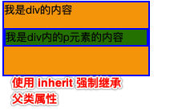 


 **元素的属性来源查看** 

 


 ## 2. CSS属性继承的注意点 (继承计算值)


1. CSS 属性继承的是**计算值** , 并不是当初编写属性时的指定值(字面值).

   > `指定值` 又称作 `字面值`, 就是书写在css样式里的值, 比如: `50%` `inherit` 等
   >
   > `计算值` 就是经过字面值计算的到的值

   ```
   .div1{
     /*50px 就是 font-size的 指定值 字面值*/
     font-size: 50px;
   }
   
   .div2{
     /*50% 就是 font-size的 指定值 字面值, 50px * 50% = 25px 就是计算值*/
     font-size: 50%;
   }
   
   .div3{
     /*因为CSS继承中继承的是计算值
     因此, font-size:inherit; 相当于是 font-size:25px;  .div2中的计算值
     而不是  font-size: 50%; 不是 25px * 50% = 12.5px
     */
     font-size:inherit;
   }
   ```

   ```
   <div class="div1">我是div1
       <div class="div2">我是div2
           <div class="div3">我是div3</div>
       </div>
   </div>
   ```

    


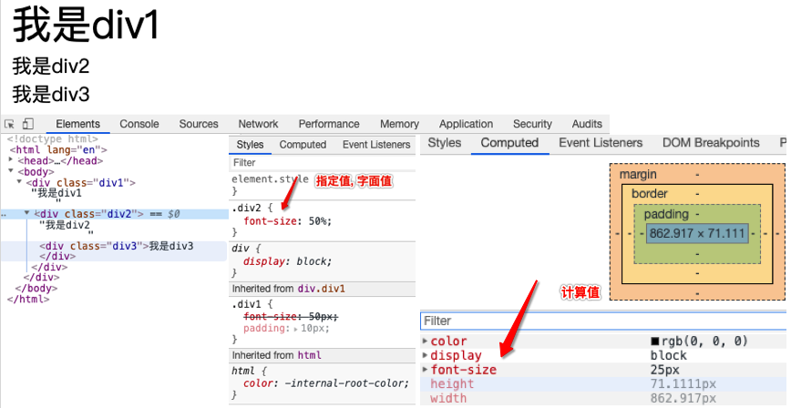 


## 3. CSS 属性的层叠


1. css 允许**多个** **相同名字的CSS属性**  **层叠在一个元素上** 
   - 层叠后的结果是: 只有一个css属性会生效

2. 浏览器的开发者工具非常清晰的显示了那个CSS属性会生效
3. 那个CSS属性生效, 取决于CSS属性所处环境的优先级高低

 


## 4. CSS 属性的优先级

1. 按照经验, 为了方便比较CSS属性的优先级, 可以个CSS 属性所处的环境定义一个权值(权重)

   ```
   !importan: 10000
   内联样式: 1000
   id选择器: 100
   类选择器/ 属性选择器/ 伪类: 10
   元素选择器/ 伪元素: 1
   通配符: 0
   ```

> 1. 针对性越强的选择器, 优先级越高
>
> 内联样式(行内样式) > id  > class/ 属性选择/ 伪类选择 > 标签 > 通配
>
> 2. 如果优先级一样, 就参考就近原则


## 5. CSS 属性使用经验


1. 为什么有时编写的CSS属性不好使, 有可能是因为

- 选择器的优先级太低

- 选择器没有选中对应的元素 (选择器写错了)

- CSS属性的使用形式不太对

  - 元素不支持此CSS属性, 比如: `span`元素默认不支持 `width` 和`height`
  - `color:red;` 写成 `color:10px` 了

- 浏览器不支持此CSS属性, 比如旧版本的浏览器不支持CSS3某些属性

  ```
  input {
  	// 设置光标颜色, 有些浏览器不支持
  	 caret-color: red;
  }
  ```

-  可能属性被同一种类型的属性覆盖了

  - `font` 属性覆盖`font-size `  , `font-size` 属性覆盖了`font` 属性中的大侠
  - `background` 属性覆盖了`background-color` 属性, 等等

- 可能是html标签的书写不规范, 导致css 选择器没选

  - p` 标签不能嵌套`div` 标签

    ```
    // 以下是错误写法
    <p>
    	我是段落
    	<div> 我是段落里的div</div>
    </p>
    
    // 当按照上面这样写时, 浏览器会自动的将html标签解析为下面的样式
    <p>
    	我是段落
    </p>
    <div> 我是段落里的div</div>
    <p></p>
    ```

    

总之, 各种各样的问题都可以通过浏览器的开发者工具调试出来.  发现问题了,按`f12` 跳出浏览器调试工具查看


# 十. HTML 列表元素

HTML 提供了3组常用的用来展示列表的元素

- 有序列表 `ol` `li`
- 无序列表 `ul` `li`
- 定义列表 `dl` `dt` `dd`


## 1. 有序列表- ol li

- `ol`  (ordered list)

  - **有序列表, 直接子元素只能是`li`** 

- `li` (list item)

  - 列表中的每一项

  ```
  <h1>热门车系</h1>
  <ol>
      <li>奥迪宝马A6</li>
      <li>宝马5系</li>
      <li>宝马3系</li>
  </ol>
  ```

  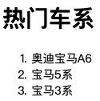 


## 2. 无序列表- ul li

- `ul` (unordered list)

  - **无序列表, 直接子元素只能是`li` ** 

- `li` (list item)

  - 列表中的每一项

  ```
  <h2>宾利车型</h2>
  <ul>
      <li>慕尚</li>
      <li>飞驰</li>
      <li>欧陆系列</li>
  </ul>
  ```

   


### 1. list-style-type 属性  

>  设置 `li` 元素前的项目符号样式
>
>  这个`list-style-type` 属性是可以设置在`ul` 标签上, 然后里面的`li` 标签通过继承获取对应的属性值

```
li {
	list-style-type: none; // 清除项目符号
	list-style-type:circle; 
}

ul { // 直接给ul元素设置, 里面的 li 元素可以通过继承获取
	list-style-type: none; // 清除项目符号
	list-style-type:circle; 
}
```


## 3. 定义列表 dl dt dd


- `dl` (definition list)
  - **定义列表, 直接子元素只能是 `dt` `dd`**
- `dt` (definition term)
  - 列表中每一项的项目名
- `dd` (definition description)
  - 列表中每一项的具体描述, 是对`dt` 的描述/ 解释/ 补充
  - 一个`dt` 后面一般紧跟着1个或多个`dd`


> dt dd 常见的组合
>
> 事物的名称, 事物的描述
>
> 问题, 答案
>
> 类别名, 归属于这类的各种事物


```
<dl>
    <dt>西瓜汁</dt>
    <dd>红色的饮料</dd>
    <dt>咖啡</dt>
    <dd>黑色的饮料</dd>
    <dt>牛奶</dt>
    <dd>白色的饮料</dd>
</dl>
```

 


```
<h2>车型</h2>
<dl>
    <dt>SUV</dt>
    <dd>牧马人</dd>
    <dd>普拉多</dd>
    <dd>揽胜</dd>
    <dl>大型车</dl>
    <dd>奥迪A8</dd>
    <dd>奔驰S级</dd>
    <dd>宝马7系</dd>
</dl>
```

 


# 十一. 列表元素相关CSS属性


## 1. 列表相关的常见CSS属性有4个:


`list-style-typelist-style-imagelist-style-positionlist-style`

- 以上4个属性, 适用于**display设置为 list-item的元素** , 比如: `li` 元素
- 以上4个元素都可以继承, 所以设置个`ol` `ul` , 默认也会应用到`li` 元素上

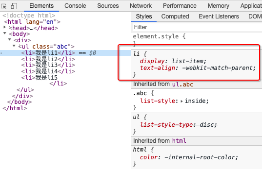 

**注意:** 

`list-style-typelist-style-imagelist-style-positionlist-style` 这4个属性, 只有直接设置在`ol` 或者`ul`类型的父元素, 才会被资源素`li` 继承. 为什么是这样呢?  


## 2. 列表CSS属性详解


-  `list-style-type`

  > 设置`li` 元素前面的项目符号

  - disc (实心圆)	circle(空心圆)	square (实心方块)

  - decimal(阿拉伯数字)   lower-roman(小写罗马数字)   upper-roman(大写罗马数字)

  - lower-alpha( 小写英文字母)   upper-alpha(大写英文字母)

  - none 取消项目符号(什么也没有)

    


- `list-style-image`

  > 设置某张图片为`li` 元素的前面的标记, 会覆盖`list-style-type`的设置
  >
  > 注意: 只好设置了`list-style-image`  之后 `list-style-type` 就不好用了

  *这个属性虽然可以设置图标, 但是我们一般不用, 因为通过这种方式设置的项目符号图标, 不好精准的控制位置我们一般设置`list-style-type` 为`none` 然后自己自定义项目符号图标*

  ```
  li {
  	lsit-style-image: url()
  }
  ```

   

 

- `list-style-position`

  > 设置`li`元素前面标记的位置, 可以取`outside` `inside` 2个值
  >
  > 几乎不用


- `list-style`

  > 这个属性,其实是前面3个属性`list-style-type` `list-style-image` `list-stype-position` 的缩写属性

  比如, 可以这样写

  ```
  li { // 以下几个写法都可以
  	list-style: circle inside; // 顺序没有关系
  	list-style: url(camera.png) outside;
  	list-style: inside square; 
  	list-style: none;
  	list-style: insize
  }
  ```

  


# 十二. HTML 表格元素


## 1. table 表格元素介绍

- `tr` (table) 

  > 表格元素

- `tr` (table  row)

  > 一行表格

- `td` (table data)

  > 表格中的一个单元格 


## 2. table 的常用属性

| border          | 边框的宽度                                                   |
| --------------- | :----------------------------------------------------------- |
| cellpadding     | 单元格内部的间距                                             |
| cellspacing     | 单元格之间的间距                                             |
| width           | 表格的宽度                                                   |
| align           | 表格的水平对齐方式: `left`  `right` `center`  <br />这个属性是用于控制table在父元素中的位置的 |
| border-collapse | 合并单元格的边框, 常用来实现细线表格                         |
| border-spacing  | 设置单元格之间的间距 , 与 `td` `tr` 中的 `cellspacing` 属性功能一样<br />只是是通过table元素来设置的 |

```
<table border="1" cellspacing="0" cellpadding="5 10" >
  <tr>
    <td>放映事件</td>
    <td>语言版本</td>
    <td>放映厅</td>
    <td>售价(元)</td>
    <td>选座购票</td>
  </tr>

  <tr>
    <td>13:15</td>
    <td>国语3D</td>
    <td>1号厅</td>
    <td>110</td>
    <td><input type="button" value="选座购票"></td>
  </tr>
  <tr>
    <td>13:15</td>
    <td>国语3D</td>
    <td>2号厅</td>
    <td>210</td>
    <td><input type="button" value="选座购票"></td>
  </tr>
</table>
```

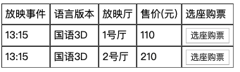 


## 3.tr,td 的常用属性


| valign  | 单元格的垂直对齐方式<br> `top` `middle` `bottom` `baseline` |
| ------- | ----------------------------------------------------------- |
| align   | 单元格水平对齐方式<br />`left` `center` `right`             |
| width   | 单元格的宽度                                                |
| height  | 单元格的高度                                                |
| rowspan | 单元格可横跨的行数                                          |
| colspan | 单元格可横跨的列数                                          |

> `align` 和 `valign` 属性既可以设置在`tr` 上也可以设置在`td` 上, 设置在`tr` 上每个`td` 可以通过继承来获取


## 4. 细线表格

**细线表格最正宗的做法** 

> 1. 给td 单元格设置边框 (boder: 1px solid #000)
> 2. 给table 表格设置, 合并单元格属性(border-collapse:collapse)

```
 td {
   border: 1px solid #000;
 }

table {
  /*合并单元格之间的边框, 细线表格效果*/
  border-collapse: collapse;
}
```

```
<table>
  <tr>
    <td >放映事件</td>
    <td>语言版本</td>
    <td>放映厅</td>
    <td>售价(元)</td>
    <td>选座购票</td>
  </tr>

  <tr>
    <td>13:15</td>
    <td>国语3D</td>
    <td>1号厅</td>
    <td>110</td>
    <td><input type="button" value="选座购票"></td>
  </tr>
  <tr>
    <td>13:15</td>
    <td>国语3D</td>
    <td>2号厅</td>
    <td>210</td>
    <td><input type="button" value="选座购票"></td>
  </tr>
</table>
```

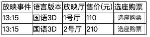 


## 5. 表格的其它元素

- **tbody **元素

  >  表格的主体 

- **caption**元素

  >  表格的标题

-  **thead**元素

  >  表格的表头

- **tfoot**元素

  >  表格的页脚

- **th**元素

  >  表格的表头单元格 


**完整的表格**

```
td,th {
  border: 1px solid #000;
}

table {
  /*合并单元格之间的边框, 细线表格效果*/
  border-collapse: collapse;
}
```

```
<table>
        <caption>欢迎光临万达影城</caption>
        <thead>
            <tr>
                <th>放映事件</th>
                <th>语言版本</th>
                <th>放映厅</th>
                <th>售价(元)</th>
                <th>选座购票</th>
            </tr>
        </thead>


        <tbody>
        <tr>
            <td>13:15</td>
            <td>国语3D</td>
            <td>1号厅</td>
            <td>110</td>
            <td><input type="button" value="选座购票"></td>
        </tr>
        <tr>
            <td>13:15</td>
            <td>国语3D</td>
            <td>2号厅</td>
            <td>210</td>
            <td><input type="button" value="选座购票"></td>
        </tr>

        </tbody>


        <tfoot>
        <tr>
            <td colspan="5"> 看电影免费抽大奖</td>
        </tr>
        </tfoot>

    </table>
```

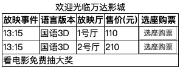 


## 6. 单元格合并


合并单元格要领:

- 合并方向是向右向下
- 删除掉被覆盖的td元素

 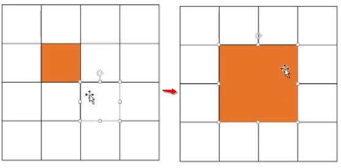 


## 7. CSS属性 -border-spacing


**border-spacing** 用于设置单元格之间的水平/ 垂直间距, 比如: 


```
table {
	// 第一个表示水平间距, 第二个表示垂直间距
	// 只设置1个表示水平和垂直
	border-spacing: 10px 20px;
}
```

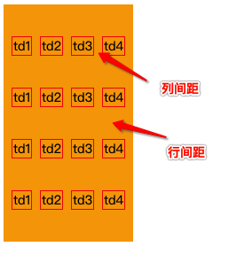 


# 十三.  表单元素 


## 1. form 元素中常用的元素

- **form** 元素

  > 表单元素
  >
  > 一般情况下, 其它表单相关的元素都是他的后代元素

- **input** 元素

  > 单行文本输入框/ 单选框/ 复选框/ 按钮等元素   (这个表现可以有很多样式)

- **textare** 元素

  > 多行文本框

- **select**元素 **option** 元素

  > 下拉选择框

- **button** 元素

  > 按钮

- **label** 元素

  > 表单元素的标题

- **fieldset** 元素

  > 表单元素组

- **legend** 元素 

  > fieldset 的标题


## 2. input 元素常用的属性

- **type** 属性

  > 设置`input`标签的类型, `type`可设置的值如下:  

  - `text` 设置`input`标签为明文文本输入框(明文输入)
- `password`  设置`input` 标签为密文文本输入框(密文输入)
  - `radio` 单选框
  - `checkbox` 复选框
  - `button` 按钮
  - `reset` 重置
  - `submit` 提交表单数据给服务器
  - `file` 文件上传
  - `hidden`  隐藏域
  - `maxlength` 允许输入的最大字数
  - `placeholder` 占位文字 

- **readonly**属性
  
  - 只读
- **disable**属性
  
  - 禁用
- **checked** 属性
  - 默认被选中
  - 只有当 `type` 为`radio` 或`checkbox` 时可用
- **autofocus** 属性
  
  - 当页面加载时, 自动聚焦
- **name** 属性
  - 名字
  - 在提交数据格服务器时, 可用于区分数据类型
- **value** 属性
  
  - 取值
- **form**
  - 设置所属的`form` 元素(填写 form元素的id)
  - 一旦使用了此属性, input元素即使不写在form元素内,数据也能够提交到服务器

```
<form action="https://www.baidu.com">
    <div>  只读属性: <input type="text" value="只读属性" readonly> </div> 
    <div> 禁用: <input type="text" value="我是禁用属性" disabled>  </div> 
    <div>  爱好: 足球 <input type="checkbox" checked name="hobby" > 篮球 <input type="checkbox" name="hobby"> </div> 
    <div> autofocus: <input type="text" value="autofocus 属性" autofocus> </div> 
</form>
```


## 3. form 元素常用的属性

- **action** 属性

  >  用于指定表单请求数据的请求 URL

- **method** 属性

  > 用于指定表单的请求方式 (get/ post), 默认就是get 请求

  - get请求, 在请求的URL后面以?的形式跟上发给服务器的参数, 多个参数支架以&隔开

  - 浏览器和服务对URL长度是有限制的, 因此在URL后面附带的参数是有限制的, 通常是不超过1kb

    ```
    http://www.baidu.com/?name=zhangsan&aqe=18
    ```

  - post请求, 发送给服务器的参数全部放在请求体中
  - 理论上, post传递的数据量是没有限制的(具体看服务器的处理能力)

- **target** 属性

  > 在什么地方打开URL (和 a 元素的 target 是一个道理)

- **enctype** 属性

  > 规定了在向服务器发送表单数据之前如何对数据进行编码

  - 取值有3种

    `application/x-www-form-urlencode` 默认的编码方式

    `multipart/form-data` 文件上传时必须为这个值, 并且method必须是post

    `text/plain` 普通文件传输

- **accept-charset** 规定表单提交时使用的字符编码


## 4. input 和label 元素

- `label` 元素一般跟`input`元素配合使用, 用来表示`input`的标题 
- `label` 可以跟某个`input`绑定, 点击`label`就可以激活对应的`input` 
- `label` 元素和`input` 元素之间通过 `id` 绑定


```
<form action="https://www.baidu.com"
      method="post"
      enctype="multipart/form-data">

    <div>
        <label for="phone">手机:</label>
        <input id="phone" type="text" name="phone">
    </div> 
    <div>
        <label> 密码:<input type="password" name="pwd"></label>
    </div> 
    <div>
        验证码:
        <input type="text"> <input type="button" value="点击获取验证码">
    </div> 
    <div>
        头像:
        <input type="file" name="photo">
    </div> 
    <div>
        兴趣:
        篮球<input type="checkbox" name="hobby" value="basketball">
        足球<input type="checkbox" name="hobby" value="football">
        乒乓球<input type="checkbox" name="hobby" value="pingpang">
    </div> 
    <div>
        性别:
        男<input type="radio" name="sex" value="male">
        女<input type="radio" name="sex" value="female">
    </div> 
    <div>
        <input type="reset" value="重置">
        <input type="submit" value="提交"></div> 
</form>
```

 


## 5. 常见的布尔属性 

- 布尔属性可以没有属性值, 写上属性名就代表使用这个属性

- 常见的不二属性有:

  `disable` `checked` `readonly` `multiple` `autofocus` `selected`

  


## 6. button 按钮

- **button** 

  > 按钮元素有三种样式

  - 普通按钮, (type=button)使用value属性设置按钮的文字
  - 重置按钮(type=submit) 重置它所属`form` 的所有表单元素(包括 input, textarea, select)
  - 提交按钮(type= submit), 提交它所属`form` 的表单数据给服务器(包括 input, textarea, select)

  ```
  <form action="https://baidu.com">
      账号: <input type="text">
      <button type="button"> 默认就是button 样式</button>
      <button type="reset"> 重置样式</button>
      <button type="submit"> 提交样式</button>
  </form>
  ```

  默认情况下(input提交按钮和button提交按钮), 敲回车键(enter 键)会自动提交表单数据给服务器

  如需禁用此行为, 需要编写响应的 javaScript代码, 监听回车键的敲击


注意: 

在form表单中可以使用 input元素和button元素都可以实现按钮和提交按钮的功能, 没有什么区别, 都可以.


## 7.  去掉input 元素tab时的轮廓线

```
// 这种2方式只是去掉了聚焦时的样式而已, 其实也是聚焦了
input, input:focus{
	outline:none;
}

 
```


去掉`input` 标签和`button` 标签的聚焦效果. 正确的做法是设置`tabindex=-1`

```
<input type="text" tabindex="-1">
<button tabindex="-1"></button>
```


## 8. textarea 元素

- **textarea** 

  > 多行文本输入框, 默认情况下可以变化输入框的大小
  >
  > 常用属性, `cols` 列数, `rows` 行数

  禁用textarea 缩放的css 设置

  ```
  textarea {
  	resize: none;  			// 不允许调整 textarea 的大小
  	resize: horizontal; // 水平缩放
  	resize:vertical; 		// 垂直缩放
  	resize:both 				// 水平垂直缩放, 默认就是这个值
  }
  ```

  一般情况下, 不建议使用 `cols` 和 `rows` 属性来控制 `textarea` 元素的大小, 使用`width 和 height` 属性控制大小更精确一点.


 

## 9. select 和 option 元素


- **option** 是**select** 的子元素, 一个option代表一个选项

  > 注意: select 元素中直接子元素只能放` option`

  - select常用属性
    - multiple, 可以多选
    - size, 显示多少项
  - option 常用属性
    - selected, 默认被选中

  ```
  <select name="edu" size="5" multiple>
      <option value="1">小学</option>
      <option value="2" selected>初中</option>
      <option value="3">高中</option>
      <option value="4">大专</option>
      <option value="5">本科</option>
      <option value="6">硕士</option>
      <option value="7">博士</option>
  </select>
  ```

  


## 10. fieldset 和 legend 元素


- **fieldset ** 元素 和 **legend** 元素是用来个 表单元素分组用的如下:

```
<form action="https://www.baidu.com"
      method="post"
      enctype="multipart/form-data">


    <fieldset>
        <legend> 必填信息</legend>
        <div>
            <label for="phone">手机:</label>
            <input id="phone" type="text" name="phone">
        </div>
        <div>
            <label> 密码:<input type="password" name="pwd"></label>
        </div>
        <div>
            验证码:
            <input type="text"> <input type="button" value="点击获取验证码">
        </div>

    </fieldset>

    <fieldset>
        <legend> 可选信息</legend>

        <div>
            头像:
            <input type="file" name="photo">
        </div>
        <div>
            兴趣:
            篮球<input type="checkbox" name="hobby" value="basketball">
            足球<input type="checkbox" name="hobby" value="football">
            乒乓球<input type="checkbox" name="hobby" value="pingpang">
        </div>
        <div>
            性别:
            男<input type="radio" name="sex" value="male">
            女<input type="radio" name="sex" value="female">
        </div>

    </fieldset>

    <div>
        <input type="reset" value="重置">
        <input type="submit" value="提交">
    </div>
</form>
```

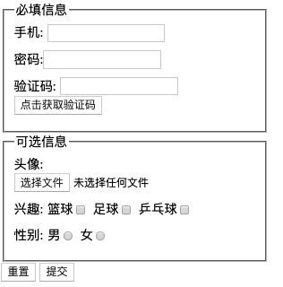 


一般来说, `fieldset` 元素和`legend` 元素很少使用, 因为标题的位置不灵活


## 11. 隐藏域

- 隐藏域不会显示在页面上, 但是提交数据的时候, 他的name和value也会被提交到服务器
- 如果有些发送给服务器的数据, 是不需要用户输入的, 或者不希望在页面展示的, 可以使用隐藏域

*隐藏域最多的应用场景是传递`id` , 一般我们网页在修改一个信息时, 就会必须传递一些参数, 而这些参数是用户不关心的* 

```
<form action="http://baidu.com">
    <fieldset>
        <legend>修改个人信息</legend>
        姓名: <input type="text" name="name"> <br>
        简介: <input type="text" name="introduce"><br>
        城市: <input type="text" name="city"> <br>
        //  隐藏域经常用来偷偷的传递一些必要的参数给服务器
        <input type="hidden" name="id"  value="001"><br>
        <input type="submit">
    </fieldset> 
</form>
```

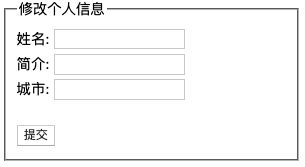 

> 虽然有些必要传递的参数,可以写在 请求的url 中, 但是不建议这样写, 因为有些服务器不支持, 最好通过隐藏域来发送

```
// 不推荐使用, 有些浏览器不支持url中有参数 parameter
<form action="http://baidu.com/?id=10"> 
        姓名: <input type="text" name="name"> <br>  
        <input type="submit"> 
</form>

// 推荐使用隐藏域
<form action="http://baidu.com/"> 
        姓名: <input type="text" name="name"> <br>  
        <input type="hidden" name="id"  value="10"><br>
        <input type="submit"> 
</form>
```


# 十四. CSS属性-元素类型


## 1 . 块级元素/ 行内元素

- 根据元素的**显示** 类型, HTML元素主要分为2大类

  - **块级**元素 (block-level elements)

    > - **独占一行**  (独占父元素的一行)
    > - 可以随意设置宽高 (默认宽度撑满父元)
    > - 高度默认由内容决定
    > - 比如: `div` `p` `pre` `h1~h6` `ul` `ol` `li` `dl` `dt` `dd` `table` `form` `article` `aside` `footer` `header` `hgroup` `main` `nav` `section` `blockquote` `hr` 等

  - **行内级** 元素 (inline-level elements)

    > - 多个行内级元素可以在同一行显示(可以在父元素的同一行显示)
    > - 比如: `a` `img` `span` `strong` `code` `iframe` `label` `input` `button` `canvas` `embed` `object` `video` `audio` 等


## 2. 替换元素/ 非替换元素

- 根据元素的**内容** 类型, HTML元素主要可以分为2大类

  - **替换** 元素(replaced elements)

    > - 元素本身没有实际的内容, 浏览器根据元素的类型和属性, 来决定元素的具体显示内容
    > - 比如: `img` `input` `iframe` `video` `embed` `canvas` `audio` `object` 等

  - **非替换** 元素 (non-replaced elements)

    > - 和替换元素相反, 元素本身有实际的内容, 浏览器会直接将其内容显示出来, 而不需要根据元素的类型和属性来判断到底显示什么内容
    > - 比如: `div` `p` `pre` `h1~h6` `ul` `ol` `li` `dl` `dt` `dd` `table` `form` `article` `aside` `footer` `header` `hgroup` `main` `nav` `section` `blockquote` `hr` `a` `strong` `span` `code` `label` 等

## 3.元素的分类总结(*)


 


  

# 十五. CSS属性- display

## 1. display属性的常用取值


- CSS 中有个display属性, 能修改元素的显示类型, 有4个常用值

  - **block** , 让元素显示为块级元素

  - **inline**, 让元素显示为行内级元素

  - **none**, 隐藏元素

  - **inline-block** , 让元素同时显示行内级/块级的元素

    > - 可以让元素同时具备块级/ 行内级元素的特征
    > - 跟其它行内级元素在同一行像是
    > - 可以设置宽高
    > - inline-block 的宽高, 默认由内容决定


## 2. 元素嵌套注意点


- 不要使用行内级元素去包含块级元素

  ```
  // 不要这样做, 不要使用小的元素去包裹大的元素 
  <span>
  	<div> <div>
  </span>
  ```

- 如果是**块级元素 或 行内块级**,

  一般可以包含其它任何元素的(比如: 块级元素/ 行内级元素/ inline-block元素)

  **特殊情况, p元素不能包含其它块级元素(比如:div元素)**

  ```
  // 错误写法
  <p>
  	<div> </div>
  </p>
  ```

- 行内级元素 (比如: a/ span/ strong 等)

  一般情况下, 只能包含行内级元素


## 3. display属性的其它取值

- display 属性的以下取值, 等同于某些HTML元素

  - table : <table> , 一个block-level表格
  - inline-table: <table>, 一个inline-level表格
  - table-row: <tr>
  - table-row-group: <tbody>
  - table-header-group: <thead>
  - table-footer-group:<tfoot>
  - table-cell: <td> <th>, 一个单元格
  - table-caption: <caption>, 表格的标题
  - list-item: <li>

  ```
  <style> 
    span{
      list-style: disc inside;
      display: list-item;
    } 
  </style>
  ```

  ```
  <ul>
      <li>我是li1</li>
      <li>我是li2</li>
      <li>我是li3</li>
      <li>我是li4</li>
      <li>我是li5</li>
  </ul>
  
  
  <div>
      <span>我是span1</span>
      <span>我是span2</span>
      <span>我是span3</span>
      <span>我是span4</span>
      <span>我是span5</span>
  </div>
  ```

   


- 我们只要熟悉了 元素的 display 属性, 我们就可以利用这个属性, 做出我们想要的结果,示例如下: *利用div strong span 做出一个表格效果出来*  

  ```
  <style>
  
    div{
      display: table;
      border-collapse: collapse;
    }
    strong{
        display: table-row;
    }
    span{
      display: table-cell;
      border: 1px solid #f00;
      padding: 5px;
    }
  </style>
  ```

  ```
  <div>
      <strong>
          <span>我是span1</span>
          <span>我是span2</span>
          <span>我是span3</span>
      </strong>
      <strong>
          <span>我是span1</span>
          <span>我是span2</span>
          <span>我是span3</span>
      </strong>
      <strong>
          <span>我是span1</span>
          <span>我是span2</span>
          <span>我是span3</span>
      </strong>
  </div>
  ```

   

  > 理解了这个**display属性**的特性后, 我们就可以只使用一个div元素做完整个网页
  >
  > 但是, 但是, 不要这样干, 很装逼, 不要干这些没有语义的事情


# 十六. CSS属性-visibility

- **visibility**, 能控制元素的可见性, 有2个常用值

  - `visible` 显示元素
  - `hidden` 隐藏元素

  > `visibility:hidden;` 和 `display:none;`的区别
  >
  > - 当设置`visibility:hidden` 时, 虽然元素看不见了, 但是元素的框依旧还留着, 还会占着原来的位子
  > - 当设置`display:none` 时, 不仅元素看不见, 而且元素的框也会被移除, 不会占着原来的位置
  >
  > 总结: `visibility:hidden` 相当于是元素不显示而已, 位置占着
  >
  > `display:none` 相当于将显示的内容移除, 相当于移除, 既不显示也不占位置


# 十七. CSS属性-overflow

- **overflow**属性用于控制内容溢出时的行为

  - `overflow:visible` 溢出的内容照样显示(一般默认就是这个值)
  - `overflow:hidden` 溢出的内容直接裁剪
  - `overflow:scroll` 溢出的内容被裁剪, 但是可以根据滚动机制查看(滑动滚动条查看)
    - 会一直显示滚动区域(即, 水平和垂直的滚动条会一直显示, 不论内容的多少)
    - 滚动条占用的空间属于`width` 和`height` 设置的范围内
  - `overflow:auto` 自动根据内容是否溢出来决定是否显示滚动条
    - 水平和竖直方向的滚动条会根据内容是否超出元素的宽度自动显示

  ```
  div{
    background-color: #ff0;
    width: 200px;
    height: 200px;
    overflow: scroll;
  }
  ```

  

  ```
  <div>
      我是div我是div我是div我是div我是div我是div我是div我是div我是div我是div我是div我是div我是div我是div我是div我是div我是div我是div我是div我是div我是div我是div我是div我是div我是div我是div我是div我是div我是div我是div我是div我是div我是div我是div我是div我是div我是div我是div我是div我是div我是div我是div我是div我是div我是div我是div我是div
      
  </div>
  ```

  

   

  >  一般来说, 水平滚动条是用来滚动图片内容的, 当图片的内容超过宽度才会显示, 而文字内容一般会自动换行, 超多高度后垂直滚动滚动条查看


- 另外, 还有**overflow-x和overflow-y**两个属性, 可以分别设置水平方向和垂直方向, 这2个属性是css3的, 不建议使用


# 十八. 行内级元素之间的间隙


- **行内级**元素(包括inline-block元素)的代码之间如果有空格, 会被解析显示为空格, 现象就是默认情况下**行内级** 元素之间有一个间隙, 且这个间隙大小有字体的大小决定

  ```
  <style>
    body{
      background-color: pink;
    }
  
    div:nth-of-type(even){
      background-color: #f00;
    }
    div:nth-of-type(odd){
      background-color: #0f0;
    }
  
    span:nth-of-type(even){
      background-color: #00f;
    }
    span:nth-of-type(odd){
      background-color: #ff0;
    }
  
    strong:nth-of-type(even){
      background-color: #0ff;
    }
    strong:nth-of-type(odd){
      background-color: #ff0;
    } 
  </style>
  ```

  ```
  <body>
  <div>我是div1</div>
  <div>我是div1</div>
  
  <span>我是span1</span>
  <span>我是span2</span>
  <span>我是span3</span>
  <span>我是span4</span>
  <span>我是span5</span>
  
  
  
  <strong>我是strong1</strong>
  <strong>我是strong2</strong>
  </body>
  ```

  

     

  > 原因分析:
  >
  > - 造成行内级元素之间的间隙的原因是浏览器将行内级元素之间的换行或者空格符解析成空格显示出来了
  > - 行内级元素之间的间隙大小是由父元素的font-size 大小决定的


- 目前解决行内元素之间因为代码书写时的换行空格造成的**行内级** 元素显示之间的间隙方法有以下几种:

  - 行内元素代码书写时, 元素之间不要留空格或者换行

    ```
    <span>我是span1</span> <span>我是span2</span>
    <span>我是span3</span> 
    
    // 上面的所有换行和空格要去掉,改为下面的样式 , 行内与行内元素之间不要有换行和空格
    <span>我是span1</span><span>我是span2</span><span>我是span3</span> 
    ```

  - 行内元素与行内元素之间的换行和空格使用, 标签注释代替

     ```
    <span>我是span1</span> <span>我是span2</span>
    <span>我是span3</span> 
    
    // 改为下面
    <span>我是span1</span><!-- --><span>我是span2</span><!--
    --><span>我是span3</span> 
    ```

  - 设置父元素的**font-size**为0, 然后在元素中重新设置自己需要的**font-size**

    - 此方法在safari中不使用

  - 给元素添加**float** 

  

# 十九. CSS 属性- line-height 行高


- line-height 用于设置(文本和内容(eg: 图片))的最小行高 , 行高是可以继承的

- 行高可以简单理解为一行文字占据的高度

- 行高的严格定义

  > - 两行文字基线(base-line)之间的间距
  > - 基线(base-line), 与小写字母xx底部对齐的线

   


- 行高**line-height** 可以设置的值

  - `具体数字+单位`: eg: 40px

  - `百分比`: eg: 200%, 最终的行高值是用百分比乘以元素的字体大小

    ```
    div {
    	font-size: 20px;
    	// 此处就相当于是200% * 20px = 40px , 相当于 line-height:40px
    	line-height: 200%;
    }
    ```

  - `具体数值`: eg: 2.5 , 最终的行高值是用数字值乘以字体的大小

    ```
    div {
    	font-size: 20px;
    	// 此处就相当于是2.5 * 20px = 50px , 相当于 line-height:50px
    	line-height: 2.5;
    }
    ```

  - `normal`: 常规显示, 浏览器会基于元素字体调整成一个合理值, 范围 `1.0 ~1.2`, 具体的值和浏览器有关. 其实默认就是这个值

  - `xem`, eg : 2em, 最终的行高值是用数字值乘以字体的大小

    ```
    div {
    	font-size: 20px;
    	// 此处就相当于是2 * 20px = 40px , 相当于 line-height:40px
    	line-height: 2em;  // em 就是相对于 字体大小的一个度量单位
    }
    ```

    

- 注意点1:

  - `height` 和 `line-height` 是不同的属性, 他们之间是有区别的

  - `height` 表示的是元素的整体高度

    

- 行高的应用实例

  - 假设div中只有一行文字, 如何让这行文字在div内部垂直居中呢? 

    - 只要设置这一行文字的行高和div的高度一样, 就可以保证文字垂直居中

      ```
      div { // div 内一行文字垂直居中
      	line-height: 50px;
      	height:50px
      }
      ```

      

- 注意点2

  - line-height 属性只能设置文字的最小行高, 当内容中有图片的话, 行高可能和line-height 设置的值不一样

  - 也就是说, 你设置了line-height 后不能保证行高就是你设定的值, 只能保证最小行高是你设置的值

    ```
    div{
      background-color: #ff0;
      font-size: 30px;
      line-height:30px;
    }
    
    .box{
      background-color: #0f0;
    }
    ```

    ```
    <div class="box">
        我是div
    </div>
    <div>
        我是div1
        
    </div>
    ```

     


- line-height 行高的继承特点 (有坑)

  - 如果父元素在设置`line-height` 时, 写的是具体值,eg: `1.5` 那么子元素继承下来的`line-height` 也是具体值`2`,  子元素的行高为子元素的字体大小乘以line-height的具体值

  -  如果父元素设置行高`line-height` 时写的是`百分比 或者 xem` 那么子元素继承下来的行高就是父元素的行高的具体指.

    ```
    <div>
        我是div
        <span>我是span</span>
    </div>
    ```

    ```
    div{
      height: 100px;
      background-color: #0f0;
      
      font-size:30px;
      // 相当于设置行高为 200% * 30px = 60px
      // 子元素继承到的行高是计算值, 60px
      line-height:200%;  
    }
    
    span{
      background-color: pink;
      font-size: 20px;
    }
    ```

     

    

    ```
    div{
      height: 100px;
      background-color: #0f0;
      
      font-size:30px;
      // 相当于设置行高为 2 * 30px = 60px
      // 子元素继承到的行高是计算值, 60px
      line-height:2em;  
    }
    
    span{
      background-color: pink;
      font-size: 20px;
    }
    ```

     

    

    ```
    div{
      height: 100px;
      background-color: #0f0;
      
      font-size:30px;
      // 相当于设置行高为 2 * 30px = 60px
      // 子元素继承到的是字面值, 2, 最后得到的行高需要与子元素的字体计算得到
      line-height:2;  
    }
    
    span{
      background-color: pink;
      font-size: 20px;
    }
    ```

     

 


# 二十. CSS属性- 盒子模型


HTML 中的每个元素都可以看做是一个盒子

- 每个盒子都有自己的内容content
- 每个盒子都有自己的内边距padding
- 每个盒子都有自己的边框border
- 每个盒子都有自己的外边距margin 


## 1. 盒子模型 (Box Model)

HTML 中每个元素都可以看做是一个盒子, 如下图所示:

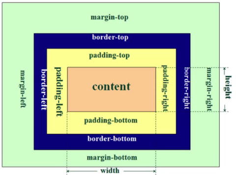 

每个盒子都有4个属性:

- 内容(content)
- 内边距(padding)
  - padding-top
  - paddng-right
  - padding-bottom
  - padding-left
- 边框(border)
  - border-top
  - border-right
  - border-bottom
  - border-left
- 外边距(margin)
  - margin-top
  - margin-right
  - margin-bottom
  - margin-left


> **注意:** 
>
> 从上图可以看出, 默认情况下,我们的内容的宽高和内边距/ 外边距/ 盒子边框是没有关系的
>
> 也就是说, 默认情况下, 宽度和高度使用来描述内容的显示区的.
>
> 盒子的实际占用宽高为:
>
> 实际占用宽 = 左边框宽+左内边距宽+内容宽+右内边距宽+右边框宽
>
> 实际占用高 = 上边框高+上内边距高+内容高+下内边距高+下边框高


## 2. 内边距相关属性 padding

- padding-top: 上内边距
- padding-right: 右内边距
- padding-botton:下内边距
- padding-left : 左内边距
- padding: 是 padding-top padding-right padding-bottom padding-left 的缩写

```
div {
	padding-top: 10px;
	padding-right: 20px;
	padding-bottom: 30px;
	padding-left: 40px;
}

div {
	padding: 10px 20px 30px 40px;
}

div {
	// padding-top = 10px, padding-rignt padding-left=20px, padding-bottom=30px
	padding: 10px 20px 30px;  
}

div {
	padding 10px 20px;  padding-top padding-bottom 10px , padding-right padding-left =20px
}

div {
	padding: 10px; // top right bottom left 全部是10px
}


// 记录这个顺序其实有个技巧,
1. 记住顺序: top right bottom left
2. 从左往右开始找, 一一与 top right bottom left 的顺序 对位
3. 如果缺少 left, 那么left就和对应的right 值一样,
 	 如果缺少bottom, 那么bottom 就和top一样,
 	 如果缺少right, 那么top right bottom left 都一样

```


## 3. 外边距相关属性 margin

- margin-top: 上内边距

- margin-right: 右内边距

- margin-botton:下内边距

- margin-left : 左内边距

- margin: 是 margin-top margin-right margin-bottom margin-left 的缩写

  > margin 属性的书写和使用注意点和padding 是一样的.


## 4. 块级元素,上下margin 传递问题


### 1.上下margin 传递问题

- **margin-top** 传递 

  **如果`块级子`元素和`块级父`元素的`顶部线`重叠, 那么这个`块级子`元素的`margin-top`就会传递给块级父元素**

  > 注意: 
  >
  > - 子元素和父元素都必须是块级元素
  >
  > - 子元素和父元素的顶部线必须重叠
  >
  > - 如果满足margin传递的条件, 不论子元素的 margin-top 是正数还是负数都会传递
  >
  >   这一点需要注意一下

  ```
  <body> 
  <div class="outer">
      <div class="inner"></div>
  </div>  
  </body>
  ```

  

  ```
  <style>
    .outer {
      background-color: #f00;
      width: 200px;
      height: 200px;
    }
    .inner {
      background-color: #0f0;
      width: 50px;
      height: 50px;
    }
  </style>
  ```

  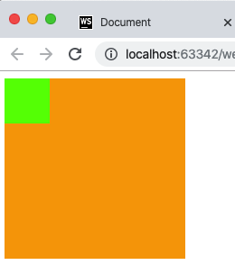 

  ```
  <style>
    .outer {
      background-color: #f00;
      width: 200px;
      height: 200px;
    }
    .inner {
      background-color: #0f0;
      width: 50px;
      height: 50px;
      // 此处的margin-top会传递给 块级父元素
      margin-top: 30px;  // 传递值与正负数无关
    }
  </style>
  ```

   


- **margin-bottom** 传递

  **如果`块级子`元素和`块级父` 元素的`底部线` 重叠, 并且`块级父` 元素的高度设置的是`auto`(不设置默认就位auto),那么这个`块级子` 元素的`margin-bottom` 会传递给父元素**

  > 注意:
  >
  > - 子元素和父元素都必须为块级元素
  >
  > - 子元素和父元素的底部线必须重叠
  >
  > - 父元素的高度必须设置为auto或不设置高度由子元素撑开
  >
  > - 如果满足margin传递的条件, 不论子元素的 margin-bottom是正数还是负数都会传递
  >
  >   这一点需要注意一下

  ```
  <body>
  <div class="outer">
      <div class="inner"></div>
  </div>
  666
  </body>
  ```

  ```
  <style>
  .outer {
    background-color: orange;
    width: 200px;
    height: auto;  /*相当于没设置,高度由子元素撑开*/
  }
  
  .inner {
    background-color: #0f0;
    width: 50px;
    height: 50px; 
  }
  </style>
  ```

   

  ```
  <style>
  .outer {
    background-color: orange;
    width: 200px;
    height: auto;  /*相当于没设置,高度由子元素撑开*/
  }
  .inner {
    background-color: #0f0;
    width: 50px;
    height: 50px;
    // 此处的margin-bottom会传递给 块级父元素 
    margin-bottom: 50px; // 传递值与正负数无关
  }
  </style>
  ```

    


### 2. 防止,上下margin传递问题解决方案


- 给父元素设置`padding-top` `padding-bottom`
- 给父元素设置`bodder`, 边框相当于是一堵墙, margin出不去了
- 给父元素或者子元素设置 `display: inline-block`  只要父元素/ 子元素不要全部是 `块级元素即可`
- 还有其他解决方案, 后面具体介绍


>  其实究其原因
>
> -  块级元素上下 margin 传递的问题,是我们在使用元素属性的时候,使用不恰单造成的 (即, 我们使用属性用错了)
> - margin 一般是用来设置兄弟元素之间的间距的
> - padding 一般是用来设置子父子元素之间的间距的


## 5. 上下margin 折叠 问题


### 1. margin 折叠问题


- **垂直方向上相邻的2个margin (margin-bottom margin-top)有可能会合并为1个margin 这种现象我们称为collapse(折叠)**

- **水平方向上的margin永远不会折叠 (collapse)** 

- **折叠后最终值的计算规则**

  - **如果都是正数**, 最终值是: 绝对值最大的那个正数值
  - **如果都是负数**, 最终值是: 绝对值最大的那个负数值
  - **如果正数/ 负数都有**, 最终值是: 最大正数与最小负数相加结果

  

  

  

  

  > -  两个兄弟块级元素之间上下margin折叠
  >
  > - 父子块级元素之间 margin 的折叠


### 2. margin 折叠的分类

- **两个兄弟块级**元素之间上下margin折叠

  注意,是2个块级兄弟

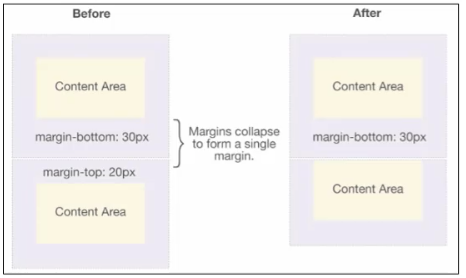 

```
div{
	width: 200px;
	height:160px;
}
.div1 {
	margin-bottom: 30px;
}
.div2 {
	margin-top: 20px;
}

<div class="div1"></div>
<div class="div2"></div>
```


- **两个父子块级**元素之间 margin 的折叠

   

  ```
  div {
  	background-color: red;
  }
  
  .div1 {
  	width: 200px;
  	height: 200px
  	margin-top: 30px;
  }
  .div2 {
  	width: 50px;
  	height: 50px
  	margin-top: 20px;
  }
  <div class="div1">
  	<div class="div2"></div>
  </div>
  ```

  

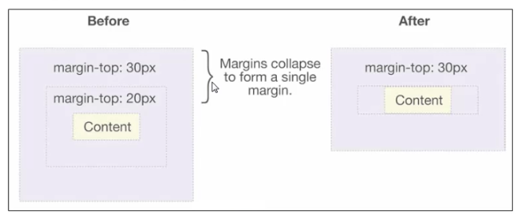 

- 无内容块级元素内部margin的折叠

  单个块级元素无内容, 上下margin折叠

  ```
  .div1 {
  	background-color: red;
  	margin-top: 30px;
  	margin-bottom:40px;
  }
  ```

  ```
  <body>
  333
  <div class="div1">内容消失上下margin就会折叠 </div> // 有内容上下margin不会折叠
  666
  </body>
  ```

  ```
  <body>
  333
  <div class="div1"></div> // 没内容上下margin折叠
  666
  </body>
  ```

  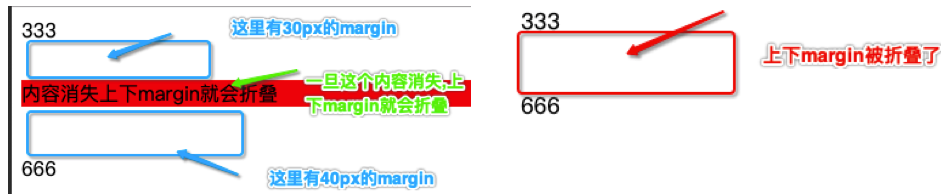 

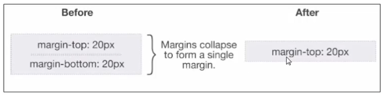

- 无内容的块级元素之间的margin的折叠 (折叠是可以连续的)

  

  

### 3. margin折叠总结

- 无论是一个块级元素还是多个**块级元素**, 只要上下margin 挨在一起就会发生折叠


### 4. 防止, margin 折叠问题解决方案


- 只设置其中一个元素的margin
- 条件允许的话, 使用padding 取代margin
- 设置元素的显示类型为 非 块级
- 更多解决方案, 后面深入介绍


其实并不是所有的上下margin 都是要防止的, 有些时候上下margin合并其实是有好处的, 比如多个挨着的p元素


## 6. 边框相关属性 border


### 1. 边框的书写方式

- 最碎的写法

  ```
  div{ 
    border-top-width: 5px;
    border-top-color: purple;
    border-top-style:dotted;
  
    border-right-width: 3px;
    border-right-color: green;
    border-right-style:solid;
  
    border-bottom-width: 6px;
    border-bottom-color: blue;
    border-bottom-style:dashed;
  
    border-left-width: 5px;
    border-left-color: green;
    border-left-style:dotted;
  }
  ```

- 按照属性类型写

  ```
  div{ 
  	// 顺序都是按照 top right bottom left 
  	// 也是可以省略的, 省略时从左向右查找, 没找到的就和对应的反方向一样, 和 margin padding 的写法一样
    border-width:5px  3px 6px 5px;
    border-color: purple green blue green;
    border-style: dotted solid dashed dotted ;
  }
  
  ```

  

- 按照方位写

  ```
  div {
  	// 按照方位写, 边框的宽度/ 颜色/ 样式 的书写没有顺序要求, 随便写
    border-top: 5px dotted purple;
    border-left: 3px  solid green;
    border-bottom: 6px dashed blue ;
    border-left: 5px dotted green ;
  }
  ```

- 最简单写法

  ```
  div{
  	//边框的宽度/ 颜色/ 样式 的书写没有顺序要求, 随便写
  	border: solid 5px  #0f0;
  }
  ```

  


### 2. 边框样式的取值


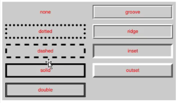 

- `border-style:` 的取值
  - `none` 没有边框,边框颜色,边框宽度会被忽略
  - `hidden` 与 `none` 类似, 多用在表格上, 用于解决边框的冲突
  - `dotted` 边框是一些列的点
  - `dashed` 边框是一条虚线
  - `solid` 边框是一条实现
  - `double` 边框有两条实现, 两条线宽和其中的空白宽度之和等于border-width的值
  - `groove` 边框看上去好像是雕刻在画布之内
  - `ridge` 和`groove` 相反, 边框看上去好像是从画布中凸出来的.
  - `inset` 该边框使整个框看上去好像是嵌在画布中.
  - `outset` 和`inset`相反, 边框使整个框看上去好像从画布中凸出来.


### 3. 边框的形状

- 矩形

- 梯形

- 三角形

  


## 7. 行内级元素注意点  宽高 边框 内外边距


常见的行内级非替换原有主要有: 

> `strong` `span` ` a`  等  

- 以下属性对**行内级非替换元素** 不起作用

  `width` `height` `margin-top` `margin-bottom`

  ```
  a{
    background-color: red;
  	// 对非替换行内级元素设置宽高无效
    width: 300px;
    height: 300px;
    // 对非替换行内级元素设置上下 margin无效
    margin-top: 100px;
    margin-bottom: 100px;
  
  	// 费替换行内级元素可以设置左右 margin
    margin-left: 100px;
    margin-right: 100px;
  }
  ```

  ```
  <body>
  <a href="#"> 点击百度一下</a> 666 <br> 777
  </body>
  ```

  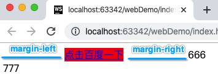 

  

  ​	**从上图也可以看出, `width` `height` `margin-left` `margin-right` ` 对行内级非替换元素是不好使的, 因此以后发现有宽高和margin不好使不要奇怪** 


- 以下属性对**行内级非替换元素** 的作用比较特殊

  `padding-top` `padding-bottom` `border-top` `border-bottom`

  ```
  <style>
  div{
      background-color: red;
  }
  a{
  background-color: yellow;
    border: 1px solid #00f;
  }
  span{
    background-color: green;
  
    /*对行内级非替换元素设置 padding-top 和 padding-bootom 效果很奇怪*/
    padding-top: 5px;
    padding-bottom: 5px;
  
    padding-left: 50px;
    padding-right: 50px;
  }
  </style>
  ```

  ```
  <body> 
  <div>我是top div</div>
  <a href="#">left</a><span>我是非替换行内级span</span><a href="#">right</a>
  <div>我是bottom div</div> 
  </body>
  ```

  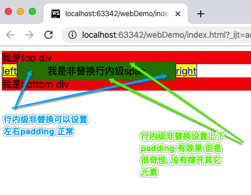 

  ```
  <style>
    div{
      background-color: red;
    }
    .box {
      border: 10px solid cyan;
    }
  
    a{
      background-color: yellow;
      border: 1px solid #00f;
    }
    span{
      background-color: green;
      border: 8px solid orange;
    }
  </style>
  ```

  ```
  <body>
  
  <div>我是top div</div>
  <a href="#">left</a><span>我是非替换行内级span</span><a href="#">right</a>
  <div class="box">我是bottom div</div>
  666 
  </body>
  ```

  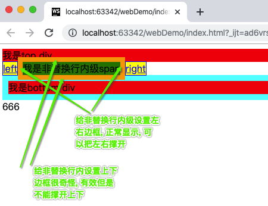 


- 总结:

以后发现个行内费替换元素设置宽/ 高/ 上下margin/ 上下padding/ 上下border 发现不好使, 不要奇怪, 因为本来就不支持


## 8. 圆角属性 border-radius

- 圆角半径相关的属性有

  - `border-top-left-radius`  , 设置左上角圆角
  - `border-top-right-radius` , 设置右上角圆角
  - `border-bottom-right-radius`, 设置右下角圆角
  - `border-bottom-left-radius` , 设置左下角圆角

- `border-*-*-radius` 定义的是4分之一椭圆的半径, 有2个取值

  ```
  border-top-left-radius: 40px 20px;
  // 第一个参数 40px 设置的是水平半径
  // 第二个参数 20px 设置的是垂直半径
  
  border-top-left-radius: 30px;
  // 表示第一个参数和第二个参数一样都为30px
  
  border-top-left-radius: 50%;
  // 可以使用百分比, 参考的是 border-box的宽度
  ```

  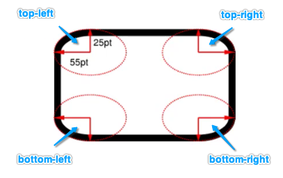 

- 圆角属性也可以简写` border-radius`

  ```
  div {
  	border-radius: 10px;
  	border-radius: 10%; // 是相对于border-box 来计算的
  }
  ```

  

> border-box 是参考元素的border的盒子
>
> 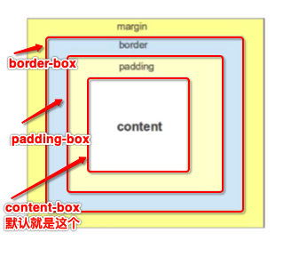 

 


## 9.CSS属性- outline


- outline 表示的是元素的外轮廓

  - **不占用空间**, border是要占用空间的.

  - 默认显示在border的外面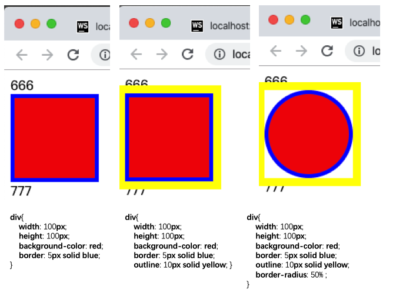

  - 每个部位都是完整连接的, 不会像border那样有可能会断开**  (比如: 行内级非替换元素的换行) 

    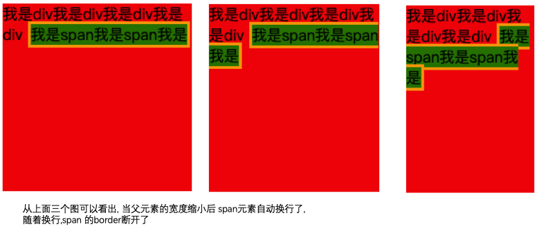

    

    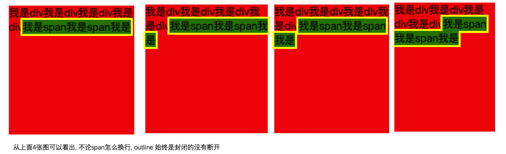

    

    

     

- outline相关的属性有

  - outline-width
  - outline-style: 取值和border的样式一样, 比如: solid/ dotted
  - outline-color
  - outline: outline-width  outline-style outline-color  简写跟border用法类似
  - outline-offset: 设置outline与border 之间的间距

- 应用实例

  - 取出a元素/ input元素的 focus轮廓效果

    ```
    a,input {
    	outline: none;
    }
    ```


## 10.  CSS 属性- box-shadow 边框阴影


- box-shadow 属性可以设置一个或多个阴影

  - 每个阴影用 `shadow` 表示
  - 多个阴影之间用逗号隔开, 从前向后叠加, 就是说可以设置很多层
  - shadow 的常见格式如下: 

  ```
  div {
    width: 100px;
    height: 150px;
    background-color: #fff;
    // 第一个参数表示的是水平偏移 (必选)
    // 第二个参数表示的是垂直偏移 (必选)
    // 第三个参数表示 模糊度 (可选)
    // 第四个参数表示 延伸度 (可以延长的范围)
    // 第五个参数表示 颜色 (必选)
    // 第六个参数表示 外框阴影还是内框阴影 (可选)
    box-shadow: 5px 7px 30px 10px gray inset;
  }
  ```


​		 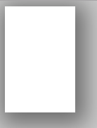 

​		

>  注意: 边框和阴影都会随着圆角变化
>
> 轮廓是不会因为阴影的变化而变化的


- 元素可以设置多重阴影, 多个阴影之间使用逗号分隔即可

  ```
  div { // 多个阴影之间使用逗号分隔
    	 box-shadow: 5px 7px 30px 10px gray ,
    	 5px 7px 30px 10px blue ;
    }
  ```

  

  ## 11. CSS 属性- text-shadow  文字阴影

- `text-shadow` 文字阴影, 用法类似于`border-shadow` , 用于个文字设置阴影效果
- `text-shadow` 同样使用与 `::first-letter` `::first-line` 伪元素
- 文字阴影和边框阴影一样, 同样可以设置多重阴影, 书写方法一样


## 12. CSS属性- box-sizing

- `box-sizing` 属性, 也是盒子模型相关的一个属性, 是用来设置盒子模型汇总宽高行为的一个属性

  - `content-box` 

    > padding border 都布置在width height外边, padding 和 border不在width 和 height的控制范围内

  - `border-box`
  
  - > padding border 都布置在width和height的里面, width 和 height 计算时包含padding 和border
  
    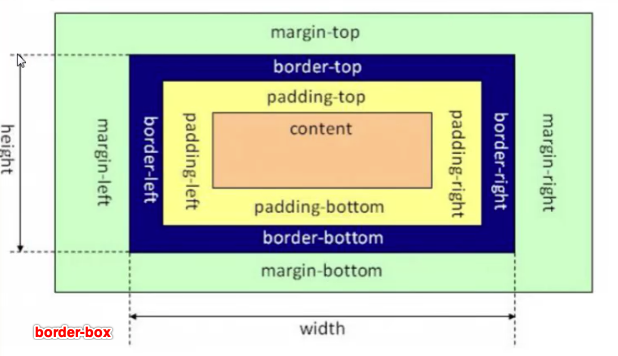 
  
     


> 说一点历史遗留问题:
>
> - 如果盒子的width和height不包含padding和border的这种content-box模型, 其实是w3c的标准盒子模型, 以前是推荐使用 content-box 模型的
> - 但是以前呢, IE8以前,它就要搞一些特殊, IE8以前采用的是border-box 模型, 以前写代码时如果兼容IE8以前, 要用两套方案调代码
> - 但是后来,w3c发现IE讲的是有道理的, 这种border-box的盒子模型很好用. 所以w3c后面又加了一种`border-box` 的样式.


## 13. 元素的水平居中显示


- 在一些需求中, 需要元素在父元素中水平居中显示

  (父元素一般都是块级元素/ inline-block)

  - 为什么子元素是在块级元素/ inline-block 中居中呢?
    - 因为只有块级元素才有空间给你居中, 行内级元素的尺寸时内容决定, 没有空间给你居中


### 1. 行内级/ inline-block 元素水平居中

-  行内级元素/ inline-block 元素, 想要在父元素中水平居中 

  - 请给父元素设置 `text-align:center` 


```
 <style> 
   div {
     background-color: pink;
     text-align: center;
   } 
   span{
    background-color: orange;
   } 
 </style>
 
  <div>
      <span>我是span</span>
      
  </div>
```


 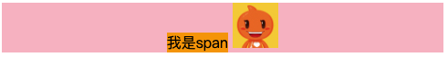 


- **注意:** `text-alogn` 属性是可以被子元素继承的, 所以父元素设置了 `text-align` 后, 所有的子元素会继承这个属性

  ```
  
  ```
<style> 
      div {
          margin-top: 50px;
          background-color: pink;
          height: 100px;
          // 这个属性是会被子元素继承的
          text-align: center;
      } 
      strong {
          display: inline-block;
          background-color: yellow;
          width: 250px;
          height: 50px; 
      } 
</style>
  ```
  <style> 
      div {
          margin-top: 50px;
          background-color: pink;
          height: 100px;
          // 这个属性是会被子元素继承的
          text-align: center;
      } 
      strong {
          display: inline-block;
          background-color: yellow;
          width: 250px;
          height: 50px; 
      } 
  </style>
  ```
  <div>
       <strong> text-align属性是可以继承 </strong> 
  </div>
```


  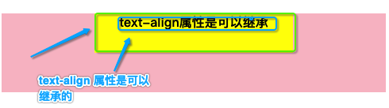 

### 3. 块级元素水平居中 (标准流)


- 设置块级元素水平居中只需要给自己设置  `margin-left:auto;`  ` margin-right:auto;`

```
  <style>
    div {
      background-color: pink;
      height: 100px;
    }
    p {
      background-color: yellow;
      width: 50px;
      height: 50px;
      // 设置 块级元素在父元素中水平居中
      margin-left:auto;
      margin-right:auto;
      // margin: 0 auto;
    } 
  </style>
  ```


  		 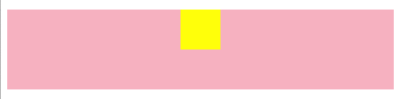  
     
# 十三. Photoshop

前端工程师, 一般使用PhotoShop的时候就两个, **测量** **切图** 


# 十四 CSS属性 背景


## 1. CSS属性- background-image


- `background-image` 用于设置元素的背景图片

  - `background-image` 会盖在`background-color`的上面
- 在图片的透明区域, 可以看到背景色
  - 可以为同一个元素设置多张背景图片 (多张背景图依次叠加)

  ```
  background-image: url("bg1.png"), url("bg2.png");
  ```
  
  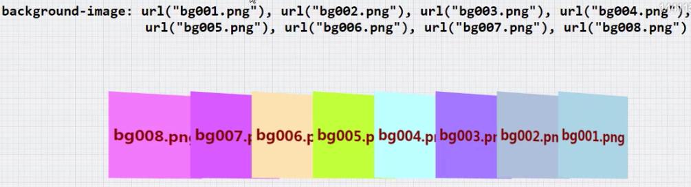 
  
  > 注意: 
  >
  > - 要看到背景图片, 标签必须要有大小
  > - 如果一个标签设置多个背景图片, 先设置的背景图在最上面, 后设置的在下面
  > - 默认背景图不会像img标签中显示图片一样压缩, 背景图片默认不压缩


​    


## 2. CSS属性-  background-repeat

- `background-repeat` 属性, 是用来设置背景图片是否要平铺

  - 常见的取值
    - `repeat`: 平铺  (默认就是这个值)
    - `no-repeat` : 不平铺
    - `repeat-x` 只在水平方向平铺
    - `repeate-y` 只在垂直 方向上平铺

- `background-repeat`属性存在的意义与应用场景

  - 平铺实现规律背景图片

    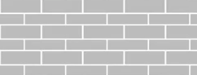 

  - 水平平铺实现按钮背景

     


## 3. CSS属性- background-size

- `background-size` 用于设置背景图片的大小

  ```
  // 宽度150px, 高度100px
  background-size: 150px  100px;

  // 宽度保持原来的宽高比自动计算, 高度100px
  background-size: auto 100px;

  // 高度保持原来的宽高比自动计算, 高度120px
  background-size: 120px auto;
  // 高度保持原来的宽高比自动计算, 高度150px
  background-size: 150px;
  ```

- `background-size` 的取值也可以使用百分比

  ```
  <style>
    div {
      width: 100px;
      height: 100px;
      padding: 50px;
      background-color: green;
      background-image: url(./images/heart.gif);

      background-size: 50% 50% ;
      background-repeat: no-repeat;
    }
  </style>
  ```

  

  > 注意当,background-size 使用百分比来表示的时候, 其默认参考的是 `padding-box` 来计算的

  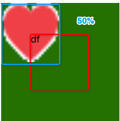 


## 4. CSS 属性- background-position

-  `background-position` 属性用于设置背景图片在水平/ 垂直方向上显示的具体位置

  - 常用的取值

    - 水平方向取值: ` left` `center` `right`
    - 垂直方向取值: `top` `center` `bottom` 
    - `可以是具体的像素 eg: 10px` `也可以是百分比,不常用` 

  - 如果只设置了1个方向的值, 另一个方向默认是center

  ```
    div { // 第一个参数是水平方向, 第二个参数是垂直
    	background-position:80px;
    	// 等价于 background-position:80px center;
    }
    ```


​    

  

  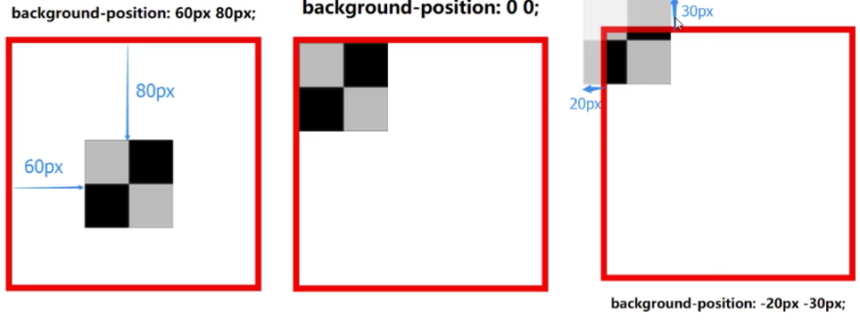  


## 5. 背景图实现圆角 按钮


- 滑动门

  > div 里面放button, div 元素左右设置圆角背景, 中间button设置平铺背景

  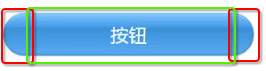 

  ```
  div {
  	width: 150px;
  	height: 32px;
  	// 设置多个背景图, 之间使用逗号分割
  	background-image: url("left.png"), url("right.png");
  	background-repreat: no-repreat, no-repeat;
  	background-position: left center, right center;
  	background-size: auto 32px, auto 32px;
  	padding-left: 17px;
  	padding-right: 17px;
  }
  
  button {
  	width: 100%
  	height: 100%
  	background-image: url("btn.png")
  	background-repeat: repeat-x;
  	border: none;
  	outline:none;
  	displau: block;
  }
  
  ```

  


## 6. 背景图 大图片适配

```
 div {
   /* 不建议设置宽度为图片原始宽度 */
   /*width: 1920px;*/

  /* 让小屏幕的浏览器也能看见最中间的内容
  min-width的宽度要能够包含主要内容
  */
  min-width: 1100px;
  /* 跟背景图片一样高度 */
  height: 489px;
  /* 让背景图片居中 */
  background-image: url("images/mhxy.jpg");
  background-repeat: no-repeat;
  background-position: center;
}
```


## 7. 背景图- sprite  雪碧 精灵图


### 1. CSS sprite 雪碧 精灵图介绍 


- 什么是CSS sprite
  - 是一种CSS图像合成技术, 将各种小图合并到一张图片上, 然后利用CSS的背景图定位来显示图片的对应部位
  - 有人翻译为: CSS 雪碧, CSS精灵
- 使用CSSSprite的好处
  - 减少网页http请求的次数, 加快网页响应的速度, 减少服务器压力
  - 减小图片的总大小
  - 解决了图片命名的困扰, 只需要针对一张集合的图片命名
  - 更换风格方便, 只需要在少数张图片上修改图片的颜色或者样式, 整个网页的风格就可以改变


### 2. CSS sprite 雪碧 精灵图 制作


- CSS sprite 雪碧 精灵图的制作简单3补

  - 1. 设置元素的背景图` background-image: url("./cars.png");`

  - 2. 设置背景图不平铺` background-repeat: no-repeat;`

  - 3. 设置背景图的显示位置(position 偏移量) `background-position: -50px -30px`

    ```
    .icon1 {
    	width = 50px; 
    	height = 30px;
    	background-color: #fff;
    	
    	background-image: url("./cars.png");
    	background-repreat: no-repeat;
    	background-position: -50px -30px;
    }
    ```

    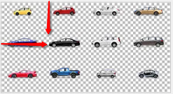 


### 3. CSS sprite 雪碧 精灵图的 注意点

- 显示 Sprite 雪碧 精灵图的元素 包裹住精灵图即可, 不能设置的太大, 否则显示错误

  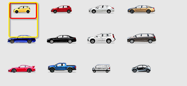 


### 4. Sprite 制作

https://www.toptal.com/developers/css/sprite-generator


## 8. CSS 属性- background-attachment

### 1. background-attchment 元素的使用介绍


- `background-attachment`	 属性可以设置3个值

  - `scroll` 背景图片跟随元素一起滚动 **(即: 依附在元素上)**(默认值)

    > 背景图以元素为参考,定位在元素内, 不会随着元素内容的滚动而滚动, 但是会随着元素的位置移动

    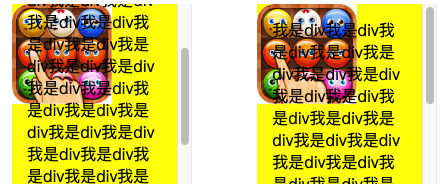 

  - `local` 背景图片跟随元素以及元素内容一起滚动 **(即, 依附在元素内容上)** 

    > 背景图定位在元素内, 会随着内容的滚动而滚动, 有点像是定位在元素的画布上的感觉

    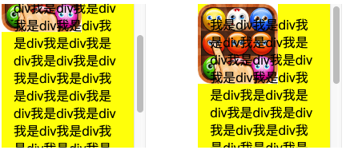 

  - `fixed` 背景图片相对于浏览器窗口固定 **(依附在浏览器上)** 

    > 背景图相对于浏览器定位, 但只在元素区域内可见

    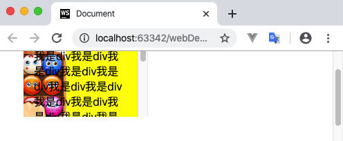 


### 2. background-attchment 的使用总结


1. `background-attchment`属性是用来设置背景图的定位参考目标的, 其有3个取值`scroll` `local` `fixed` , 其中`scroll` 是默认取值
2. `scroll` 和`local` 取值时, 背景图片的定位都是相对于元素的左上角定位的, 只有有一点不同, 当设置为`scroll` 时, 背景图不会随着元素内的内容的滚动而滚动, 有点被边框挡住的感觉. 当设置为`local` 是背景图会跟随着元素内容的滚动而滚动
3. `fixed` 取值时, 元素的背景图是相对于浏览器定位的, 当浏览器页面滑动时, 背景图会跟随着移动, 只是, 只有元素的可见区域部分才能看见背景图


### 3. background-attachment 的应用场景

- 有时我们想实现一个背景图不动, 内容可以滚动的效果

  > 应用场景, 经常和背景平铺一起使用

  - 示例1: 整个网页一个背景

  ```
  <style> 
    body {
    background-image: url(./images/bg002.png);
    background-attachment: local;
    } 
  </style>
  
  <body>
    <p>1</p>
    ... ...
    <p>1000</p>
  </body>
  ```

  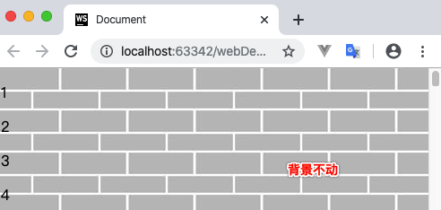 

  -  示例2: div 是一个背景

  ```
   <style>
    div {
      width: 100px;
      height: 100px;
      overflow: auto;
      background-image: url(./images/bg002.png);
      background-attachment: fixed;
    } 
  </style>
  ```

  ```
  <body>
    <div>
      <p>1</p>
      ...
      <p>100</p>
    </div>    
  </body>
  ```

  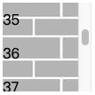 

​		


## 9. CSS 属性- background


- `background` 属性是一系列背景的相关属性的简写, 常用格式是:

  - `image` `position/size` `repeat ` `attachment`  `color` 

    > - background-size 可以省略, 如果不省略必须跟在background-position 后面
    > - 其它属性都可以省略, 而且顺序任意

    


## 10. background-image  和 img 的选择


- 利用`background-image` 和 `img` 都能实现图片的需求, 在开发时该如何选择呢? 

  |                        | img              | background-image         |
  | ---------------------- | ---------------- | ------------------------ |
  | 性质                   | HTML元素         | CSS样式                  |
  | 图片是否占用空间       | 占用空间         | 不占用空间               |
  | 浏览器右键直接查看地址 | 可以             | 不可以                   |
  | 支持CSS Sprite         | 不支持           | 支持                     |
  | 更有可能被搜索引擎收录 | 能 (结合alt属性) | 不能                     |
  | 加载顺序               | 优先加载         | 等加载完HTML元素后再加载 |

- 总结:

  - `img` 作为网页内容的重要组成部分, 比如: *广告图片/ logo图片/ 文章图片/ 产品图片* 

  - `background-image` 可有可无, 有, 能让网页显示的更加美观, 无, 也不应用用户获取网页完整的内容信息

  - 宗旨:

    - 在没有任何CSS样式的情况下, 用户也能浏览网页中完整的内容信息

      *网络出现问题或者服务器出现问题时, 有可能导致CSS文件加载失败* 


## 11. 文档画布的背景 (颜色和图片) 坑


- **没有HTML元素对应着文档画布, 如何设置文档画布的背景? ** 

  > 没有HTML元素对应着文档画布怎么理解呢?
  >
  > 1. html元素是html元素, body元素是body元素, 是没有一个元素对应着文档画布的.  
  >
  >    虽然有时我们直接通过html选择器或者body选择器设置背景色后, 整个浏览器的背景色都会跟着变, 但是其实我们看到的都是假象,  我们看到的整个页面不是html元素, 也不是body元素, 解释如下:

  ```
  <style>
    html {
      background-color: #f00;
    }  
  </style>
  ```

  ```
  </head>
   <body>
  
   </body>
  </html>
  ```

    

  从上图我们到, 虽然整个浏览器都变成和body的颜色一样了, 但是body的实际高度只有内容的高度`22` , 所以以后不要再错误的理解, 整个浏览器的页面就是`body` 或者`HTML`

  

  

  

- **html 或者body 元素的背景都能够延伸到整个文档画布** 

  > 怎么理解呢? 
  >
  > 也就是说:
  >
  > 当 html设置背景body不设置背景, 浏览器的背景就为html的背景
  >
  > 当html不设置背景body设置背景, 浏览器的背景就为body的背景


- **如果同时设置了html和body元素的背景, 根元素HTML的背景才会作为文档画布背景**

  > 怎么理解呢? 
  >
  > 也就是说:
  >
  > html设置背景 且 body设置背景, 浏览器的背景就为html的背景 


- 一般来说, 我们建议通过 body来设置背景色


## 11.伪元素 ::first-line 的背景


- `::first-line`  虽然意为第一行内容, 但是它的背景并不一定填满一行, 取决于各种因素

  - 文字大小/ 容器宽度/ 文字的对齐方式

  ```
  div::first-line {
  	background-color: #00f;
  }
  ```

    


# 十五. CSS 属性- cursor 鼠标样式


## 1. CSS 属性- cursor 的常用取值介绍


- `cursor` 可以设置鼠标指针 (光标) 在元素上面显示的样式
- `cursor`  常有的取值
  - `auto` **默认就是这个值** 浏览器根据上下文决定指针的显示样式, 比如根据文本和非文本切换指
  - `default` 由操作系统决定, 一般就是一个小箭头   
  - `pointer` 一只小手, 鼠标指针挪动到连接上面默认就是这个样式 
  - `text` 一条竖线, 鼠标指针挪动到文本输入框上main默认就是这个样式 
  - `none` 没有任何指针显示在元素上面


## 2. CSS属性- cursor 设置图片

- `cursor` 除了可以设置系统自带的一些值外, 还可以设置图片

  ```
  cursor: url('abc.png') 0 0 , pointer;
  ```

  - `url()` 后面的2个数字
    - 分别代表在水平/ 垂直方向上的偏移, 不能设置负数
    - `0和0` 代表图片左上角和指针是重叠的, 数值越大, 图片左上角会朝着指针左上角偏移
    - 如果水平/ 垂直分别设置一半, 图片的中心点将和指针重叠
  - 如果找不到图片就是用 pointer 作为cursor 的值. 

   


# 十六. 画布和视口

- 视口 (viewport)

  - 文档的可视区域

     


- 画布(Canvas)
  - 用于渲染文档的区域 (就是浏览器中显示的整个网页部分称为文档)
  - 文档的内容超出视口范围, 可以滚动查看

- 宽高比

  - 画布 >= 视口

  


# 十七. CSS 属性- 定位


## 1. 标准流 (Normal Flow)

- 默认情况下, 元素都是按照 normal flow进行定位的
  - 从上到下, 从左到右按顺序排列
  - **相互之间不存在层叠现象** 


## 2. 相对定位 relative (相对于自己原来定位)


### 1. 相对定位的介绍与使用


- 相对定位的元素依然按照normal flow  标准流排布
- 可以通过`left` `right` `top` `bottom` 进行定位
  - 定位参照对象是`元素自己原来在标准流中的位置`

> - 设置相对定位后,元素还是按照`normal flow` 标准流来进行排布
> - 设置相对定位后, 不论元素的定位有没有发生变化, 元素原来占有的位置依然存在, 也就是说前面的元素相对定位改变了位置后不影响后边元素标准流的定位

```
<style>
div {
  width: 100px;
  height: 100px;
}
.box1 {
  background-color: #ff0000;
}
.box2 {
  background-color: #00ff00 ;
  // 设置相对定位 
  position: relative;
  left: 50px;
  top: -50px;
}
.box3 {
  background-color: #0000ff;
}
</style>
```

```
 <body>
   <div class="box1"></div>
   <div class="box2"></div>
   <div class="box3"></div>
 </body>
```

 


### 2. 相对定位的应用场景

-  主要是在不影响其它元素的定位前提下,对元素自己的位置进行微调

   

- 元素居中 (上下 左右居中)

  ```
  img {
  	position: relative;
  	margin-left: -960px;
  	left: 50%;
  }
  
  // 这里的原理相当于是2个属性相减
  // 1. margin-left: -960px; 先往左边挪动 一定距离
  // 2. left: 50% ; 再往右边挪动父元素的一半
  // 最后的结果就是 -960px - 50%
  ```

   


## 3. 静态定位 static (默认定位)

- `position` 属性的默认值就是静态定位`static`

- 静态定位`static`的元素按照 normal flow 标准流排布

- `left` `right` `bottom` `top`  对静态定位`static` 没有任何作用

  > 一般来说我们不用静态定位, 因为默认就是静态定位, 有个了解就对了


## 4. 固定定位-  fixed (相对于视口定位)


### 1. 固定定位 fixed 的介绍

- 固定定位`fixed`的元素会脱离normal flow 标准流 (一般我们称为: 脱标)

- 固定定位`fixed` 的元素, 也是通过`left` `right` `top` `bottom`  这4个属性来定位

  - **固定定位的参考对象与相对定位的参考对象不同, 相对定位relative的参考对象是元素原来在标准流中的位置, 而固定定位的参考对象是视口(viewport), 一般你可以理解为浏览器的窗口就是视口** 

     

- 固定定位`fixed` 的元素, 当画布滚动时, 固定不动

   


## 5. 脱标的特点

- 脱标后的元素可以随意设置宽高, 不再受行内和块级的约束
- 脱标后的元素, **宽度默认由内容决定**
- 脱标后的元素, 不再受标准流的约束
  - 不再严格按照从上到下, 从左到右排布约束
  - 不再严格区分块级/ 行内级, 块级, 行内级的很多特定都会消失
- 不再给父元素汇报宽度数据
- 脱标元素内部的子元素, 默认还是按照标准流排布.


```
 <style>
  .box1 {
    background-color: #f00;
    padding-left: 50px;;
  }
  .box2 {
    background-color: #00ff00;
    position: fixed;
  }
  .box3 {
    background-color: #0000ff;
    padding-left: 50px;;
  } 
</style>

<body>
  <div class="box1">box1</div>
  <div class="box2">box2</div>
  <div class="box3">box3</div>
</body>
```

 


## 6. 绝对定位- absolute 


### 1. 绝对定位的特点介绍

- 绝对定位`absolute` 的元素和固定定位`fixed` 的元素一样, 都会脱离标准流`normal flow`

- 绝对定位的元素和固定定位的元素一样, 都是通过`top` `bottom` `left` `right` 4个属性进行定位

- 绝对定位元素的参考位置和固定定位元素参考的位置不一样, 固定定位的元素脱标后是参考视口(默认浏览器窗口就是视口)来定位, 而绝对定位是参考最邻近的定位父元素进行定位,如果绝对定位没有找到最邻近的定位父元素就参考视口定位

  > `position` 设置为 `relative` 或`absolute` 或`fixed`  的父元素, 都可以作为绝对定位的参考元素

- 绝对定位的元素在布局上和固定定位的元素在布局上特点是一样的, 只是他们定位是参考的对象不同而已. 


### 2. 绝对定位元素的特点

- 绝对定位的元素, 可以自己设定定位参考对象
- 给最近的想定位的父元素, 设置 position 为非 static 就可以参考它定位 


## 7. 定位元素介绍


**1. 什么是定位元素?** 

元素属性position 为 fixed 或 relative 或者 fixed 的元素, 我们都称为定位元素


**2. 定位元素的特点**

定位的元素都可以通过 `top` `bottom` `left` `right`  对元素的定位进行调整


**3.不同类型的定位元素之间的差异**

- `absolute` 和 `fixed` 类型的定位元素在标准流中不再占用原来的位置, 但是`relative` 类型的元素在标准流中还是占用原来的位置
- `absolute` 和 `fixed` 类型的定位元素的尺寸由内容决定, 可以随意设置宽高, 而`relative` 类型的定位元素的宽高仍然由元素的 `display` 属性决定


## 8. 绝对定位技巧 (*) 很重要

- 绝对定位元素 (absolutely position)
- `position` 属性的值为`absolute` 或者`fixed` 的元素, 我们成为绝对定位元素
- 款高 或 margin 适配
- 有了这个技巧后, 我们在定位父元素内布局绝对定位的子元素将变得 更加的灵活和简单


### 1. 技巧1:  计算公式介绍


- 被定位元素的 `left` + `margin-left` + `width` + `margin-right` +`right` = 参照对象的宽度

- 被定位元素的 `top` + `margin-top` + `height` + `margin-bottom` +`bottom` = 参照对象的高度

  上面2句话怎么理解呢? 看下面这幅图: 

   

  > 1. 绝对定位元素的 `left` + `margin-left` + `width` +`margin-right` + `right` = 父定位元素的宽, 这个的意思是当定位父元素的尺寸确定后, 可以通过这个一个公式自动的套出子元素的尺寸


### 2. 子元素尺寸确定, 位置自动适配

- `left` `top` `right` `bottom` 和`width` `height` 决定后 自动计算适配 `margin`

```
<style>

.box1 {
  width: 200px;
  height: 200px;
  background-color: #ff0000;
  position: relative;
}

.box2{
  position: absolute;
  background-color: #0f0;

  left: 0;
  top: 0;
  bottom: 0;
  right: 0;
	width: 100px;
  height: 100px;
  
  // 位置适配/ 宽高适配
  margin: auto; 
}
</style>
```

```
<body>
  <div class="box1">
  	<div class="box2"></div>
  </div>
</body>
```

 

​	

### 3. 宽高适配

```
<style>

   .box1 {
       width: 200px;
       height: 200px;
       background-color: #ff0000;
       position: relative;
   }
    .box2{
        position: absolute;
        background-color: #0f0;
        left: 0;
        top: 0;
        bottom: 0;
        right: 0;
        margin: 10px 20px 30px 40px; 
        // 宽高适配
    } 
</style>
```

```
<body>
  <div class="box1">
  	<div class="box2"></div>
  </div>
</body>
```

 


## 9. 定位总结


### 1. 各种定位元素特点概览

|                     | 是否脱离标准流 | 是否是定位元素 | 绝对定位元素 | 定位参考对象                 |
| ------------------- | -------------- | -------------- | ------------ | ---------------------------- |
| static (静态定位)   | 否             | 否             | 否           | 否                           |
| relative (相对定位) | 否             | 是             | 否           | 元素自己原来在标准流中的位置 |
| absolute (绝对定位) | 是             | 是             | 是           | 最近的定位父元素或视口       |
| fixed (固定定位)    | 是             | 是             | 是           | 视口                         |


### 2. 定位的参考点总结


- 相对定位元素, 参考自己原来在标准流中的位置定位
- 固定定位参考视口定位
- 固定定位相对于最近的定位父元素定位或视口定位


### 3. 修改 position 属性前后对照

定位元素(设置 position 为 relative 或 fixed 或 absolute 的元素)如果没有设置过 `top` `bottom` `left` `right` 属性, 那么元素的位置就是原来标准流中的位置


## 10. 子绝父相

- 在绝大数情况下, 子元素的绝对定位是相对于父元素进行的

- 如果希望子元素相对于父元素进行定位, 又不希望父元素脱标, 常用的解决方案是:

  - 父元素设置 `position: relative`

  - 子元素设置`position: absolute`

    > 简称: 子绝父相


## 11. Z-index 属性


### 1. 元素的层叠


- 父子关系

  - 子元素会层叠在父元素上

- 非父子关系

  - 都是非定位元素

    - **在标准流中默认不存在层叠现象**  , 但是可以使用 负数`margin`  实现后面的层叠前面的

      ```
       .box {
         width: 200px;
         height: 260px;
         background-color: #f00;
       }
      
      .child1{
        width: 100px;
        height: 100px;
        background-color: #0f0;
      }
      
      .child2 {
        margin-top:-20px;
        margin-left: 20px;
        width: 100px;
        height: 100px;
        background-color: #00f;
      }
      ```

      ```
      <div class="box">
        <div class="child1"></div>
        <div class="child2"></div>
      </div>
      ```

       

  - 一个是定位元素,一个是非定位元素

    - **定位元素会层叠在非定位元素上面**, 定位元素可以盖住非定位元素. 

  - 都是定位元素

    - 使用CSS属性 `z-index` 来控制层叠顺序


### 2. z-index 属性


- `z-index` 属性是用来设置**定位元素** 的层叠顺序的 (**仅对定位元素有效**)

  > 注意, 不要用来设置非定位元素, 因为非定位元素绝对是被定位元素盖住的. 
  >
  > 因此, 不存在设置非定位元素的层叠优先级

- `z-index` 的取值可以是` 正整数` `负整数`  `0`,  `z-index` 的默认值不是0, 是auto, 默认不参与比较


- **比较原则**

  - 如果是兄弟关系 (层叠关系比较z-index 即可)
    - `z-index` 越大, 层叠在越上面
    - `z-index` 相等, 写在后面的那个元素层叠在上面
  - 如果不是兄弟关系
    - 各自从元素自己以及祖先元素中, 找出最相邻的2个定位元素进行比较
    - 而且这2个定位元素必须有设置`z-index` 的具体数值

   


# 十八. 浮动


## 1. 定位方案 (Position Schemes)

- 在CSS 中, 有3种常用的方法对元素进行定位/ 布局
  - 标准流/ 正常流 (normal flow)
  - 绝对定位 (absolute positioning)
  - 浮动 (float)
- **绝对定位和浮动都会让元素脱离标准流, 以达到灵活布局的效果**


## 2. CSS 属性- float

- 可以通过`float` 属性让元素产生浮动的效果, float的常用取值有:

  - `none` 不浮动, 所有元素`float` 属性默认值就是`none`

  - `left` 向左浮动

  - `right` 向右浮动

    > 不论float的属性值是left 还是 right 都会让元素脱离标准流.


## 3. 浮动的规则 (*) 很重要


> 需要记住浮动的这些规则, 否则以后会出现一些莫名其妙的问题, 到时找不到问题的解决方法


- **1. 元素一旦浮动后** 

  - 脱离标准流

  - 朝着向左或者向右方向移动, 直到自己的边界紧贴着包含块(一般是父元素)或者其他浮动元素的边界为止.

  - **定位元素会层叠在浮动元素上** 

    ```
    <style> 
    .box {
      width: 200px;
      height: 200px;
      margin-left: 30px;
      background-color: rgba(255,0,0,0.8);
      position: absolute;
    } 
    .box2 {
      width: 50px;
      height: 50px;
      background-color: #0f0;
      float: left;
    } 
    </style>
    ```

    ```
    <body>
      <div class="box"></div>
      <div class="box2"></div>
    </body>
    ```

     


- **2. 浮动元素不能与行内级内容层叠, 行内级内容将会被浮动元素推出/ 赶出去**  

  - 比如: 行内级元素, inline-block 元素

  

  

- 利用浮动元素不能与行内级元素层叠的特性, 我们可以轻松实现文字环绕的效果.

   


- **3. 行内级元素/ inline-block 元素浮动后, 其顶部将与所在行的顶部对齐** 

  

- 4. 如果元素是向左(右)浮动, 浮动元素的左(右)边界不能超出包含块的左(右) 边界

   


- 5. 浮动的元素之间是不能层叠的

  >  这也是为什么左浮动或右浮动元素没有足够空间时会向下移动的原因

  - 如果一个元素浮动, 另一个浮动元素已经在那个位置了, 后浮动的元素将紧贴着前一个浮动元素
  - 如果水平方向剩余的空间不够现实浮动元素, 浮动元素将向下移动, 知道有充足的空间为止.

   


- **6. 浮动元素的顶端不能超过包含块的顶端, 也不能超过之前所有浮动元素的顶端(即, 浮动是有顺序的)**

  > 后浮动的元素浮动后不能超过前面浮动元素的顶端, 这一点很容易忽略

   

  

- **7.浮动后的元素顶部绝对不会搞过浮动前.**  换句话说, 浮动是分先后的

   


## 4. 浮动元素的特点 总结

1. 元素浮动后脱标, 脱标的元素宽高由内容确定, 脱标后元素不再区分块级和行内, 脱标的元素可以随意设置宽高
2. 浮动的元素盖在标准流的元素上, 定位的元素盖在浮动的元素上
3. 浮动的元素不能与行内级元素层叠, 会将行内级内容挤出去
4. 浮动的元素之间是不能层叠的
5. 浮动的元素不能超出包含块的左右
6. 后浮动的元素顶部不能超过先浮动的元素
7. 元素左浮动/ 右浮动, 浮动后的元素顶部绝对不会搞过浮动前.