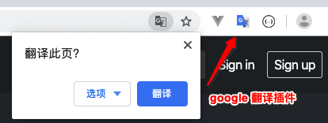
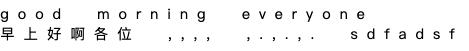
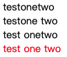
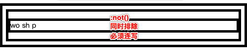

   


 


# 一. 文档声明

 

一个基本的完整的HTML代码如下:

```
 <!DOCTYPE html>
<html lang="en">
<head>
    <meta charset="UTF-8">
    <title>Title</title>
</head>
<body>

</body>
</html>
```


## 说明:


1. `<!DOCTYPE html>`  是html文档声明, 告诉浏览器当前的页面是HTML5页面, 让浏览器按照HTML5的语法格式去解析.  
2. html文档声明必须放在HTML文档的最前面, 不能省略, 省略了会出现兼容性问题
3. HTML5 的文档声明比 HTML4.01/ XHTML1.0 简洁非常多


# 二. HTML 元素

 

1. `html` 元素是HTML文档的根元素, 一个文档中只能有一个, 其它的所有元素都必须放在它里面
2. W3C 标准建议为html 元素增加一个 lang 属性
   - lang属性的作用是帮助语言合成工具确定要使用的发音. 
   - 帮助翻译工具确定要使用的翻译规则

> 1. 比如说盲人, 他在浏览网页的时候是看不见网页的, 但是针对盲人其实是有些设备是可以帮助他们浏览网页的, 比如说有些语音合成工具, 它一浏览这个网页的时候就解析里面的文字, 解析里面的语言, 将内容转换成声音播放给盲人听
> 2. 比如说, 你使用google浏览器, html 标签中设置了 lang=en 的网页, 那么浏览器就会自动的提示你要不要使用google 插件将当前网页内容翻译成中文 




# 三. head 元素


1. head元素里面的内容是一些 `元数据`  *(元数据: 描述数据的数据)*

> 一般用于描述网页的各种信息, 比如: `字符编码`  `网页标题` `网页图标` 等


## 1. title 元素

title 元素是网页的标题


## 2. meta 元素

1. meta用于设置网页的字符编码, 让浏览器 

 


# 四. 文本相关CSS 属性


## 1. text-decoration 属性 (上中下划线)

> text-decoration 用于设置文字的装饰线 (上划线/ 下划线/ 清除下划线)
>
> 一般情况下, 文字的装饰线的颜色和文字的颜色是一样的, 如果需要单独设置需要使用ccs 的 text-decoration-color, 不过这个属性有兼容性问题

- none 无任何装饰线
  - 可以去除a元素默认的下划线
- underling 下划线
- overline 上划线
- line-through 中划线(删除线)

`u` `ins` 元素默认就设置了 text-decoration 为 underline


## 2. letter-spacing / word-spacing 属性 (文字间距)

> letter-spacing 和 word-spacing 分别用于设置字母和单词之间的间距
>
> 默认为0, 可以设置负数

- letter-spacing 用于控制字母与字母之间的间距的(中文/英文/标点都可以)

- word-spacing 用于控制单词与单词之间的间距, 只要是被空格分开的一段连续的字符, 都被它识别为单词




## 3. text-transform 属性(大小写转换)

> text-transform 属性用于设置文字的大小转换

- capitalize  将单词的首字母转换成大写
- uppercase 将所有字母转换成大写
- lowercase 将所有的字母转成小写


## 4. text-indent 属性(首行缩进)

> 首行文字缩进

- `text-indent: 10px`  首行缩进10px

- `text-indent: 2em` 首行缩进 2个文字大小


```
绝对单位: px
相对单位: em 
em单位是相对于font-size 进行计算的
2em 相当于font-size * 2
1em 相当于font-size * 1
```


## 5. text-align 属性 (水平

## 内容对齐方式)

>  设置内容在水平方向上的对齐方式

- left 左对齐
- center 居中对齐
- right 右对齐
- justify 两端对齐

注意: 是这只内容在水平方向上的对齐方式


# 五. 字体相关css属性


## 1. font-size属性

> font-size 属性决定文字的大小

常用的设置

- 具体数值 + 单位

  - 比如: 100px
  - 也可以使用 `em` 单位. eg: 1em代表100% , 2em代表200%, 0.5em代表50%

  

- 百分比

  - 基于父元素的font-size 计算, 比如: 50% 表示等于父元素 font-size的一半

```
div{
	font-size:2em;  // 此时的em 是相对父元素的font-size来参考的 // 相当于2 *父元素的font-size
	height: 2m;   // 此时的em 是相对于自己的font-size来参考的 // 相当于4 *父元素的font-size
}
```

>  一般给body设置font-size就代表设置网页的默认字体大小
>
> - 其它元素可以基于父元素设置字体大小
> - 到时候,只需要改变body的字体大小, 其它元素都会按照比例改变


## 2. font-family 属性

> 用于设置文字的字体名称
>
> - 可以设置1个或者多个字体的名称(从左向右顺序选择字体, 直到找到可用的字体就停止)

```
 div{ 
 	// 可以设置多个字体, 字体之间以逗号分割, 先从左往右找, 找到了就停止
   font-family:"Courier New", "微软雅黑";
 } 
```

如果想要中文显示中文字体, 英文显示英文字体, 需要将英文字体写在前面, 中文字体写在后面.


## 3. @font-face

> @font-face 可以让网页支持自定义字体, 不再局限于系统自带字体.

常见的字体类型

- TrueType字体: 拓展名为 `.ttf`
- OpenType字体: 拓展名为 `.ttf` `.otf`  建立在TrueType字体之上
- Embedded OpenType字体: 拓展名为 `.oet` , OpenType 字体的压缩版
- SVG字体, 拓展名师`.svg` `.svgz`
- web开发字体: 拓展名是`.woff` , 建立在TrueType字体之上


并不是所有的浏览器都支持以上的字体, 使用时要多加测试

字体下载: http://font.chinaz.com


**具体使用步骤:  导入自定义字体并设置字体名字 -> 在选择器中通过自定义字体名使用自定义字体** 

```
<style>
		//1. 导入字体, 并给字体取名字
    @font-face{
    	// 字体文件的位置
    	src : url('font/miniCut.ttf');   // 可以有多个url, 之间使用逗号分割 
    	// 定义字体的名字
    	font-family: '迷你剪纸字体'
    }
    
    // 2. 在对应的选择器中使用自定义字体
    div{
    	font-family :'迷你剪纸字体'
    }
</style>
```


## 4. font-weight 属性

> font-weight 用于设置文字的粗细(重量)


可以设置下面的值

- `100` `200` `300` `400` `500` `600` `700` `800` `900`  每一个数字表示一个重量

- `normal` 等于400 的重量
- `bold`  等于是700的重量


一般开发中, 我们使用 数字来设置字体的重量, 这样比较明确.


实际上很多元素默认就是 `bold` 的重量:

```
strong	b	h1~h6 等标签默认的 font-weight 就是 bold
```


## 5. font-style 属性

> font-style 属性是用于设置文字的常规/ 斜体显示

可以使用的值

- normal  常规显示 (一般默认就是这种样式)
- italic 用字体的斜体样式    `(italic 是斜体的意思)`
- oblique 文本倾斜显示 ` (oblique 是倾斜的意思)`

**说明: ** 

一个字体可能包含正规字体/ 斜体, 也可能不支持斜体, 也就是说, 如果你使用的是 `italic` 那么 只有在当前使用的字体有斜体字时, 文字才会有 倾斜效果,否则没有. 

如果你使用的是 `oblique`那么不论当前使用的字体有没有斜体样式, 字体都会被倾斜显示


下面元素中的字体默认就是使用的是斜体 `italic`

```
em	i	cite	address	var	dfn 等   
```


## 6. font-variant 属性

> font-variant 可以影响小写字母的显示形式
>
> variant 是变体的意思

可以设置如下的值

- normal 常规显示
- small-caps 将小写字母替换为缩小的大写字母


```
div{
	font-variant: small-caps;
}

<body>
    Hello Good morning
    <div>
        Hello Good morning 
    </div> 
</body>
```


# 六 . CSS 选择器 selector

选择器的种类繁多, 大概可以归纳为: 

- 通用选择器   `*`
- 元素选择器 `div` `p` `span` 
- 类选择器 `.nav` `.box` 
- id选择器 `#header` 
- 属性选择器 `[attr=val]` `[attr~=val]` `[attr$=val]` `[attr|=val]` `[attr*=val]` `[attr^=val]` 
- 组合选择器 `div p`  `div>p` ` div+p`  `div~p` `div.one`  `div~p`


 


## 1. 标签选择器 (type Selector)

也有些地方称标签选择器为类型选择器.  写上标签名元素名即可

```
div{
	color: red;
}
```


## 2. 通用选择器 (Universal selector)

通用选择器, 选择所有的元素

```
*{
	color : red;
}
```

一般来说, 通用选择器的效率比较低,尽量不要使用


## 3. id 选择器 (id selector)

**使用场景:**

什么时候会使用`id选择器` , 如果想在一个HTML文档中给`唯一一个`的元素设置属性, 就可以使用id选择器. 注意是唯一一个.

**示例:** 

```
<style>
	#main-content{
		color:red;
	}
</style>
```

```
<body>
<div id="main-content">

</div>
</body>
```


**注意点:**

1. 一个HTML 文档里面的`id`值是唯一的,不能重复 *(即, 一个HTML文件里不能出现重复的id名)* 

2. id值如果由多个单词组成, 单词之间用中划线`-` 下划线`_` , 也可以是使用驼峰命名法.  根据html文档和css的特点, 建议使用中划线`-` 

3. 最好不要使用标签名作为id值, id名一般要写的有意义.

    

> 中划线 `-` 又叫连字符 (`hyphen`) , 在有些文章中有这个单词


## 4. 类选择器 (class selector)

注意: 

类选择器不是类型选择器, 类选择器是根据类型来选择, 而类型选择器是根据标签元素名来选择. 


**使用场景:**

 如果想给多个标签设置一坨相同的样式, 就可一个定义一个类选择器, 给多个标签添加这个类, 这样多个标签就设置了相同的一坨样式属性了


**示例: ** 

```
<style>
	.content{
		color: red;
	}
</style>
```


```
<p> 我是段落1 </p>
<p class="content"> 我是段落2 </p>
<p class="content"> 我是段落3 </p>
<p class="content"> 我是段落4 </p>
<p> 我是段落5 </p> 
```


> 一个标签可以有多个类, 不同的类之间使用 空格 隔开

```
<p class="one two three"> 我是段落 </p>
```


**总结:**

类选择器的特点, 把一些共性的样式抽到一个类里面, 随想要使用这个共性, 就在标签里面填

 

## 5. 属性选择器 ([attr = val]) 等于val

属性值等于val的选择器

```
[title="one"]{ // 属性名为title, title的值为 'one' 的选择器
	color: red;
}
[title="two"]{
	color: blue;
}
[id='username']{ //属性名为id, 属性值为 username的选择器 
	color: pink;
}
```

```
<div title='one'>title='one'</div>
<div title='two'>title='two'</div>
<div id="username">id="username"</div>
```


 

> `#test` 和 `[id='test']`  看起来好像一样, 其本质是不一样的


 

## 6. 属性选择器 ([attr ~= val]) 包含val单词

属性值包含 `val单词`的选择器, 且多个单词之间必须使用空格隔开

```
[title ~= 'one']{
	color: red;
}
```


```
<div title='testonetwo'> testonetwo</div>
<div title='testone two'>testone two </div>
<div title='test onetwo'> test onetwo</div>
<div title='test one two'> test one two</div>
```





## 7. 属性选择器 ([attr |= val])等于或val-开头

属性值恰好等于val或者以val开头且紧跟连字符的元素

```
[title |="one"]{
	color: red;
}
```


```
<div title='one'>one</div>
<div title='one-two'>title=one-two</div>
<div title='one two'>one two</div>
<div title='onetwo'>onetwo</div>
```


 一般这个属性选择器 [attr |= val] 选择器是用在 `lang` 属性上面, 用于语言的区分

```
[lang |= 'zh']{
	color: red;
}
```

```
<div>
<span lang="en-US">美国英语</span>
<span lang="en-bz">巴西英语</span>
<span lang="zh">中文</span>
<span lang="zh-tw">繁体中文</span>
</div>
```


## 8. 属性选择器 ([attr ^= val]) 以val开头

属性值单词以 val 开头的元素

```
[title ^="one"]{ // 属性名为title, 属性值 以 one 开头的 所有元素
	color: red;
}
```


主要使用场景, 根据不同数据来源对展示做去区分.

比如: http与https 的连接不同, http存在安全风险, 在展示时根据内容提示用户

```
 [href ^="mailto://"]{
 	color: red;
 	background-color: green;
 }
```


```
<a href ="https://www.baidu.com"> 百度</a>
<a href ="https://www.baidu.com"> 网易</a>
<a href ="mailto://3588710396@qq.com"> 发邮件</a>
<a href ="mailto://690852195@qq.com"> 发邮件1</a>
```


## 9. 属性选择器 ([attr $= val]) 以val结尾

属性值以 val 结尾的选择器

```
[title $= "one"]{
	color: red;
}
```

```
<div title="one"> one</div>
<div title="twoone">twoone</div>
<div title="two one">two one</div>
<div title="two-one">two-one</div>
```


## 10. 属性选择器 ([attr *= val])包含val

属性值只要包含 val 就可以

```
[title *= 'usse']{ // 只要title 属性中包含 'user' 就可以
	color: red;
}
```


## 11. 后代选择器 (div p) 


> 后代选择器也被叫做后代选择器 .  只要是后代全部选中 

```
div span { // 找出div 元素里面的span元素, 包括直接, 间接元素, 只要,div里面的span就会被选择出来
	color: red;
}
```

```
<div>
	我是div	
	<span> span1</span>
	<p> <span> span2 </span> 我是p </p> 
</div>
```


## 12. 子组合选择器 (div>p)

>  资组合选择器, 也叫直接子元素选择器 (不包括间接元素)
>
> - 建议, 一般 `v` 符号两遍不要留空格,紧挨着就好, 否则容易和后代选择器搞混


```
div>span{   
	color: red;
}
```


```
<div>
	<span> 直接子元素1</span>
	<p> <span> 间接子元素</span> </p>
	<span> 直接子元素2</span>
</div>
```


## 13. 相邻兄弟组合选择器 (div+p)


> div 元素后面紧挨着的平元素 (div和p元素必须是兄弟关系)
>
> 相邻兄弟选择器, 也称为紧挨着兄弟选择器 

```
div+p{
	color: red;
}
```


```
<p>段落1</p>
<div>我是div</div>
<p>我是段落2</p>
<div>我是div</div>
<span>我是span</span>
<p>我是段落3</p>
```


## 14. 全体兄弟组合 (div~p)


> div 后面的平元素, div 与 p 之间必须是兄弟关系

```
div~p{
	color:red;
}
```

```
<p>段落1</p>
    <div>
        <p>段落2</p>
    </div>
    <p>段落3</p>
    <p>段落4</p>
    <span> span</span>
    <p>段落5</p>
```

 


## 15. 选择器组-交集 (div.one)

> 选择div元素里面有`.one` 类 的元素
>
> - 注意:  `div` 和 `.one` 之间是没有空格的, 紧挨着

```
div.one{ // 既要是div 元素, class 中也要有个 one
	color: red;
}

div.one[title='test']{// 既要是div元素, class里面又要有个one 且 title属性为 'test'
	color:blue;
}
```

```
<div class="one"> div.one </div>
<div class="two">div.two</div>
<div class="three">div.three</div>
<div class="one" title="test"> div.one  test </div>
```


## 16. 选择器组-并集(div,p,a)

> 选择器之间使用逗号`,` 隔开

```
div, .one, [title='test']{ // 这些选择器中只要符合一个就可
	color: red;
}

// 上面的写法等价于分开写, 如下
div{  
	color: red;
}
.one{  
	color: red;
}
 [title='test']{  
	color: red;
}
```


## 17. 伪类选择器 


### 1. 常见的伪类选择器 


伪类选择器的作用是给已经存在的类选择器增加一些额外的选择功能, 比如:

1. 可以通过`动态伪类`为已经存在的选择器增加一种`动态选择`的功能. **根据状态选择元素**
2. 可以通过`结构伪类` 根据html文档内的`元素的书写结构` 来选择对应的元素. **根据结构选择元素** 

3. 可以通过`否定伪类` 来排除要选择的元素. **排除一些不想选的,其它全选中**


> 说明, 所有的伪类选择器前面(即`:前`)可有有其它的选择器, 也可以没有单独使用, 如下: 

```
div:nth-child(1){ // 表示选择第一个子元素, 且必须是div类型
	color:red;
}

:nth-child(1){ // 表示选择所有的第一个元素, 只要是第一个子元素即可
	color:red;
}
```


 


##### 1. 动态伪类选择器

*动态伪类细节比较多* 

`:link` `:visited`  `:hover` `:active` `:focus` 

>  为已经存在的选择器增加一种**动态选择** 的功能
>
> - 除了`a` 元素, `:hove` `:active` 也能用在其它元素上, hover表示的是鼠标挪到了元素上, active表示鼠标左键按照元素上
> - `:hover` 必须放在 `:link` 和 `visited` 的后面才能生效
> - `:active` 必须放在`:hover` 的后面才能生效
>
> 建议顺序:  `:link` `:visited` `hover` `:active`   女朋友看到LV宝宝haha大笑
>
> - `:focus` 伪类, 聚焦动作选择器, 一般为`input` `textarea` 标签增加聚焦的选择, 也可用用在`a` 标签上, 如果用在`a` 标签上就和`:active`  差不错
>
> 因此, `a` 标签可以有5中伪类状态` :link` `:visited` `:focus` `:hover` `:actived` , 为了便于记忆, 女朋友看见LV宝宝(疯)一样的ha ha 大小


使用举例:

```
a:link{ // 未访问的连接
	color: red;
}
a:visited{ // 已访问的连接
	color: gree;
}
a:hover{ // 鼠标挪动到连接上
	color: orange;
}
a:active{ // 鼠标在连接上长按未松开, 鼠标左键按下不松开
	color:cyran;
}

input:focus{ // 文本框聚焦时选中
	color: blue;
}
```


>  提示:
>
> 因为默认情况下可以通过键盘上的`tab键` 在HTML网页中的多个 `input标签`  `a标签` `textarea标签`  之间切换, 让对应的`input标签` `textarea标签`  `a标签` 进入`:focus` 聚焦状态(外边显示蓝边), 这是浏览器的默认行为(google chrome 有这种行为, safar没这种行为)
>
> 为了决绝这种键盘上的`tap键` 让`a标签` 也出现蓝边这种行为, 只需要给`a标签` 设置`tabindex` 为`-1` 


```
// tabindex 是用于控制tab键被按下的选择顺序的, 当为-1 是表示不允许tab键切换
<input type="text" tabindex="1">
<input type="text" tabindex="2">
<input type="text" tabindex="3">
<input type="text" tabindex="4" >

<a tabindex="-1" href="http://baidu.com">afasd</a>
<a tabindex="-1" href="http://baidu.com">afasd</a>
<a tabindex="-1" href="http://baidu.com">afasd</a>
<a tabindex="-1" href="http://baidu.com">afasd</a>

// 注意: 通过选择器给a标签设置 tabindex 是不会生效的, 需要在 a标签内直接设置才会生效
```


**a标签样式细节**

如果, 我们想要`a` 标签在显示时, 所有的状态颜色都一样, 我们可以直接个`a` 标签设置`color` 属性, 相当于给` a:link` `a:visited` `a:focus` `a:hover` `a:active` 同时设置了`color`, 如下: 

```
a{ // 这样 link visited focus hover active 下的color就都为red了
	color: red; 
}
```

如果通过 `a{color:red;}` 设置了统一的颜色后还要有其它的状态颜色, 在后面使用伪类单独设置即可.

 

#####2. 结构伪类选择器

*所谓结构伪类, 就是根据元素的结构情况来选择对应的元素* 

`:nth-child()`  `:nth-last-child()` 

`:nth-of-type()` `:nth-last-of-type()`

`:first-child` `:last-child`

`:first-of-type` `:last-of-type`

`:root` `only-child` `only-of-type` `:empty`


- **:nth-child(num)** 

> 选择span元素, 并且span元素是他父元素中的第一个子元素 (直接子元素)
>
> **1. 如果span不是父元素的第1个元素就不选**  
>
> **2.如果发现span是父元素的第一个元素就选上, 与父元素的类型无关, 只要是父元素的第1个就可以** 

```
pan:nth-child(1){ // 只要是父元素的第一个元素是span 就选中, 与父元素的类型无关
	color:red;
}
```

```
<div>
    <span>div 我是span1</span>
    <span>div 我是span2</span>
    <span>div 我是span3</span>
    <p>
        <span>p  我是span1</span>
        <span>p  我是span2</span>
        <span>p  我是span3</span>
    </p>
</div><div>
    <span>我是span1</span>
    <span>我是span2</span>
    <span>我是span3</span>
    <span>我是span4</span>
    <span>我是span5</span>
</div>
```


> `:nth-child(num)` 的高级用法
>
> 1. 可以这样用 `span:nth-child(2n)` n 代表从0 开始的正整数 0,1,2,3,4,5…,  `span:nth-child(2n)` 表示取 2,4,6,8 ..位上的span子元素
> 2. 也可以这样用 `span:nth-child(even)` 等价于`span:nth-child(2n)`  evnt 是偶数的意思
> 3. 还可以这样写 `span:nth-child(2n+1)` n 代表从0 开始的正整数 0,1,2,3,4,5…,   `span:nth-child(2n+1)` 表示取 1,3,5,7. ..位上的span子元素
> 4. 也可以这么写 `span:nth-child(odd)`  等价于 `span:nth-child(1n)`  odd 是奇数的意思


**总结:**

1. `:nth-child()` 的完整使用的格式是 `:nth:child(an+b)`
   - `an+b` 表示的是选择父元素中的第 `an+b` 个子元素
   - `n` 代表任意正整数和0
   - `a` `b`  需要给出具体的数值, 可是`正整数` `负整数` 和 `0` 
2. 最重要的是css选择器在选择子元素时, 子元素的序号是从`1` 开始计算, 也就是说css在选择子元素时, 不存在选择 `第0` 位的子元素, 子元素最小的序号是`1`
3. 注意: 不要写成` :nth-child(2+n)` 变量 `n` 要写在前面, 否则失效


> **思考**
>
> 如何使用 `:nth:child()` 取出最前面的2个子元素
>
>  
>
> 答案: 
>
> span:nth-child(-n + 2){	// n 从0开始, -n表示 0, -1, -2,-3 
>
> ​	color:red;
>
> }
>
> 这里主要是利用的css选择器在选择子元素时, 子元素的序号为 大于0 的正整数, 小于1的整数都视为无效. 


- **nth-last-child(num)** 

> `:nth-last-child()` 的语法根`nth-child()` 类似, 不同点是`:nth-last-child()`  是从最后一个元素倒着查找, 其它的都一样. 只是反着数数而已


> **思考:**
>
> 如果想要达到前几个不选, 最后几个不选怎样实现
>
>  
>
> 答案: 使用 `nth:child()` 和 `nth-last-child()` 组合选择器完成
>
> span:nth-child(n+2):nth-last-child(n+2){	// 前2个不选, 后2个不选, 中间的选中
>
> ​	color:red;
>
> }


- **:nth-of-type(num)**

> `span:nth-of-type(num) `  是这样来查找的, 第一, 找出父元素内的所有的 `span` 元素, 如果所有的`span` 元素中有第`num` 个元素, 那么这个`span` 元素就是要找的元素. (直接子元素)
>
> 注意: 
>
> `span:nth-of-type(num)` 这种方式查找与`span` 元素前面有没有其他的元素没关系, 是要是父元素中的`span`类型的第`num` 个元素即可 


**总结:** 

1. `:nth-of-type(num)` 的完整格式是`:nth-of-type(an+b)` ,  其中  `an+b` 的计算与使用原理与`:nth-child(an+b)` 中的`an+b` 的使用和计算原理是一样的


- **:nth-last-of-type(num)**

> 使用方法同 `:nth-of-type(num)` 的用法是一样的, 只是索引的序号是倒着数.


- **:first-child()**

> `span:first-child` 表示找第一个子元素, 且子元素的类型必须是 span类型
>
> `span:first-child` 等价于`span:nth-child(1)` 


- **:last-child**

> 功能与`:first-child` 类似, 只是选择最后一个 

 

- **:root** 

> 根元素选择器, 一般表示的是获取 html 元素


- **empty**

> `:empty` 代表里面完全是空白的元素, 开始标签和结束标签之间没有任何内容

```
p{
  width: 100px;
  height:50px;
  background-color: green;
  margin: 10px;
  float: left;
}

p:empty{ // 选择完全没有内容的 p 元素
	border: 2px solid #f00;
}
```

```
<p></p>   							 // 完全空白
<p> 我是段落1</p> 
<p>   </p> 							// 空格也算内容
<p><span></span></p> 		// 其它标签也算内容
<p>我是段落2</p>
```


##### 3.否定伪类

> 含义: 否定伪类`:not(selector)` ,表示排除 `selector` 选择的元素后的所有元素
>
> 否定伪类选择器只支持简单选择, 不支持组合. 也就是说selector只能是`标签选择器,  类选择器 , 通用选择器, 属性选择器, 伪类选择器, id选择器`  
>
>  比如: 下面的写法是支持的

```
div:not(div.one){ // 错误写法
	color:red;
}
:not(div .one){   // 错误写法
	color:red;
}

:not(p):not(body):not(html){ // 表示选择所有, 除了p 除了body 除了 html 
	color:red;
}
```


**注意: ** 

*如果要同时排除一些元素, 必须要连着写, 如果分开就就失效了*  

*比如: 同时排除 p, body, html 就得按照下面连着写* 

```

:not(p):not(body):not(html){  
	border: 5px solid #000;
}
```


这样分开写, 就失效了

```
:not(p){  // 排除了p, 包含了body 和 html
	border: 5px solid #000;
}
:not(body){ // 排除了body, 包含了p 和 html
	border: 5px solid #000;
}
:not(html){  //// 排除了 html,包含了 p, body
	border: 5px solid #000;
}
```




##### 4. 目标伪类选择器

`:target` 


##### 5.  语言伪类选择器

`:lang()`


##### 6.  元素状态伪类选择器

`:enabled` `:disabled` `:checked` 


# 七. 伪元素 


## 1. 常用的伪元素介绍

`:first-line` `::first-line`   

`:first-letter` `::first-letter` 

`:before` `::before`

`:after` `::after`

**伪元素前面可以写1个冒号, 也可以使用2个冒号, 是一样的意思**, 为了区分伪元素和伪类, 建议伪元素使用2个冒号, eg: `::first-line` 


伪类一般是代表**某种状态** 或者**某种位置** 或者**某种条件** 的, 而伪元素代表一种元素.


### 1. 伪元素 ::first-line (首行文字伪元素)


> `::first-line`  可以针对 **首行文本**  设置属性 

```
 div {
 	border: 1px solid #000;
 }
// 为首行文字设置背景色
div::first-line{
	background-color: #f00;
}
```

```
 <div>
 我是div 我是div 我是div 我是div 我是div 我是div 我是div 我是div 我是div 我是div 我是div 我是div 我是div 我是div
 </div>
```


**注意:** 

不是所有的属性都可以应用到 `::first-line` 伪元素上. 

只有, **字体属性**  **颜色属性**  **背景属性**   才能应用到`::first-line` 微元素上, 如下等等, 不知道试一下就好 

`word-spacing` `letter-spacing` `text-decoration` `text-transform` `line-height` `color` `background-color` 


### 2. 伪元素::first-letter (首字母伪元素)

> 首个字母微元素`::first-letter` 和首行字母伪元素的用法是一样的, 只是范围是首字母而已

```
 div {
 	border: 1px solid #000;
 }
// 为首个字母添加背景色和设置文字大小
div::first-letter{
	background-color: #f00;
	font-size:30px;
}
```

``` 
<div> 
我是div 我是div 我是div 我是div 我是div 我是div 我是div  我是div我是div  我是div 我是div 我是div  我是div我是div  我是div
</div>
```


**注意:**

并不是所有的属性都可以应用在 `::first-letter` 首个字母伪元素上.

一般只有字体属性, margin属性, padding属性,boder属性, 颜色属性,背景属性


 ### 3. 伪元素 ::before 和 ::after

> `::before和::after` 伪元素, 用来在一个元素的内容之前或者之后插入其他内容 (可以是文字, 图片)
>
> `::before 和::after` 伪元素中的content 可以是`字符串`, `可以是URL`, `可以是同果attr(属性名)获取的属性值`

```
 div {
   margin-top:100px;
   border: 1px solid #000;
 }

div::before{
  content: '我是插入的文字 ';
  color: #0f0;
}
div::after{
  content: url('a.jpg');
}

p::before{
  content: attr(class);
  color: orange;
}
p::after{
  content: attr(name);
  color: purple;
}
```


```
 <div>我是div</div>
 <p class="stu" name="zhangsan"> 我 是段落 </p>
```


 **::before 和 ::after 伪元素主要应用场景说明** 

1. 这2个微元素在网页中的应用场景其实还是比较的的, 比如: 常用来清除浮动, 显示超链接的详细地址等等

```
// 在超链接的末尾添加上连接详细地址
// 如果想要在 attr(属性名) 的前面插入其他内容, 直接使用 字符串即可, 如下: 

a[href^="http"]::after{ //[href^="http"] 表示选择要有http属性的
	content: " [ "     attr(href) " ] ";
}

<a href="http://baidu.com">百度一下</a> <br><br>
<a href="http://sina.com">新浪</a>
```


