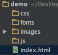
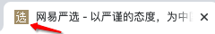
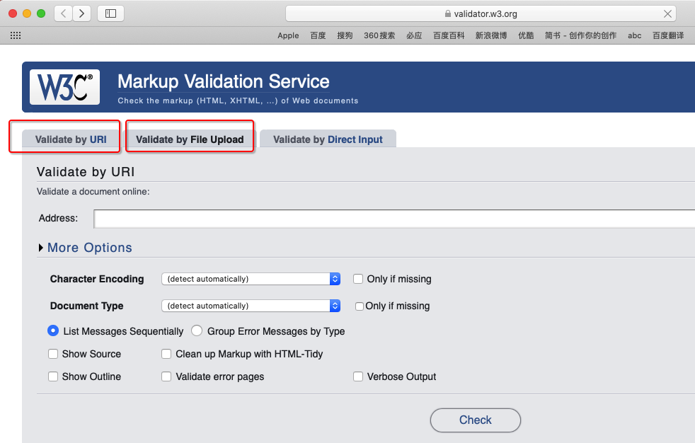

# HTML  综合练习


# 一.项目基本设置


## 1. 项目结构划分


一般我们在开发一个网页项目的时候, 工程项目一般以文件夹划分为几块:

- `css`: 该文件夹一般用于存储所有的CSS 样式文件
- `images`: 该文件夹一般用于存储项目中会用到的所有图片
- `js` : 该文件夹一般用于存储项目中所用到的javaScript文件
- `fonts`: 该文件一般用于存储所有的字体

- `index.html` : 网页入口文件

   


## 2. HTML网页标题icon设置

```
<link rel="icon" href="images/favicon.ico"/>
```

 


## 3. 项目结构的划分


### 1. 结构介绍


通常网页的结构是从上向下划分的, 一般我们习惯把网页划分为三个部分: **header** (头部)    **main**(主体)  **footer** (尾部) 

>  具体的结构划分要根据项目的实际情况来决定.


- **header** 头部, 一般主要包含以下几部分内容:

  - `logo` 

  - `导航` 

  - `搜索框` 

  - `登陆/注册`

  - `Slogan`   slogan 是口号的意思

     

- **main** 主体

  - 核心内容
  - 产品信息

- **footer** 尾部, 尾部一般包含以下几个方面的内容

  - 友情链接
  - 帮助
  - 服务
  - 版权
  - 备案信息
  - … … 

  > 注意:
  >
  > 尾部一般也是包含很多内容的, 不是最后/最下面的区域才称为尾部, 这一点要注意一下

   


### 2. 具体划分

一般来说,结构划分的这三部分,每一部分都是唯一的,所以我们使用 **id** 划分

```
<body>
<div id="header"></div>
<div id="main"></div>
<div id="footer"></div>
</body>
```


## 4. CSS Reset  (CSS样式重置)

- 对浏览器默认的一些样式进行重置

  > 因为每个浏览器默认的样式都是不一样的, 为了便于维护, 通常我们在真正编写CSS代码前的第一件事就是清楚浏览器默认的样式, 这样我们在后面编写样式时就不用在关心浏览器的默认样式了, 直接编写即可

  css-reset.css 文件内容如下: 

  ```
  @charset "UTF-8";
  
  /*清除默认的内外边距*/
  body, dl, dt, dd, ul, ol, li,
  h1, h2, h3, h4, h5, h6, pre, p,
  form, button, input, textarea, select,
  table, tr, td, th {
      margin: 0;
      padding: 0;
  }
  
  i, em {
      /*清除文字默认的倾斜样式*/
      font-style: normal;
  }
  
  li {
      /*清除item前面的项目符号*/
      list-style: none;
  }
  
  a {
      /*清除默认的上中下划线*/
      text-decoration: none;
  }
  
  table {
      /*表格默认合并边框*/
      border-collapse: collapse;
      /*清除单元格之间默认的水平垂直间距*/
      border-spacing: 0;
  }
  
  /*清除默认的轮廓线*/
  button, input, textarea, select, a {
      outline: none;
  }
  
  img {
      /*很久以前图片默认是有边框的, 清除它*/
      border: none;
      /*与一行文字的顶部对齐, 清除底部间隙, 默认是 baseline*/
      vertical-align: top;
  }
  ```
  
  


## 5. CSS编码规范

- 省略小于1的小数前面的0(eg: ` .5` 代替 `0.5`)
- 对于以逗号分隔的属性值, 每个逗号后面都应该插入一个空格(eg: box-shadow)
- 不要在 rgb(), rgba() 值的内部的逗号后面插入空格(这样利于从多个属性值)
- 并集选择器, 建议每个选择器独立一行
- 样式的建议编写顺序: 定位 盒子模型 文字 其它 


# 二. 项目中不要滥用标题


官方验证网页大纲的网站

https://validator.w3.org

  


