[TOC]


# 一、 Web APIs 入门介绍


> 学习目标：
>
> 能够通过ID来获取元素
> 能够通过标签名来获取元素
> 能够通过class来获取元素
> 能够通过选择器来获取元素
> 能够获取body和html元素
> 能够给元素注册事件
> 能够修改元素的内容
> 能够区分innerText和innerHTML的区别
> 能够修改像div这类普通元素的属性
> 能够修改表单元素的属性
> 能够修改元素的样式属性

## 1、 Web API介绍

### 1、 API的概念

API（Application Programming Interface，应用程序编程接口）是一些预先定义的函数，目的是提供应用程序与开发人员基于某软件或硬件得以访问程序的能力，无需访问源码，无需理解其内部工作机制细节，只需直接调用使用即可。

.png)          


> 举例解释什么是API。
>
> 例如，
>
> ​	C语言中有一个函数 fopen()可以打开硬盘上的文件，这个函数对于我们来说，就是一个C语言提供的打开文件的工具。
>
> ​	javascript中有一个函数alert()可以在页面弹一个提示框，这个函数就是js提供的一个弹框工具。
>
> 这些工具（函数）由编程语言提供，内部的实现已经封装好了，我们只要学会灵活的使用这些工具即可。


### 2、 Web  API的概念

​	**Web API 是浏览器提供的** 一套操作**浏览器**功能和**页面元素**的 API  ( `分为 BOM 和 DOM 两部分` )。 

​	现阶段我们主要针对于浏览器讲解常用的 API , 针对浏览器做交互效果。比如我们想要浏览器弹出一个警示框， 直接使用` alert(‘弹出’)` 

​	**MDN 详细 API :**  https://developer.mozilla.org/zh-CN/docs/Web/API

​	因为 Web API 很多，所以我们将这个`阶段称为 Web APIs`。 

​	此处的 Web API 特指浏览器提供的一系列API(很多函数或对象方法)，即操作网页的一系列工具。例如：操作html标签、操作页面地址的方法等。


### 3、 API 和 Web  API 总结

1. API 是为我们程序员提供的一个接口，帮助我们实现某种功能，我们会使用就可以了，不必纠结内部如何实现
2. Web API 主要是针对于浏览器提供的接口，主要针对于浏览器做交互效果。
3. Web API 一般都有输入和输出（函数的传参和返回值），Web API 很多都是方法（函数）
4. 学习 Web API 可以结合前面学习内置对象方法的思路学习


## 2、 DOM 介绍


### 1、 什么是DOM

​	**文档对象模型**（Document Object Model，简称**DOM** ），是 [W3C](https://baike.baidu.com/item/W3C) 组织推荐的处理[可扩展标记语言](https://baike.baidu.com/item/%E5%8F%AF%E6%89%A9%E5%B1%95%E7%BD%AE%E6%A0%87%E8%AF%AD%E8%A8%80)（html或者xhtml）的标准[编程接口](https://baike.baidu.com/item/%E7%BC%96%E7%A8%8B%E6%8E%A5%E5%8F%A3)。

​	W3C 已经定义了一系列的 DOM 接口，通过这些 DOM 接口可以改变网页的`内容、结构和样式` 。

> DOM是W3C组织制定的一套处理 html和xml文档的规范，所有的浏览器都遵循了这套标准。


### 2、 DOM树


**DOM树 又称为文档树模型** ，把文档映射成树形结构，通过节点对象对其处理，处理的结果可以加入到当前的页面。

- **文档** ：一个页面就是一个文档，**DOM中使用document表示** 

- **节点** ：网页中的所有内容在文档树中都是节点`（标签、属性、文本、注释等）` ，**DOM中**使用node表示** 

  - `标签节点` `属性节点` `文本节点` 

- **元素** ：网页中的标签，通常又称为元素，**DOM中**使用element表示** 

  ​

> 在**DOM** 中, 把`文档` `节点` `元素` 都看成一个个的对象


## 3、 获取HTML元素

为什么要获取页面元素？

例如：我们想要操作页面上的某部分(显示/隐藏，动画)，需要先获取到该部分对应的元素，再对其进行操作。


### 1、 根据ID获取元素对象 

```js
语法：document.getElementById(id)
作用：根据ID获取元素对象
参数：id值，区分大小写的字符串
返回值：元素对象 或 null
```

**案例代码**

```js
<body>
    <div id="time">2019-9-9</div>
    <script>
        // 因为我们的文档页面从上往下加载，所以先得有标签 所以script写到标签的下面
        var timer = document.getElementById('time');
        console.log(timer);
        console.log(typeof timer);
        // console.dir 打印我们返回的元素对象 更好的查看里面的属性和方法
        console.dir(timer);
    </script>
</body>
```


### 2 、根据标签名获取元素对象集合(伪数组)

```
语法：document.getElementsByTagName('标签名') 或者 element.getElementsByTagName('标签名') 
作用：根据标签名获取元素对象
参数：标签名
返回值：元素对象集合（伪数组，数组元素是元素对象, 不支持push/ pop等方法） 
```

**案例代码**

```javascript
<body>
    <ul>
        <li>知否知否，应是等你好久11</li>
        <li>知否知否，应是等你好久22</li>
        <li>知否知否，应是等你好久33</li>
        <li>知否知否，应是等你好久44</li>
        <li>知否知否，应是等你好久55</li>
    </ul>
    <ul id="nav">
        <li>生僻字</li>
        <li>生僻字</li>
        <li>生僻字</li>
        <li>生僻字</li>
        <li>生僻字</li>
    </ul>
    <script>
        // 1.返回的是 获取过来元素对象的集合 以伪数组的形式存储的
        var lis = document.getElementsByTagName('li');
        console.log(lis);
        console.log(lis[0]);
        // 2. 我们想要依次打印里面的元素对象我们可以采取遍历的方式
        for (var i = 0; i < lis.length; i++) {
            console.log(lis[i]);
        }
        // 3. element.getElementsByTagName()  可以得到这个元素里面的某些标签
        var nav = document.getElementById('nav'); // 这个获得nav 元素
        var navLis = nav.getElementsByTagName('li');
        console.log(navLis);
    </script>
</body>
```

> 注意:
>
> - 因为得到的是对象的集合, 要操作里面的元素需要遍历
> - getElementsByTagName()获取到是动态集合，即：当页面增加了标签，这个集合中也就增加了元素。

 

### 3、H5新增获取元素方式

#### 1、根据类名获取元素对象集合

- `document.getElementByClassName('类名')`

  > 返回结果是一个伪数组

  ​

#### ２、根据选择器获取元素对象集合中第一个元素对象

- `document.querySelector('选择器')`

  > 在CSS中支持的选择器都可以使用
  >
  > 返回结果是一个元素对象

  ​

####３、根据选择器获取所有元素对象的集合

- `document.querySelectorAll('选择器')`

- 根据指定的选择器获取元素对象的集合

  > `querySelector` 和 `querySelectorAll` 里面的选择器需要加`符号` ,比如:
  >
  > `document.querySelector('#nav')`

  ​

**案例代码**

```js
<body>
    <div class="box">盒子1</div>
    <div class="box">盒子2</div>
    <div id="nav">
        <ul>
            <li>首页</li>
            <li>产品</li>
        </ul>
    </div>
    <script>
        // 1. getElementsByClassName 根据类名获得某些元素集合
        var boxs = document.getElementsByClassName('box');
        console.log(boxs);
        // 2. querySelector 返回指定选择器的第一个元素对象  切记 里面的选择器需要加符号 .box  #nav
        var firstBox = document.querySelector('.box');
        console.log(firstBox);
        var nav = document.querySelector('#nav');
        console.log(nav);
        var li = document.querySelector('li');
        console.log(li);
        // 3. querySelectorAll()返回指定选择器的所有元素对象集合
        var allBox = document.querySelectorAll('.box');
        console.log(allBox);
        var lis = document.querySelectorAll('li');
        console.log(lis);
    </script>
</body>
```


### 4 、获取特殊元素（body，html）

在DOM中`body` 和`html` 这两个是比较特殊的元素, 不能像获取其它元素一样来获取 , 需要使用特殊的API才能获取,如下: 

- `document.body`  : 获取DOM中的`body`元素

- `document.htmlElement`: 获取DOM中的`html` 元素

  ​


## 4、事件基础


### 1、事件概述

JavaScript 使我们有能力创建动态页面，而事件是可以被 JavaScript 侦测到的行为。

简单的理解就是： **触发--- 响应机制**。

​	网页中的每个元素都可以产生某些可以触发 JavaScript 的事件，例如，我们可以在用户点击某按钮时产生一个 事件，然后去执行某些操作。


### 2、 事件三要素

- **事件源（谁）**：触发事件的`元素` 

- **事件类型（什么事件）** ： 例如 click `点击事件` 

- **事件处理程序（做啥）** ：事件触发后要执行的代码(函数形式)，`事件处理函数` 

  ​

**案例代码**

```js
<body>
    <button id="btn">唐伯虎</button>
    <script>
        // 点击一个按钮，弹出对话框
        // 1. 事件是有三部分组成  事件源  事件类型  事件处理程序   我们也称为事件三要素
        //(1) 事件源 事件被触发的对象   谁  按钮
        var btn = document.getElementById('btn');
        //(2) 事件类型  如何触发 什么事件 比如鼠标点击(onclick) 还是鼠标经过 还是键盘按下
        //(3) 事件处理程序  通过一个函数赋值的方式 完成
        btn.onclick = function() {
            alert('点秋香');
        }
    </script>
</body>
```


### 3、 执行事件的步骤

- 获取事件源 
  -  比如,HTML元素, 定时器,网络请求等等)
- 注册事件(绑定事件) ,
  - 比如, 点击事件, 触摸事件, 鼠标聚焦事件 等等
- 添加事件处理程序(函数)
  - 事件触发后要执行的操作


**案例代码**

```js
<body>
    <div>123</div>
    <script>
        // 执行事件步骤
        // 点击div 控制台输出 我被选中了
        // 1. 获取事件源
        var div = document.querySelector('div');
        // 2.绑定事件 注册事件
        // div.onclick 
        // 3.添加事件处理程序 
        div.onclick = function() {
            console.log('我被选中了');
        }
    </script>
</body>
```


### 4、 常见的鼠标事件

| 鼠标事件        | 触发条件                         |
| ----------- | ---------------------------- |
| onclick     | 鼠标点击左键                       |
| onmouseover | 鼠标经过(hover)时触发               |
| onmouseout  | 鼠标移开时触发                      |
| onfocus     | 获取鼠标焦点时触发 (比如: input 进入编辑状态) |
| onblur      | 失去鼠标焦点时触发(比如: input 退出编辑状态)  |
| onmousemove | 鼠标移动时触发                      |
| ommouseup   | 鼠标弹起时触发                      |
| onmousedown | 鼠标按下时触发                      |


### 5、分析事件三要素

- 下拉菜单三要素
  - hover时展开(omnouseover)
- 关闭广告三要素
  - onmouseout 鼠标移开时隐藏


## 5、 操作元素

​	JavaScript的 DOM 操作可以改变网页`内容`、`结构`和`样式` ，我们可以利用 DOM 操作元素来改变元素里面的`内容`、`属性`等。

> 注意：这些操作都是通过元素对象的属性实现的


### 1、改变元素内容（获取或设置）

- `element.innerText`: 

  从起始位置到终止位置的内容, 但它去除了html标签, 同时换行和空格也去除了

- `element.innerHTML` :

  起始位置到终止位置的全部内容, 包括html标签, 同时保留空格和换行


#### 1、 innerText改变元素内容  

```js
<body>
    <button>显示当前系统时间</button>
    <div>某个时间</div>
    <p>1123</p>
    <script>
        // 当我们点击了按钮，  div里面的文字会发生变化
        // 1. 获取元素 
        var btn = document.querySelector('button');
        var div = document.querySelector('div');
        // 2.注册事件
        btn.onclick = function() {
            // div.innerText = '2019-6-6';
            div.innerHTML = getDate();
        }
        function getDate() {
            var date = new Date();
            // 我们写一个 2019年 5月 1日 星期三
            var year = date.getFullYear();
            var month = date.getMonth() + 1;
            var dates = date.getDate();
            var arr = ['星期日', '星期一', '星期二', '星期三', '星期四', '星期五', '星期六'];
            var day = date.getDay();
            return '今天是：' + year + '年' + month + '月' + dates + '日 ' + arr[day];
        }
    </script>
</body>
```


#### 2、innerText和innerHTML的区别 


- 获取内容时的区别：

  ​innerText会去除空格和换行，而innerHTML会保留空格和换行	

- 设置内容时的区别：

  ​innerText不会识别html，而innerHTML会识别

**案例代码**

```js
<body>
    <div></div>
    <p>
        我是文字
        <span>123</span>
    </p>
    <script>
        // innerText 和 innerHTML的区别 
        // 1. innerText 不识别html标签 非标准  去除空格和换行
        var div = document.querySelector('div');
        // div.innerText = '<strong>今天是：</strong> 2019';
        // 2. innerHTML 识别html标签 W3C标准 保留空格和换行的
        div.innerHTML = '<strong>今天是：</strong> 2019';
        // 这两个属性是可读写的  可以获取元素里面的内容
        var p = document.querySelector('p');
        console.log(p.innerText);
        console.log(p.innerHTML);
    </script>
</body>
```


### 2、常用元素的属性操作

- `innerText` `innerHTML` 改变元素内容

- `src` `href` 

- `id` `alt` title` 

  ​


**获取属性的值**

> 元素对象.属性名

**设置属性的值**

> 元素对象.属性名 = 值

**案例代码**

```js
<body>
    <button id="ldh">刘德华</button>
    <button id="zxy">张学友</button> <br>
    
    <script>
        // 修改元素属性  src
        // 1. 获取元素
        var ldh = document.getElementById('ldh');
        var zxy = document.getElementById('zxy');
        var img = document.querySelector('img');
        // 2. 注册事件  处理程序
        zxy.onclick = function() {
            img.src = 'images/zxy.jpg';
            img.title = '张学友思密达';
        }
        ldh.onclick = function() {
            img.src = 'images/ldh.jpg';
            img.title = '刘德华';
        }
    </script>
</body>
```


### 3 、案例：分时问候


### 4、  表单元素的属性操作

- 利用**DOM** 可以操作如下表单元素的属性

  `type` `value` `checked` `selected` `disabled` 


- 获取属性的值

  > 元素对象.属性名

- 设置属性的值 

  > 元素对象.属性名 = 值
  >
  > 表单元素中有一些属性如：disabled、checked、selected，元素对象的这些属性的值是布尔型。

  **案例代码**

  ```
  <body>
      <button>按钮</button>
      <input type="text" value="输入内容">
      <script>
          // 1. 获取元素
          var btn = document.querySelector('button');
          var input = document.querySelector('input');
          // 2. 注册事件 处理程序
          btn.onclick = function() {
              // 表单里面的值 文字内容是通过 value 来修改的
              input.value = '被点击了';
              // 如果想要某个表单被禁用 不能再点击 disabled  我们想要这个按钮 button禁用
              // btn.disabled = true;
              this.disabled = true;
              // this 指向的是事件函数的调用者 btn
          }
      </script>
  </body>
  ```

  ​

### 5、 案例：仿京东显示密码


### 6、样式属性操作

我们可以通过 JS 修改元素的大小、颜色、位置等样式。

**常用方式**

- `element.style` 

  行内样式操作

- `element.className`

  类名样式操作

  ​


#### 方式1：通过操作style属性

> 元素对象的style属性也是一个对象！
>
> 元素对象.style.样式属性 = 值;


**案例代码**

```js
<body>
    <div></div>
    <script>
        // 1. 获取元素
        var div = document.querySelector('div');
        // 2. 注册事件 处理程序
        div.onclick = function() {
            // div.style里面的属性 采取驼峰命名法 
            this.style.backgroundColor = 'purple';
            this.style.width = '250px';
        }
    </script>
</body>
```

#### 案例：淘宝点击关闭二维码


#### 案例：循环精灵图背景


#### 案例：显示隐藏文本框内容


#### 方式2：通过操作className属性

> 元素对象.className = 值;
>
> 因为class是关键字，所有使用className。


**案例代码**

```js
<body>
    <div class="first">文本</div>
    <script>
        // 1. 使用 element.style 获得修改元素样式  如果样式比较少 或者 功能简单的情况下使用
        var test = document.querySelector('div');
        test.onclick = function() {
            // this.style.backgroundColor = 'purple';
            // this.style.color = '#fff';
            // this.style.fontSize = '25px';
            // this.style.marginTop = '100px';

            // 2. 我们可以通过 修改元素的className更改元素的样式 适合于样式较多或者功能复杂的情况
            // 3. 如果想要保留原先的类名，我们可以这么做 多类名选择器
            // this.className = 'change';
            this.className = 'first change';
        }
    </script>
</body>
```

#### 案例：密码框格式提示错误信息


## 6、今日总结


# 二、元素属性操作


> 学习目标：
>
> 能够说出排他操作的一般实现步骤
>
> 能够使用html5中的dataset方式操作自定义属性
>
> 能够根据提示完成百度换肤的案例
>
> 能够根据提示完成全选案例
>
> 能够根据提示完成tab栏切换案例
>
> 能够区分元素节点、文本节点、属性节点
>
> 能够获取指定元素的父元素
>
> 能够获取指定元素的所有子元素
>
> 能够说出childNodes和children的区别
>
> 能够使用createElement创建页面元素

## 1、排他操作


 

如果有同一组元素，我们想要某一个元素实现某种样式， 需要用到循环的排他思想算法：

1. 所有元素全部清除样式（干掉其他人）

2. 给当前元素设置样式 （留下我自己）

3. 注意顺序不能颠倒，首先干掉其他人，再设置自己

```js
    <button>按钮1</button>
    <button>按钮2</button>
    <button>按钮3</button>
    <button>按钮4</button>
    <button>按钮5</button>
    <script>
        // 1. 获取所有按钮元素
        var btns = document.getElementsByTagName('button');
        // btns得到的是伪数组  里面的每一个元素 btns[i]
        for (var i = 0; i < btns.length; i++) {
            btns[i].onclick = function() {
                // (1) 我们先把所有的按钮背景颜色去掉  干掉所有人
                for (var i = 0; i < btns.length; i++) {
                    btns[i].style.backgroundColor = '';
                }
                // (2) 然后才让当前的元素背景颜色为pink 留下我自己
                this.style.backgroundColor = 'pink';

            }
        }
    </script>
```


## 2、 案例：百度换肤


```js
<body>
    <ul class="baidu">
        <li></li>
        <li></li>
        <li></li>
        <li></li>
    </ul>
    <script>
        // 1. 获取元素 
        var imgs = document.querySelector('.baidu').querySelectorAll('img');
        // console.log(imgs);
        // 2. 循环注册事件 
        for (var i = 0; i < imgs.length; i++) {
            imgs[i].onclick = function() {
                // this.src 就是我们点击图片的路径   images/2.jpg
                // console.log(this.src);
                // 把这个路径 this.src 给body 就可以了
                document.body.style.backgroundImage = 'url(' + this.src + ')';
            }
        }
    </script>
</body>
```


## 3、 案例：表格隔行变色


```js
    <script>
        // 1.获取元素 获取的是 tbody 里面所有的行
        var trs = document.querySelector('tbody').querySelectorAll('tr');
        // 2. 利用循环绑定注册事件
        for (var i = 0; i < trs.length; i++) {
            // 3. 鼠标经过事件 onmouseover
            trs[i].onmouseover = function() {
                    // console.log(11);
                    this.className = 'bg';
                }
                // 4. 鼠标离开事件 onmouseout
            trs[i].onmouseout = function() {
                this.className = '';
            }
        }
    </script>
```


## 4、 案例：全选


```js
    <script>
        // 1. 全选和取消全选做法：  让下面所有复选框的checked属性（选中状态） 跟随 全选按钮即可
        // 获取元素
        
        var j_cbAll = document.getElementById('j_cbAll'); 
        var j_tbs = document.getElementById('j_tb').getElementsByTagName('input'); 
        // 全选按钮注册事件
        j_cbAll.onclick = function() {
                // this.checked 当前复选框的选中状态
                console.log(this.checked);
                for (var i = 0; i < j_tbs.length; i++) {
                    j_tbs[i].checked = this.checked;
                }
         }
         // 给所有的子复选框注册单击事件
        for (var i = 0; i < j_tbs.length; i++) {
            j_tbs[i].onclick = function() {
                // flag 控制全选按钮是否选中
                var flag = true;
                // 每次点击下面的复选框都要循环检查者4个小按钮是否全被选中
                for (var i = 0; i < j_tbs.length; i++) {
                    if (!j_tbs[i].checked) {
                        flag = false;
                        break; 
                    }
                }
                // 设置全选按钮的状态
                j_cbAll.checked = flag;
            }
        }
    </script>
```


## 5、自定义属性操作(重点* 有坑) 

### 1、 获取属性值(2种方式, 有坑)

- **.点语法**:  

  - `element.属性名` : 获取属性值

- **getAttrubute()方法** 

  - `element.getAttribute(属性名)` 

  > 注意: 虽然通过上面两种方式都能获取元素的属性值, 但是他们是有区别的
  >
  > - 点语法`element.属性名` 主要是用来获取系统属性的, 不能获取自定义的属性
  > - getAttribute() 方法一般是用来获取自定义属性的 (程序员自己额外给元素增加的属性)


  ```
  // index 属性就是程序员自定义的属性, 通过点语法无法获取
  <div id="demo" index="1" class="nav"></div>
  <script>
    var div = document.querySelector('div');
    // 1. 获取元素的属性值
    // (1) element.属性
    console.log(div.id);
    //(2) element.getAttribute('属性')  get得到获取 attribute 属性的意思 我们程序员自己添加的属性我们称为自定义属性 index
    console.log(div.getAttribute('id'));
    console.log(div.getAttribute('index'));
  </script>
  ```

  ​


### 2、设置属性值(2中方式, 有坑)

- **点语法**

  - `element.属性名= 属性值`  这种方式一般是**主要用来设置系统自带的属性** , 不适合自定义属性

    > 通过这种方式设置非系统属性（自定义属性）, 在标签上是不能看见属性的

- **setAttribute(属性名, 属性值)**

  - 这种方式一般是**主要用来给元素设置自定义属性的** 

    >这种方式设置的属性，在标签上是可以看见的 

```js
// 2. 设置元素属性值
// (1) element.属性= '值'
div.id = 'test';
div.className = 'navs';
// (2) element.setAttribute('属性', '值');  主要针对于自定义属性
div.setAttribute('index', 2);
div.setAttribute('class', 'footer'); // class 特殊  这里面写的就是
```


### 3、移除属性

- `element.removeAttribute(属性名)`

  - 移除元素的指定属性

  ```
  // class 不是className
  // 3 移除属性 removeAttribute(属性)    
  div.removeAttribute('index');
  ```

  ​


### 4、案例：tab栏 (坑)


```js
    <script>
        // 获取元素
        var tab_list = document.querySelector('.tab_list');
        var lis = tab_list.querySelectorAll('li');
        var items = document.querySelectorAll('.item');
        // for循环，给选项卡绑定点击事件
        for (var i = 0; i < lis.length; i++) {
            // 开始给5个小li 设置索引号 
            lis[i].setAttribute('index', i);
            lis[i].onclick = function() {
                // 1. 上的模块选项卡，当前这一个底色会是红色，其余不变（排他思想）
                // 干掉所有人 其余的li清除 class 这个类
                for (var i = 0; i < lis.length; i++) {
                    lis[i].className = '';
                }
                // 留下我自己 
                this.className = 'current';
                // 2. 下面的显示内容模块
                var index = this.getAttribute('index');
                console.log(index);
                // 干掉所有人 让其余的item 这些div 隐藏
                for (var i = 0; i < items.length; i++) {
                    items[i].style.display = 'none';
                }
                // 留下我自己 让对应的item 显示出来
                items[index].style.display = 'block';
            }
        }
    </script>
```


### 5、 H5自定义属性

#### 1、 H5自动以属性的意义

- **自定义属性目的：**
  - 是为了保存并使用数据。有些数据可以保存到页面中而不用保存到数据库中。
- H5新增自定以属性的目的
  - 在H5以前我们是很难区分`自定义属性` 和`系统属性` 的, 为了解决这个问题, H5规定了html元素新增自定义属性的规范, 有了这个规范之后我们就可以很轻松的区分出`自定义属性` 和`系统属性`  
- H5给我们新增了自定义属性 `data-属性名`  以及自定义属性集合`dataset`


#### 2、 自定义设置H5属性(2种方式, 有坑) 

- H5规定, 自定以属性以`data-` 开头作为属性名并赋值

  ```
  // 方式1, 直接在html标签中书写, 如下: data-index 就是自定义H5属性
  <div data-index = 10 data-my-age = 18> 自定义h5属性 data-index</div>

  // 方式2, 使用setAttribute(),如下: 
  div.setAttribute('data-index', 10)
  div.setAttribute('data-my-age', 18)

  // 这两种方式是等价的
  ```

  > 注意: 通过JS添加H5属性只能使用`setAttribute(属性名, 属性值)` 的方式添加, 不能使用点语法

  ​

#### 3、 获取H5自定义属性(2种方式, 有坑)

- 点语法

  `element.dataset.属性名` 获取自定义的H5属性

  > - 所有的H5自定义(data-属性) 会被自动的添加打一个名为`dataset` 的集合中
  > - 通过`dataset.属性名` 获取属性时, 要把`data-` 前缀去掉
  > - 如果`data-` 后面的属性名中有`-` 中划线, 那么单词要自定使用驼峰命名法获取,如: 定义是为 `data-my-age` 那么在获取时需要写成`element.data.myAge` 才能够正确获取到

  ```
  // 方式1,  直接使用getAttribute(属性名获取)
  var index = eleDiv.getAttribute('data-index'); // 这种方式需要使用属性全名
  var my-age = eleDiv.getAttribute('data-my-age'); // 这种方式需要使用属性全名

  // 方式2, 使用`element.dataset.属性名` 获取
  var index = eleDiv.dataset.index;  
  var my-age = eleDiv.dataset.myAge;   // data-后面的 my-age  要使用驼峰命名 myAge

  var my-age = eleDiv.dataset['myAge'];   //方括号语法ie11 才支持
  ```


  ```
    <div getTime="20" data-index="2" data-list-name="andy"></div>
    <script>
      var div = document.querySelector('div');
      // console.log(div.getTime);
      console.log(div.getAttribute('getTime'));
      div.setAttribute('data-time', 20);
      console.log(div.getAttribute('data-index'));
      console.log(div.getAttribute('data-list-name'));
      // h5新增的获取自定义属性的方法 它只能获取data-开头的
      // dataset 是一个集合里面存放了所有以data开头的自定义属性
      console.log(div.dataset);
      console.log(div.dataset.index);
      console.log(div.dataset['index']);
      // 如果自定义属性里面有多个-链接的单词，我们获取的时候采取 驼峰命名法
      console.log(div.dataset.listName);
      console.log(div.dataset['listName']);
    </script>
  ```

  ​

  ​


# 三、节点操作进阶


> 学习目标：
>
> 能够使用removeChild()方法删除节点
>
> 能够完成动态生成表格案例
>
> 能够使用传统方式和监听方式给元素注册事件
>
> 能够说出事件流执行的三个阶段
>
> 能够在事件处理函数中获取事件对象
>
> 能够使用事件对象取消默认行为
>
> 能够使用事件对象阻止事件冒泡
>
> 能够使用事件对象获取鼠标的位置
>
> 能够完成跟随鼠标的天使案例
>

## 1、节点操作(简单)

### 1、 节点概述

​	网页中的所有内容都是节点（标签、属性、文本、注释等），在DOM 中节点使用 node 来表示。

> 一句话, 在网页中一切皆节点

​	HTML DOM 树中的所有节点均可通过 JavaScript 进行访问，所有 HTML 元素（节点）均可被修改，也可以创建或删除。


​	一般地，节点至少拥有**nodeType（节点类型） 、nodeName（节点名称）和nodeValue（节点值）**这三个基本属性。

- `node.nodeTyep = 1`: 元素节点

- `node.nodeType = 2`: 属性节点

- `node.nodetype = 3`: 文本节点 (主要包括: **文字、空格、换行等** )

  > 我们在实际操作中, 主要是操作元素节点


### 2、 节点层级

​	利用 DOM 树可以把节点划分为不同的层级关系，常见的是**父 子 兄   层级关系**。 

​    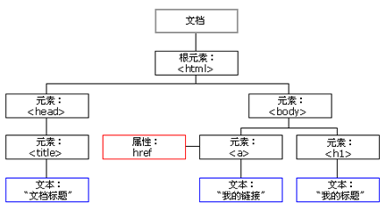

### 3、父级节点

- 我们可以通过`node.parentNode` 获取当前节点的父节点

  - 如果没有父节点,那么返回`null` 

  ```
    <div class="demo">
          <div class="box">
              <span class="erweima">×</span>
          </div>
      </div>
      <script>
          // 1. 父节点 parentNode
          var erweima = document.querySelector('.erweima');
          // var box = document.querySelector('.box');
          // 得到的是离元素最近的父级节点(亲爸爸) 如果找不到父节点就返回为 null
          console.log(erweima.parentNode);
      </script>
  ```

  ​

### 4、 子节点(有坑)


#### １、 所有子节点 `node.childNodes` 


- 通过`node.childNodes`**(标准)** , 我们可以获取所有的子节点, 返回值是一个集合

  > 注意:
  >
  > - 该集合为即时更新的集合
  > - 返回值里面包含了所有的子节点, 包括`元素节点`  `文本节点` 等


####２、所有子元素节点 `node.children` 

- 通过`node.children`**(非标准)** , 可以获取所有的子元素节点, 它只返回子元素节点, 其它节点不返回

  > 注意: 
  >
  > 虽然这个API 是非标准的, 但是得到了各个浏览器的支持, 因此我们可以放心大胆的用 

```js
    <ul>
        <li>我是li</li>
        <li>我是li</li>
        <li>我是li</li>
        <li>我是li</li>
    </ul>
    <script>
        // DOM 提供的方法（API）获取
        var ul = document.querySelector('ul');
        var lis = ul.querySelectorAll('li');
        // 1. 子节点  childNodes 所有的子节点 包含 元素节点 文本节点等等
        console.log(ul.childNodes);
        console.log(ul.childNodes[0].nodeType);
        console.log(ul.childNodes[1].nodeType);
        // 2. children 获取所有的子元素节点 也是我们实际开发常用的
        console.log(ul.children);
    </script>
```


#### ３、第一个子节点`node.firstChild` 

- `node.firstChild` : 获取第一个子节点

  > 注意:
  >
  > 第一个子节点可能是文本节点也可能是元素节点, 不确定
  >
  > 如果没有就返回 null


####４、最后一个子节点`node.lastChild` 

- `node.lastChild` 获取的是最后一个子节点

  > 注意:
  >
  > 最后一个子节点可能是文本节点也可能是元素节点, 不确定
  >
  > 如果没有就返回 null


#### ５、第一个子元素节点 　

- `node.firstElementChild`  获取到的是第一个元素节点


#### ６、最后一个子元素节点 　

- `node.lastElementChild`  获取到的是第一个元素节点


 #### ７、注意点：

实际开发中，`firstChild` 和` lastChild` 包含其他节点，操作不方便，而 `firstElementChild` 和` lastElementChild` 又有兼容性问题，那么我们如何获取第一个子元素节点或最后一个子元素节点呢？

**实际解决方案**

如果想要第一个元素节点, 可以使用`node.chiren[0]`  获取第一个元素节点, 没有兼容问题

如果要最后一个元素节点, 可以使用`node.chiren[node.chrien.length -1]` , 没有兼容性问题

 

```js
    <ol>
        <li>我是li1</li>
        <li>我是li2</li>
        <li>我是li3</li>
        <li>我是li4</li>
        <li>我是li5</li>
    </ol>
    <script>
        var ol = document.querySelector('ol');
        // 1. firstChild 第一个子节点 不管是文本节点还是元素节点
        console.log(ol.firstChild);
        console.log(ol.lastChild);
        // 2. firstElementChild 返回第一个子元素节点 ie9才支持
        console.log(ol.firstElementChild);
        console.log(ol.lastElementChild);
        // 3. 实际开发的写法  既没有兼容性问题又返回第一个子元素
        console.log(ol.children[0]);
        console.log(ol.children[ol.children.length - 1]);
    </script>
```

### 5、案例：新浪下拉菜单


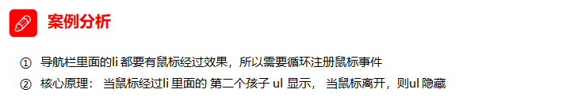

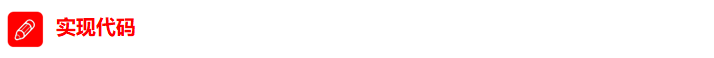

```js
    <script>
        // 1. 获取元素
        var nav = document.querySelector('.nav');
        var lis = nav.children; // 得到4个小li
        // 2.循环注册事件
        for (var i = 0; i < lis.length; i++) {
            lis[i].onmouseover = function() {
                this.children[1].style.display = 'block';
            }
            lis[i].onmouseout = function() {
                this.children[1].style.display = 'none';
            }
        }
    </script>
```

### 6、兄弟节点


#### 1、下一个兄弟节点

- `node.nextSibling` 
  - 返回当前元素的下一个兄弟节点, 找不到返回null


#### 2、上一个兄弟节点

- `node.previousSibling`
  - 返回当前元素的上一个兄弟节点, 找不到返回null


#### 3、下一个兄弟元素节点

- `node.nextElementSibling`
  - 返回下一个兄弟元素节点


#### 4、上一个兄弟元素节点

- `node.previousElementSilbing`

  - 返回上一个兄弟元素节点

  ```
   <div>我是div</div>
      <span>我是span</span>
      <script>
          var div = document.querySelector('div');
          // 1.nextSibling 下一个兄弟节点 包含元素节点或者 文本节点等等
          console.log(div.nextSibling);
          console.log(div.previousSibling);
          // 2. nextElementSibling 得到下一个兄弟元素节点
          console.log(div.nextElementSibling);
          console.log(div.previousElementSibling);
      </script>
  ```

  ​

#### 5、 注意:

`nextElementSibling` 和`previousElementSibling` 有兼容性问题, IE9 以上才支持.

解决兼容性问题的方法是自己封装一个方法   


```js
   function getNextElementSibling(element) {
      var el = element;
      while (el = el.nextSibling) {
        if (el.nodeType === 1) {
            return el;
        }
      }
      return null;
    }  
```


### 7、 创建节点

- `document.createElement('标签名')`

  - 创建指定标签名的html元素

    > 因为这些元素原先不存在,是根据我们的需求动态生成的, 所以我们也称为**动态创建元素节点** 


### 8 、添加节点

####１、追加子元素

- `node.appendChild(newChild)`
  - 将一个节点添加到指定的父节点的子节点的**末尾** , 类似CSS 中的`::after` 伪元素

#### 2、插入子元素

- `node.insertBefore(child, newNode)`
  - 将一个新的子节点插入到指定节点的前面, 类似于CSS中的`::before` 但是又有点不同

```js
    <ul>
        <li>123</li>
    </ul>
    <script>
        // 1. 创建节点元素节点
        var li = document.createElement('li');
        // 2. 添加节点 node.appendChild(child)  node 父级  child 是子级 后面追加元素
        var ul = document.querySelector('ul');
        ul.appendChild(li);
        // 3. 添加节点 node.insertBefore(child, 指定元素);
        var lili = document.createElement('li');
        ul.insertBefore(lili, ul.children[0]);
        // 4. 我们想要页面添加一个新的元素 ： 1. 创建元素 2. 添加元素
    </script>
```


### 9、案例：简单版发布留言


```js
<body>
    <textarea name="" id=""></textarea>
    <button>发布</button>
    <ul>

    </ul>
    <script>
        // 1. 获取元素
        var btn = document.querySelector('button');
        var text = document.querySelector('textarea');
        var ul = document.querySelector('ul');
        // 2. 注册事件
        btn.onclick = function() {
            if (text.value == '') {
                alert('您没有输入内容');
                return false;
            } else {
                // console.log(text.value);
                // (1) 创建元素
                var li = document.createElement('li');
                // 先有li 才能赋值
                li.innerHTML = text.value;
                // (2) 添加元素
                // ul.appendChild(li);
                ul.insertBefore(li, ul.children[0]);
            }
        }
    </script>
</body>
```


## 2、 节点操作(高级)


### 1、 删除节点

- `node.removeChild(child)`  方法从 node节点中删除一个子节点，返回删除的节点。

  ```
      <button>删除</button>
      <ul>
          <li>熊大</li>
          <li>熊二</li>
          <li>光头强</li>
      </ul>
      <script>
          // 1.获取元素
          var ul = document.querySelector('ul');
          var btn = document.querySelector('button');
          // 2. 删除元素  node.removeChild(child)
          // ul.removeChild(ul.children[0]);
          // 3. 点击按钮依次删除里面的孩子
          btn.onclick = function() {
              if (ul.children.length == 0) {
                  this.disabled = true;
              } else {
                  ul.removeChild(ul.children[0]);
              }
          }
      </script>
  ```

  ​


### 2、案例：删除留言

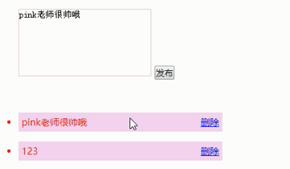


```js
    <textarea name="" id=""></textarea>
    <button>发布</button>
    <ul>

    </ul>
    <script>
        // 1. 获取元素
        var btn = document.querySelector('button');
        var text = document.querySelector('textarea');
        var ul = document.querySelector('ul');
        // 2. 注册事件
        btn.onclick = function() {
            if (text.value == '') {
                alert('您没有输入内容');
                return false;
            } else {
                // console.log(text.value);
                // (1) 创建元素
                var li = document.createElement('li');
                // 先有li 才能赋值
                li.innerHTML = text.value + "<a href='javascript:;'>删除</a>";
                // (2) 添加元素
                // ul.appendChild(li);
                ul.insertBefore(li, ul.children[0]);
                // (3) 删除元素 删除的是当前链接的li  它的父亲
                var as = document.querySelectorAll('a');
                for (var i = 0; i < as.length; i++) {
                    as[i].onclick = function() {
                        // 删除的是 li 当前a所在的li  this.parentNode;
                        ul.removeChild(this.parentNode);
                    }
                }
            }
        }
    </script>
```

### 3、复制（克隆）节点

#### 1、浅拷贝(浅复制)节点

- `node.clone()` : 浅拷贝, 浅复制节点

  > 只复制节点本身, 不克隆里面的子节点
  >
  > 等价于 `node.clone(false)` 


#### ２、深拷贝（深复制）节点

- `node.clone(true)` : 深拷贝（深复制）节点

  > 复制节点本身即内部的所有子节点

   ```
      <ul>
          <li>1111</li>
          <li>2</li>
          <li>3</li>
      </ul>
      <script>
          var ul = document.querySelector('ul');
          // 1. node.cloneNode(); 括号为空或者里面是false 浅拷贝 只复制标签不复制里面的内容
          // 2. node.cloneNode(true); 括号为true 深拷贝 复制标签复制里面的内容
          var lili = ul.children[0].cloneNode(true);
          ul.appendChild(lili);
      </script>
   ```


### 4、案例：动态生成表格


```js
    <script>
        // 1.先去准备好学生的数据
        var datas = [{
            name: '魏璎珞',
            subject: 'JavaScript',
            score: 100
        }, {
            name: '弘历',
            subject: 'JavaScript',
            score: 98
        }, {
            name: '傅恒',
            subject: 'JavaScript',
            score: 99
        }, {
            name: '明玉',
            subject: 'JavaScript',
            score: 88
        }, {
            name: '大猪蹄子',
            subject: 'JavaScript',
            score: 0
        }];
        // 2. 往tbody 里面创建行： 有几个人（通过数组的长度）我们就创建几行
        var tbody = document.querySelector('tbody');
		// 遍历数组
        for (var i = 0; i < datas.length; i++) { 
            // 1. 创建 tr行
            var tr = document.createElement('tr');
            tbody.appendChild(tr);
            // 2. 行里面创建单元格td 单元格的数量取决于每个对象里面的属性个数  
            // 使用for in遍历学生对象
            for (var k in datas[i]) { 
                // 创建单元格 
                var td = document.createElement('td');
                // 把对象里面的属性值 datas[i][k] 给 td  
                td.innerHTML = datas[i][k];
                tr.appendChild(td);
            }
            // 3. 创建有删除2个字的单元格 
            var td = document.createElement('td');
            td.innerHTML = '<a href="javascript:;">删除 </a>';
            tr.appendChild(td);

        }
        // 4. 删除操作 开始 
        var as = document.querySelectorAll('a');
        for (var i = 0; i < as.length; i++) {
            as[i].onclick = function() {
                // 点击a 删除 当前a 所在的行(链接的爸爸的爸爸)  node.removeChild(child)  
                tbody.removeChild(this.parentNode.parentNode)
            }
        }
    </script>
```


### 5、 创建元素的三种方式

- document.write('content')
- element.innerHTML  = 'content'
- document.createElement('标签名')

#### 区别:

- `document.write(content) `: 直接将内容写入页面的内容流, **文档流执行完毕,会导致页面全部重绘**, 原来的页面不复存在
- `element.innerHTML`:是将内容写入某个DOM节点, 不会导致整个页面重绘, 只当指定节点内内容全部重绘
- `document.createElement` 动态创建一个新的节点

> `innerHTML` 和 `createElement` 都可以创建节点, 当创建多个节点时, `innerHTML` 的效率要比`createElement` 效率高一些. 
>
> 注意: `innerHTML` 不要操作用直接字符串拼接创建多个, 而采用数组拼接, 否则效率变低

 

```js
    <script>
        // 三种创建元素方式区别 
        // 1. document.write() 创建元素  如果页面文档流加载完毕，再调用这句话会导致页面重绘
         var btn = document.querySelector('button');
         btn.onclick = function() {
             document.write('<div>123</div>');
         }

        // 2. innerHTML 创建元素
        var inner = document.querySelector('.inner');
         for (var i = 0; i <= 100; i++) {
             inner.innerHTML += '<a href="#">百度</a>'
         }
        var arr = [];
        for (var i = 0; i <= 100; i++) {
            arr.push('<a href="#">百度</a>');
        }
        inner.innerHTML = arr.join('');
        // 3. document.createElement() 创建元素
        var create = document.querySelector('.create');
        for (var i = 0; i <= 100; i++) {
            var a = document.createElement('a');
            create.appendChild(a);
        }
    </script>
```


### 6、 innerTHML和createElement效率对比

####１、innerHTML字符串拼接方式（效率低）

```js
<script>
    function fn() {
        var d1 = +new Date();
        var str = '';
        for (var i = 0; i < 1000; i++) {
            document.body.innerHTML += '<div style="width:100px; height:2px; border:1px solid blue;"></div>';
        }
        var d2 = +new Date();
        console.log(d2 - d1);
    }
    fn();
</script>
```


####２、createElement方式（效率一般）

```js
<script>
    function fn() {
        var d1 = +new Date();

        for (var i = 0; i < 1000; i++) {
            var div = document.createElement('div');
            div.style.width = '100px';
            div.style.height = '2px';
            div.style.border = '1px solid red';
            document.body.appendChild(div);
        }
        var d2 = +new Date();
        console.log(d2 - d1);
    }
    fn();
</script>
```


####３、innerHTML数组方式（效率高）　

**innerHTML数组方式（效率高）**

```js
<script>
    function fn() {
        var d1 = +new Date();
        var array = [];
        for (var i = 0; i < 1000; i++) {
            array.push('<div style="width:100px; height:2px; border:1px solid blue;"></div>');
        }
        document.body.innerHTML = array.join('');
        var d2 = +new Date();
        console.log(d2 - d1);
    }
    fn();
</script>
```


## ３、 DOM的核心总结


关于dom操作，我们主要针对于元素的操作。主要有创建、增、删、改、查、属性操作、事件操作。

### 1、 创建节点


### ２、增加节点


### ３、 删除节点


### ４、改该节点

- 修改元素属性: `src` `href` `title` 等
- 修改普通元素内容`innerHTML` `innerText`
- 修改表单元素: `value` `type` `disable` `checked` `selected`等
- 修改元素样式: `style` `className` 


### 5、查寻节点

- DOM提供的API: `getElementById` `getElementsByTagName`  , 古老用法不太推荐
- H5提供新方法: `querySelector()` `querySelectoreAll`  推荐使用
- 利用节点操作获取元素: `.parentNode`  `.chilren`  `.previousElementSibling` `.nextElementSibling`  都是获取元素节点


### 6、属性操作

- `ele.dataset.驼峰属性名`
- `setAttribute('属性名', '属性值')`
- `getAttribute('属性名')` 
- `removeAttribute('属性名')` 


# 四、事件操作 


## 1、事件详解 


### 1、 注册事件（2种方式）

给元素添加事件, 称为`注册事件` 或者`绑定事件`

注册事件主要有两种方式: **传统方式**  和 **监听注册方式** 

#### 1、方式1 : 传统方式 (事件唯一性)

- 利用`on` 开头的事件,eg: `onclick`

  ```
  <button> 点我试试</button>
  <script>
  	var btn = document.querySelector('button');
  	btn.onclick = function(){
        console.log('你点我了')
  	}
  	btn.onclick = function(){
        console.log('只有我有效, 前面的onclick 事件被覆盖了')
  	}
  </script>
  ```

  > 特点:
  >
  > - 注册事件的唯一性
  >
  >   同一个元素同一个类型的事件只能设置一个处理函数, 最后注册的处理函数会覆盖前面注册的处理函数, 换句话说, 只有最后一个处理函数生效


#### 2、方式2: 监听注册方式 

- `addEventListener(type, callback,userCapture)` 


- W3C标准, 推荐使用

- `IE9` 之前的不支持此方法, `IE9` 前使用`attachEvent()` 方法

  > 特点: 
  >
  > - 同一个元素,同一类型的事件, 可以注册多个监听器
  > - 多个监听器之间按注册的先后顺序执行


### 2、 事件监听

#### 1、addEventListener()事件监听（IE9以后支持）

- `ele.addEventListener(type, callback, useCapture)`
  - `type`: 是事件的类型,eg: `click` `mouseover` 等,该参数前面不带`on` 
  - `callback`: 事件回调函数
  - `useCapture` : boolean 类型的, `true` 表示的是捕获事件, 默认就是`false` 表示的是冒泡. `useCapture` 这个参数可以省略, 省略就是相当于`false` 

> eventTarget.addEventListener()方法将指定的监听器注册到 ele（目标对象）上，当该对象触发指定的事件时，就会执行事件处理函数。


 

#### 2、 attacheEvent()事件监听（IE678支持）

- `ele.attachEvent(type, callback)`

  - `type` : 事件类型,eg: `onclick` `onmouseover` , 注意这里要加`on` 

  - `callback` : 回调函数

    > IE8及更早IE支持, 后面的不支持


​	eventTarget.attachEvent()方法将指定的监听器注册到 eventTarget（目标对象） 上，当该对象触发指定的事件时，指定的回调函数就会被执行。

```js
<button>传统注册事件</button>
<button>方法监听注册事件</button>
<button>ie9 attachEvent</button>
<script>
    var btns = document.querySelectorAll('button');
    // 1. 传统方式注册事件
    btns[0].onclick = function() {
        alert('hi');
    }
    btns[0].onclick = function() {
            alert('hao a u');
        }
   // 2. 事件侦听注册事件 addEventListener 
   // (1) 里面的事件类型是字符串 必定加引号 而且不带on
   // (2) 同一个元素 同一个事件可以添加多个侦听器（事件处理程序）
    btns[1].addEventListener('click', function() {
        alert(22);
    })
    btns[1].addEventListener('click', function() {
            alert(33);
    })
    // 3. attachEvent ie9以前的版本支持
    btns[2].attachEvent('onclick', function() {
        alert(11);
    })
</script>
```


#### 3、事件监听兼容性解决方案

封装一个函数，函数中判断浏览器的类型：

```
function addEventListener(ele, eventName,callback){
  // 判断当前浏览器是否支持 addEventListener
  if(ele.addEventListener){
  	// 第三个参数默认是false
    ele.addEventListener(eventName, callback)
  }
  else if(ele.attachEvent){
    ele.attachEvent('on'+eventName, callback)
  }
  else{
    // 相当于 ele.onclick = callback
    ele['on'+eventName] = callback
  }
}
```


 

### 3、  删除事件（解绑事件）

#### 1、传统注册方式(删除事件)

```
ele.onclick = null
```


#### 2、方法监听方式(删除事件)

```
ele.removeEventListener(type, fn)
或者
ele.removeEvetnListener(type, fn, useCapture)

如果是IE678
ele.detachEvent('on'+type, fn)
```


```js
    <div>1</div>
    <div>2</div>
    <div>3</div>
    <script>
        var divs = document.querySelectorAll('div');
        divs[0].onclick = function() {
            alert(11);
            // 1. 传统方式删除事件
            divs[0].onclick = null;
        }
        // 2. removeEventListener 删除事件
        divs[1].addEventListener('click', fn) // 里面的fn 不需要调用加小括号
        function fn() {
            alert(22);
            divs[1].removeEventListener('click', fn);
        }
        // 3. detachEvent
        divs[2].attachEvent('onclick', fn1);

        function fn1() {
            alert(33);
            divs[2].detachEvent('onclick', fn1);
        }
    </script>
```


#### 3、删除事件兼容性解决方案  

```
function removeEventListener(ele,eventName, fn){
  // 判断当前浏览器是否支持 removeEventListener
  if(ele.removeEventListener){
  	// 第三参数省略默认为false 
    ele.removeEvetnListener(eventName, fn)
  }
  else if(ele.detachEvent){
    ele.detachEvent('on' + eventName, fn)
  }
  else{
    ele['on'+eventName] = null
  }
}
```


### 4、  DOM事件流(捕获、冒泡)

> ```
> html中的标签都是相互嵌套的，我们可以将元素想象成一个盒子装一个盒子，document是最外面的大盒子。
> 当你单击一个div时，同时你也单击了div的父元素，甚至整个页面。
>
> 那么是先执行父元素的单击事件，还是先执行div的单击事件 ？？？
> ```


####１、事件流　

- **事件流**: 

  - 描述的是从页面中接收事件的顺序

- **DOM事件**: 
  - 事件发生时会在元素节点之间按照特定的顺序传播, 这个**传播过程** 即 **DOM** 事件流


  > 比如：我们给页面中的一个div注册了单击事件，当你单击了div时，也就单击了body，单击了html，单击了document。

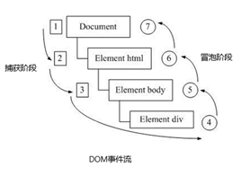 


#### 2、冒泡 & 捕获

- **事件冒泡**:
  -  IE最早提出, **事件开始时由具体的元素接收, 然后逐级向上传播到DOM最顶层节点的过程** 
- **事件捕获:** 
  - 网景最早提出, **由DOM最顶层节点开始, 然后逐级向下传播到具体的元素接收的过程** 


  > 当时的2大浏览器霸主谁也不服谁！
  > IE 提出从目标元素开始，然后一层一层向外接收事件并响应，也就是冒泡型事件流。
  > Netscape（网景公司）提出从最外层开始，然后一层一层向内接收事件并响应，也就是捕获型事件流。
  >
  > 江湖纷争，武林盟主也脑壳疼！！！
  >
  > 最终，w3c 采用折中的方式，平息了战火，制定了统一的标准 —--— 先捕获再冒泡。
  > 现代浏览器都遵循了此标准，所以当事件发生时，会经历3个阶段。


#### ３、事件流３阶段

DOM 事件流会经历3个阶段： 

1. 捕获阶段

2. 当前目标阶段

3. 冒泡阶段 


​	我们向水里面扔一块石头，首先它会有一个下降的过程，这个过程就可以理解为从最顶层向事件发生的最具体元素（目标点）的捕获过程；之后会产生泡泡，会在最低点（ 最具体元素）之后漂浮到水面上，这个过程相当于事件冒泡。 

  


**事件** 发生时会在元素节点之间按照特定的顺序传播, 这个传播过程称为 **DOM事件流** 

> **注意:**
>
> - JS代码中只能执行捕获或者冒泡其中一种
> - **onclick 和 attachEvent 只能得到冒泡阶段** 
> - addEventListener(type, callback,useCapture) 第三个参数是true, 表示在事件捕获阶段调用事件处理程序; 如果是false或者省略, 表示在事件冒泡阶段处理程序


> - 在实际开发中, 我们很少使用事件捕获
> - **有些事件是没有冒泡的** , 比如: `onblur` `onfocus` `onmouseenter` `onmouseleave` 
> - 事件冒泡有时候会带来麻烦, 有时又会帮助我们很巧妙的做某些事件


**事件冒泡**

```js
    <div class="father">
        <div class="son">son盒子</div>
    </div>
    <script>
        // onclick 和 attachEvent（ie） 在冒泡阶段触发
        // 冒泡阶段 如果addEventListener 第三个参数是 false 或者 省略 
        // son -> father ->body -> html -> document
        var son = document.querySelector('.son');
		// 给son注册单击事件
        son.addEventListener('click', function() {
            alert('son');
        }, false);
		// 给father注册单击事件
        var father = document.querySelector('.father');
        father.addEventListener('click', function() {
            alert('father');
        }, false);
		// 给document注册单击事件，省略第3个参数
        document.addEventListener('click', function() {
            alert('document');
        })
    </script>
```

**事件捕获**

```js
    <div class="father">
        <div class="son">son盒子</div>
    </div>
    <script>
        // 如果addEventListener() 第三个参数是 true 那么在捕获阶段触发
        // document -> html -> body -> father -> son
         var son = document.querySelector('.son');
		// 给son注册单击事件，第3个参数为true
         son.addEventListener('click', function() {
             alert('son');
         }, true);
         var father = document.querySelector('.father');
		// 给father注册单击事件，第3个参数为true
         father.addEventListener('click', function() {
             alert('father');
         }, true);
		// 给document注册单击事件，第3个参数为true
        document.addEventListener('click', function() {
            alert('document');
        }, true)
    </script>
```


### 5、  事件对象(* 重点)


#### 1、什么是事件对象

事件发生后，跟事件相关的一系列信息数据的集合都放到这个对象里面，这个对象就是事件对象。

比如：  

1. 谁绑定了这个事件。
2. 鼠标触发事件的话，会得到鼠标的相关信息，如鼠标位置。
3. 键盘触发事件的话，会得到键盘的相关信息，如按了哪个键。


#### 2、 事件对象的使用

事件触发发生时就会产生事件对象，并且系统会以实参的形式传给事件处理函数。

所以，在事件处理函数中声明1个形参用来接收事件对象。

```
ele.onclick = function(event){
  // 这个 event 就是事件对象, 这个变量名可以随便写
}
ele.addEventListener('click', function(event){
  // 这个event就是事件对象, 这个变量随便写
})
ele.addEventListener('click',fn)
function fn(event){
  // 这个event就是事件对象, 这个变量随便写
}
```


 

#### 3、事件对象的兼容性处理

事件对象本身的获取存在兼容问题：

1. 标准浏览器中是浏览器给方法传递的参数，只需要定义形参 e 就可以获取到。

2. 在 IE6~8 中，浏览器不会给方法传递参数，如果需要的话，需要到 window.event 中获取查找。


```
只要“||”前面为false, 不管“||”后面是true 还是 false，都返回 “||” 后面的值。
只要“||”前面为true, 不管“||”后面是true 还是 false，都返回 “||” 前面的值。

```

> `||`  辑或,  `表达式1` || `表达式2` 
>
> - 当表达式1为真, 返回表达式1
> - 当表达式1为假, 返回表达式2


```
<div>123</div>
<script>
  var div = document.querySelector('div');
  div.onclick = function(e) {
    // 事件对象兼容性写法 
    e = e || window.event;
    console.log(e);
  }
</script>
```


#### 4、 事件对象的属性和方法

| 事件对象属性方法            | 说明                                 | 是否是标准       |
| ------------------- | ---------------------------------- | ----------- |
| e.target            | 返回触发事件的对象                          | 标准          |
| e.srcElement        | 返回触发事件的对象                          | 非标准 IE6~8使用 |
| e.type              | 返回事件的类型,比如: click、mouseover `不带on` |             |
| e.cancelBubble      | 该属性阻止冒泡, IE6~8使用                   | 非标准         |
| e.stopPropagation() | 阻止冒泡                               | 标准          |
| e.returnValue       | 该属性阻止默认事件(默认行为), 比如不让链接跳转, IE6~8使用 | 非标准         |
| e.preventDefault()  | 该方法阻止默认事件(默认行为),比如: 不让链接跳转         | 标准          |


#### 5、 e.target 和 this 的区别

-  this 是事件绑定的元素（绑定这个事件处理函数的元素） 。

-  e.target 是事件触发的元素。

   > 通常情况下terget 和 this是一致的，但有一种情况不同，
   >
   > - 那就是在事件冒泡时**（父子元素有相同事件，单击子元素，父元素的事件处理函数也会被触发执行）**
   >   - 这时候**this指向的是父元素，因为它是绑定事件的元素对象** 
   >   - 而**target指向的是子元素，因为他是触发事件的那个具体元素对象。** 

```js
<div>123</div>
<script>
    var div = document.querySelector('div');
 	div.addEventListener('click', function(e) {
    // e.target 和 this指向的都是div
    console.log(e.target);
    console.log(this);

  });
</script>
```


- 事件冒泡下的e.target和this

```js
    <ul>
        <li>abc</li>
        <li>abc</li>
        <li>abc</li>
    </ul>
    <script>
        var ul = document.querySelector('ul');
        ul.addEventListener('click', function(e) {
              // 我们给ul 绑定了事件  那么this 就指向ul  
              console.log(this); // ul

              // e.target 触发了事件的对象 我们点击的是li e.target 指向的就是li
              console.log(e.target); // li
        });
    </script>
```


### 6、 阻止默认行为

> html中一些标签有默认行为，例如: a标签被单击后，默认会进行页面跳转。

```js
<a href="http://www.baidu.com">百度</a>
<script>
    // 2. 阻止默认行为 让链接不跳转 
    var a = document.querySelector('a');
 	 a.addEventListener('click', function(e) {
    	e.preventDefault(); //  dom 标准写法
  	});

 	 // 3. 传统的注册方式
 	 a.onclick = function(e) {
    	// 普通浏览器 e.preventDefault();  方法
   		 e.preventDefault();
    	// 低版本浏览器 ie678  returnValue  属性
    	e.returnValue = false;
    	// 我们可以利用return false 也能阻止默认行为 没有兼容性问题
   		 return false;
  }
</script>
```

> 注意:
>
> 事件注册`onclick`  和 事件监听`addEventListener`  在阻止默认行为时使用的方式是由差异的.
>
> - 事件注册方式`onclick` 可以使用 `return false`  阻止默认行为
> - 而事件监听`addEventListener` 不能使用`return false`  阻止默认行为


### 7、 阻止事件冒泡

事件冒泡本身的特性，会带来的坏处，也会带来的好处。

- 标准写法: 利用事件对象里面的`.stopPropagation()` 方法, 阻止冒泡

  ```
  btn.addEventListener('click', function(e){
    // 点击逻辑代码 ...
    e.stopProgation();  // 阻止冒泡
  })
  ```

- 非标准写法: IE6~8 才支持 , 事件对象的`cancelBubble` 属性, 阻止冒泡

  ```
  btn.onclick = function(){
    // 点击逻辑代码 ...
    window.e.cancleBubble = true; // 阻止冒泡
  }
  ```

- 阻止冒泡兼容性处理

  ```
  if(e || e.stopPropagation){
    e.stopPropagation()
  }
  else {
    window.e.cancelBubble = true
  }
  ```

  ​


### 8、事件委托

事件冒泡本身的特性，会带来的坏处，也会带来的好处。

#### 1、什么是事件委托

- 把事情委托给别人，代为处理。

  事件委托也称为事件代理，在 jQuery 里面称为事件委派。

  > 说白了就是，不给子元素注册事件，给父元素注册事件，把处理代码在父元素的事件中执行。

- javaScript 中的事件委托

  ```
  <ul>
    <li>我 是 li 1</li>
    <li>我 是 li 2</li>
    <li>我 是 li 3</li>
    <li>我 是 li 4</li>
    <li>我 是 li 5</li>
  </ul>
  ```

  > - 点击每个`li` 都会执行对应的事件方法法, 以前需要给每个`li` 单独添加/注册事件,非常繁琐, 而且访问DOM的次数越多, 就会延长整个页面的页面交互时间, 而且如果后面又新增了新的`li` 又要需要单独的为新增的`li` 添加事件, 这就不是很方便了
  >
  >
  > -  如果我们通过事件委托(代理)的方式只需要给 父元素`ul` 添加点击事件, 当我们点击子元素`li` 时, 事件传递到父元素`ul` 上同一处理, 这样访问DOM的时长缩短增加用户体验, 如果后面有新的`li` 元素增加也不用在单独为其添加点击事件, 这样做既方便由高效灵活


#### 2、 事件委托的原理

​	给父元素注册事件，利用事件冒泡，当子元素的事件触发，会冒泡到父元素, 在父元素的事件方法中统一处理子元素的事件.


#### 3、事件委托的作用,特点

- 我们只操作了一次 DOM ，提高了程序的性能。

- 动态新创建的子元素，也拥有事件。

  ```
  <ul>
    <li>我 是 li 1</li>
    <li>我 是 li 2</li>
    <li>我 是 li 3</li>
    <li>我 是 li 4</li>
    <li>我 是 li 5</li>
  </ul>
  <script>
    // 事件委托的核心原理：给父节点添加侦听器， 利用事件冒泡影响每一个子节点
    var ul = document.querySelector('ul');
    ul.addEventListener('click', function(e) {
      // e.target 这个可以得到我们点击的对象
      // 直接点的是哪个, e.target 就是哪一个元素
      e.target.style.backgroundColor = 'pink';
    })
  </script>
  ```

  ​

#### 4、事件委托的注意点(坑)

- 虽然我们可以通过事件委托. 给父元素添加事件监听, 当鼠标点击在子元素上时, 我们可以在父元素上统一处理, 但是, 当父元素的子元素层次比较多是, 这时, `e.target` 可能就不是我们所希望获取到的点击元素, 这时我们需要一一的排解

  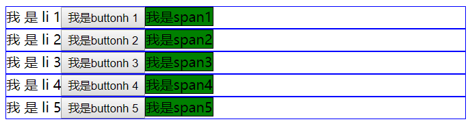   

  ```
  <body> 
  <ul>
    <li>我 是 li 1<button>我是buttonh 1</button><span>我是span1</span></li>
    <li>我 是 li 2<button>我是buttonh 2</button><span>我是span2</span></li>
    <li>我 是 li 3<button>我是buttonh 3</button><span>我是span3</span></li>
    <li>我 是 li 4<button>我是buttonh 4</button><span>我是span4</span></li>
    <li>我 是 li 5<button>我是buttonh 5</button><span>我是span5</span></li>
  </ul>

  <script> 
    var ul = document.querySelector('ul') 
    ul.addEventListener('click', function (e) {
      // 此处的 e.target 可能是 li 或 button 或 span
      console.log(e.target);
      // this 始终是监听事件的 ul
      console.log(this);
      // 事件对象
      console.log(e);
    })

  </script>

  </body>
  ```

  ​


## 2、常用鼠标事件


### 1、常用鼠标事件类型介绍

| 鼠标事件        | 触发条件     | 是否冒泡 |
| ----------- | -------- | ---- |
| onclick     | 鼠标左键点击触发 | 不冒泡  |
| onmouseover | 鼠标经过触发   |      |
| onmouseout  | 鼠标离开触发   |      |
| onfocus     | 获得鼠标焦点触发 | 不冒泡  |
| onblur      | 失去鼠标焦点触发 | 不冒泡  |
| onmousemove | 移动鼠标触发   |      |
| onmouseup   | 鼠标弹起触发   |      |
| onmousedown | 鼠标按下触发   |      |
| mouseenter  | 鼠标进入时触发  | 不冒泡  |
| mouseleave  | 鼠标离开时触发  | 不冒泡  |


### 2、 案例：禁止选中文字和禁止右键菜单


#### 1、 禁止鼠标右键菜单 (contextmenu)

```
<script>
  document.addEventListener('contextmenu',function (e) {
    console.log(e);
    e.preventDefault()
  })
<script>
```

>  就是不让鼠标右键时弹出菜单列表
>
>  

####2、禁止鼠标选中 (selectstart 开始选中)

```
<script>
  document.addEventListener('selectstart',function (e) {
    console.log(e);
    e.preventDefault()
  })
</script>
```

>  鼠标根本无法选中文字


#### 3、  鼠标事件对象 `clientX` `clientY` `pageX` `pageY` `screenX` `screenY` 

**event** 事件对象是事件相关的一系列信息的集合

现阶段我们主要是用鼠标事件对象**mouseEvent**  和 键盘事件对象 **keyboardEvent** 

| 鼠标事件对象    | 说明                           |
| --------- | ---------------------------- |
| e.clientX | 返回鼠标**相对于浏览器窗口可视区** 的 X 坐标   |
| e.clientY | 返回鼠标**相对于浏览器窗口可视区** 的Y坐标     |
| e.pageX   | 返回鼠标**相对于文档页面** 的X坐标, IE9+支持 |
| e.apgeY   | 返回鼠标**相对于文档页面** 的Ｙ坐标,IE9+ 支持 |
| e.screenX | 返回鼠标**相对于电脑屏幕** 的X坐标         |
| e.screenY | 返回鼠标**相对于电脑屏幕** 的Y坐标         |


 

### 3、 获取鼠标在页面的坐标

```js
    <script>
        // 鼠标事件对象 MouseEvent
        document.addEventListener('click', function(e) {
            // 1. client 鼠标在可视区的x和y坐标, 浏览器窗口坐标
            console.log(e.clientX);
            console.log(e.clientY);
            console.log('---------------------');

            // 2. page 鼠标在页面文档的x和y坐标, 文档坐标
            console.log(e.pageX);
            console.log(e.pageY);
            console.log('---------------------');

            // 3. screen 鼠标在电脑屏幕的x和y坐标, 屏幕坐标
            console.log(e.screenX);
            console.log(e.screenY);

        })
    </script>
```

### 4、 案例：跟随鼠标的天使

 


```js
    
    <script>
        var pic = document.querySelector('img');
        document.addEventListener('mousemove', function(e) {
        	// 1. mousemove只要我们鼠标移动1px 就会触发这个事件
        	// 2.核心原理： 每次鼠标移动，我们都会获得最新的鼠标坐标， 
            // 把这个x和y坐标做为图片的top和left 值就可以移动图片
        	var x = e.pageX;
        	var y = e.pageY;
        	console.log('x坐标是' + x, 'y坐标是' + y);
        	//3 . 千万不要忘记给left 和top 添加px 单位
        	pic.style.left = x - 50 + 'px';
        	pic.style.top = y - 40 + 'px';
    	});
    </script>
```


### 5、 mouseenter 和mouseover的区别

- 当鼠标移动到元素上时就会触发mouseenter 事件
- 类似 mouseover，它们两者之间的差别是
- mouseover 鼠标经过自身盒子会触发，经过子盒子还会触发。mouseenter  只会经过自身盒子触发
- 之所以这样，就是因为mouseenter不会冒泡
- 跟mouseenter搭配鼠标离开 mouseleave  同样不会冒泡


## 3、常用的键盘事件

### 1、 键盘事件`keydown` `keypress` `keyup` 

| 键盘参数       | 触发条件                                     |
| ---------- | ---------------------------------------- |
| onkeyup    | 某个键盘按键被松开是触发                             |
| onkeydown  | 某个键盘按键被按下时触发                             |
| onkeypress | 某个键盘按键被按下时触发, **但是它不识别功能件, 比如`Ctrl` `shift`  `箭头` 等等 |

> 注意: 
>
> - 如果使用`addEventlistener` 前面不需要添加`on` 
> - `onkeypress` 和前面2个的的区别是, 它不识别功能键, 比如: 左右箭头和 shift 等
> - 三个键盘事件的执行顺序是`keydown` `keypress` `keyup`


```js
<script>
    // 常用的键盘事件
    //1. keyup 按键弹起的时候触发 
    document.addEventListener('keyup', function() {
    console.log('我弹起了');
  })

  //3. keypress 按键按下的时候触发  不能识别功能键 比如 ctrl shift 左右箭头啊
  document.addEventListener('keypress', function() {
    console.log('我按下了press');
  })
  //2. keydown 按键按下的时候触发  能识别功能键 比如 ctrl shift 左右箭头啊
  document.addEventListener('keydown', function() {
    console.log('我按下了down');
  })
  // 4. 三个事件的执行顺序  keydown -- keypress -- keyup
</script>
```

### 2、 键盘事件对象属性 `keyCode` 

| 键盘事件对象 **属性** | 说明          |
| ------------- | ----------- |
| keyCode       | 返回该键的ASCII值 |

> 注意: 
>
> - `onkeydown` 和`onkeyup`  不区分字母的大小写, `onkeypress` 区分字母的大小写 
> - 在我们的实际开发中, 我们更多的使用`keydown` 和`keyup`  他能识别所有的键, 包括功能键
> - `keypress` 不识别功能键, 但是`keyCode` 属性能区分大小写, 返回不同的`ASCII` 值


**使用keyCode属性判断用户按下哪个键**

```js
<script>
  // 键盘事件对象中的keyCode属性可以得到相应键的ASCII码值
  document.addEventListener('keyup', function(e) {
  console.log('up:' + e.keyCode);
  // 我们可以利用keycode返回的ASCII码值来判断用户按下了那个键
  if (e.keyCode === 65) {
    alert('您按下的a键');
  } else {
    alert('您没有按下a键')
  }
})

document.addEventListener('keypress', function(e) {
  // console.log(e);
  console.log('press:' + e.keyCode);
})
</script>
```


### 3、 案例：模拟京东按键输入内容

当我们按下 s 键， 光标就定位到搜索框（文本框获得焦点）。

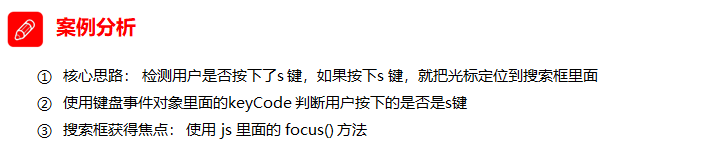

> 注意：触发获得焦点事件，可以使用 元素对象.focus()

```js
    <input type="text">
    <script>
        // 获取输入框
        var search = document.querySelector('input');
		// 给document注册keyup事件
        document.addEventListener('keyup', function(e) {
            // 判断keyCode的值
            if (e.keyCode === 83) {
                // 触发输入框的获得焦点事件
                search.focus();
            }
        })
    </script>
```

### 4、 案例：模拟京东快递单号查询

要求：当我们在文本框中输入内容时，文本框上面自动显示大字号的内容。


```js
    <div class="search">
        <div class="con">123</div>
        <input type="text" placeholder="请输入您的快递单号" class="jd">
    </div>
    <script>
        // 获取要操作的元素
        var con = document.querySelector('.con');
        var jd_input = document.querySelector('.jd');
		// 给输入框注册keyup事件
        jd_input.addEventListener('keyup', function() {
				// 判断输入框内容是否为空
                if (this.value == '') {
                    // 为空，隐藏放大提示盒子
                    con.style.display = 'none';
                } else {
                    // 不为空，显示放大提示盒子，设置盒子的内容
                    con.style.display = 'block';
                    con.innerText = this.value;
                }
            })
        // 给输入框注册失去焦点事件，隐藏放大提示盒子
        jd_input.addEventListener('blur', function() {
                con.style.display = 'none';
            })
        // 给输入框注册获得焦点事件
        jd_input.addEventListener('focus', function() {
            // 判断输入框内容是否为空
            if (this.value !== '') {
                // 不为空则显示提示盒子
                con.style.display = 'block';
            }
        })
    </script>
```


# 五.  BOM操作


> 学习目标：
>
> 能够知道浏览器的顶级对象window
>
> 能够使用window.onload事件
>
> 能够使用window.onresize事件
>
> 能够说出两种定时器的区别
>
> 能够使用location对象的href属性完成页面之间的跳转
>
> 能够使用location对象获取url中的参数部分
>
> 能够使用history提供的方法实现页面刷新


## 1、 BOM 详解 

- **BOM**（Browser Object Model）即浏览器对象模型，它提供了独立于内容而与浏览器窗口进行交互的对象，**其核心对象是 window。** 


- BOM 由一系列相关的对象构成，并且每个对象都提供了很多方法与属性。
- **BOM 缺乏标准**
  -  JavaScript 语法的标准化组织是 ECMA
  -  DOM 的标准化组织是 W3C
  -  BOM 最初是Netscape 浏览器标准的一部分。

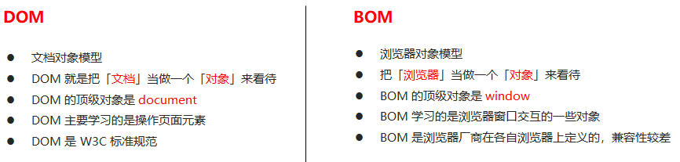


## 2、 BOM的构成


BOM 比 DOM 更大，它包含 DOM。


## 3、 顶级对象window


**window** 对象是浏览器的顶级对象, **它具有双重角色** 

- 它是javaScript 访问浏览器的一个接口

- 它是一个全局对象. 

  - 定义在全局作用域内的`变量`、`函数`  都会变成window对象的属性和 方法

  - 在调用的时候可以省略`window` , 前面学习的对话框都属于`window` 对象的方法, 如: alert()、 prompt() 等

    > 注意:
    >
    > window 下的一个特殊属性`window.name` 


## 4、 window对象的常见事件


### 1、页面(窗口)加载事件`load` `DOMContentLoaded` （2种方式）

####方式１：`load` 　

```
　
window.onload = function (){
  // 执行window 加载后的代码
}

// 或者
window.addEventListener('load', function(){
  // 执行window 加载后的代码
})
```


`window.onload`  是窗口 (页面）加载事件，**当文档内容完全加载完成**会触发该事件**(包括图像、脚本文件、CSS 文件等)** , 就调用的处理函数。


> 注意:
>
> - 有了`window.onload` 就可以把`javaScript` 代码写到页面元素的上方, 因为`onload` 是等页面内容全部加载完毕, 采取执行处理函数
> - `window.onload` 传统的注册事件方式只能写一次, 如果写多次, 最后一个会覆盖前面的所有, 只有最后一个有效
> - 如果使用`window.addEventListener('load',function() {})`  添加窗口加载事件, 则没有限制, 可以写过个

> 注意: 
>
> 不能直接将以前写在window.onload之外的代码直接剪切到这个事件方法中不做任何修改, 因为在javaScript 中只有函数内是有作用域概念的

 

#### 方式2:`DOMContentLoaded`  

```
document.addEventListener('DOMContentLoaded', function(){

})
```

**DOMContentLoade** d 事件触发时，仅当DOM加载完成，**不包括样式表，图片，flash等等。**  IE9以上才支持！！！


>  如果页面的图片很多的话, 从用户访问到onload触发可能需要较长的时间, 交互效果就不能实现，必然影响用户的体验，此时用 DOMContentLoaded 事件比较合适。
>
>  这是页面加载的一种优化策略

```js
<script>
  window.addEventListener('load', function() {
    var btn = document.querySelector('button');
    btn.addEventListener('click', function() {
      alert('点击我');
    })
  })
  window.addEventListener('load', function() {
    alert(22);
  })
  document.addEventListener('DOMContentLoaded', function() {
    alert(33);
  })
</script>
```


### 2、调整窗口大小事件`resize`  

```
window.onresize = function(){
  
}

// 或者
window.addEventListener('resize`, function(){
  
})
```

`window.onresize`  是调整窗口大小加载事件,  当触发时就调用的处理函数。

> 注意：
>
> - 只要窗口大小发生像素变化，就会触发这个事件。
> - 我们经常利用这个事件完成响应式布局。` window.innerWidth`  当前屏幕的宽度

```
 window.addEventListener('resize',function () {
   console.log('宽:',  window.innerWidth);
   console.log('高:',  window.innerHeight);
 })
```

```js
<script>
  // 注册页面加载事件
  window.addEventListener('load', function() {
  var div = document.querySelector('div');
  // 注册调整窗口大小事件
  window.addEventListener('resize', function() {
    // window.innerWidth 获取窗口大小
    console.log('变化了');
    if (window.innerWidth <= 800) {
      div.style.display = 'none';
    } else {
      div.style.display = 'block';
    }
  })
})
</script>
<div></div>
```

## 5、  定时器（两种）


window 对象给我们提供了 2 个非常好用的方法-定时器。

- setTimeout() 

- setInterval()  

### 1、 setTimeout() 炸弹定时器


####1、 开启定时器　

```
window.setTimeOut(callback, 延迟毫秒数)
window.setTimeOut(function(){
  console.log('1秒钟的时间到了)
}, 1000)

// 在使用的时候, 也可以省略window
setTimeOut(function(){
  
}, 1000)
```

> 注意: 
>
> - `window` 可以省略
> - 第一个参数 callback 是必须要的, 有三种书写方式:  `直接写匿名函数` `写函数名`  `'函数名()'`  三种形式,  第三种不推荐使用
> - 延迟的单位是毫秒, 1000毫秒 = 1秒
> - 因为定时器可能有很多, 所以我们经常给定时器赋值一个标识符
> - `setTimeOut` 只执行一次, 因此又称为`炸弹定时器` 


> ```
> 普通函数是按照代码顺序直接调用。
>
> 简单理解： 回调，就是回头调用的意思。上一件事干完，再回头再调用这个函数。
> 例如：定时器中的调用函数，事件处理函数，也是回调函数。
>
> 以前我们讲的   element.onclick = function(){}   或者  element.addEventListener(“click”, fn);   里面的 函数也是回调函数。
>
> ```


```js
<script>
  // 回调函数是一个匿名函数
  setTimeout(function() {
  console.log('时间到了');

  }, 2000);
  function callback() {
    console.log('爆炸了');
  }
  // 回调函数是一个有名函数
  var timer1 = setTimeout(callback, 3000);
  var timer2 = setTimeout(callback, 5000);
</script>
```


#### 2、 案例：5秒后关闭广告


```js
<body>
    
    <script>
        // 获取要操作的元素
        var ad = document.querySelector('.ad');
		// 开启定时器
        setTimeout(function() {
            ad.style.display = 'none';
        }, 5000);
    </script>
</body>
```


#### 3、 停止定时器


```
// 停止定时器
window.clearTimeOut(timerID)
```

> `clearTimeOut(timerID)`  方法取消了先前通过`setTimeOut()` 创建的定时器
>
> 里面的参数是定时器标识, 创建定时器会返回一个标识

```js
<button>点击停止定时器</button>
  <script>
    var btn = document.querySelector('button');
  // 开启定时器
  var timer = setTimeout(function() {
    console.log('爆炸了');
  }, 5000);
  // 给按钮注册单击事件
  btn.addEventListener('click', function() {
    // 停止定时器
    clearTimeout(timer);
  })
</script>
```


### 2、setInterval() 闹钟定时器


#### 1、开启定时器 

```
window.setInterval(function(){}, 1000)

// 或者
window.setInterval(callback, 1000)
```

> 注意: 
>
> - `window` 可以省略
> - `setInterval()` 方法会重复调用回调函数, 每隔间隔时间就去调用一次回调函数
> - 第一个参数 callback 是必须要的, 有三种书写方式:  `直接写匿名函数` `写函数名`  `'函数名()'`  三种形式,  第三种不推荐使用
> - 延迟的单位是毫秒, 1000毫秒 = 1秒
> - 第一次执行, 也是间隔时间之后执行 

 

```js
    <script>
        // 1. setInterval 
        setInterval(function() {
            console.log('继续输出');
        }, 1000);
    </script>
```


#### 2、 案例：倒计时 


```js
    <div>
        <span class="hour">1</span>
        <span class="minute">2</span>
        <span class="second">3</span>
    </div>
    <script>
        // 1. 获取元素（时分秒盒子） 
        var hour = document.querySelector('.hour'); // 小时的黑色盒子
        var minute = document.querySelector('.minute'); // 分钟的黑色盒子
        var second = document.querySelector('.second'); // 秒数的黑色盒子
        var inputTime = +new Date('2019-5-1 18:00:00'); // 返回的是用户输入时间总的毫秒数

        countDown(); // 我们先调用一次这个函数，防止第一次刷新页面有空白 

        // 2. 开启定时器
        setInterval(countDown, 1000);
		
        function countDown() {
            var nowTime = +new Date(); // 返回的是当前时间总的毫秒数
            var times = (inputTime - nowTime) / 1000; // times是剩余时间总的秒数 
            var h = parseInt(times / 60 / 60 % 24); //时
            h = h < 10 ? '0' + h : h;
            hour.innerHTML = h; // 把剩余的小时给 小时黑色盒子
            var m = parseInt(times / 60 % 60); // 分
            m = m < 10 ? '0' + m : m;
            minute.innerHTML = m;
            var s = parseInt(times % 60); // 当前的秒
            s = s < 10 ? '0' + s : s;
            second.innerHTML = s;
        }
    </script>
```


#### 3、停止定时器 

```
window.clearInterval(intervalID)
```


 

#### 3、案例：发送短信倒计时

​	点击按钮后，该按钮60秒之内不能再次点击，防止重复发送短信。


```js
    手机号码： <input type="number"> <button>发送</button>
    <script>
        var btn = document.querySelector('button');
		// 全局变量，定义剩下的秒数
        var time = 3; 
		// 注册单击事件
        btn.addEventListener('click', function() {
            // 禁用按钮
            btn.disabled = true;
            // 开启定时器
            var timer = setInterval(function() {
                // 判断剩余秒数
                if (time == 0) {
                    // 清除定时器和复原按钮
                    clearInterval(timer);
                    btn.disabled = false;
                    btn.innerHTML = '发送';
                } else {
                    btn.innerHTML = '还剩下' + time + '秒';
                    time--;
                }
            }, 1000);
        });
    </script>
```


## 6、 this指向问题


`this` 的指向在函数定义的时候是确定不了的，只有函数执行的时候才能确定.

this到底指向谁，一般情况下this的最终指向的是那个调用它的对象。

现阶段，我们先了解一下几个this指向

- 全局作用域或者普通函数中this指向全局对象window**（注意定时器里面的this指向window）** 
- 方法调用中谁调用this指向谁
- 构造函数中this指向构造函数的实例

```js
    <button>点击</button>
    <script>
        // this 指向问题 一般情况下this的最终指向的是那个调用它的对象
        // 1. 全局作用域或者普通函数中this指向全局对象window（ 注意定时器里面的this指向window）
        console.log(this);
        function fn() {
            console.log(this);
        }
        window.fn();
        window.setTimeout(function() {
            console.log(this);
        }, 1000);
        // 2. 方法调用中谁调用this指向谁
        var o = {
            sayHi: function() {
                console.log(this); // this指向的是 o 这个对象
            }
        }
        o.sayHi();
        var btn = document.querySelector('button');
        btn.addEventListener('click', function() {
                console.log(this); // 事件处理函数中的this指向的是btn这个按钮对象
            })
        // 3. 构造函数中this指向构造函数的实例
        function Fun() {
            console.log(this); // this 指向的是fun 实例对象
        }
        var fun = new Fun();
    </script>
```


## 7、 location对象


### 1、什么是 location 对象

`window` 对象给我们提供了一个`location` 属性, 用于**获取或者设置窗体的URL** , 并且可以用于**解析URL** . 因为这个属性返回的是一个对象, 所有我们将这个属性也称为`location对象` 


 

### 2、什么是URL 

**同一资源定位符(Uniform resour Locator, URL)**  是互联网上标准资源的地址. 互联网上的每个文件都有唯一的URL, 它包含的信息指出文件的位置以及浏览器应该怎么处理它. 

URL的一般语法格式:

```
protocal://host[:port]/path/[?query]#fragment

// 如:
http://www.baidu.com/index.html?name=zhangsan&age=118#link
```

| 组成       | 说明                                       |
| -------- | ---------------------------------------- |
| protocal | 通信协议, 通常是: http, https, ftp,maito等       |
| host     | 主机ip地址, 或者是域名                            |
| port     | 端口号,可选, 省略时使用默认的端口号,http默认端口是80          |
| path     | 路径, 由零个或多个'/'符号隔开的字符串, 一般是用来表示主机上的一个目录或者地址 |
| query    | 参数, 以键值对的形式, 通过 & 符号分隔                   |
| fragment | 片段, # 后面内容常见于链接 锚点                       |

 

 

###　3、location 对象的属性

| location对象属性      | 返回值                        |
| ----------------- | -------------------------- |
| location.href     | 获取或者设置整个URL                |
| location.host     | 返回主机IP(域名) `www.baidu.com` |
| location.port     | 返回端口号, 如果威胁就返回空字符串         |
| location.pathname | 返回路径                       |
| location.search   | 返回参数                       |
| location.hash     | 返回片段, # 后面内容, 常见于链接锚点      |

> 记住 **href**  和 **search** 

 

### 4、案例：5分钟自动跳转页面


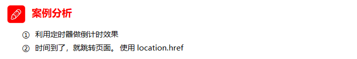

```js
    <button>点击</button>
    <div></div>
    <script>
        var btn = document.querySelector('button');
        var div = document.querySelector('div');
        btn.addEventListener('click', function() {
            // console.log(location.href);
            location.href = 'http://www.itcast.cn';
        })
        var timer = 5;
        setInterval(function() {
            if (timer == 0) {
                location.href = 'http://www.itcast.cn';
            } else {
                div.innerHTML = '您将在' + timer + '秒钟之后跳转到首页';
                timer--;
            }
        }, 1000);
    </script>
```


### 5、案例：获取URL参数


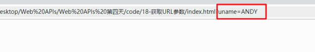


```js
    <div></div>
	<script>
        console.log(location.search); // ?uname=andy
        // 1.先去掉？  substr('起始的位置'，截取几个字符);
        var params = location.search.substr(1); // uname=andy
        console.log(params);
        // 2. 利用=把字符串分割为数组 split('=');
        var arr = params.split('=');
        console.log(arr); // ["uname", "ANDY"]
        var div = document.querySelector('div');
        // 3.把数据写入div中
        div.innerHTML = arr[1] + '欢迎您';
    </script>
```


### 6、 location对象的常见方法 

| location对象方法       | 返回值                                      |
| ------------------ | ---------------------------------------- |
| location.assign()  | 根 `href` 属性一样, 可以跳转页面(也称为重定向页面)          |
| location.replace() | 替换当前页面, 因为不记录历史, 所以不能后退页面                |
| location.reload()  | 重新加载页面, 相当于刷星按钮或者 `f5`  如果参数为`true` 强制刷新 `ctrl + f5` |

 

```js
    <button>点击</button>
    <script>
        var btn = document.querySelector('button');
        btn.addEventListener('click', function() {
            // 记录浏览历史，所以可以实现后退功能
            // location.assign('http://www.itcast.cn');
            // 不记录浏览历史，所以不可以实现后退功能
            // location.replace('http://www.itcast.cn');
            location.reload(true);
        })
    </script>
```


## 8、  navigator对象


`navigator 对象` 包含有关浏览器的信息，它有很多属性，我们最常用的是 `userAgent`，该属性可以返回由客户端发送服务器的 `user-agent 头部`的值。

下面前端代码可以判断用户那个终端打开页面，实现跳转

```js
if((navigator.userAgent.match(/(phone|pad|pod|iPhone|iPod|ios|iPad|Android|Mobile|BlackBerry|IEMobile|MQQBrowser|JUC|Fennec|wOSBrowser|BrowserNG|WebOS|Symbian|Windows Phone)/i))) {
    window.location.href = "";     //手机
 } else {
    window.location.href = "";     //电脑
 }
```


## 9、 history对象


`window对象`给我们提供了一个 `history对象` 　，与浏览器历史记录进行交互。

> 该对象包含用户（在浏览器窗口中）访问过的URL。 

| history对象方法 | 作用                                       |
| ----------- | ---------------------------------------- |
| back()      | 可以后退功能                                   |
| forward()   | 前进功能                                     |
| go(参数)      | 前进后退功能, 参数如果是`1`前进`1`个页面, 如果是`-1` 后退`1`个页面 |

 

history对象一般在实际开发中比较少用，但是会在一些 OA 办公系统中见到。


# 六、 JS执行机制


## 1、 JS执行机制 

- 以下代码执行的结果是什么？

  ```
   console.log(1);
   
   setTimeout(function () {
       console.log(3);
   }, 1000);
   
   console.log(2);
  ```

  > 执行结果是: 123


- 以下代码执行的结果是什么？

  ```
   console.log(1);
   
   setTimeout(function () {
       console.log(3);
   }, 0);
   
   console.log(2);
  ```

  > 执行结果是: 123


## 2、  JS 是单线程 

javaScript 语言的一大特点就是**单线程** , 也就是说, **在同一个时间只能做一件事** . 这是因为javaScript 这门脚本语言诞生的使命所致---- javaScript是为处理页面中用户的交互, 以及操作DOM而诞生.

比如: 我们对某个DOM元素进行添加和删除操作, 不能同时进行. 应先进行添加, 之后再删除. 

> - 单线程就意味着，所有任务需要排队，前一个任务结束，才会执行后一个任务。
> - 如果前一个任务耗时很长，后一个任务就不得不一直等着
> - 这样所导致的问题是： 如果 JS 执行的时间过长，这样就会造成页面的渲染不连贯，导致页面渲染加载阻塞的感觉。


## 3、 同步任务和异步任务


​	单线程导致的问题就是后面的任务等待前面任务完成，如果前面任务很耗时（比如读取网络数据），后面任务不得不一直等待！！

​	为了解决这个问题，利用多核 CPU 的计算能力，HTML5 提出 **Web Worker 标准** ，允许 JavaScript 脚本创建多个线程，但是子线程完全受主线程控制。于是，JS 中出现了**同步任务**和**异步任务**。

> 注意:
>
> 线程和 同步任务 异步任务 是不同的概念, 不要搞混了
>
> 线程是线程
>
> 任务是任务

### 1、同步任务

- 前一个任务结束后再执行后一个任务，程序的执行顺序与任务的排列顺序是一致的、同步的。
- 比如做饭的同步做法：
  - 我们要烧水煮饭，等水开了（10分钟之后），再去切菜，炒菜。


### 2、异步异步任务

​	你在做一件事情时，因为这件事情会花费很长时间，在做这件事的同时，你还可以去处理其他事情。比如做饭的异步做法，我们在烧水的同时，利用这10分钟，去切菜，炒菜。


> ```js
> JS中所有任务可以分成两种，一种是同步任务（synchronous），另一种是异步任务（asynchronous）。
>
> 同步任务指的是：
> 	在主线程上排队执行的任务，只有前一个任务执行完毕，才能执行后一个任务；
>     
> 异步任务指的是：
> 	不进入主线程、而进入”任务队列”的任务，当主线程中的任务运行完了，才会从”任务队列”取出异步任务放入主线程执行。
> ```


> 一般的定时器, 事件类都是异步任务 


## 4、 JS执行机制（事件循环） 

- 先执行**执行栈中的同步任务** 

- 异步任务(回调函数) 放入任务队列中

- 一旦执行栈中的所有同步任务执行完毕, 系统就会按次序读取**任务队列** 中的异步任务, 于是被读取的异步任务结束等待状态, 进入执行栈, 开始执行

  ​


## 5、 代码思考题

```js
 console.log(1);
 document.onclick = function() {
   console.log('click');
 }

 setTimeout(function() {
   console.log(3)
 }, 3000)
 console.log(2);
```


# 七、  Offset 家族(元素偏移量) 


> **学习目标:**
>
> 能够说出常见 offset 系列属性的作用
>
> 能够说出常见 client 系列属性的作用
>
> 能够说出常见 scroll 系列属性的作用
>
> 能够封装简单动画函数
>


## 1、 offset 概述

offset 翻译过来就是偏移量， 我们使用 offset系列相关属性可以动态的得到该元素的位置（偏移）、大小等。

- 获得元素**距离带有定位父元素**的位置

- 获得元素**自身的大小**（宽度高度）

  >  注意：返回的数值都不带单位

  | offset系列属性       | 作用                                       |
  | ---------------- | ---------------------------------------- |
  | ele.offsetParent | 返回该元素**带定位的父元素** , 如果没有就返回`body`         |
  | ele.offsetTop    | 返回该元素相对于**定位父元素** 顶部的偏移量, 没有定位父元素就相对于`body` |
  | ele.offsetLeft   | 返回该元素相对于**定位父元素** 左边的偏移量, 没有定位父元素就相对于`body` |
  | ele.offsetWidth  | 返回自身包括`padding`  + `边框` +`内容区`的宽度 ,  返回值不带单位 |
  | ele.offsetHeight | 返回自身包括`padding`  + `边框` +`内容区`的高度 ,  返回值不带单位 |


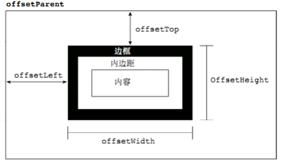  


## 2、 offset 与 style 区别

#### offset　总结

- offset 可以得到任意样式表中的样式值

- offset 系列获得的数值是没有单位的

- offsetWidth 包含padding+border+width

- offsetWidth 等属性是只读属性，只能获取不能赋值

  > 所以，我们想要获取元素大小位置，用offset更合适


#### style　总结

- **style 只能得到行内样式表中的样式值** 

- style.width 获得的是带有单位的字符串

- style.width 获得不包含padding和border 的值

- style.width 是可读写属性，可以获取也可以赋值

  > 所以，我们想要给元素更改值，则需要用style改变

  ​


> **因为平时我们都是给元素注册触摸事件，所以重点记住 targetTocuhes**


## 3、  案例：获取鼠标在盒子内的坐标

1. 我们在盒子内点击，想要得到鼠标距离盒子左右的距离。
2. 首先得到鼠标在页面中的坐标（e.pageX, e.pageY）
3. 其次得到盒子在页面中的距离 ( box.offsetLeft, box.offsetTop)
4. 用鼠标距离页面的坐标减去盒子在页面中的距离，得到 鼠标在盒子内的坐标
5. 如果想要移动一下鼠标，就要获取最新的坐标，使用鼠标移动

```javascript
var box = document.querySelector('.box');
box.addEventListener('mousemove', function(e) {
var x = e.pageX - this.offsetLeft;
var y = e.pageY - this.offsetTop;
this.innerHTML = 'x坐标是' + x + ' y坐标是' + y;
})
```


##4、 案例：模态框拖拽

弹出框，我们也称为模态框。

​	1.点击弹出层，会弹出模态框， 并且显示灰色半透明的遮挡层。

​	2.点击关闭按钮，可以关闭模态框，并且同时关闭灰色半透明遮挡层。

​	3.鼠标放到模态框最上面一行，可以按住鼠标拖拽模态框在页面中移动。

​	4.鼠标松开，可以停止拖动模态框移动


##5、案例分析: 

1. 点击弹出层， 模态框和遮挡层就会显示出来 display:block;
2. 点击关闭按钮，模态框和遮挡层就会隐藏起来 display:none;
3. 在页面中拖拽的原理：鼠标按下并且移动， 之后松开鼠标
4. 触发事件是鼠标按下mousedown，鼠标移动mousemove 鼠标松开 mouseup
5. 拖拽过程:  鼠标移动过程中，获得最新的值赋值给模态框的left和top值，这样模态框可以跟着鼠标走了
6. 鼠标按下触发的事件源是最上面一行，就是  id 为 title 
7. 鼠标的坐标减去 鼠标在盒子内的坐标， 才是模态框真正的位置。
8. 鼠标按下，我们要得到鼠标在盒子的坐标。
9. 鼠标移动，就让模态框的坐标  设置为  ：鼠标坐标 减去盒子坐标即可，注意移动事件写到按下事件里面。
10. 鼠标松开，就停止拖拽，就是可以让鼠标移动事件解除  

```javascript
 // 1. 获取元素
        var login = document.querySelector('.login');
        var mask = document.querySelector('.login-bg');
        var link = document.querySelector('#link');
        var closeBtn = document.querySelector('#closeBtn');
        var title = document.querySelector('#title');
        // 2. 点击弹出层这个链接 link  让mask 和login 显示出来
        link.addEventListener('click', function() {
                mask.style.display = 'block';
                login.style.display = 'block';
            })
            // 3. 点击 closeBtn 就隐藏 mask 和 login 
        closeBtn.addEventListener('click', function() {
                mask.style.display = 'none';
                login.style.display = 'none';
            })
            // 4. 开始拖拽
            // (1) 当我们鼠标按下， 就获得鼠标在盒子内的坐标
        title.addEventListener('mousedown', function(e) {
            var x = e.pageX - login.offsetLeft;
            var y = e.pageY - login.offsetTop;
            // (2) 鼠标移动的时候，把鼠标在页面中的坐标，减去 鼠标在盒子内的坐标就是模态框的left和top值
            document.addEventListener('mousemove', move)

            function move(e) {
                login.style.left = e.pageX - x + 'px';
                login.style.top = e.pageY - y + 'px';
            }
            // (3) 鼠标弹起，就让鼠标移动事件移除
            document.addEventListener('mouseup', function() {
                document.removeEventListener('mousemove', move);
            })
        })

```


## 6、  案例：仿京东放大镜


1. 整个案例可以分为三个功能模块
2. 鼠标经过小图片盒子， 黄色的遮挡层 和 大图片盒子显示，离开隐藏2个盒子功能
3. 黄色的遮挡层跟随鼠标功能。 
4. 移动黄色遮挡层，大图片跟随移动功能。


## 7、 案例分析:


1. 黄色的遮挡层跟随鼠标功能。
2. 把鼠标坐标给遮挡层不合适。因为遮挡层坐标以父盒子为准。
3. 首先是获得鼠标在盒子的坐标。 
4. 之后把数值给遮挡层做为left 和top值。
5. 此时用到鼠标移动事件，但是还是在小图片盒子内移动。
6. 发现，遮挡层位置不对，需要再减去盒子自身高度和宽度的一半。
7. 遮挡层不能超出小图片盒子范围。
8. 如果小于零，就把坐标设置为0
9. 如果大于遮挡层最大的移动距离，就把坐标设置为最大的移动距离
10. 遮挡层的最大移动距离：小图片盒子宽度 减去 遮挡层盒子宽度


```javascript
window.addEventListener('load', function() {
    var preview_img = document.querySelector('.preview_img');
    var mask = document.querySelector('.mask');
    var big = document.querySelector('.big');
    // 1. 当我们鼠标经过 preview_img 就显示和隐藏 mask 遮挡层 和 big 大盒子
    preview_img.addEventListener('mouseover', function() {
        mask.style.display = 'block';
        big.style.display = 'block';
    })
    preview_img.addEventListener('mouseout', function() {
            mask.style.display = 'none';
            big.style.display = 'none';
        })
        // 2. 鼠标移动的时候，让黄色的盒子跟着鼠标来走
    preview_img.addEventListener('mousemove', function(e) {
        // (1). 先计算出鼠标在盒子内的坐标
        var x = e.pageX - this.offsetLeft;
        var y = e.pageY - this.offsetTop;
        // console.log(x, y);
        // (2) 减去盒子高度 300的一半 是 150 就是我们mask 的最终 left 和top值了
        // (3) 我们mask 移动的距离
        var maskX = x - mask.offsetWidth / 2;
        var maskY = y - mask.offsetHeight / 2;
        // (4) 如果x 坐标小于了0 就让他停在0 的位置
        // 遮挡层的最大移动距离
        var maskMax = preview_img.offsetWidth - mask.offsetWidth;
        if (maskX <= 0) {
            maskX = 0;
        } else if (maskX >= maskMax) {
            maskX = maskMax;
        }
        if (maskY <= 0) {
            maskY = 0;
        } else if (maskY >= maskMax) {
            maskY = maskMax;
        }
        mask.style.left = maskX + 'px';
        mask.style.top = maskY + 'px';
        // 3. 大图片的移动距离 = 遮挡层移动距离 * 大图片最大移动距离 / 遮挡层的最大移动距离
        // 大图
        var bigIMg = document.querySelector('.bigImg');
        // 大图片最大移动距离
        var bigMax = bigIMg.offsetWidth - big.offsetWidth;
        // 大图片的移动距离 X Y
        var bigX = maskX * bigMax / maskMax;
        var bigY = maskY * bigMax / maskMax;
        bigIMg.style.left = -bigX + 'px';
        bigIMg.style.top = -bigY + 'px';

    })

})
```


# 八、  client 家族(元素可视区)


##1、 client概述 

client 翻译过来就是客户端，我们使用 client 系列的相关属性来获取元素可视区的相关信息。通过 client
系列的相关属性可以动态的得到该元素的边框大小、元素大小等。

| client系列属性       | 作用                                       |
| ---------------- | ---------------------------------------- |
| ele.clientTop    | 返回元素上边框的大小                               |
| ele.clientLeft   | 返回元素注左边框的大小                              |
| ele.clientWidth  | 返回包括自身`padding` + `内容`  不包含边框的宽度, 返回值不带单位 |
| ele.clientHeight | 返回包括自身`padding` + `内容`  不包含边框的宽高度, 返回值不带单位 |


  

 

## 2、淘宝 flexible.js 源码分析


立即执行函数 (function(){})()  或者 (function(){}())

**主要作用： ** 

- 创建一个独立的作用域。 避免了命名冲突问题


下面三种情况都会刷新页面都会触发 load 事件。

1.a标签的超链接

2.F5或者刷新按钮（强制刷新）

3.前进后退按钮

**但是 火狐中，有个特点，有个“往返缓存”，这个缓存中不仅保存着页面数据，还保存了DOM和JavaScript的状态；实际上是将整个页面都保存在了内存里。所以此时后退按钮不能刷新页面 **   

此时可以使用 pageshow事件来触发。，这个事件在页面显示时触发，无论页面是否来自缓存。在重新加载页面中，pageshow会在load事件触发后触发；根据事件对象中的persisted来判断是否是缓存中的页面触发的pageshow事件

`注意这个事件给window添加。`


#九、 scroll 家族(元素滚动)


## 1、scroll 概述

scroll 翻译过来就是滚动的，我们使用 scroll 系列的相关属性可以动态的得到该元素的大小、滚动距离等。

| scroll系列属性       | 作用                         |
| ---------------- | -------------------------- |
| ele.scrollTop    | 返回被卷去的上侧距离, 返回值不带单位        |
| ele.scrollLeft   | 返回被卷去的左侧距离, 返回值不带单位        |
| ele.scrollWidth  | 返回自身实际的宽度, 不含边框. 返回的数值不带单位 |
| ele.scrollHeight | 返回自身实际高度, 不含边框, 返回数值不带单位   |


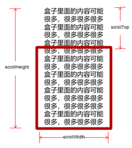  


## 2、页面被卷去的头部

如果浏览器的高（或宽）度不足以显示整个页面时，会自动出现滚动条。当滚动条向下滚动时，页面上面被隐藏掉的高度，我们就称为页面被卷去的头部。滚动条在滚动时会触发 onscroll事件。


## 3、案例：仿淘宝固定右侧侧边栏

1. 原先侧边栏是绝对定位
2. 当页面滚动到一定位置，侧边栏改为固定定位
3. 页面继续滚动，会让 返回顶部显示出来


## 4、案例分析:

1. 需要用到页面滚动事件 scroll  因为是页面滚动，所以事件源是document
2. 滚动到某个位置，就是判断页面被卷去的上部值。
3. 页面被卷去的头部：可以通过window.pageYOffset 获得  如果是被卷去的左侧window.pageXOffset
4. 注意，元素被卷去的头部是element.scrollTop  , 如果是页面被卷去的头部 则是 window.pageYOffset
5. 其实这个值 可以通过盒子的 offsetTop可以得到，如果大于等于这个值，就可以让盒子固定定位了

```javascript
  //1. 获取元素
        var sliderbar = document.querySelector('.slider-bar');
        var banner = document.querySelector('.banner');
        // banner.offestTop 就是被卷去头部的大小 一定要写到滚动的外面
        var bannerTop = banner.offsetTop
            // 当我们侧边栏固定定位之后应该变化的数值
        var sliderbarTop = sliderbar.offsetTop - bannerTop;
        // 获取main 主体元素
        var main = document.querySelector('.main');
        var goBack = document.querySelector('.goBack');
        var mainTop = main.offsetTop;
        // 2. 页面滚动事件 scroll
        document.addEventListener('scroll', function() {
            // console.log(11);
            // window.pageYOffset 页面被卷去的头部
            // console.log(window.pageYOffset);
            // 3 .当我们页面被卷去的头部大于等于了 172 此时 侧边栏就要改为固定定位
            if (window.pageYOffset >= bannerTop) {
                sliderbar.style.position = 'fixed';
                sliderbar.style.top = sliderbarTop + 'px';
            } else {
                sliderbar.style.position = 'absolute';
                sliderbar.style.top = '300px';
            }
            // 4. 当我们页面滚动到main盒子，就显示 goback模块
            if (window.pageYOffset >= mainTop) {
                goBack.style.display = 'block';
            } else {
                goBack.style.display = 'none';
            }

        })
```


## 5、页面被卷去的头部兼容性解决方案


**需要注意的是，页面被卷去的头部，有兼容性问题，因此被卷去的头部通常有如下几种写法：** 

1. 声明了 DTD，使用 document.documentElement.scrollTop
2. 未声明 DTD，使用  document.body.scrollTop
3. 新方法 window.pageYOffset和 window.pageXOffset，IE9 开始支持

```javascript
function getScroll() {
    return {
      left: window.pageXOffset || document.documentElement.scrollLeft || document.body.scrollLeft||0,
      top: window.pageYOffset || document.documentElement.scrollTop || document.body.scrollTop || 0
    };
 } 
使用的时候  getScroll().left

```


# 十、 offset、client、scrioll 三大家族系列总结

| 三大家族系列大小对比      | 作用                                       |
| --------------- | ---------------------------------------- |
| ele.offsetWidth | 返回自身包括`padding` `边框` `内容` 的宽度, 返回值不带单位   |
| ele.clientWidth | 返回自身包括`padding` `内容` 的宽度, 不包含边框, 返回值不带单位 |
| ele.scrollWidth | 返回自身实际的宽度, 不包含边框, 不带数值                   |


他们主要用法：

1.offset系列 经常用于获得元素位置    offsetLeft  offsetTop

2.client经常用于获取元素大小  clientWidth clientHeight

3.scroll 经常用于获取滚动距离 scrollTop  scrollLeft  

4.注意页面滚动的距离通过 window.pageXOffset  获得


## 1.6. 动画函数封装

### 1.6.1. 动画实现原理 

> 核心原理：通过定时器 setInterval() 不断移动盒子位置。

实现步骤：

1. 获得盒子当前位置
2. 让盒子在当前位置加上1个移动距离
3. 利用定时器不断重复这个操作
4. 加一个结束定时器的条件
5. 注意此元素需要添加定位，才能使用element.style.left

### 1.6.2. 动画函数给不同元素记录不同定时器 

如果多个元素都使用这个动画函数，每次都要var 声明定时器。我们可以给不同的元素使用不同的定时器（自己专门用自己的定时器）。

> 核心原理：利用 JS 是一门动态语言，可以很方便的给当前对象添加属性。

```javascript
 function animate(obj, target) {
            // 当我们不断的点击按钮，这个元素的速度会越来越快，因为开启了太多的定时器
            // 解决方案就是 让我们元素只有一个定时器执行
            // 先清除以前的定时器，只保留当前的一个定时器执行
            clearInterval(obj.timer);
            obj.timer = setInterval(function() {
                if (obj.offsetLeft >= target) {
                    // 停止动画 本质是停止定时器
                    clearInterval(obj.timer);
                }
                obj.style.left = obj.offsetLeft + 1 + 'px';

            }, 30);
        }

```


#  六、Web APIs动画


> **学习目标:**
>
> 能够封装简单动画函数
>
> 能够理解缓动动画的封装
>
> 能够使用动画函数
>
> 能够写出网页轮播图案例
>
> 能够写出移动端触屏事件


## 1、动画函数封装

### 1、缓动效果原理  

缓动动画就是让元素运动速度有所变化，最常见的是让速度慢慢停下来

思路：

1. 让盒子每次移动的距离慢慢变小，速度就会慢慢落下来。
2. 核心算法： (目标值 - 现在的位置)   /  10    做为每次移动的距离步长
3. 停止的条件是： 让当前盒子位置等于目标位置就停止定时器  
4. **注意步长值需要取整  ** 


### 2、 动画函数多个目标值之间移动  

可以让动画函数从 800 移动到 500。

当我们点击按钮时候，判断步长是正值还是负值

​	1.如果是正值，则步长往大了取整

​	2.如果是负值，则步长 向小了取整


### 3、 动画函数添加回调函数 

回调函数原理：函数可以作为一个参数。将这个函数作为参数传到另一个函数里面，当那个函数执行完之后，再执行传进去的这个函数，这个过程就叫做回调。

回调函数写的位置：定时器结束的位置。


### 4、  动画完整版代码:

```javascript
function animate(obj, target, callback) {
    // console.log(callback);  callback = function() {}  调用的时候 callback()

    // 先清除以前的定时器，只保留当前的一个定时器执行
    clearInterval(obj.timer);
    obj.timer = setInterval(function() {
        // 步长值写到定时器的里面
        // 把我们步长值改为整数 不要出现小数的问题
        // var step = Math.ceil((target - obj.offsetLeft) / 10);
        var step = (target - obj.offsetLeft) / 10;
        step = step > 0 ? Math.ceil(step) : Math.floor(step);
        if (obj.offsetLeft == target) {
            // 停止动画 本质是停止定时器
            clearInterval(obj.timer);
            // 回调函数写到定时器结束里面
            // if (callback) {
            //     // 调用函数
            //     callback();
            // }
            callback && callback();
        }
        // 把每次加1 这个步长值改为一个慢慢变小的值  步长公式：(目标值 - 现在的位置) / 10
        obj.style.left = obj.offsetLeft + step + 'px';

    }, 15);
}
```


## 2、 常见网页特效案例

### 1、 案例：网页轮播图

轮播图也称为焦点图，是网页中比较常见的网页特效。

功能需求：

​	1.鼠标经过轮播图模块，左右按钮显示，离开隐藏左右按钮。

​	2.点击右侧按钮一次，图片往左播放一张，以此类推，左侧按钮同理。

​	3.图片播放的同时，下面小圆圈模块跟随一起变化。

​	4.点击小圆圈，可以播放相应图片。

​	5.鼠标不经过轮播图，轮播图也会自动播放图片。

​	6.鼠标经过，轮播图模块， 自动播放停止。

```
window.addEventListener('load', function() {
    // 1. 获取元素
    var arrow_l = document.querySelector('.arrow-l');
    var arrow_r = document.querySelector('.arrow-r');
    var focus = document.querySelector('.focus');
    var focusWidth = focus.offsetWidth;
    // 2. 鼠标经过focus 就显示隐藏左右按钮
    focus.addEventListener('mouseenter', function() {
        arrow_l.style.display = 'block';
        arrow_r.style.display = 'block';
        clearInterval(timer);
        timer = null; // 清除定时器变量
    });
    focus.addEventListener('mouseleave', function() {
        arrow_l.style.display = 'none';
        arrow_r.style.display = 'none';
        timer = setInterval(function() {
            //手动调用点击事件
            arrow_r.click();
        }, 2000);
    });
    // 3. 动态生成小圆圈  有几张图片，我就生成几个小圆圈
    var ul = focus.querySelector('ul');
    var ol = focus.querySelector('.circle');
    // console.log(ul.children.length);
    for (var i = 0; i < ul.children.length; i++) {
        // 创建一个小li 
        var li = document.createElement('li');
        // 记录当前小圆圈的索引号 通过自定义属性来做 
        li.setAttribute('index', i);
        // 把小li插入到ol 里面
        ol.appendChild(li);
        // 4. 小圆圈的排他思想 我们可以直接在生成小圆圈的同时直接绑定点击事件
        li.addEventListener('click', function() {
            // 干掉所有人 把所有的小li 清除 current 类名
            for (var i = 0; i < ol.children.length; i++) {
                ol.children[i].className = '';
            }
            // 留下我自己  当前的小li 设置current 类名
            this.className = 'current';
            // 5. 点击小圆圈，移动图片 当然移动的是 ul 
            // ul 的移动距离 小圆圈的索引号 乘以 图片的宽度 注意是负值
            // 当我们点击了某个小li 就拿到当前小li 的索引号
            var index = this.getAttribute('index');
            // 当我们点击了某个小li 就要把这个li 的索引号给 num  
            num = index;
            // 当我们点击了某个小li 就要把这个li 的索引号给 circle  
            circle = index;
            // num = circle = index;
            console.log(focusWidth);
            console.log(index);

            animate(ul, -index * focusWidth);
        })
    }
    // 把ol里面的第一个小li设置类名为 current
    ol.children[0].className = 'current';
    // 6. 克隆第一张图片(li)放到ul 最后面
    var first = ul.children[0].cloneNode(true);
    ul.appendChild(first);
    // 7. 点击右侧按钮， 图片滚动一张
    var num = 0;
    // circle 控制小圆圈的播放
    var circle = 0;
    // flag 节流阀
    var flag = true;
    arrow_r.addEventListener('click', function() {
        if (flag) {
            flag = false; // 关闭节流阀
            // 如果走到了最后复制的一张图片，此时 我们的ul 要快速复原 left 改为 0
            if (num == ul.children.length - 1) {
                ul.style.left = 0;
                num = 0;
            }
            num++;
            animate(ul, -num * focusWidth, function() {
                flag = true; // 打开节流阀
            });
            // 8. 点击右侧按钮，小圆圈跟随一起变化 可以再声明一个变量控制小圆圈的播放
            circle++;
            // 如果circle == 4 说明走到最后我们克隆的这张图片了 我们就复原
            if (circle == ol.children.length) {
                circle = 0;
            }
            // 调用函数
            circleChange();
        }
    });

    // 9. 左侧按钮做法
    arrow_l.addEventListener('click', function() {
        if (flag) {
            flag = false;
            if (num == 0) {
                num = ul.children.length - 1;
                ul.style.left = -num * focusWidth + 'px';

            }
            num--;
            animate(ul, -num * focusWidth, function() {
                flag = true;
            });
            // 点击左侧按钮，小圆圈跟随一起变化 可以再声明一个变量控制小圆圈的播放
            circle--;
            // 如果circle < 0  说明第一张图片，则小圆圈要改为第4个小圆圈（3）
            // if (circle < 0) {
            //     circle = ol.children.length - 1;
            // }
            circle = circle < 0 ? ol.children.length - 1 : circle;
            // 调用函数
            circleChange();
        }
    });

    function circleChange() {
        // 先清除其余小圆圈的current类名
        for (var i = 0; i < ol.children.length; i++) {
            ol.children[i].className = '';
        }
        // 留下当前的小圆圈的current类名
        ol.children[circle].className = 'current';
    }
    // 10. 自动播放轮播图
    var timer = setInterval(function() {
        //手动调用点击事件
        arrow_r.click();
    }, 2000);

})
```


### 2、 节流阀

防止轮播图按钮连续点击造成播放过快。

节流阀目的：当上一个函数动画内容执行完毕，再去执行下一个函数动画，让事件无法连续触发。

核心实现思路：利用回调函数，添加一个变量来控制，锁住函数和解锁函数。

 开始设置一个变量var flag= true;

If(flag){flag = false; do something}       关闭水龙头

利用回调函数动画执行完毕， flag = true     打开水龙头


### 3、 案例：返回顶部

1. 带有动画的返回顶部
2. 此时可以继续使用我们封装的动画函数
3. 只需要把所有的left 相关的值改为 跟 页面垂直滚动距离相关就可以了
4. 页面滚动了多少，可以通过 window.pageYOffset 得到
5. 最后是页面滚动，使用 window.scroll(x,y) 

```javascript
  //1. 获取元素
        var sliderbar = document.querySelector('.slider-bar');
        var banner = document.querySelector('.banner');
        // banner.offestTop 就是被卷去头部的大小 一定要写到滚动的外面
        var bannerTop = banner.offsetTop
            // 当我们侧边栏固定定位之后应该变化的数值
        var sliderbarTop = sliderbar.offsetTop - bannerTop;
        // 获取main 主体元素
        var main = document.querySelector('.main');
        var goBack = document.querySelector('.goBack');
        var mainTop = main.offsetTop;
        // 2. 页面滚动事件 scroll
        document.addEventListener('scroll', function() {
                // console.log(11);
                // window.pageYOffset 页面被卷去的头部
                // console.log(window.pageYOffset);
                // 3 .当我们页面被卷去的头部大于等于了 172 此时 侧边栏就要改为固定定位
                if (window.pageYOffset >= bannerTop) {
                    sliderbar.style.position = 'fixed';
                    sliderbar.style.top = sliderbarTop + 'px';
                } else {
                    sliderbar.style.position = 'absolute';
                    sliderbar.style.top = '300px';
                }
                // 4. 当我们页面滚动到main盒子，就显示 goback模块
                if (window.pageYOffset >= mainTop) {
                    goBack.style.display = 'block';
                } else {
                    goBack.style.display = 'none';
                }

            })
            // 3. 当我们点击了返回顶部模块，就让窗口滚动的页面的最上方
        goBack.addEventListener('click', function() {
            // 里面的x和y 不跟单位的 直接写数字即可
            // window.scroll(0, 0);
            // 因为是窗口滚动 所以对象是window
            animate(window, 0);
        });

```


### 4、案例：筋头云案例

1. 利用动画函数做动画效果
2. 原先筋斗云的起始位置是0
3. 鼠标经过某个小li，把当前小li的offsetLeft 位置做为目标值即可
4. 鼠标离开某个小li，就把目标值设为 0
5. 如果点击了某个小li， 就把li当前的位置存储起来，做为筋斗云的起始位置

```javascript
 window.addEventListener('load', function() {
            // 1. 获取元素
            var cloud = document.querySelector('.cloud');
            var c_nav = document.querySelector('.c-nav');
            var lis = c_nav.querySelectorAll('li');
            // 2. 给所有的小li绑定事件 
            // 这个current 做为筋斗云的起始位置
            var current = 0;
            for (var i = 0; i < lis.length; i++) {
                // (1) 鼠标经过把当前小li 的位置做为目标值
                lis[i].addEventListener('mouseenter', function() {
                    animate(cloud, this.offsetLeft);
                });
                // (2) 鼠标离开就回到起始的位置 
                lis[i].addEventListener('mouseleave', function() {
                    animate(cloud, current);
                });
                // (3) 当我们鼠标点击，就把当前位置做为目标值
                lis[i].addEventListener('click', function() {
                    current = this.offsetLeft;
                });
            }
        })

```


#  **七.Web APIs** 触摸事件


> **学习目标:**
>
> 能够写出移动端触屏事件
> 能够写出常见的移动端特效
> 能够使用移动端开发插件开发移动端特效
> 能够使用移动端开发框架开发移动端特效
> 能够写出 sessionStorage 数据的存储以及获取
> 能够写出 localStorage 数据的存储以及获取
> 能够说出它们两者的区别
>

## 1、触屏事件

### 1、 触屏事件概述 

移动端浏览器兼容性较好，我们不需要考虑以前 JS 的兼容性问题，可以放心的使用原生 JS 书写效果，但是移动端也有自己独特的地方。

**比如: 触屏事件 touch（也称触摸事件），Android和 IOS 都有。** 

**touch 对象代表一个触摸点。** 

触摸点可能是一根手指，也可能是一根触摸笔。触屏事件可响应用户手指（或触控笔）对屏幕或者触控板操作。

常见的触屏事件如下：

| 触屏touch事件  | 说明               |
| ---------- | ---------------- |
| touchstart | 手指触摸到一个DOM元素时触发  |
| touchmove  | 手指在一个DOM元素上滑动时触发 |
| touchend   | 手指从一个DOM元素上移开时触发 |


### 2、 触摸事件对象（TouchEvent）

TouchEvent 是一类描述手指在触摸平面（触摸屏、触摸板等）的状态变化的事件。这类事件用于描述一个或多个触点，使开发者可以检测触点的移动，触点的增加和减少，等等

touchstart、touchmove、touchend 三个事件都会各自有事件对象。

触摸事件对象重点我们看三个常见对象列表：

| 触摸列表           | 说明                          |
| -------------- | --------------------------- |
| touches        | 正在触摸屏幕的所有手指的一个列表            |
| targetTouches  | 正在触摸当前 DOM 元素上的手指的一个列表      |
| changedTouches | 手指状态发生了改变的列表, 从无到有, 从有到无的变化 |


> `因为平时我们都是给元素注册触摸事件，所以重点记住 targetTocuhes`


### 3、案例：移动端拖动元素

1. touchstart、touchmove、touchend可以实现拖动元素

2. 但是拖动元素需要当前手指的坐标值 我们可以使用  targetTouches[0] 里面的pageX 和 pageY 

3. 移动端拖动的原理：    手指移动中，计算出手指移动的距离。然后用盒子原来的位置 + 手指移动的距离

4. 手指移动的距离：  手指滑动中的位置 减去  手指刚开始触摸的位置

   拖动元素三步曲：

   （1） 触摸元素 touchstart： 获取手指初始坐标，同时获得盒子原来的位置

   （2） 移动手指 touchmove： 计算手指的滑动距离，并且移动盒子

   （3） 离开手指 touchend:

   ​

   `注意： 手指移动也会触发滚动屏幕所以这里要阻止默认的屏幕滚动 e.preventDefault();`


## 2、 移动端常见特效

### 1、 案例: 移动轮播图

`移动端轮播图功能和基本PC端一致。`

1. 可以自动播放图片
2. 手指可以拖动播放轮播图


### 2、 案例分析:

1. 自动播放功能

2. 开启定时器

3. 移动端移动，可以使用translate 移动

4. 想要图片优雅的移动，请添加过渡效果

   ```
   //1. 获取元素
   var focus = document.querySelector('.focus')
   var ul = focus.children[0]

   // 获得focus 的宽度
   var w = focus.offsetWidth

   // 利用定时器自动轮播图片
   var index = 0
   var timer = setIntervar(function(){
     index++
     var translatex = -index * w
     ul.style.transition = 'all  .3s'
     ul.style.transform = 'translateX((' + translatex + 'px)'
     
   },2000)
   ```

   ​

    


1. 自动播放功能-无缝滚动

2. 注意，我们判断条件是要等到图片滚动完毕再去判断，就是过渡完成后判断

3. 此时需要添加检测过渡完成事件  transitionend 

4. 判断条件：如果索引号等于 3 说明走到最后一张图片，此时 索引号要复原为 0

5. 此时图片，去掉过渡效果，然后移动

6. 如果索引号小于0， 说明是倒着走， 索引号等于2 

7. 此时图片，去掉过渡效果，然后移动

   .jpg)

## 3、classList 属性

classList属性是HTML5新增的一个属性，返回元素的类名。但是ie10以上版本支持。

该属性用于在元素中添加，移除及切换 CSS 类。有以下方法

**添加类：**

element.classList.add（’类名’）；

```javascript
focus.classList.add('current');
```

**移除类：**

element.classList.remove（’类名’）;

```javascript
focus.classList.remove('current');
```

**切换类：**

element.classList.toggle（’类名’）;

```javascript
focus.classList.toggle('current');
```

`注意:以上方法里面，所有类名都不带点`

### 2、案例分析

1. 小圆点跟随变化效果

2. 把ol里面li带有current类名的选出来去掉类名 remove

3. 让当前索引号的小li 加上 current   add

4. 但是，是等着过渡结束之后变化，所以这个写到 transitionend 事件里面

   .jpg)


1. 手指滑动轮播图
2. 本质就是ul跟随手指移动，简单说就是移动端拖动元素
3. 触摸元素touchstart：  获取手指初始坐标
4. 移动手指touchmove：  计算手指的滑动距离，并且移动盒子
5. 离开手指touchend:   根据滑动的距离分不同的情况
6. 如果移动距离小于某个像素  就回弹原来位置
7. 如果移动距离大于某个像素就上一张下一张滑动。
8. 滑动也分为左滑动和右滑动判断的标准是 移动距离正负 如果是负值就是左滑 反之右滑 
9. 如果是左滑就播放下一张 （index++）
10. 如果是右滑就播放上一张  (index--)

.jpg)

.jpg)


### 3、 案例：返回顶部

当页面滚动某个地方，就显示，否则隐藏

点击可以返回顶部

### 3、案例分析

1. 滚动某个地方显示
2. 事件：scroll页面滚动事件  
3. 如果被卷去的头部（window.pageYOffset ）大于某个数值
4. 点击，window.scroll(0,0) 返回顶部

.jpg)


## 4、click 延时解决方案

移动端 click 事件会有 300ms 的延时，原因是移动端屏幕双击会缩放(double tap to zoom) 页面。

解决方案：

​	1. 禁用缩放。 浏览器禁用默认的双击缩放行为并且去掉300ms 的点击延迟。

```html
  <meta name="viewport" content="user-scalable=no">
```

​	2.利用touch事件自己封装这个事件解决300ms 延迟。 

​	原理就是：

1.  当我们手指触摸屏幕，记录当前触摸时间
2.  当我们手指离开屏幕， 用离开的时间减去触摸的时间
3.  如果时间小于150ms，并且没有滑动过屏幕， 那么我们就定义为点击

代码如下:

```javascript
//封装tap，解决click 300ms 延时
function tap (obj, callback) {
        var isMove = false;
        var startTime = 0; // 记录触摸时候的时间变量
        obj.addEventListener('touchstart', function (e) {
            startTime = Date.now(); // 记录触摸时间
        });
        obj.addEventListener('touchmove', function (e) {
            isMove = true;  // 看看是否有滑动，有滑动算拖拽，不算点击
        });
        obj.addEventListener('touchend', function (e) {
            if (!isMove && (Date.now() - startTime) < 150) {  // 如果手指触摸和离开时间小于150ms 算点击
                callback && callback(); // 执行回调函数
            }
            isMove = false;  //  取反 重置
            startTime = 0;
        });
}
//调用  
  tap(div, function(){   // 执行代码  });

```

3. 使用插件。fastclick 插件解决300ms 延迟。 

   .jpg)

## 5、移动端常用开发插件


### 1、什么是插件

移动端要求的是快速开发，所以我们经常会借助于一些插件来帮我完成操作，那么什么是插件呢？

JS 插件是 js 文件，它遵循一定规范编写，方便程序展示效果，拥有特定功能且方便调用。如轮播图和瀑布流插件。

特点：它一般是为了解决某个问题而专门存在，其功能单一，并且比较小。

我们以前写的animate.js 也算一个最简单的插件

fastclick 插件解决 300ms 延迟。 使用延时

GitHub官网地址： [https://](https://github.com/ftlabs/fastclick)[github.com/ftlabs/fastclick](https://github.com/ftlabs/fastclick)


### 2、 插件的使用

1.  引入 js 插件文件。

2.  按照规定语法使用。

3.  fastclick 插件解决 300ms 延迟。 使用延时

4.  GitHub官网地址： https://github.com/ftlabs/fastclick

    ```javascript
    if ('addEventListener' in document) {
                document.addEventListener('DOMContentLoaded', function() {
                           FastClick.attach(document.body);
                }, false);
    }
    ```


### 3、 Swiper 插件的使用

中文官网地址： https://www.swiper.com.cn/ 

1.  引入插件相关文件。
2.  按照规定语法使用


### 4、 其他移动端常见插件

lsuperslide： http://www.superslide2.com/

l iscroll： https://github.com/cubiq/iscroll


### 5、 插件的使用总结

1.确认插件实现的功能

2.去官网查看使用说明

3.下载插件

4.打开demo实例文件，查看需要引入的相关文件，并且引入

5.复制demo实例文件中的结构html，样式css以及js代码


### 6、移动端视频插件 zy.media.js

H5 给我们提供了 video 标签，但是浏览器的支持情况不同。

不同的视频格式文件，我们可以通过source解决。

但是外观样式，还有暂停，播放，全屏等功能我们只能自己写代码解决。

这个时候我们可以使用插件方式来制作。

我们可以通过 JS 修改元素的大小、颜色、位置等样式。


## 6、 移动端常用开发框架


### 1、 移动端视频插件 zy.media.js

框架，顾名思义就是一套架构，它会基于自身的特点向用户提供一套较为完整的解决方案。框架的控制权在框架本身，使用者要按照框架所规定的某种规范进行开发。

插件一般是为了解决某个问题而专门存在，其功能单一，并且比较小。

前端常用的框架有 Bootstrap、Vue、Angular、React 等。既能开发PC端，也能开发移动端

前端常用的移动端插件有 swiper、superslide、iscroll等。

框架： 大而全，一整套解决方案

插件： 小而专一，某个功能的解决方案


### 2、 Bootstrap

Bootstrap 是一个简洁、直观、强悍的前端开发框架，它让 web 开发更迅速、简单。

它能开发PC端，也能开发移动端 

Bootstrap JS插件使用步骤：

1.引入相关js 文件

2.复制HTML 结构

3.修改对应样式

4.修改相应JS 参数


## 7、本地存储

随着互联网的快速发展，基于网页的应用越来越普遍，同时也变的越来越复杂，为了满足各种各样的需求，会经常性在本地存储大量的数据，HTML5规范提出了相关解决方案。


### 1、本地存储特性

1、数据存储在用户浏览器中

2、设置、读取方便、甚至页面刷新不丢失数据

3、容量较大，sessionStorage约5M、localStorage约20M

4、只能存储字符串，可以将对象JSON.stringify() 编码后存储


### 2、window.sessionStorage

1、生命周期为关闭浏览器窗口

2、在同一个窗口(页面)下数据可以共享

3、以键值对的形式存储使用

存储数据：

```javascript
sessionStorage.setItem(key, value)
```

获取数据：

```javascript
sessionStorage.getItem(key)
```

删除数据：

```javascript
sessionStorage.removeItem(key)
```

清空数据：(所有都清除掉)

```javascript
sessionStorage.clear()
```


### 3、window.localStorage

1、声明周期永久生效，除非手动删除 否则关闭页面也会存在

2、可以多窗口（页面）共享（同一浏览器可以共享）

3.  以键值对的形式存储使用

存储数据：

```javascript
localStorage.setItem(key, value)
```

获取数据：

```javascript
localStorage.getItem(key)
```

删除数据：

```javascript
localStorage.removeItem(key)
```

清空数据：(所有都清除掉)

```javascript
localStorage.clear()
```


### 4、案例：记住用户名

如果勾选记住用户名， 下次用户打开浏览器，就在文本框里面自动显示上次登录的用户名

#### 案例分析

1. 把数据存起来，用到本地存储

2. 关闭页面，也可以显示用户名，所以用到localStorage

3. 打开页面，先判断是否有这个用户名，如果有，就在表单里面显示用户名，并且勾选复选框

4. 当复选框发生改变的时候change事件

5. 如果勾选，就存储，否则就移除

   .jpg)


   


