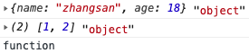

[TOC]


# 一. ECMAScript 6 入门

建议看 阮一峰 的书:

http://es6.ruanyifeng.com/#docs/intro


https://www.babeljs.cn   专门测试 ES6 与 ES5 之间的差异


在线画图:

https://www.processon.com


并不是所有的浏览器都支持es6语法, 我们在开发的时候使用es6 语法, 当项目上线后为了支持所有的浏览器需要把es6的代码转换为es5


## 1. ES6 变量的声明


### 1. ES6 中变量 & 常量


- 在ES6 中使用 **let**  声明变量

  ```
  // 相当于ES5中的var , 但是又有不同
  let num = 20;
  ```

- 在ES6 中, 同一个作用域内, 不能声明相同的变量, 如下, 是错误的

  ```
  <script> 
      // ES 6 不允许这样, 直接报错
      let a = 10;
      let a = 20;
      console.log(a);
  </script>
  ```

  - 但是在ES5 中是允许的

    ```
    <script>
        // ES 5 中允许这样 重复定义
        var num = 20;
        var num = 30;
        console.log(num); 
    </script>
    ```

- 在ES6 中函数的形参和函数内的变量名不能重名

  ```
  <script>
    function  fn(x) {
        console.log(x);  
        // 不允许这样, 直接报错  `Identifier 'x' has already been declared` 
        let x = 20;
        console.log(x);  
    }
    fn(10)
  </script>
  
  ```

  - 但是在ES5中是允许的

    ```
    <script>
      function  fn(x) {
          console.log(x); // 打印10
          var x = 20;
          console.log(x); // 打印20
      }
      fn(10)
    </script>
    ```

- ES6 中let 声明的变量只在自己的作用域内有效

  - for循环中使用let 和 var 的定义变量的差异差异

    - ES6 中, 只能在{}内使用

      ```
      <script> 
      		// 变量i只能在 {} 内使用
          for(let i=0; i<10; i++){ 
          }
          // 直接报错:Uncaught ReferenceError: i is not defined
          console.log(i);
      </script>
      ```

    - ES5 中, 是全局变量

      ```
      <script>  
          for(var i=0; i<10; i++){ 
          }
          console.log(i); // 结果为10
      </script>
      ```

      


### 2. ES6 声明常量

- 在ES6 中使用**const** 声明常量, 常量在定义是必须赋值且不能被修改

  ```
  // 一但赋值后就不能改了 
  <script>  
      const AGE = 18;
  </script>
  ```

  > 在 ES5 中没有常量这一说法


## 2. ES6 中字符串 (很好用)

- 有点像模板字符串的概念

  > ${} 中间放表达式即可  

```
<script> 
    let body = document.querySelector('body');
    let info = {name:'zhangsan', age:18, height:1.88};
    let ul = `<ul>
                <li>${info.name}</li>
                <li>${info.age}</li>
                <li>${info.height}</li>
              </ul>`
    body.innerHTML = ul;
</script>
```


## 3. ES6 中函数的特点

### 1.ES6 中函数可以设置默认值

```
<script> 
    function fn(num = 10) {
        console.log(num);
    }
    fn(); // 打印结果是10
    fu(5); // 打印结果是5
</script>
```

> 需要注意的是, ES6 中如果函数有多个参数, 设置默认值只能从右往左设置
>
> function fn(num = 10, age,name) // 错误写法
>
> function fn( age,name,num = 10) // 正确写法

- ES5 中函数不能设置默认值

  ```
  <script> 
  		// ES5 中函数设置默认值需要这样做
      function fn() {
          var n = num || 10
          console.log(n);
      }
      fn(); // 打印结果是10
      fu(5); // 打印结果是5
  </script>
  ```


### 2. ES6 中支持箭头函数

```
let fn = ()=> {
	console.log('箭头函数')
}
fn()
```


# javaScript 高级(js入门介绍)

快捷键

- `itar` 

  ```
  for (var i = 0; i < array.length; i++) {
  	var obj = array[i];
  }
  ```


# 问题:

1、面向对象的三大特性, 分别说明

2、为什么要使用面向对象编程

3、构造函数和原型对象的关系

4、说明自定义构造函数的执行过程

5、面向对象和面向过程的区别

6、构造函数的原型对象的作用

7、如何获取构造函数的原型对象

8、简单介绍 创建对象的几种方式, 并说明优缺点

9、说明实例和实例化

10、请画出下面代码的结构关系图 (包含__proto__ 和 constructor)


## 一、 javaScript 的组成


### 1、 DOM

>  Document Object Model 文档对象模型, 为了我们方便的操作HTML中的标签元素, 提供了一系列的方法.
>
> 其实没有DOM 也可以操作HTML元素, 只是很麻烦而已

```
document.body ; // 获取body元素
```


### 2、 BOM

> Browser Object Model 浏览器对象模型, 它里面提供了一些方法, 可以让你对浏览器进行一些操作/ 交互, 其中最重要的就是 `window` 对象

```
window.open(); // 打开一个创库
window.open('https://baidu.com'); // 打开百度页面
```


### 3、 ECMAScript

> ECMAScript 是一个语法标准, 它规定了javaScript的核心语法.


## 二、javaScript 中的数据类型


### 1、基本(简单)数据类型 (5种)

- **string** 字符串
- **number** 数值 (整数 | 小数)
- **boolean** 布尔 (true | false)
- **undefined** 未定义
- **null** 空


### 2、复杂(复合)数据类型

- **object** 对象
- **Array** 数组对象
- **Date** 日期对象
- **function** 函数
- **String** 字符串对象 (基本包装型)
- **Number** 数值对象 (基本包装型)
- **Boolean** 布尔对象 (基本包装型)


### 3、 判断数据类型

#### 1、判断数据类型的方法(2种情况)

-  关键字 **typeof**  获取一个变量 或者一个数据的数据类型(返回值是string), 其语法格式如下:

  ```
  // 格式: 
  typeof 变量\数据
  // 示例:
  console.log(typeof "abc"); // 获取 "abc" 的数据类型
  ```

  > typeof 判断返回的值的类型是 `string` 基本数据类型

- 关键字 **instanceof** 判断一个数据是否是某个类型(返回值是 布尔)

  ```
  // 格式: 
  nl instanceof type;
  
  // 示例:
  console.log(@"abc" instanceof string); // true
  ```

  


#### 2、基本数据类型的判断 (有坑)

> null 是基本数据类型, 但是通过 typeof 判断出的结果却是 object 类型, 这是官方承认的错误

```
<script>

    var str = '123';
    console.log(str, typeof str); // string

    var num = 123;
    console.log(num, typeof  num); //number

    var bl = true;
    console.log(bl, typeof  bl); // boolean

    // 注意: 
    // null 并不是一个对象, 但是通过 typeof 打印出来的时候是 object, 这是因为
    // js 这门语言当初在设计的时候的一个错误, 这个错误 官方在很早就已经承认了
    var nl = null;
    console.log(nl, typeof  nl); // null | (object)
    // 判断 nl 是否是Object 类型的对象
    console.log(nl instanceof Object); // false

    var a ;
    console.log(a, typeof a); // undefined

    // var c = 20;  其实等价于下面两句
    //    var c ;  // 声明
    //    c = 20;  // 赋值 (定义)

</script>
```

 

#### 3、复杂数据类型的判断(有坑)

```
<script>
    var obj = {
        name: 'zhangsan',
        age:18
    };
    console.log(obj, typeof  obj);   // object

    var arr = [1,2];
    console.log(arr, typeof  arr);  // object
    // 通过 typeof 操作复杂数据类型时, 数据类型都是 object, 函数除外

    function  fn() {}
    console.log(typeof  fn); // function 
</script>
```

 


## 三、 等于和全等 详解 (有坑)


### 1、等于(==)和全等(===)说明

- 赋值号: `=` 

- 等于号: `==`

  > 判断左右两边是否相等
  >
  > 只判断值

- 全等于号:`===`

  > 判断左右两边是否相等
  >
  > 不仅判断值, 还判断类型


### 2、等于和全等 示例 


```
<script>
    var str1 = '123';
    var str2 = '123';
    var num1 = 123;

    console.log(str1 == str2);      // true
    console.log(str1 === str2);     // true
    console.log(str1 == num1);      //true
    console.log(str1 === num1);     //false


    console.log(null == undefined);     //true
    console.log(null === undefined);    //false


    var arr1 = [1,2,3];
    var arr2 = [1,2,3]; 
    console.log(arr1 == arr2);  //false
    console.log(arr1 === arr2); //false

</script>
```


### 3、 null 和 undefined 说明


1. 什么时候变量的值为 `null`

   变量的值永远不可能为`null` , 只有手动给变量赋值为`null` 后变量的值才为`null`.

   ```
   var a = 20;
   这句话, 其实要这样理解:
   首先, var a = 20 ; 等价于下面2句:
   var a;
   a = 20;
   
   其中, var a; 相当于是在内存中申请一个变量(可以理解为一个装东西的盒子)
   a = 20; 相当于是让变量a 指向20 (或者理解为把20装进变量 a 的盒子)
   ```


## 四、关系运算符 (返回值是布尔)


### 1、 关系运算符有哪些

- 大于: `>`

- 小于: `<`

- 大于等于: `>=`

- 小于等于: `<=`

- 不等于:

  - `!=`
  - `!==`

  > 关系运算符一般用在条件判断, 其返回值都是boolean 值

  ```
  var a = 10;
  var b = 20;
  if (a > b){
  	console.log('a > b');
  }
  ```


## 五、逻辑运算符


### 1、逻辑运算符有哪些 (详解- 有坑)

- 逻辑非: `!` , 取反

- 逻辑或: `||`   *短路运算符* 

- 逻辑与: `&&`   *短路运算符* 

   

### 2、逻辑非: `!` , 取反 (返回值布尔)


> 语法: `! 表达式` 
>
> 返回结果是 boolean

```
<script>
    console.log(!0); // true
    console.log(!2); // false
    console.log(!null); // true
    console.log(!undefined); // true
    var arr = [1,2];
    console.log(!arr);  // false
</script>
```


### 3、逻辑或: `||`   (返回值表达式)

> 语法:  ` 表达式1 || 表达式2`
>
> **注意:** 返回结果不一定是布尔类型, 结果是其中一个表达式的结果 
>
> 如果表达式1为真, 返回表达式1
>
> 如果表达式1为假, 返回表达式2 
>
> 
>
> (坑) 要说明的是, js 中的逻辑或(||) 与C语言中的逻辑或是不一样的概念, C语言逻辑或后只能是 真或假

```
<script>

    console.log(true || false); // true
    console.log(false || true); // true
    console.log(0 || 0);    // 0
    console.log(0 || 1);    // 1
    console.log(1 || 0);    // 1
    console.log(1 || 1);    // 1
    console.log(2 || 3);    // 2
    console.log(null || [1, 2]);    //  [1, 2]
    console.log([1, 2] || null);    //[1, 2]
    console.log(undefined || {name: 'zhagnsan'});   // {name: "zhagnsan"}
    console.log({name: 'zhangsan'} || undefined );  // {name: "zhangsan"}
</script>
```


### 4、逻辑与: `&&`  (返回值表达式)

> 语法: 表达式1 && 表达式2
>
> 结果: 不一定是布尔类型
>
> 表达式1为假, 返回表达式1
>
> 表达式1为真, 返回表达式2

```
<script>

    console.log(true && false); // false
    console.log(false && true); // false
    console.log(0 && 0);    // 0
    console.log(0 && 1);    // 0
    console.log(1 && 0);    // 0
    console.log(1 && 1);    // 1
    console.log(2 && 3);    // 3
    console.log(null && [1, 2]);    //  null
    console.log([1, 2] && null);    //null
    console.log(undefined && {name: 'zhagnsan'});   // undefined
    console.log({name: 'zhangsan'} && undefined );  // undefined
</script>
```


## 六、 值类型和引用数据类型

### 1、 值类型 (5种) 

`string` `number` `boolean` `undefined` `null`


### 2、 引用类型

`object` `Array` `Function` `Date` ...


### 3、 值类型和应用类型的区别

- 值类型存储的是具体的数据
- 引用类型存储的是引用 (内存地址) 

 


### 4、 值类型和引用类型的赋值


#### 1、 值类型赋值

- 默认会把赋值符号`=` 右边的存储的信息**(具体数据)**复制一份给左边 

  ```
  <script>
    var a = 10;
    var b = a;
    b = 20;
    console.log(a); // 10
    console.log(b); // 20
  </script>
  ```

  > 特点:
  >
  > 只是简单的数据复制, 相互之间独立

#### 2、 引用类型赋值 

- 把赋值符号`=` 右边的存储的信息**(指向具体数据的地址)**复制一份给左边

  ```
  <script>
      var  obj = {
          name: 'zhangsan'
      }
      var obj1 = obj;
      console.log(obj.name);  // zhangsan
  
      obj1.name = 'ls';
      console.log(obj.name);  // ls
      console.log(obj1.name); // ls
  </script>
  ```

  > 特点:
  >
  > 共享同一份数据, 修改其中一个对象属性的值, 会影响另外一个

    

- 思考:

  ```
  <script>
      var  obj = {
          name: 'zhangsan'
      }
      var obj1 = obj;
      console.log(obj.name);  // zhangsan 
      obj1.name = 'ls';
      
      obj1 = {des: 'des'}
      console.log(obj.name);  // ls
      console.log(obj1.name); // undefined
      console.log(obj.des); 	// undefined
      console.log(obj1.des); 	// des
  </script>
  ```

- 回顾, 理解

  ```
  <script>
    var arr1 = [1,2,3]; // 0x123
    var arr2 = [1,2,3]; // 0x223
    console.log(arr1 == arr2);  //false   (0x123 != x223 ) 值不相等
    console.log(arr1 === arr2); //false   (0x123 != x223 ) 值不相等, 肯定类型也不同
  </script>
  ```


### 5、 值类型和引用类型在函数中的使用

- 实参: 实际参数
- 形参: 占位用的, 函数调用之前形参没有值
- 函数的调用: 默认会把实参赋值给形参


#### 1、值类型作为函数参数

- 值类型作为函数的参数时(值传递), 实参和形参之间是独立的

  ```
  <script>
      var a = 10;
      function fun(num) { 
          console.log(num);   // 10
          num = 20;
          console.log(num);   // 20
          console.log(a);     // 10
      }
      fun(a);
  </script>
  ```

  

#### 2、 引用类型作为函数的参数

- 引用类型作为函数的参数时(地址传递),  形参和实参之间会共用一分数据之间相互影响

  ```
  <script>
      var obj = {name:'zs'}
      function fn(obj1) {
          console.log(obj1.name); //zs
  
          obj1.name = 'ls';
          console.log(obj1.name); //ls
          console.log(obj.name);  //ls
      }
      fn(obj)
  </script>
  ```


## 七、 对象的动态特性


### 1、js对象的动态特性

可以对已经创建好的对象 `增加` `修改` `删除` 属性或方法


### 2、访问对象的属性

js中的对象, 既可以使用点语法`.`访问属性, 也可以使用方括号`[]` 访问属性,操作基本都是差不多的, 不过还是有一些差异, 比如说: 

- `[] 语法` ,只能通过属性名(字符串) 访问对象的属性

- `. 语法` , 不能通过属性名(字符串) 访问对象的属性

  > `for in obj` 中使用 [] 语法访问对象属性

  

#### 1、点语法

```
<script>
    // 1. 创建一个对象 (key - value)
    var obj = {
        name: '张三',
        age:18
    }

    // 2. 动态增加属性 | 方法
    obj.des = '我是张三,年龄18'; 
    obj.logDes = function () {
        console.log(this.des);
    }

    console.log(obj.des);
    obj.logDes();

    // 3. 修改属性
    // 通过点语法操作对象的时候, 已经存在的属性就修改, 如果不存在就添加
    obj.des = 'des'
    console.log(obj.des);


    // 4. 删除属性
    delete  obj.des;
    console.log(obj.des); // undefined

</script>
```

> 通过点语法操作对象的时候, 已经存在的属性就修改, 如果不存在就添加
>
> 使用 `delete 关键字` 删除对象的属性


#### 2、[] 语法 (和点语法差不多)

```
<script>
    // 1. 创建一个对象 (key - value)
    var obj = {
        name: '张三',
        age:18
    }

    // 2. 动态增加属性 | 方法
    obj['des'] = '我是张三,年龄18'; 
    obj['logDes'] = function () {
        console.log(this['des']);
    }

    console.log(obj['des']);
    obj['logDes']();

    // 3. 修改属性
    // 通过[]语法操作对象的时候, 已经存在的属性就修改, 如果不存在就添加
    obj['des'] = 'des'
    console.log(obj['des']);


    // 4. 删除属性
    delete  obj['des'];
    console.log(obj['des']); // undefined

</script>
```

> 通过 [] 语法操作对象的时候, 已经存在的属性就修改, 如果不存在就添加
>
> 使用 `delete 关键字` 删除对象的属性


## 八、关键字- in、delete


### 1、 in 关键字 介绍

- `in` 关键字主要用在以下几个地方:
  - `for … in … ` 遍历对象的属性
  - `key in obj`判断对象的某个属性是否存在
  - `index in array` 判断数组某个索引是否有值


### 2、 in 关键字 具体使用(有坑)

#### 1、for … in... 遍历对象中所有的key(属性名)


- 通过`for…in…` 遍历对象时, 遍历到的是属性的名字

  >  属性名只能使用 []语法访问属性值

```
<script>
    var obj = {
        name: "张三",
        age: 18,
        height: 1.88
    }

    for (var key in obj){
        console.log(key, obj.key);
    }
    console.log('------------');
    for (key in  obj){
        
        console.log(key, obj[key]);
    }
</script>
```

 


#### 2、属性名 in 对象  判断对象{}中是否存在指定的属性 


> 通过属性名 in 对象, 判断对象中是否存在指定的属性时, **属性名一定是字符串**
>
> 格式: `keyName in obj` 

```
<script>
    var obj = {
        name: "张三",
        age: 18,
        height: 1.88
    }

    console.log('name' in obj);     // true
    console.log('age' in obj);      // true
    console.log('height' in obj);   // true 
    console.log('test' in obj);     // false
    obj.name = null;
    console.log('name' in obj);     // true
</script>
```

> 注意:
>
> - `key in obj` 在操作` (key - value) 的对象`时, 判断的是 obj 这个对象中是否存在名字为 key 的属性, `key` 必须是字符串, `obj` 必须是一个 `{name: value}` 的对象
> - `key in obj` 只判断对象中是否有这个名字的属性, 与具体的属性值是`null` 或 `undefined` 无关
> - 返回值是boolean


#### 3、index in array , 判断数组中指定索引是否有值


> - 通过 `index in array` 判断数组中指定索引位置是否有值, index 只能是正数
>- 只要索引 `index` 对应的位置有值, 不论是`undefined`  还是`null` 还是其它都为 true, 只有该位置的元素被删除了或根本没元素才为 false
> - 返回值是boolean

```
<script> 
    var arr1 = ['a','b','c','d','e','f']
    // 判断索引1位置是否有值
    console.log(1 in arr1);     // true
    console.log('a' in arr1);   // false

    var arr2 = [1,,3,4,5,6,7]
    console.log(1 in arr2);     // false
    console.log(arr2[1]);       // undefined
    console.log(2 in arr2);     // true
    console.log(arr2[2]);       // 3

    var arr3 = [1,2,3,4,5,6,7]
    console.log(1 in arr3);     // true
    arr3[2] = null;
    console.log(arr3[2]);       // null
    console.log(2 in arr3);     // true


    delete  arr3[3]
    console.log(arr3[3]);       // undefined
    console.log(3 in arr3);     // false
</script>
```


### 3、 delete 关键字


#### 1、delete 关键字删除对象某个属性

```
<script>
    var obj = {
        name : "zhangsan",
        age: 18
    }

    console.log(obj.name);	// zhangsan
    delete obj.name;
    console.log(obj.name);	// undefined

</script>
```


#### 2、delete 关键字, 可以直接删除未使用 var 声明的变量

```
<script> 
    // 未使用var 声明的变量是一个全局变量, 会自动成为 window 的属性
    a = 10;
    console.log(a); // 10
    console.log(window.a);  // 直接报错

    var b = 20; // 20
    delete  b;      // 无法使用delete 删除var 声明的变量
    console.log(b); // 20 
</script>
```

> 注意:
>
> - 使用var 声明的变量, 是无法使用delete 关键字删除的
> - 使用 var 声明的变量, 要使用 `delete window.属性名` 的方式才能删掉
> - 未使用 var 声明的变量被delete 关键字删除掉后再次被访问会直接报错
> - 访问使用 delete关键字删除掉的对象属性时, 返回值是undefined
> - 有返回值, 是布尔类型, 删除成功 true , 删除失败 false 
> - 使用 delete 删除 不存在的属性, 返回值也是true


## 九、异常处理


### 1、 异常处理的结构

```
try {

} catch(e){

}
```


### 2、 异常的处理 (程序执行的常识)

-  在正常的情况下, 程序在执行过程中, 如果出现了错误或者异常, 后面的代码都不会被执行

  ```
  <script> 
      function  demo() {
          console.log('demo');
      }
      var a = 10;
      a();  // 这一行报错, 后面不会再执行了
      demo();
  </script>
  ```

   

- 但是, 在有的时候, 我们需要保证即使程序出现了错误或者异常, 后面的代码还是可以继续执行

  这时, 我们就需要使用 `try{}catch(e){}` 来捕获对应的错误, 保证后面的代码继续执行

  ```
  <script>
  
      // 在正常的情况下, 程序在执行过程中, 如果出现了错误或者异常, 后面的代码都不会被执行
  
      function  demo() {
          console.log('demo');
      }
      var a = 10;
      try{
          // try 里面书写可能出现错误的代码
          a();  // 这一行会报错
      }
      catch (e){
          // 如果 try 里面的代码出现了错误, 就会执行这个大括号
          // 一般这里需要对错误进行一些处理
          console.log(e);
      } 
      demo();
  </script>
  ```

   


### 3、 手动抛出异常

在有些时候程序的执行过程中, 我们需要手动的抛出异常

```
<script> 
    try {
        var a ;
        // 使用throw 手动抛出异常
        throw 'a 未定义';
    }
    catch (e) {
        console.log(e);
    }
</script>
```

> throw + 异常信息 (字符串 | 对象)
>
> 很多公司要求是对象:
>
> 1001 : 变量未定义
>
> 1002 : 不合法的参数
>
> 1003 : …   

```
<script> 
    try {
        var a ; 
        throw {// 使用throw 手动抛出异常
        	error: 'a 未定义',
        	code: 1001
        };
    }
    catch (e) {
        console.log(e);
    }
</script>
```


### 4、异常的完整结构 (*) 

```
<script> 
    try {
        var a ;
        // 使用throw 手动抛出异常
        //throw 'a 未定义';
    }
    catch (e) {
        console.log(e);
    }
    finally {
        // 不论前面是否抛出异常, finally 中的代码都会被执行
        console.log('无论抛不抛异常, 这句代码都会被执行了');
    }
</script>
```

> 上面的代码书写和下面的代码书写, 在效果上是一样的

```
<script> 
    try {
        var a ;
        // 使用throw 手动抛出异常
        //throw 'a 未定义';
    }
    catch (e) {
        console.log(e);
    } 
    console.log('无论抛不抛异常, 这句代码都会被执行了');
</script>
```


> 上面的两端代码, 都会执行最后一句`console.log('无论抛不抛异常, 这句代码都会被执行了');` , 那么这两端代码到底有什么区别呢? 

是这样的哈, `finally{}` 这个数据块在前端开发中一般不会使用, 因为前端开发中一般不会关心内存飙升的 ,但是在后端就不一样了, 因为服务器是 24 消失不关机的, 所以后端开发人员需要严格的管理内存的问题, 特别是内存飙升, 否则程序宕机.

`try {} catch(e){}finally{}` 中的fianlly 一般使用在当程序出现异常后使用一些内存资源的, 如果资源得不到释放, 最终系统内存被耗尽就会宕机.


## 十、 调试工具的使用

`f12` 打开浏览器调试工具

 


## 十一、循环和分支


### 1、循环

- `for .. in`

- `for`

- `while`

- `do… while`

  ```
  <script>
      var obj = {
          name: 'zhangsna',
          age: 18
      }
      for(var key in obj){
          console.log(key);
      }
      
      for(var i=0; i< 10; i++){
          console.log(i);
      }
      
      var a = 10;
      while (a > 0){
          a --;
          console.log(a);
      }
      
      do {
          a++;
          console.log(a); 
      }while(a < 10)
  </script>
  ```

  


### 2、分支

- `if .. else`

- `switch .. case`

  ```
  <script>
    if (a > 0){
    
    }
    else{
  
    }
  
  // js 中的switch 没有 break 会 穿透
    switch (b){
      case 0:
        console.log('00');  
        break;
      case 1:
        console.log('11');
        break;
      default:
        break;
    }
  </script>
  ```

  


## 十二、 DOM 操作


### 1、DOM 的简单操作

- 要求:

  - 创建一个div标签
  - 设置标签的样式
  - 添加到页面中
  - 获取到新创建的div标签
  - 删除这个标签

  ```
  <script>
      // 1. 创建一个div标签
      var div = document.createElement('div');
  
      // 2. 设置标签的样式
      div.innerHTML = '我是一个div';
      div.style.width = '200px';
      div.style.height = '200px';
      div.style.background = 'red';
  
      // 3. 添加到页面
      document.body.appendChild(div);
  
      // 4. 获取到新创建的div标签
      var div1 = document.querySelector('div');
      
      // 5. 删除这个标签
      document.body.removeChild(div1); 
  </script>
  ```


## 十三、函数和对象的创建


### 1、函数的创建 (3种方式)


#### 1、方式一(声明函数)

- 使用function 关键字声明函数

  > 格式:
  >
  > function  函数名(形参1, 形参2...) {	
  >
  > ​	// 函数体
  >
  > }

  ```
  <script>
      function  函数名(形参1, 形参2...) {
      }
      
      function  sum(a, b){
      	return a + b;
      }
  </script>
  ```

#### 2、方式二(函数表达式)

- 函数表达式 创键函数

  ```
  <script>
  		// 匿名的函数表达式
      var fun1 = function () {
      }
      
      // 命令的函数表达式
      var fun2 = function demo(){ 
          console.log('demo');
      } 
      fun2(); 
      // demo(); 不能再使用demo 调用了
  </script>
  ```

#### 3、方式三(使用Function 构造函数, 创建函数) 

- Function 构造函数 

  ```
  <script>
  		// 使用Function构造函数, 创建一个函数实例
      var fun = new Function();
  </script>
  
  // 上面使用Function构造函数, 创建的函数实例, 等价于下面 
  <script>
     function fun(){
     }
  </script>
  上面2种方式创建的函数, 函数体里面都是空的, 没有执行内容
  ```

  - 通过Function构造函数创建的函数实例, 如果需要有执行语句, 需要使用字符串传参, 如下:

    ```
    <script>
        var fun = new Function("console.log('使用Function构造函数')");
        fun(); 
    </script>
    
    // 等价于下面
    <script> 
      function fun() {
         console.log('使用Function构造函数')
      } 
      fun();
    </script>
    ```

    


## 十四、面向对象和面向过程编程


1. 不论是面向对象还是面向过程, 其实都是解决问题的一种思想(思路)


>  区别: 关注点不一样
>
> - 面向过程, 更加关注的是解决问题的一个一个的步骤(细节)
> - 面向对象, 更加关注解决问题所需要的对象


## 十五、面向对象编程的相关概念

 


1. 什么是对象?

   什么都是对象, 万物皆对象

   一般的对象指的是具体的事物

2. 静态的描述信息

   姓名/ 性别/ 身高/ 头发颜色

3. 动态的行为特征

   睡觉/ 吃饭/ 打游戏

4. 现实生活中的对象 和  js中的对象

   静态的描述信息  <---> 属性 (定义在对象中的变量)

   动态的行为特征 <—> 方法 (定义在对象中的函数)


## 十六、前面知识复习


1、JS 组成: DOM、BOM、ESMAJavaScript

2、数据类型:

​	基本数据类型: string number boolean null undefined

​	复杂数据类型: object Array Function Number String Boolean Date ...

3、获取数据类型: typeof

​	typeof null —> object

​	typeof 函数 —> function

​	返回值是 boolean

4、 判断数据类型 instanceof

​	"abc" instanceof string  —> true

5、

​	等于==, 判断值

​	全等===, 判断值 和 类型

6、 逻辑运算

​	逻辑非 (!),  !表达式  —> 取反, 结果为boolean

​	逻辑或(||), 短路或

​		表达式1 || 表达式2, 表达式1为true,返回表达式1, 否则返回表达式2

​	逻辑与(&&), 短路与

​		表达式1 && 表达式2, 表达式1为false, 返回表达式1, 否则返回表达式2

7、 

​	值类型: 基本数据类型

​	引用类型: 复杂数据类型

​	区别: 存储的信息不一样, 值类型存储的是值, 引用类型存储的是地址

​	

​	值类型的赋值, 简单的数据复制, 相互独立不影响

​	引用类型赋值: 引用地址复制, 会共用一份数据, 相互关联影响


8、函数调用

​	默认把实参的数据复制给形参

​	值类型作为函数参数: 实参和形参是独立的

​	引用类型作为函数的参数: 实参和形参共用一份数据

9、对象的动态特定

​	可以为已经创建好的对象, 增加、 删除、 修改属性

10、 属性的访问

​	点语法

​	[]语法

​	点语法和[]语法基本用法差不多, 只是在使用场景上有差异

11、关键字 in

 	for … in,遍历所有的属性名,通过属性名只能使用[]语法访问属性

​	 判断对象{}是否有对应名字的属性, 属性名 in obj

​	 判断数组指定缩影是否有值, index in arr

​	 返回值是 boolean

12、

​	 删除对象的某个属性, delete 对象.属性 或者 delete 对象[属性名]

​	delete 可以直接删除未使用 var 声明的变量

​	不能删除使用var 声明的属性, 但是可以使用 delete window.属性

​	返回值是boolean

​	使用delete 删除根本不存在的属性, 返回值也是true

13、异常处理

​	try{// 写可能异常的代码}catch(e){// 异常发生会来这里}finally{// 无论有误异常都会执行这句}

 	异常的处理,就是为了保证程序发生异常后仍然执行, 而不是终止执行

​	finally{} 块的目的是释放一些资源


# javaScript 高级 (面向对象)


## 一、 面向对象的三大特性

所有的面向对象的语言都有这三大特性

- 封装
- 继承
- 多态


### 1、javaScript 中的封装

-  在js封装的实现, 就是使用一个对象把一些`变量`和`函数` 包裹起来, 就称为**封装**  

- 封装的作用: 提高代码的复用性, 便于代码维护, 隐藏细节

  ```
  <script> 
      var name = "一出好戏"
      var actors = ['黄渤', '王宝强', '王迅']
      var type = "喜剧"
      var showTime = "2018"
      var play = function () {
          console.log('播放一出好戏');
      }
  
      // 下面操作就是对上面的封装
  
      var film = {
          name: "一出好戏",
          actors: ['黄渤', '王宝强', '王迅'],
          type: "喜剧",
          showTime: "2018",
          play: function () {
              console.log('播放一出好戏');
          }
      }
  </script>
  ```


### 2、javaScript中的继承

- 程序中的继承: 

  - 一个类(对象)获取另外一个类(对象)的属性和方法

    >面向对象语言的一个判断重要判断依据: 有没有类的概念
    >
    >- 一般来说我们根据一个语言有没有类的概念来判断它是不是面向对象的语言, 比如: (C++, Java, OC…) 这几个语言都是有累的概念, 因此我们称他们是面向对象的语言.  但是传统的javaScript 语言它并没有类的概念, 从这个角度来说的话, 你可以说javaScript不是面向对象的语言. 因为它没有类的概念.  但是javaScript 它有真实的 `封装` `继承` 和 `多态` 的概念(面向对象的三大特性), 从面向对象三大特性来说javaScript 又是面向对象的语言, 所以说看一个问题,要看你从哪个角度去看, 不同的角度有不同的结果
    >
    >因此,我们说 javaScript 是面向对象的语言 (有三大特性)

  - 属性拷贝继承 (混入式继承)

    ```
    <script> 
        var obj1 = {
            name : "张三",
            age: 18,
            des:"姓名:张三, 年龄:18"
        }
        var obj2 = {};
        // obj2 想要获取obj1 的属性和方法
        // 属性拷贝 (混入式继承)
        for (var key in  obj1){
            obj2[key] = obj1[key];
        } 
        console.log(obj2);
    </script>
    ```

    

  


### 3、javaScript 中的多态

- 多态:

  - 对于同一个操作, 不同的对象有不同的行为

  - JS 天生就具备多态的特性(弱类型语言)

    > javaScript 是弱类型语言
    >
    > 具体javaScript 中的多态是什么, 我们在讲函数传参的时候就明白了


## 二、javaScript 创建对象的方式(4类)


### 1、字面量方式创建对象(代码冗余,无法区分类型)

- 字面量创建对象 (json对象)

  > 特点: 创建好的对象,无法附庸, 有大量的重复代码 (代码冗余度过高) 
  >
  > 只需要创建简单的对象是, 很快捷

  ```
  <script> 
      var obj = {
          name: "zhangsan",
          age:18,
          paly:function () {
              console.log("玩耍");
          }
      }
  </script>
  ```

  

### 2、 简单的工厂函数创建对象(无法区分类型)

- 提供一个函数把创建对象的过程封装起来

  > 解决 了 `字面量创建对象 和 内置构造函数创建对象` 代码无法复用的代码

  ```
  <script>
      // 提供一个函数把创建对象的过程封装起来
       function  createStu(name, age) {
           var obj = new Object();
           obj.name = name;
           obj.age = age;
           study = function () {
               console.log(this.name);
           }
           return obj;
       }
       
        function  createDog(name, age) {
           var obj = new Object();
           obj.name = name;
           obj.age = age;
           run = function () {
               console.log(this.name + '在跑' );
           }
           return obj;
       }
  
       var s1 = createStu('张三', 18)
       var d1 = createDog('wangcai', 1)
       console.log(s1);
       console.log(d1);
       
       
       console.log(typeof s1); //object
       console.log(typeof d1); //object
  </script>
  ```

   

  > 简单工厂函数创建对象的方式, 虽然解决了代码复用性的问题, 但是依然引入了一个问题:
  >
  > 通过简单工厂函数方式创建的不同的对象都是一个类型 (object)类型, 无法更详细的判断详细类型(人 狗 不分), 在以后的开发中, 我们无法根据具体的类型来做对应的事情

​		

### 3、内置的构造函数创建对象(代码冗余,无法区分类型)

- 什么是内置构造函数?

  > 所谓的内置构造函数就是说, 这个构造函数是系统提供的, 不是你自己写的.  有代表性的内置构造函数如下:
  >
  > `Object` `Array` `Date` `Function` `String` `Number` `Boolean` 

- 使用内置构造函数创建对象 (示例)

  > 内置构造函数和字面量创建对象的特点都差不多, 代码无法复用			

  ```
  <script> 
      var stu1 = new Object(); // 等价于  var stu = {}
      stu1.name = "zhangsan";
      stu1.age = 18
  </script>
  ```

  > 注意, 在使用构造函数创建对象时, 如果不传参数时,构造函数后面的括号`()`可以省略,即: 下面两种情况是等价的
  >
  > ```
  > var obj = new Object();
  > // 等价于下面
  > var obj1 = new Object;
  > ```

### 4、 自定义构造函数创建对象(有坑)(重点)

- 提供一个构造函数(自己写的) 

  > 构造函数首字母大写(规范) 
  >
  > 构造函数内不需要使用return

- 通过`this`设置对象的属性和方法

- 使用`new`构造函数创建对象 

  ```
  <script>
      function  Person(name, age) {
          // 通过this给狗仔函数设置属性 和 方法
          this.name = name;
          this.age = age;
          this.des = function () {
              console.log("姓名:" + this.name + ",年龄: " + this.age);
          } 
          // 构造函数内不需要调用 return
      }
  
      var p1 = new Person('zhangsan', 18)
      var p2 = new Person('lisi', 19)
      console.log(p1);
      console.log(p2);
  
      console.log(typeof  p1);
      console.log(typeof  p2); 
  </script>
  ```

  - 自定义构造函数和工厂函数的区别

    - 首字母大写

    - 需要使用new 关键字 调用构造函数 (工厂函数不需要)

    - 默认会自动创建一个对象, 不需要手动创建 (工厂函数需要)

    - 默认会自动返回这个对象 (工厂函数需要手动返回)

      - 如果主动使用return 返回简单的数据类型会被忽略, 还是默认返回的构造对象

        ```
        function  Person(name, age) {
          // 通过this给狗仔函数设置属性 和 方法
          this.name = name;
          this.age = age; 
          // 返回的任然是 Person
          return "abc";
        }
        ```

      - 如果主动使用return 返回复杂数据类型, 那么默认返回的构造对象会被覆盖

        ```
        function  Person(name, age) {
          // 通过this给狗仔函数设置属性 和 方法
          this.name = name;
          this.age = age; 
          // 返回的任然是 [1,2,3]
          return [1,2,3];
        }
        ```


- 注意: 

  > 在使用自定义构造函数创建对象时, 如果不传参数, 后面的小括号


#### 1 、自动一构造函数注意项1(函数传值&对象类型&构造器属性)


##### 1、函数传值 (多态特性)

- 把一个函数作为构造函数的参数

  > 这也就体现了 javaScript 的多态特性 (不同的对象, 调用同一个方法. 表现出不同的结果)
  >
  > 这就是为什么我们说, javaScript 天生就具备多态特性

  ```
  <script>
      // 函数作为构造函数的参数 
      // 体现javaScript 的多态特性
      function  Person(name, age, show) {
          this.name  = name;
          this.age = age;
          this.show = show;
      }
      
      var p1 = new Person('zhagnsan', 18, function () {
          console.log(this.name);
      })
      
      var p2 = new Person('lisi', 20, function () {
          console.log(this.age);
      })
      
      // javaScript 的多态特性
      p1.show();  // zhangsan
      p2.show();  // 20
  </script>
  ```

  

##### 2、判断对象的类型

- 通过 `对象  instanceof  构造函数` 可以判断对象是否是通过指定构造函数创建出来的

  > 注意:
  >
  > 虽然通过`对象  instanceof  构造函数`可以判断,某个对象是否是通过指定构造函数创建出来的
  >
  > 但是, 通过 `typeof 对象` 获取到的仍然是 `object` 类型

  ```
  <script>
      function Person(name, age){
          this.name = name
          this.age = age
      }
  
      function Dog(name, age){
          this.name = name
          this.age = age
      }
  
      var p1 = new Person('zhagnsan', 18)
      var d1 = new Dog('wangcai', 2)
  
      console.log(typeof p1);	//object
      console.log(typeof d1); //object
      
      console.log(p1 instanceof Person);  // true
      console.log(p1 instanceof Dog);			// false
      
      console.log(d1 instanceof Dog);			// true
      console.log(d1 instanceof Person);	// false
  
  </script>
  ```


##### 3、获取对象的类型 (构造器属性) 

- 对象有一个`constructor` 属性, 可以获取它的构造函数

  ```
  <script>
      function Person(name, age){
          this.name = name
          this.age = age
      }
  
      var p = new Person('zhangsan', 18)
      console.log(p.constructor);
  
      var obj = {}
      console.log(obj.constructor);
  
  </script>
  ```

   


#### 2、构造函数注意事项2(函数调用 & this)

- 通过new 去调用构造函数时, 构造函数的 `this` 就是新创建的对象

- 直接调用构造函数`(不使用new 调用)`, 构造函数内部是不会创建对象的, 此时, 构造函数内的`this`为`window`

  ```
  <script>
      function Person(name, age){
          console.log(this);
          this.name = name
          this.age = age
      }
  
      var p = new Person('zhangsan', 18)    // this = p
      // 不建议这样直接调用构造函数, 因为此时的this代表的是window
      // 可能就不小心修改了window的属性和方法了, 可能会出现误操作
      var p = Person('lisi', 20)  // this = window
  
  </script>
  ```

  >其实哈, `new` 和构造函数是有分工的.
  >
  >- `new`: 创建对象, 返回对象
  >- `构造函数`: 对 对象进行初始化设置


####3、 自定义构造函数的问题

虽然我们通过自定义构造函数, 可以解决`字面量对象` 和`内置构造函数`  代码冗余的问题, 解决了`工厂函数` 对象不能判断类型的问题, 但是自定义构造函数仍然有问题, 什么问题呢? 

> 自定义构造函数, 多个对象内的同名函数, 各个函数是独立不同的, 造成代码冗余
>
> 每个对象都有一个函数, 这样内存多浪费啊

```
<script>
    function  Person(name) {
        this.name = name;
        // 每个对象内都有一个新的 play 方法
        this.play = function () {
            console.log(this.name + '在play');
        }
    }

    var p1 = new Person("zhagnsan")
    var p2 = new Person("lisi")

    console.log(p1.play == p2.play); // false

</script>
```

> 通过自定义构造函数创建的对象, 可能会造成, 资源重复浪费的情况


## 三、 知识回顾总结

1、 面向对象的三大特定

​	封装: 使用对象封装(包裹)一些变量和函数

​	继承: 一个类(对象)获取另外一个类(对象) 的属性和方法 (混入式继承)

​	多态: 对于同一个操作, 不同的对象有不同的行为. (函数作为构造函数的参数实现)

2、创建对象的方式

​	字面量创建, 代码重复,冗余

​	内置构造函数, 代码重复冗余

​	工厂函数, 解决了代码冗余, 对象类型不能判断

​	自定义构造函数, 解决了代码冗余, 对象类型判断, 但是新增了,方法冗余的问题


## 四、构造函数的原型对象


### 1、什么是构造函数的原型

- 构造函数在创建出来的时候, 系统默认就会创建一个对象与之相关联, 这个对象就称为构造函数的原型对象

  > 原型对象是系统创建的

- 约定:

  > - 该对象 构造函数的原型对象那个
  > - 构造函数的原型
  > - 构造函数的原型对象
  > - 对象的原型对象
  > - 对象的原型
  >
  > 以上几种说法, 说都都是一个意思

### 2、原型对象的作用

- 通过构造函数创建出来的对象, 默认就可以使用原型对象的属性和方法


### 3、访问原型对象

- 使用构造函数的 `prototype` 属性访问构造函数的原型对象

  ```
  <script>
      function  Person(name) {
          this.name = name;
          this.play = function () {
              console.log(this.name + '在play');
          }
      } 
      // 访问构造函数的 原型对象
      console.log(Person.prototype); 
  </script>
  ```


### 4、设置原型对象(2种)

- 原型对象的本质就是一个对象, 利用对象的动态特性设置原型对象
- 替换原型


### 3、__proto__ 属性

- 我们可以通过一个构造函数的`prototype`属性, 获取构造函数的原型对象
- 我们也可以通过构造函数的实例化对象的`__proto__` 属性, 获取构造函数的原型对象
- `.prototype` 和 `.__proto__` 这两种方式获取到的原型对象是同一个对象

```
<script>
    function Person(){

        }
    var p = new Person()
    console.log(Person.prototype);
    console.log(p.__proto__); 
    
    console.log(Person.prototype == p.__proto__); // true
    console.log(Person.prototype === p.__proto__); // true
</script>
```


## 五、使用原型对象解决自定义构造函数创建对象的问题

- 属性 设置在构造函数内部

- 方法设置在原型对象上

  ```
  <script>
      function Person (name){
          // 1. 属性设置在构造函数内部
          this.name = name;
      }
      
      // 2. 方法设置在构造函数的原型上
      Person.prototype.show = function () {
          console.log(this.name);
      }
      
      var p1 = new Person('zhangsan')
      var p2 = new Person('lisi')
      
      p1.show();  // zhangsan
      p2.show();  // lisi
  
      console.log(p1.show == p2.show); // true   
  </script>
  ```

  


## 六、实例化和实例 


- 实例化
  
- 通过构造函数创建对象的过程, 称为实例化
  
- 实例:

  - 通过构造函数创建出来的对象就是一个实例. 一般说实例时要说明是哪一个构造函数的实例

    > 比如: 你可以说  xxx实例 是XXX构造函数的实例

> 一句话, 实例化是一个过程, 实例是一个对象


## 七、原型的使用方法


### 1、 利用对象的动态特性设置原型对象

- 构造函数的原型对象是构造函数创建后, 系统自动添加的对象

- 只有通过构造函数才能访问原型对象, 通过构造函数的实例不能访问构造函数的原型对象, 但是通过实例对象能访问到构造函数的原型对象的属性和方法

- 构造函数原型对象中的属性和方法, 只能通过构造函数修改, 不能 通过实例修改, 实例只能访问属性和方法

  ```
  <script>
      // 利用对象的动态特性, 我们可以给构造函数的原型对象 增加 删除 修改 属性和方法
  
      function Person (){
      }
  
  
  
  
      // 1. 为构造函数的原型对象 动态增加属性和方法
      Person.prototype.des = 'des'
      Person.prototype.logDes = function () {
          console.log(this.des);
      }
  
      // 2. 实例化 对象, 通过对象访问构造函数的原型对象的属性和方法
      var p1 = new Person();
      console.log(p1.des);
      p1.logDes();
  
      // 3. 修改构造函数原型对象 中的方法 和 实例
      Person.prototype.des = '修改后的 des'
      Person.prototype.logDes = function () {
          console.log('修改后的' +  this.des);
      }
      console.log('--修改后-------');
      console.log(p1.des);
      p1.logDes();
  
  
      // 4. 删除构造函数的原型对象中的属性和方法
      
      
      delete Person.prototype.des;
      delete Person.prototype.logDes;
  
      console.log('--删除后-------');
      console.log(p1.des);
      p1.logDes();
  
  
  </script>
  ```

  >
  >
  >构造函数才有原型对象
  >
  >实例对象没有原型对象
  >
  >构造函数可以直接访问原型对象
  >
  >实例对象不能访问原型对象, 但是能访问原型对象的  属性和方法


### 2、替换原型

1、 为甚么我们要有替换原型的需求呢? 

如下代码段, 当我们要个构造函数的原型添加很多的属性和方式时, 每次都要一个个的添加太麻烦而且容易出错

```
<script>
    function Person(){
        
    }
    Person.prototype.des = 'des'
    Person.prototype.test = 'test'
    Person.prototype.log = 'log'
    // 一直这样写下去, 好繁琐
</script>
```

- 原型替换示例

  > 替换原型的使用场合:
  >
  > 需要设置的属性 和 方法很多时, 通常我们会使用原型替换

  ```
  // 自定义构造函数
  function Person (){
  }
  
  // 自定义对象
  var obj = {
  	des: 'des',
  	test: 'test',
  	log: 'log'
  }
  
  // 替换原型
  Person.prototype = obj
  ```

  


### 3、替换原型的注意点

- **修改** 原型前和修改原型后, 创建的实例对象的对比

  ```
  <script>
      function Person() {
  
      }
  
      var p1 = new Person()
      // 修改原型对象
      Person.prototype.des = 'des'
      var p2 = new Person()
  
      console.log(p1.des);  // des
      console.log(p2.des);  // des
      
      console.log(p1.constructor == p2.constructor); // true
  
  </script>
  ```

  > 修改原型前后修改原型后, 不同实例对象访问的原型对象是同一个

  

- **替换** 构造函数的原型对象之前和之后, 原型对象不是同一个

  ```
  <script>
      function Person() {
  
      }
  
      var p1 = new Person()
      // 替换原型对象
      Person.prototype= {
      	des:'des'
      }
      var p2 = new Person()
  
      console.log(p1.des);  // undefine
      console.log(p2.des);  // des
      
      // 当访问对象的 constructor 属性时, 真实是访问的是原型对象的constructor属性
      console.log(p1.constructor == p2.constructor); // false
  
  </script>
  ```

  > 替换原型之前和替换原型之后, 不同的对象访问的不是同一个原型对象


- 结论: 

  > 为了不引起意向不到的错误
  >
  > - 尽量避免, 创建对象后替换原型对象
  > - 原型对象的替换, 尽可能在创建对象之前


### 4、对象的constructor 属性

- 当我们在访问一个 对象的`construtor` 属性时, 默认访问的其实是其内部原型的 `constructor` 属性

- 当一个构造函数的`prototype` 原型对象是默认的原型对象时(即, 没有替换过构造函数的原型对象), 原型对象的`construtor` 指向的就是构造函数本身

- 当一个构造函数的`prototype` 原型对象被替换过, 那么对象的`constructor` 指向的就是, 替换的原型对象的`constructor` 对象

  ```
  <script>
      function Person() {
  
      }
  
      var p1 = new Person() 
      var obj =  {des: 'des'}
      Person.prototype= obj
      var p2 = new Person()
   
      console.log(p1.constructor);
      console.log(p2.constructor);
   
      console.log(p1.constructor == Person);
      console.log(p2.constructor == obj.constructor);
  
  
  </script>
  ```

    

  

   

  > 一句话, 默认的原型对象有`constructor` 属性, 就是构造函数本身.
  >
  > 替换原型对象后的`construtor` 属性, 通过替换原型对象一层层的找.
  >
  > 对象没有`constructor` 属性, 通过原型对象层层的找


#### 1 、替换原型对象后, 我们要修正 `constructor` 属性


```
<script>
    function Person() {

    }

    var p1 = new Person()
    //替换原型对象后, 手动修正 `constructor` 属性
    var obj =  {
    			des: 'des',
			    constructor:Person}
    Person.prototype= obj
    var p2 = new Person()

    console.log(p1.constructor);
    console.log(p2.constructor);

    console.log(p1.constructor == p2.constructor);  // true

</script>
```


### 5、 构造器属性

- 构造器属性, 指向对象的构造函数

  ```
  <script>
      function Person() {
  
      } 
      var p1 = new Person() 
      console.log(p1.constructor);  // Person
  
  </script>
  ```

  > 访问对象的构造器属性, 其实访问的是原型对象的构造器属性


###6、使用原型的注意点


#### 1、访问原型对象的属性和方法注意点


```
<script>
    function Person() {

    }

    Person.prototype.des = 'des';
    var p = new Person();
    console.log(p.des);	// des
    console.log(Person.prototype.des); // des
 
</script>
```

- 访问原型对象的属性和方法

  - 可以通过 `对象.属性` 或`对象.方法()`  访问
  - 可以通过 `构造函数.prototype.属性` 或 `构造函数.prototype.方法()` 访问

- 属性和方法的访问原则

  - 通过`对象.属性` 或 `对象.方法()` 访问属性或方法时, 首先会查找对象自己有没有这个`属性` 或`方法`, 如果有就直接使用.

    如果没有就找原型对象的属性 或者 方法, 如果找到就使用.

    如果没有找到就返回`undefined`(属性) 或者`报错` (方法)

    

#### 2、设置原型属性和方法注意点(坑)


##### 坑点1


```
<script>
    function Person() {

    }

    Person.prototype.des = 'des';
    var p = new Person();
    p.des = 'abc'
    
    console.log(p.des);	// abc
    console.log(Person.prototype.des); // des

</script>
```

- 通过 `对象.属性` 或 `对象.函数` 设置属性和方法时,如果该对象不存在这个属性或者方法就给该对象添加属性或者方法, 如果有就修改

  >  换句话说, 通过`对象.属性` 或` 对象.方法` 是不能影响到 原型对象中的属性和方法的  

- 如果要改变原型对象中的`属性` 和`函数` 时, 只能通过`构造函数.prototype.属性` 或者 `构造函数.prototype.函数` 来修改, 或者通过原型替换来修改.

  


##### 坑点2

```
<script>
    function Person() {

    }

    Person.prototype.dog= {
    	name:'旺财',
    	color:'白色'
    };
    var p = new Person();
    p.dog.name = '小旺财'
    
    console.log(p.dog.name);	// '小旺财'
    console.log(Person.prototype.des); // '小旺财'

</script>
```

- 通过`对象.属性` 或者 `对象.函数` 不能直接影响修改到原型内的属性和函数

- 但是, 通过`对象.属性.属性` 或者 `对象.属性.函数`  可以修改到到原型对象内的属性和方法

  > 这就像我定义一个 const 的对象一样, 我不能修改这个对象, 但是我可以修改对象内的属性和方法


### 7、hasOwnProperty 属性

- 判断对象是否存在指定的属性

  - 格式: `对象.hasOwnproperty('属性名')`

  > 以前学过, 通过关键字 **in**  也可以判断 某个对象是否有某个属性
  >
  > 格式: `var  exists = '属性名' in 对象`

  ```
  <script>
      function Person(name) {
          this.name = name
      } 
      
      Person.prototype.des = 'des';
      var p = new Person('zhangsan'); 
      
      console.log('name' in p);       // true
      console.log(p.hasOwnProperty('name')); // true 
      
      console.log('des' in p); // true
      console.log(p.hasOwnProperty('des')); // false 
  </script>
  
  ```

  - 不管是自己的还是原型的属性, 通过 关键字`in`  , 返回结果都为 true
  - 通过`hasOwnProperty` 只检查对象的属性, 不检查原型


- 判断一个属性是否是原型属性
  - 对象有属性 `属性名  in  对象 == true` 
  - 对象自己没有这个属性`对象.hasOwnProperty(属性名) == false`


### 8、isPrototypeof 属性

- `isPropertyOf` 判断一个对象, 是否是指定对象的原型对象

- `instanceof` 判断一个对象是否是指定构造函数的实例对象

  ```
  <script>
      function Person() {
      }
  
      var obj = {
          name:'zhangsan'
      }
      Person.prototype = obj;
      var p = new Person('zhangsan');
  
  		// 判断对象 obj  是否是 p 的原型对象
      console.log(obj.isPrototypeOf(p));  // true
  		// 判断对象 p 是否是 构造函数 Person 的实例
      console.log(p instanceof Person);		// true
  
  </script>
  ```


# javaScript 继承


## 一、javaScript 继承的实现

### 1、javaScript  中实现继承的主要方式(7种)

- 属性拷贝(混入式继承)
- 原型是继承

- 原型链继承

- Object.create()

- 借用构造函数继承

  -  借调方法

    >  `obj.fun.call(obj2, 参数1,参数2) ` ` obj.fun.apply(obj2, ['参数1','参数2'])`

- 组合继承

- 完全拷贝

> 在javaScript 中继承有很多中, 我们这里重点介绍这7种


### 2、属性拷贝继承 (混入式继承)

- 实现方式2种:  `for … in ` 拷贝属性 和 `Object.assign() `函数 拷贝 
  - 方式1:  `for … in ` 拷贝属性继承

    ```
     var obj1 = {
            name: 'zhangsan',
            age: 18,
            friend: ['王五', '赵六']
        }
    
        var obj2 = {}
        // 1. 属性拷贝 (obj2可以获取到obj1 所有的属性和方法)
        for (var key in obj1){
            obj2[key] = obj1[key]
        }
        console.log(obj2);
    
        obj2.friend.push('老王');
        console.log(obj2.friend); // ['王五', '赵六', '老王']
        console.log(obj1.friend); // ['王五', '赵六', '老王']
        // 这种继承的特点:
        // 如果属性是引用类型的数据, 那么子对象和父对象会共用一分数据, 修改其中一个会影响另外一个
    ```

    

  - 方式2: `函数` 拷贝继承 (ES6 中才支持这种方式)

    ```
      var obj1 = {
        name: 'zhangsan',
        age: 18,
        friend: ['王五', '赵六']
      } 
      var obj2 = {}
      // 函数拷贝, 将所属性拷贝给另外一个对象
      // 参数1, 目标对象
      // 参数2, 源对象
      Object.assign(obj2, obj1)
      console.log(obj2);
    ```

    > 方式2和方式1 本质上是一样的, 只是方式2是利用系统的 `Object.assign(target, source)` 帮助我们拷贝, 不用手动 for in 拷贝而已
    >
    > 补充:
    >
    > Object.assign() 这个方法可以同时拷贝多个对象的属性到 一个方法中
    >
    > eg: `Object.assign(target, source1, source2 …)`

- 缺点:

  > 如果属性是引用类型的数据, 那么子对象和父对象会共用一分数据, 修改其中一个会影响另外一个


### 3、原型式继承(替换原型对象)

- 使用父构造函数的原型对象替换子构造函数的原型对象, 我们称为原型式继承

  > 原型式继承的特点:
  >
  > - 子构造函数自能继承父构造函数的原型对象的属性和方法
  > - 无法修改子对象的构造器(如果修改了父构造器也会相应的改变)

```
<script>
    function Person(){
        this.name = 'zs'
        this.age = 18
    }
    Person.prototype.des = 'des'

    function  Stu(){
    }

    // 原型式继承: 设置自构造函数的原型对象为父构造函数的原型对象
    Stu.prototype = Person.prototype;
    // 修改子类的原型对象的构造函数
    Stu.prototype.constructor = Stu;


    var s1 = new Stu();
    console.log(s1.name);   // undefined
    console.log(s1.age);    // undefined
    console.log(s1.des);    // des

		// 访问对象的构造器, 默认访问的是原型对象的构造器
    console.log(s1.constructor);    // Stu
    var p = new Person()
    console.log(p.constructor);       // Stu

</script>
```

 


### 4、扩展内置对象


#### 1 、内置对象和扩展内置对象介绍


1、什么是内置对象? 

通过内置构造器创建出来的对象, 就称为内置对象. 常见的内置构造器有: `Object` `Array` `Date` `Function` `String` 


2、什么是扩展内置对象呢? 

所谓的扩展内置对象, 就是给内置对象增加一些属性, 增加一些方法, 我们就称为扩展内置对象. 


#### 2 、修改内置构造器的原型对象(扩展内置对象) 不推荐

- 我们可以通过给内置的构造器的原型对象增加属性或者方法的方式来扩展内置对象, 这样扩展以后, 所有通过内置构造函数创建出来的内置对象就都有了这个属性和方法

  > 但是不推荐这样做

  ```
  <script>
      Array.prototype.des = '给内置对象扩展的属性des'
      var arr = [1,2,3]
      console.log(arr.des); //'给内置对象扩展的属性des'
  </script>
  ```

  > 为什么不推荐使用这种方式呢?
  >
  > 特别是在大型的项目中, 如果我们都这样做, 很有可能就把别人的属性方法覆盖了.
  >
  > 都这样做, 就乱套了


#### 3 、安全的扩展内置对象(内置对象替换原型)

- 提供一个构造函数

- 设置这个构造函数的原型对象是内置构造函数的一个实例 (内置对象)

- 给这个内置对象(替换后的原型对象)添加属性和方法, 后面的实例就都有了

  >  换句话说, 如果我要扩展数组, 我就自己写一个数组, 然后自己扩展

  ```
  <script>
      // 1. 提供一个构造函数
      function  MyArray() {
  
      }
      // 2. 设置这个构造函数的原型对象是内置构造函数的一个实例
      // 这样自己提供的构造函数创建出来对象, 就有了系统提供的方法了
      MyArray.prototype = new Array();
      MyArray.prototype.des = '我是一个扩展属性des'
  
  
      // 3. 使用自己的构造函数, 创建对象
      var arr = new  MyArray();
      arr.push('xiaoming')
      console.log(arr);
      console.log(arr.des);
  
  </script>
  ```

    

  > 这样的好处, 无论怎们改, 都是自己改自己的, 不会影响别人

- 下面我们来分析一下, 为什么这样扩展后的构造函数创建出来的对象, 具备内置对象的功能呢? 

  - 我们使用`内置对象` 替换了自己的构造函数的 `prototype` 原型对象, 首先内置对象具备包含有系统提供的属性和方法
  - 当我们通过自己的构造函数创建出来的实例对象方位系统的属性或者方法时, 对象自己没有这个方法或这个属性, 就会去原型对象中查找, 一查就查到内置对象身上了, 就查找到了

- 这个使用内置对象替换自定义构造函数原型对象的方法, 还是有一个缺点

  - 通过这样的对象访问系统的属性和方法是没有问题的, 也就是说属性和方法的读取是没有任何问题的
  - 去修改系统属性和方法时就会出问题,  这个问题是由于对象的动态特性造成的, 一设置系统的属性和方法, 发现自己没有, 就给自己加上了, 系统的是改不了的.  


### 5、 原型链


#### 1、原型链介绍


- 每一个对象都是由构造函数创建的
- 每一个构造函数都有对应的原型对象
- 原型对象也是一个对象, 也是由构造函数创建的
- 原型对象的构造函数也有对应的原型对象, 这个原型对象也是由构造函数创建出来的

以上就形成了一个链式结构, 这就称为原型链

> 原型链的顶端是 Object的原型对象(Object.prototype)
>
> `Object.prototype.__proto__ = null`

```
<script>
    console.log(Object.prototype.__proto__);     // null 
</script>
```


#### 2、原型链的搜索规则

- 在访问一个属性的时候, 首先会查找自己有没有这个属性, 如果有就直接调用
- 如果没有, 会查找原型对象有没有这个属性或方法, 如果有就直接使用. 
- 如果还没有, 会继续查找原型对象的原型对象, 如果有就直接使用
- 如果还没有, 就会沿着原型链继续查找, 直到 Object.prototype
- 如果还没有就返回undefined(属性) 或 报错 (方法)


### 6、原型链继承


#### 1、原型链继承实现


- 原型链继承和原型继承很相似,但是不同

  > - 原型链继承是设置子构造函数的原型对象为父构造函数的一个实例
  > - 原型链继承相较于原型继承, 可以修正子构造函数的构造器

  ```
  <script>
      function Person(){
          this.name = 'person name'
      }
      
      function  Stu() {
          this.des = 'stu des'
      }
      // 原型链继承:
      // 替换子构造函数的原型对象为 父构造对象的一个实例
      Stu.prototype = new Person()
      // 修正子构造函数的原型对象的构造器
      Stu.prototype.constructor = Stu;
      
      var s = new Stu()
      console.log(s.name);  // person name
      console.log(s.des);   // stu des
  
      console.log(s.constructor); //Stu
      var p = new Person()
      console.log(p.constructor); // Person
  
  </script>
  ```


#### 2、复杂的原型链示例 

```
<script>
    // 动物(color, run) -> 人 (姓名, useTool) --> 学生 (学号, study) --> 男学生 (性别, 打游戏)

    // 1. 提供构造函数
    // 2. 设置属性和方法 (属性写在构造函数里, 方法写在原型对象上)
    // 3. 实现原型链继承
    // 4. 修正构造器的执行   


    function Animal() {
        this.color = '黑色'
    }
    Animal.prototype.run = function () {
        console.log('Animal run');
    }


    function Person() {
        this.name = '张三'
    }
    Person.prototype = new Animal()
    Person.prototype.constructor = Person;
    Person.prototype.useTool = function () {
        console.log('person use tool');
    }

    function Stu() {
        this.num = 1005
    }
    Stu.prototype = new Person()
    Stu.prototype.constructor = Stu;
    Stu.prototype.study = function () {
        console.log('stu study');
    }

    function BoyStu() {
        this.sex = 'male'
    }
    BoyStu.prototype = new Stu()
    BoyStu.prototype.constructor = BoyStu;
    BoyStu.prototype.paly = function () {
        console.log('BoyStu play');
    }


    var boy = new BoyStu()
    console.log(boy);


</script>
```

 


#### 3 、原型链继承注意点

- 必须在完成继承后再设置原型对象的属性和方法, 否则被继承覆盖
- 完成继承后只能利用对象的动态特性设置原型对象的属性和方法, 不能使用原型替换, 否则被覆盖
- 完成继承后再修正构造器属性的指向, 否则被覆盖


#### 4、原型链继承的问题


- 无法传递参数给父构造器函数

  > 就是说, 通过原型链继承, 子构造器的实例对象只可以访问父构造器中的属性和方法
  >
  > 但是无法修改

- 继承过来的引用类型属性是共用的

  

  ```
  <script>
      function Person(){
          this.name = '张三',
          this.friends = ['小明', 小红]
      }
      
      function Stu(num) {
          this.num = num 
      }
      
      
      Stu.prototype = new Person()
      Stu.prototype.constructor = Stu;
      
      var s1 = new Stu(10054)
      s1.friends.push('小华')
  		var s2 = new Stu(10052)
      console.log(s1.num, s1.name, s1.friends);
      console.log(s2.num, s2.name, s2.friends);
      
      //    s.name = 'lisi'  不能修改父构造函数中的name 属性
   
  </script>
  ```

  

### 7、Object.create() 方法继承 


- `Object.create()` 方法的作用 (ES5之后才支持)

  > 创建一个新的对象, 并设置这个对象的原型对象

  ```
  <script>
       var obj = {name:'zhangsan', age:18}
       // 创建一个新的obj1对象, 并设置obj对象为 obj1 的原型对象
       var obj1 = Object.create(obj);
  </script>
  
  // 兼容写法
  <script>
  
  		if(Object.create){
        var obj = {name:'zhangsan', age:18}
         // 创建一个新的obj1对象, 并设置obj对象为 obj1 的原型对象
         var obj1 = Object.create(obj);
  		}
  		else{
  			var obj = {name:'zhangsan', age:18}
  			// var obj2 = new Object()
  			// obj2.__proto__ = obj
  			function F(){}
  			F.prototype = obj;
  			var obj = new F();
  		}
       
  </script>
  
  ```

  - 兼容性写法2

    ```
    <script>
    		// 如果系统没这个方法,我们就给他添加这个方法
    		if(! Object.create){
          Object.create= function (obj){
          	function F(){}
          	F.prototype = obj
          	return new F();
          }
    		} 
    		
    		// 后面就放心大胆的使用了
    </script>
    ```

    


### 8、call  和 apply 函数


- 在ES3, 系统给 Function的原型对象添加了2个方法`call`  `apply` 

- 作用:

  > 借用其它对象的方法,调用

  

#### 1、 call 借用其它对象的方法


- 使用方法

  > obj.fun.call(obj2, 参数1, 参数2)
  >
  > - obj2 并没有 fun方法, 但是可以通过call 借调 obj中的fun方法
  >
  > - 参数1, 参数2 是传递个fun的参数
  > - call 方法在调用时, 会使用 obj2 替换调用 fun方法内的this

  ```
  <script>
      var zs = {
          des : '我是一个老实人: ',
          showDes : function (param1, param2) {
              console.log(this.des + param1 + param2);
  
          }
      }
  
      var ls = {
          des : '我是一个聪明人: '
      }
  
      zs.showDes('憨厚', '耿直') // 我是一个老实人: 憨厚耿直
  
      // ls 没有zs 里面的 showDes 方法, 不能直接调用会报错
      // 但是在 ES3 之后系统增加了 Function 构造函数的原型新增了 call 方法, 可以用来借调其它方法
      // ls.showDes('智商高', '情商低') 不能这样直接调用报错
  
  
      // 使用 call 借用 zs 的showDes 方法
      // zs.showDes 表示实际被借调的方法
      // call的第一个参数: ls 指明那个对象要借调方法
      // '智商高', '情商低' 参数是传递个 zs.showDes 方法的参数
      zs.showDes.call(ls, '智商高', '情商低') //我是一个聪明人: 智商高情商低
  
  
  </script>
  ```


#### 2、apply 借用其它对象的方法

- apply 的用法和call 的用法都是一样的, 都是用来借调其它对象的方法, 唯一的差异是, 被调用方法传参的方式不同

  - call 借调用方法是, 使用的是 `参数1` `参数2` ...

  - apply 借调用方法是, 传递的方法要使用数组包装

    > 第一个参数都是一样的 

  ```
  <script>
      var zs = {
          des : '我是一个老实人: ',
          showDes : function (param1, param2) {
              console.log(this.des + param1 + param2);
  
          }
      }
  
      var ls = {
          des : '我是一个聪明人: '
      }
  
      zs.showDes('憨厚', '耿直') // 我是一个老实人: 憨厚耿直
  
      // 传递给 showDes 的参数使用 数组包装
      zs.showDes.call(ls, ['智商高', '情商低']) //我是一个聪明人: 智商高情商低
  
  </script>
  
  ```


### 9、借用构造函数继承 (经典继承 | 伪对象继承)

- 优点: `call` `Apply` 

  > - 解决了原型链继承, 不能向父构造函数传参的问题 
  > - 解决了父构造函数内引用类型属性, 数据共用的问题

- 缺点:

  > 只能获取实例属性和方法, 不能获取原型属性和方法

  

  

  ```
  <script>
  		// 父构造函数
      function Person(name, age){
          this.name = name;
          this.age = age
          this.friends = []
      }
      Person.prototype.des = 'des'
  		
  		// 子构造函数
      function  Stu(num, name, age) {
          this.num = num
          // 借调父构造函数继承
          Person.call(this, name, age)
          //Person.apply(this, [name, age])
      }
  
      var s1 = new Stu(10086, 'zhagnsan', 18)
      s1.friends.push('xiaozhang')
      var s2 = new Stu(10088, 'lisi', 20)
      s2.friends.push('xiaoli')
      console.log('s1', s1);
      console.log('s2',s2);
      // 只能获取实例属性和方法, 不能获取原型属性和方法
      console.log(s1.des);
      console.log(s2.des);
  
  </script>
  ```

   

   


### 10、组合继承的基本写法(正确写法, 推荐 *)


- 首先利用借用构造函数继承 ——> 获取实例属性和方法

- 再利用原型链继承  —> 获取原型的属性和方法

- 修正构造器指向

  > 一句话, 组合继承就是 借用构造继承 + 原型继承

- 注意:

  > 组合继承中要使用原型链继承, 而不是使用原型继承
  >
  > - 如果使用原型继承会造成, 无法修改构造器指向

  

  ```
  <script>
      // 父构造函数
      function Person(name, age){
          this.name = name;
          this.age = age
          this.friends = []
      }
  
      Person.prototype.des = 'des'
  
      // 1. 子构造函数 (借用构造函数继承)
      function  Stu(num, name, age) {
          this.num = num
          // 借调父构造函数继承
          Person.call(this, name, age)
          //Person.apply(this, [name, age])
      }
      // 2. 原型链继承
      Stu.prototype = new Person();
      // 3. 修正构造器指向
      Stu.prototype.constructor = Stu;
  
      var s1 = new Stu(10086, 'zhagnsan', 18)
      s1.friends.push('xiaozhang')
      var s2 = new Stu(10088, 'lisi', 20)
      s2.friends.push('xiaoli')
      console.log('s1', s1);
      console.log('s2',s2);
  
      console.log(s1.des);
      console.log(s2.des);
      
     	console.log(s1.constructor); // Person
  
  </script>
  ```

  > 组合继承总结
  >
  > 1. 使用 借用构造函数继承父构造函数
  > 2. 使用原型链修正子构造函数的原型对象
  > 3. 使用子构造函数修正子构造函数的原型对象的构造器


# javaScript  拷贝


## 一、浅拷贝 & 深拷贝


### 1、浅拷贝(地址拷贝/ 指针拷贝)

- 浅拷贝(地址), 原理如下:

- 浅拷贝的问题:

  > - 对于基本数据类型的属性来说, 拷贝前后, 属性是独立的
  > - 对于引用类型来说, 拷贝前后, 属性数据是共用的相互影响

  ```
  <script>
      var obj1 = {
          name : "zhangsan",
          car :{
              type:'公交车'
          }
      } 
      var obj2 = {}
      for(var key in obj1){
          obj2[key] = obj1[key];
      }
  
      console.log(obj1.name, obj1.car.type)
      console.log(obj2.name, obj2.car.type)
  
      console.log('----- obj2.car.type = 电瓶车----------');
      obj2.car.type = '电瓶车'
      console.log(obj1.name, obj1.car.type)
      console.log(obj2.name, obj2.car.type)
  </script>
  ```

  


### 2、深拷贝(内容拷贝)

- 深拷贝和浅拷贝不同, 深拷贝不是地址拷贝, 是将地址对应的内容拷贝一份

  > 深拷贝是内容拷贝

#### 1、补充知识 Array.isArray()


- 判断一个对象是否是一个数组 (ES5 开始支持)

- Array.isArray 底层实现原理

  > 底层判断是否是  '[object Array]' 字符串
  >
  > 即: 数组的最底层方法打印出来是 '[object Array]' 字符串

  ```
  <script> 
      if(!Array.isArray){ // 在以前, 我们是这样判断一个对象 是否是一个 数组的
          Array.isArray = function (obj) {
              // 这是 Array.isArray() 的底层实现原理
              return Object.prototype.toString.call(obj) == '[object Array]';
          }
      }
  
  </script>
  ```


##### 1、Object.prototype.toString补充


- 数组 `[]` 底层答应结果是 `"[object Array]"` 

- 数组 `abc` 底层答应结果是 `"[object String]"` 

- 数组 `{name:"zhangsan"}` 底层答应结果是 `"[object Object]"` 

  ```
  <script>
      // 数组 
      console.log(Object.prototype.toString.call(['a', 'b']));	// "[object Array]"
      // 字符串 
      console.log(Object.prototype.toString.call('AAA'));	//"[object String]"
      // 对象 "[object Object]"
      console.log(Object.prototype.toString.call({})); //"[object Object]"
  </script>
  ```

  

#####2 、{} 对象上层打印都一样 "[object Object]"

- 所有的 {} 类型的对象, 默认调用 `toString()` 方法打印的结果都是一样的

  ```
  Object.prototype.toString.call({})	// "[object Object]"
  Object.prototype.toString.call({name:"zhangsan", friends:[]}) // "[object Object]"
  ```

- 面试题:

  ```
  var a = {name:'zhangsan'}
  var b = {}
  var c = {}
  
  // [] 语法是通过名字来访问属性或方法的
  c[a] = 'str1'
  c[b] = 'str2'
  
  // 问: 
  console.log(c[a]) ; 打印什么
  ```

  - 答案:

    ```
    'str2'
    ```

    - 原理:

      当我们将一个对象`{}`作为属性名的时候, 默认会先调用 `toString()` 将对象转换成字符串

      不论对象 `{}` 有没有内, `toString()` 后的返回结果都是`"[object Object]"`, 因此:

      `a[{}] 和 a {name:'张三'}` 访问的都是`a['[object Object]']` 

      

    


#### 2、深拷贝的实现

- 提供一个函数来实现深拷贝: 参数1 source , 参数2 target

- 判断第一个参数是否有值, 如果没有值初始化为空对象{}

  - 判断属性的类型, 值类型直接赋值

  - 引用类型的属性, 递归深拷贝

    ```
    <script>
        // 将 sourceObj  拷贝到 targetObj 中
        function  deepCopy(sourceObj, targetObj) {
            targetObj = targetObj || {}
            for(key in sourceObj){
                // 只拷贝实例属性
                if(sourceObj.hasOwnProperty(key)){
                    if((typeof sourceObj[key]) == 'object'){
                        // 引用类型
                        targetObj[key] = Array.isArray(sourceObj[key] ) ? [] : {};
                        deepCopy(sourceObj[key], targetObj[key]);
                    }
                    else {
                        // 值类型 | 函数
                        targetObj[key] = sourceObj[key];
    
                    }
                }
            }
        }
    
    
        var obj = {name:'zhangsan',
                    car:{
                            type:'奔驰'
                        },
                    friends:[1,2,3],
            fun: function () {
                console.log('abc');
            }
                    }
        var obj2 = {}
        deepCopy(obj, obj2)
    
        console.log(obj);
        console.log(obj2);
    </script>
    ```

     

     


# javaScript 基本使用


## 一、基本包装类型

- 常见的基本包装类型:

  `String` `Number` `Boolean`   

  > `string` `number` `boolean` 是简单数据类型

- 创建`String` 包装类型

  ```
  <script>
      // 1. 创建 String 包装数据类型
      var str1 = new String('demo')
      var str2 = String('demo')
      var str3 = 'demo'
  
      console.log(typeof str1);   // object
      console.log(typeof str2);   // string
      console.log(typeof str3);   // string
  
  
  
      // 2. 创建 Number 包装数据类型
      var num1 = new Number(123)
      var num2 = Number(123)
      var num3 = 123
  
      console.log(typeof num1);   // object
      console.log(typeof nbum2);   // number
      console.log(typeof num3);   // number
  
  
      // 3. 创建 Boolean 包装数据类型
      var b1 = new Boolean(true)
      var b2 = Boolean(true)
      var b3 = true
  
      console.log(typeof b1);   // object
      console.log(typeof b2);   // boolean
      console.log(typeof b3);   // boolean
  
  
  
      // 4. 特殊的创建方式
      var s_1 = new Object('demo')
      var n_1 = new Object(123)
      var b_1 = new Object(true)
  
      console.log(typeof s_1);   // object
      console.log(typeof n_1);   // object
      console.log(typeof b_1);   // object
  
  </script>
  ```

  


## 二、基本包装类型和基本类型的区别(注意点)

- 全等(===) 和 等于(==)

  ```
  <script>
      var str1 = new String('demo')   // 0x123
      var str2 = new String('demo')   // 0x124
      var str3 = 'demo'
  
      // 如果都是对象的话, 比较地址是否相等
      console.log(str1 == str2);  // false
      console.log(str1 === str2); // false
  
      // 复杂数据类型和基本数据类型比较的时候, 首先将复杂数据类型转换为基本类型, 再比较值
      console.log(str1 == str3); // true
      console.log(str1 === str3); // false
  
  		// 数值和布尔的操作与字符串类似
  </script>
  ```

  


- 基本数据类型为什么可以访问属性和方法?

  - 字符串 数值 布尔 在使用属性或者方法的时候, 系统内部默认会创建一个对象 (包装数据类型)

  - 利用该对象使用属性或者方法
  - 得到结果后返回
  - 销毁创建的对象(包装数据类型)

  ```
  <script>
  
      var str = 'demo123'
      var str2 = new String('demo123')
      console.log(str.length);    // 7
      console.log(str2.length);   // 7  
  </script>
  ```

- 对基本数据类型访问属性和方法的解释验证

  - 验证1

    ```
      // 详解如下:
        var str3 = '123'
        str3.des = 'des'
        console.log(str3.des);   // undefined 
        
        
        var str33 = new String('123')
        str33.des = 'des'
        console.log(str33.des);   // des
    ```

  - 验证2

    ```
    <script> 
        Number.prototype.sum = function () {
            console.log(this + 10)
        } 
        var num = new Number(12)
        num.sum()	//22
        var num1 = 10
        num1.sum() // 20
    </script>
    ```

  

## 三、Object.prototype 详解

- Object.prototype 详解

  - `constructor`: 

    > 指向对象的构造函数

  - `hasOwnProperty`:

    >  判断对象是否存在指定的实例属性

  - `isPrototypeOf`: 

    > 判断一个对象是否是指定对象的原型对象(判断是一条原型链)

  - `propertyIsEnumerable`: 

    >  判断一个属性是够是可枚举的 (如果是, 就可以通过for in)

  - `toLocaleString`:

    > 和 toString 差不多, 只是有本地化处理

  - `toString()`:

    > 返回对象当前的描述信息
    >
    > - 如果是 {} 对象, 返回的是 '[object Objec]' 字符串
    > - 如果是 函数 或者 数组, 返回对应的字符串形式 (真实的书写形式)
    > - 如果是 Number对象, toString() 方法可以传参, 表示进制转换,eg:  (10).toString(8)

  - `valueOf`():

    > 返回对应的值
    >
    > - 基本包装类型, 返回对应的基本类型的值
    > - 对象, 返回对象本省
    > - 日期对象, 返回时间戳

    ```
    <script>
    
        var obj = {name:'zhangsan'}
        var arr = [1, 'a']
        var str = new String('demo')
        var num = new Number(10)
        var b = new Boolean(true)
        var date = new Date()
    
        console.log(obj.valueOf());
        console.log(arr.valueOf());
        console.log(str.valueOf());
        console.log(num.valueOf());
        console.log(b.valueOf());
        console.log(date.valueOf());
    
    </script>
    ```

     

    


## 四、静态成员和实例成员


- 实例成员 (属性和方法)

  > 直接添加在实例上的属性和方法称为实例成员

- 原型成员 (属性和方法)

  > 直接添加在原型对象上的属性和方法成员称为成员

- 静态成员

  > 直接添加在构造函数上的属性和方法称为静态成员

  ```
  <script>
      function Person() {
          this.name = 'zhangsan'   // 实例成员
          this.age = 18            // 实例成员
      }
      Person.prototype.des = 'des' // 原型成员
      var p1 = new Person()
      p1.abc = 'abc'              // 实例成员
  
      Person.test = 'test'        // 静态成员
      console.log(Person.test);
  </script>
  ```

  


## 五、Object的静态成员(重要)


### 1、Object.apply 借调方法

> 借用其它对象的方法

```
<script>
    function Person() {
        this.name = 'zhangsan'   // 实例成员
        this.age = 18            // 实例成员
        this.sum = function (num1 , num2) {
            console.log(this.name  + (num1 + num2));
        }
    }
    var p = new Person()
    var obj = {name : 'abc'}
		// obj 接调对象p的sum方法, 参数是 10 和 20
    p.sum.apply(obj, [10, 20] )
</script>
```


### 2 、Object.call: 借调方法

> 借用其它对象的方法 

```
<script>
    function Person() {
        this.name = 'zhangsan'   // 实例成员
        this.age = 18            // 实例成员
        this.sum = function (num1 , num2) {
            console.log(this.name  + (num1 + num2));
        }
    }
    var p = new Person()
    var obj = {name : 'abc'}
		// obj 接调对象p的sum方法, 参数是 10 和 20
    p.sum.call(obj, 10, 20 )
</script>
```


### 3、Object.assign 拷贝对象属性

> 函数拷贝属性

```
<script>
    var obj1 = {name : 'abc'}
    var obj2 = {age:18}
    console.log(Object.assign(obj1, obj2)); // {name: "abc", age: 18}
</script>
```


### 4、Object.arguments  方法参数

> 接收实参并保存实参

```
<script>
    function  test() {
        // arguments 是一个对象, 不是数组, 但是有类似数组的结构, 可以遍历, 可以像操作数组一样操作它
        console.log(arguments);
        console.log(Array.isArray(arguments));  // false
        console.log(arguments[1]);  // b
    }

    test('a','b',1,3,4)
</script>
```


### 5、Object.create 根据原型对象创建新对象 

> 创建一个对象并设置原型对象

```
<script>
  var obj = {name:'zhangsan', age:18}
   // 创建一个新的obj1对象, 并设置obj对象为 obj1 的原型对象
   var obj1 = Object.create(obj);
 </script>
```


### 6、Object.constructor 获取对象的构造器

> 指向对应的构造函数

```
<script>

    function Person(){
        this.name = 'zhangsan'
    }

    var p = new Person()
    console.log(p.constructor);     //  Person
    console.log(Person.prototype.constructor);  //  Person

</script>
```


### 7、Object.caller 获取调用函数的函数

> 返回调用函数的函数, 
>
> 哪一个函数调用的就返回哪一个函数
>
> 注意: 在全局作用域下调用返回 null 

```
<script>

    function fun1() {
        // 返回调用函数的函数 
        console.log(fun1.caller); // fun2
        console.log(typeof  fun1.caller);  // 返回值是一个 function 类型
    }
 
    function fun2() {
        '我要调用 fun1 函数了'
        fun1()
    } 
    fun2() 
</script>
```

 


### 8、 Object.getOwnPropertyDescription 获取实例属性的描述信息

> 获取指定实例对象的指定属性的描述信息
>
> 参数1, 要获取属性信息的实例对象
>
> 参数2, 要获取的属性的名字
>
> 是这样的, 一个对象的属性包含很多信息, 比如`属性的值`, `属性是否可写`, `是否可枚举`  `是否可配置` 
>
> 也就是说你想知道某个对象的某个属性支持哪些操作就可以使用这个方法

```
<script>
    var obj = {name : 'zhagnsan'} 
    // 获取 obj 对象的 name属性的描述信息, 返回值是一个对象
    console.log(Object.getOwnPropertyDescriptor(obj, 'name'));
</script>
```

 


### 9、Object.defineProperty 定义属性的属性

> 定义对象的指定属性的属性信息
>
> 与`Object.getOwnPropertyDescriptor` 相对应, 一个是设置, 一个是获取
>
> 注意点: 
>
> 一旦,对象的某个属性的`configurable` 被设置为` false` 之后就不能设置回 `true` 了

```
<script>
 
    var obj = {name :'zhangsan',
                age:18
                } 

     // 参数1: 要定义的对象
     // 参数2: 要定义的对象的属性名
     // 参数3: 要定义的对象的属性的配置信息
    Object.defineProperty(obj, 'name', {
        configurable: false, // 是否可配置 (比如: 该属性是否可被删除, 可枚举是否可修改, 可写是否可写 )
        enumerable: true,   // 是否可枚举
        value: "zhagnsan",
        writable: true  // 是否可写
    })

    delete obj.name
    console.log(obj);
</script>
```


### 10 、Object.getOwnPropertynames 获取所有的属性名

> 获取实例对象的所有属性的名字

```
<script>
    function Person(){
        this.name = 'zs'
        this.age= 18
        this.fn = function () {
            console.log(test);
        }
    }
    var p = new Person()
    console.log(Object.getOwnPropertyNames(p)); 

</script>
```


### 11、 Object.keys() 获取所有可枚举属性

> 获取实例对象的所有 可枚举的 属性的名字

```
<script>
    function Person(){
        this.name = 'zs'
        this.age= 18
        this.fn = function () {
            console.log(test);
        }
    }
    var p = new Person()
    Object.defineProperty(p,'name', {
        enumerable: false
    })
 
    console.log(Object.keys(p)); // ["age", "fn"]

</script>
```


### 12、 Object.getPrototypeof 获取原型对象

> 获取对象的原型对象 
>
> - `构造函数.ptototype ` 也可以获取对象的原型对象
> - `对象.__proto__` 也可以获取对象的原型对象

```
<script>
    function Person(){
        this.name = 'zs'
        this.age= 18
        this.fn = function () {
            console.log(test);
        }
    }
   var p = new Person()

    // 方式1:
    console.log(Object.getPrototypeOf(p));
    // 方式2:
    console.log(Person.prototype);
    // 方式3:
    console.log(p.__proto__);

</script>
```


### 13、 Object.preventExtensions() 禁止对象扩展

> 禁止 对象   扩展新的属性或方法

```
<script>
    function Person(){
        this.name = 'zs'
        this.age= 18
    }
    var p = new Person() 
    console.log(p); // {name: "zs", age: 18}

    // 禁止 对象 p 扩展新的属性或方法
    Object.preventExtensions(p)

    p.test = 'test' // 这一行不生效
    console.log(p); // {name: "zs", age: 18} 
</script>
```


### 14、 Object.isExtensible 判断对象是否可扩展

> 判断一个对象是否可以扩展新的属性


### 15、Object.seal 密封对象

> 密封对象
>
> - 不能新增属性
> - 不能删除属性
> - 但是可以修改/ 查看


### 16、object.freeze 冻结对象

> 冻结对象
>
> - 不能添加新属性
> - 不能删除属性
> - 不能修改属性


### 17、Object.isFrozen() 判断对象是否冻结

> 判断一个对象是否被冻结


## 六、函数的使用(详解)


### 1、创建函数的方式

- 声明函数

  ```
  <script>
    function 函数名() {
      // 函数体
    }
  </script>
  ```

- 函数表达式

  ```
   <script>
   		// 2. 匿名的函数表达式
      var fun1 = function () { 
      }
      
      // 3. 命令的函数表达式
      var func2 = function demo() { 
      }
  </script>
  ```

  

- Function 构造函数

  - 1. Function 的每个参数都是字符串
  - 2. 不传参数, 创建的是一个空函数
  - 3. 只传一个参数, 把这个参数作为函数的函数体
  - 4. 传多个参数, 把最后一个参数作为函数体, 前面的参数作为函数的形参

  ```
  <script>
       var fn = new Function()
       // 等价于
       function fn(){}
  </script>
  ```

  ```
  <script>
      var fn = new Function("console.log('demo')")
      // 等价于
      function  fn() {
          console.log('demo')
      }
  </script>
  ```

  ```
  <script>
     var fn = new Function('num1', 'num2', 'return num1 + num2;') 
     // 等价于 
    function  func_4(num1, num2) {
    	return num1 + num2;
    }
  </script>
  ```


###2、callee 和 caller

- `caller`: 返回调用函数的函数, 在JS全局作用域 调用返回 null

- `callee`: 返回函数自身, 常用于匿名函数的递归调用

  > arguments 有个callee

  ```
  <script>
      function f1() {
          // 获取调用函数的函数
          console.log(f1.caller); // f2
          console.log(arguments.callee); // f1
      }
  
      function  f2() {
          f1()
      }
      f2()
  </script>
  ```

  > 返回值都是 function 类型

   


### 3、匿名函数的递归调用

#### 1、 匿名函数

- 没有名字的函数称为匿名函数

  - 匿名函数的书写方式

    ```
    (function(){
    	console.log('test');
    })
    ```

  - 匿名函数的调用

    ```
    (function(){
    	console.log('test');
    })()
    ```

    

#### 2、 匿名函数的递归调用

- 在函数内部通过 `arguments.callee` 获取函数本省, 实现匿名函数的调用

  ```
  <script>
      (function(n){
          console.log('test', n);
          if(n > 0){
          		// 通过 arguments.callee 获取函数本身  
              arguments.callee(n-1)
          }
          return ;
      })(10)
  </script>
  ```

  


### 4、 函数的隐藏参数(arguments.length & 函数名.length) 

- 在函数内部, 可以通过 `arguments` 获取调用函数时的实际参数, 以及实际参数的个数

- 通过`函数名.length` 可以获取定义函数时,定义的形参个数

  > 总结:
  >
  > - `arguments.length`  调用函数实参个数
  >
  > - `函数名.length ` 定义函数形参个数

  ```
  <script>
      function fn(a,b,c){
          // 获取调用函数时传递的参数
          console.log('实际调用函数的参数', arguments);
  
          // 获取调动函数时传递的参数的个数
          console.log('实际调用函数参数个数: ', arguments.length);
  
          // 获取定义函数时, 形参的个数
          console.log('定义函数形参个数: ',  fn.length);
  
          // 遍历调用函数时传递的实际参数
          for(var i = 0; i < arguments.length; i++){
              console.log(i,  arguments[i]);
          }
      }
  
      fn('aa','bb', 'cc',)
  </script>
  ```

   


### 5、函数内部的this指向

- 函数内部的`this` 的指向, 取决于哈数的调用方式

  - 作为对象内部的方法调用时,  函数内部的`this` 就指向对象本身
  - 作为普通函数被调用, 函数内部的`this` 指向的就是`window` 对象
  - 使用`new` 构造函数调用时, `this` 指向的就是构造函数新创建的实例对象
  - 使用`call` | `apply` 借调时, `this` 指向的就是借调对象

  ```
  <script>
      var obj = {
          name: 'zhangsan',
          age:18,
          fn:function () {
              console.log(this, '正在调用 obj对象的 fn方法 ');
          }
      }
  
      // 1. 作为对象内部的方法调用时,  函数内部的`this` 就指向对象本身
      obj.fn()
  
      // 2. 作为普通函数被调用, 函数内部的`this` 指向的就是`window` 对象
      var show = obj.fn;
      show()
  
      function Person(){
          console.log(this, '正在调用 Person构造方法');
      }
      // 3. 使用`new` 构造函数调用时, `this` 指向的就是构造函数新创建的实例对象
      var p = new Person()
  
      // 4. 使用`call` | `apply` 借调时, `this` 指向的就是借调对象
      obj.fn.call(p)
  </script>
  ```

  


### 6、 Function.prototype 原型链

```
function Person(){

}

function Stu(){

}

var p1 = new Person()
Stu.prototype = p1
var s1 = new Stu()
```


 


- 原型链

   

  

- 完整原型链

    


### 7、Object 和Function 的关系

- Function 和 Object 互为对方的实例

- 所有的对象都是 Object的实例

  ```
  <script>
      // (对象 instanceof 构造函数) 判断一个对象是否是 构造函数的实例对象
      console.log(Function instanceof Object); // true
      console.log(Function instanceof Function); // true
      console.log(Object instanceof Function);    // true
      console.log(Object instanceof Object);  // true
  </script>
  ```

- 深入的理解

  - Object 的原型对象在Function的原型链上
  - Function的原型对象在Object的原型链上

  

  

  


### 8、 `instanceof` 的判断本质


- `对象 instanceof 构造函数` 的简单的理解: 

  > 就是判断对象是否是构造函数的实例

- `对象 instanceof 构造函数`  的深入的理解

  > 检测构造函数的原型对象, 是否在 对象的原型链上

  ```
  <script>
      function Person(){
  
      }
      var p1 = new Person()
  
      console.log(p1 instanceof Person);          // true
      console.log(typeof p1);                     // object
      console.log(p1.constructor);                //  Person
      console.log(Person.prototype.constructor);  // Person
  
      console.log('-------');
      Person.prototype = {des:'des'}
  
      console.log(p1 instanceof Person);          // false
      console.log(typeof p1);                     // object
      console.log(p1.constructor);                // Person
      console.log(Person.prototype.constructor);  // Object
  
  </script>
  ```

  

### 9、 即时函数

####1、 即时函数介绍

- `JS` 是单线程的, 也就是说只有一条线程执行任务
- `js` 中的任务是分级别的
  - 优先执行渲染任务
  - 其次执行代码的主要任务
  - 再其次执行 事件性任务 (点击事件, 定时器)

- `JS` 中的即时函数可以让里面的代码立即执行, 而不区分级别, 格式如下:

  ```
   <script>
   (function(){
   		// 这里面的代码会立即执行
   })()
   </script>
   
   // 写法2
   <script>
   (function(){
   		// 这里面的代码会立即执行
   }())
   </script>
  ```

  - 即时函数还有其他的很种写法

    > 定义时直接在函数的 {} 后面使用 () 调用即可, 主要不报错

  ```
   <script> 
   -function(){
   		// 这里面的代码会立即执行
   }()
    
   +function(){
   		// 这里面的代码会立即执行
   }()
    
   ~function(){
   		// 这里面的代码会立即执行
   }()
    
   new function(){
   		// 这里面的代码会立即执行
   }()
    
   void function(){
   		// 这里面的代码会立即执行
   }()
    
   typeof function(){
   		// 这里面的代码会立即执行
   }()
   
   
   var fn = function(){
   		// 这里面的代码会立即执行
   }()
   
   1, function(){
   		// 这里面的代码会立即执行
   }()
   ... 还有很多
   </script>
  ```

  

#### 2、即时函数的应用场景

- 使用即时函数之前, 示例1: 

  ```
  <script>
      for(var i = 0 ; i< 10; i++){
          setTimeout(function () {
              console.log(i);  // 最后这里打印的是 10次 10 
          },0)
      } 
  </script>
  ```

- 使用即时函数之前, 示例2:

  ```
  <script>
      for(var i = 0 ; i< 10; i++){
          setTimeout(function () {
              console.log(i);  // 最后这里打印的是 10次 100
          },0)
      }
      i = 100
  </script>
  ```

- 使用即时函数之后

  ```
  <script>
      for(var i = 0 ; i< 10; i++){
          (function(j){
          setTimeout(function () {
              console.log(j);  // 打印的是 0,1,2,3,4,5,6,7,8,9 
          },0)
          })(i)
      }
      i = 100
  </script>
  ```

  

   


## 七、私有变量和函数

- 在构造函数内定义的, 没有赋值给`this` 的变量和函数,称为私有变量和函数, 在外面不能直接访问, 只能在构造函数内访问

  ```
   <script>
      function Person(){
          this.name = 'za'
          // 特权方法, 可以访问私有变量和私有方法的函数, 称为特权函数/方法
          this.test = function (){
              console.log('test');
              console.log(age);
              fn()
          }
  
          // 私有变量, 外边不能访问
          var age = 20;
          // 私有方法, 外边不能访问
          function fn() {
              console.log('fn');
          }
      }
  
  
      var p = new Person()
      p.test()
  </script>
  ```


## 八、 eval 简单介绍

### 1、 eval 介绍

- `eval()`: 的功能很简单, 可以把字符创, 转换成对应的代码

  > 其实`eval` 和以前学习的 `Function` 构造函数非常的相似


- `eval` 和 `Function` 构造函数在讲字符串转为代码时的差异
  - `eval` 和`Function构造函数` 都可以将字符串转为对应的 JS 代码
  - `eval` 把字符串转为代码后会立即执行, `Function`构造函数需要调用后才能执行


### 2、eval 的应用场景

- 处理JSON数据

  - 普通的 JSON 与 字符串的互转

    > `JSON.parse`  和`JSON.stringify` 是ES5 才出来的, 以前不支持

    ```
    <script>
        var objData = `{"name":"zhangsan", "age":18}`
        console.log(objData);
    
        // 1. string 转为对象
        var obj = JSON.parse(objData)
        console.log(obj);
    
        // 2. 对象转为 字符串
        var objStr = JSON.stringify(obj)
        console.log(objStr); 
    </script>
    ```

  - 使用`eval` 将json 转成对象

    ```
    <script>
        var str = '{"name":"zhangsan"}'
        // 方式1, 在前面拼接一个 变量
        eval ('var info =' + str)
        console.log(info)
        
        // 方式2, 是用 () 包裹 
        console.log(eval ('(' + str + ')'))
    </script>
    ```

    > 虽然, eval 很好用, 但是不建议使用, 因为JS 是词法作用域
    >
    > - 因为, eval 会动态的调整(破坏)词法作用于, 性能不好

    


## 九、 with 简单介绍


### 1、with的作用介绍

- `with` 可以吧对象的作用域, 引申到大括号中, 作用就是减少代码量

  > 修改有属性
  >
  > - 通过with 只能修改属性, 不能添加属性 
  > - 严格模式下不允许使用

  ```
  <script>
      var obj = {
          name:'zhangsan',
          age:18,
          sex:'man'
      }
      console.log(obj); // {name: "zhangsan", age: 18, sex: "man"}
  
  
      // 以前我们是通过 . 点语法 或者 [] 方括号 语法来修改属性的
      // 每次要在前面写上 对象的名字, 要修改的属性多就很麻烦, 如下:
      obj.name = 'wangwu'
      obj.age = 80
      obj.sex = 'weman'
      console.log(obj); // {name: "wangwu", age: 80, sex: "weman"}
      
      
      // 有了with之后, 可以把对象的作用域提升到 {} 处, 就简单了, 如下
      with(obj){
          name = 'zhaoliu'
          age = 55
          sex = 'man'
      }
      console.log(obj); // {name: "zhaoliu", age: 55, sex: "man"}
      // 有了with后简化操作, 方便很多
      
  </script>
  ```

- `with` 在有些场景下很好用, 但是不是什么场景下都能用, 我们可以使用 `即时函数代替它`

  - 使用`JS 即时函数代替 with`

    ```
    <script>
        var obj = {
            name:'zhangsan',
            age:18,
            sex:'man'
        }
    
    
        with(obj){
            name = 'zhaoliu'
            age = 55
            sex = 'man'
        }
    
        // 上面的with 可以使用下面 js 中的即时函数代替
        (function(){
            name = 'zhaoliu'
            age = 55
            sex = 'man'
        })(obj)
    
    </script>
    ```

    

## 十、this的丢失问题

```
<script>
    var div = document.getElementsByTagName('div')
    var p = document.getElementsByTagName('p')
    console.log(div);
    console.log(p);

    // 上面代码在执行的时候每次前面都要写一个  document.getElementsByTagName 很麻烦
    // 有时, 可能就想把它抽出来
    // 下面就出现了this 丢失的问题
    var getEle = document.getElementsByTagName
    var div2 = getEle('div')
    var p2 = getEle('p')
</script>
```

- 造成this丢失的问题原因就是下面这段代码的原因

  ```
  <script>
      function  Person() {
          this.fn= function () {
              console.log(this);
          }
      }
  
      var p = new Person()
      p.fn(); // person,此时this指向 p对象
  
      var f = p.fn ;
      f(); // window , 此时this指向 window对象
  </script>
  ```

  

> 知道this 丢失的原因后, 以后我们在写代码的时候就要注意了, 不要简单粗暴的将代码做抽取
>
> 出现了this丢失的问题要清除原因


## 十一、面向对象(图书管理)

- 在JS中定义类的正确姿势

  - 在构造器中书写属性
  - 在原型中写方法

  ```
  <script>
  function BookManager(option){
  	this._init(option)
  }
  
  BookManager.prototype = {
  	// 修正构造器指向
  	constructor : BookManager,
  	// 初始化操作
  	_init : function (books){
  		this.books = books || []
  	},
  	// 获取书
  	getBook : function(name){
  		// 表达式
  	},
  	addBook : function(book){
  		// 表达式
  	},
  	updateBookName: function(bookName, newName){
  		// 表达式
  	},
  	deleteBook: function(name){
  		// 表达式
  	}
  	
  }
  
  </script>
  ```

  


## 十二 、JS开发中, 严格模式和非严格模式


- 在严格模式下, 会做更加严格的语法检查
- 默认情况下是非严格模式


### 1、 如何开启严格模式

- 在 `<script> </script>` 的第一句中写上` "use strict";` 开启严格模式, 如下:

  > 在ES5开始才支持严格模式

  ```
  <script>
      "use strict";
      
      // 后面书写严格模式的代码
  </script>
  ```

  - 注意:

    - `"use strict";`  这种方式开启严格模式, 做了先前兼容问题, 如果浏览器不支持严格模式, 那么这句话会被当成一般的字符串, 忽略处理掉. 

      > 其实在 js 中, 我们定义普通的字符串 也是使用双引号 ` " "` 包起来的, 不是吗? 所以没有任何问题 


- 开启严格模式的注意点

  > - `"use strict":` 需要写在当前作用域的最前面才会生效, 否则失效
  > - 严格模式的作用域只限当前作用域
  >
  > "use strict"; 开启的严格模式, 只对当前 `script` 标签对内的代码有效

  ```
  <script> // 整个script标签有效, 超出失效
      "use strict";
         
  </script>
  ```

  ```
  <script> //无效
   	b = 30  
   	"use strict";
  </script>
  ```

  ```
  <script> //无效
      function fn() {
          a = 101 // 直接报错
          "use strict";
          b = 101 // 直接报错 
          console.log(a, b);
      }
      fn()
  </script>
  ```

  ```
  <script>
      function fn() { // {}内有效, 超出失效
          "use strict";
          a = 101 // 直接报错 
          b = 101 // 直接报错
  
          console.log(a, b);
      }
      fn()
  </script>
  ```

  


### 2、严格模式 注意点

- 所有的变量必须使用 `var` 关键字声明, 否则直接报错

  > 在非严格模式下, 不使用 var 声明的变量是全局变量

- 不能使用`delete` 关键字删除全局变量, 以前默认删除失败, 在严格模式下直接崩溃

  - 非严格模式下, 可以

    ```
    <script> 
        var a = 10
        delete a ;      // 删不调 (静默错误)
        console.log(a);
    
        var b = 20
        delete window.b // 删不调 (静默错误)
        console.log(b);
    </script>
    ```

  - 严格模式下

    > 在严格模式下不能删除全局变量

    ```
    <script> 
        var a = 10
        delete a ;      // 直接报错
        console.log(a);
    
        var b = 20
        delete window.b // 直接报错
        console.log(b);
    </script>
    ```

    

- 在对象中不允许有同名的属性

  > 非严格模式, 同名的后面覆盖前面

- 函数的参数必须唯一, 不能出现同名的参数

  > 非严格模式, 同名的后面覆盖前面

- `arguments` 的行为不同, 在非严格模式下修改形参的值会反应到`arguments` 中, 而在严格模式下则相对独立

  - 非严格模式下

    ```
    <script>
        var num1 = 20
        function fn(num) {
            console.log(num);	// 20
            console.log(arguments[0]);// 20
            
            num = 200
            console.log(num);// 200
            console.log(arguments[0]);// 200
        }
        fn(num1)
    </script>
    ```

  - 严格模式下

    ```
    
    <script>
    		"use strict";
        var num1 = 20
        function fn(num) {
            console.log(num);	// 20
            console.log(arguments[0]);// 20
            
            num = 200
            console.log(num);// 200
            console.log(arguments[0]);// 20
        }
        fn(num1)
    </script>
    ```

  > 注意了, 不论是在严格模式下还是非严格模式下 在函数内修改形参都不会影响外面的实参
  >
  > 只是在严格和非严格下对 arguments 有影响而已
  >
  > 也就是说, 在非严格模式下, 形参和arguments 是共用数据的

- 禁用了`arguments.callee` 和`arguments.caller`, 他们一个引用函数本身, 一个应用调用函数

  ```
  <script> 
   "use strict";
   function f1(){
   	console.log(f1.caller) // 崩溃
   	console.log(arguments.callee) // 崩溃
   }
   function f2(){
   	f1()
   }
   
   f2()
  </script>
  ```

  

- 不能在`if` 语句中声明函数

- 禁止使用`eval` 和 `arguments` 作为标识符

  > 即, 在严格模式下不能使用 `eval` 和 `arguments` 作为成员名, 和其它关键字想` if`  `break` 这些关键字一样

- 修正`this` 的值时, 在严格模式下, 函数的`this` 值始终指向指定的值

  ```
  <script>
      "use strict";
      var obj = {
         name:'zs',
          show : function(){
              console.log(this);
          }
      }
      obj.show(); // this --> obj
      var sw = obj.show;
      
      sw();  // 非严格模式下 this -> window, 在严格模式下 this -> undefine
      
      
      obj.show.call(null) // this -> null
  </script>
  
  ```

  > 概括:
  >
  > 在严格模式下, this必须明确指定, 指定的是什么就是什么
  >
  > 如果没有指定, 那么此时的this 就位 undefined

- 禁用了`with` 语句

- 去掉了`javaScript` 找那个的八进制字面量(以 0开头的数字是八进制)

  


## 十三、作用域


- 作用域
  - 一个变量有作用的范围 


### 1、js 没有块级作用域 {}

- 在javaScript 中 `{}` 花括号, 没有想其它语言(eg:C 语言)一样的作用域的概念

  在 `{}` 中定义的变量和在外面定义的变量是一个概念

```
<script>

    if(true){ 
        var a = 10; // a 全局变量
    }
    
    console.log(a); // 10 
    for (var i = 0; i < 5; i++){ // a 全局变量

    }
    console.log(i); // 5
</script>
```


### 2、js  中的作用域

- 在JS 中只有2种作用域: `全局作用域`  和 `函数作用(块级作用域)` 

  - JS 中函数是唯一可以创建作用域的对象

    > 你可以把函数的 {}范围, 理解为一个块级作用域

  ```
  <script>
      function  fn() {
  				// nn 只能在函数内访问
          var nn = 'zs'
      }
      console.log(nn);  // 访问不到
  </script>
  ```


### 3、词法作用域和动态作用于

- 词法作用于:

  - 变量声明完成后, 这个变量的作用域就已经确定了

- 动态作用域:

  - 变量的作用域由程序的执行环境所决定

  > JS 属于词法作用域


### 4、词法作用域 变量的搜索原则(就近原则)

- 在使用变量的时候, 首先会在当前作用域查找, 找到就用
- 如果没找到就去上一级作用于查找. 如果找到就用
- 如果没找到就会继续向上查找, 直到全局作用域, 找到就用
- 还是没找到就没有了 undefine 或 报错


### 5、变量和函数的声明提升


#### 1、 变量和函数声明提升介绍


- JS 是解释性语言, 解释一行运行一行

  > js 是从上到下, 一行一行执行的

- JS 代码的执行过程, 2个阶段: `预解析阶段`  `执行阶段` 

  - `预解析阶段` , 会对 `var` 声明的变量和 `function` 声明的代码块进行声明提升, 提升到当前作用域的顶端, 这也是为什么, 我们在书写 js 代码的时候, 可以在声明之前使用变量和方法

  - `执行阶段`:  一行一行的执行

    ```
    <script> 
        console.log(a);
        var a = 10
        demo()
        function  demo() {
            console.log('demo');
        }
    </script>
    ```

    - 模拟提升(上面代码块的代码, 可以改写为下面的样式)

      > 就是因为JS 对变量和方法进行了提升, 所以执行时没有报错

      ```
      <script> 
      		var a;
      		function  demo() {
              console.log('demo');
          }
          
          console.log(a);
          a = 10
          demo() 
      </script>
      ```

      


> 注意:
>
> - 只会提升变量和函数的声明, 不会提升定义(赋值)
> - 变量和变量同名, 后面的覆盖前面的
> - 函数和函数同名, 候命的覆盖签名的
> - 当函数和变量同名时, 只提升函数, 不提升变量

```
<script> 
    console.log(demo); 
    function  demo() {
        console.log('demo22');
    }
    var demo = 123 
    console.log(demo);
    demo()  
</script>
```

 


#### 2、变量的提升是分作用域的

- 变量的提升是分作用域的, 如下代码:

  ```
  <script>
      var a = 10
  
      function test1() {
          console.log(a); // undefined
          var a = 20;
      } 
      function  test2() {
          var a = 30
          test1()       // undefined      
          console.log(a); // 30
          var a = 40
      }
  
      test1()   
      test2()
      console.log(a); // 10 
  </script>
  ```

  - 提升后的代码等价于下面

    ```
    <script>
        var a;
        function test1() {
    		    var a;
            console.log(a); // undefined
            a = 20;
        }
        function  test2() {
            var a;
            a = 30;
            test1()       // undefined      
            console.log(a); // 30
            a = 40
        }
        
    		a = 10 
        test1()   
        test2()
        console.log(a); // 10 
    </script>
    ```

  

  

#### 3、函数表达式提升

- 只提升变量, 不提升定义

  ```
  <script> 
      fn() // 这句报错
      var fn = function () {
          console.log('test');
      } 
  </script>
  ```

  - 提升后的代码等价于

    ```
    <script> 
    		var fn;
        fn()		// 这句报错
        fn = function () {
            console.log('test');
        } 
    </script>
    ```

    


## 十四、面试题


###1、 变量提升面试题 

1、

```
<script>
    function  foo() {
        var num = 123
        console.log(num); // 123
    }
    foo()
    console.log(num);  // 因为没声明, 报错
</script>
```

2 、

```
<script>
    function  foo() {
        num = 123  // 方法执行后, 相当于全局变量
        console.log(num); // 123
    }
    foo()
    console.log(num);  // 123
</script>
```

3、

```
<script>
    function  foo() {
        num = 123  // 方法执行后, 相当于全局变量
        console.log(num); // 123
    }
    console.log(num);  // 未声明, 直接报错
    foo()
    
</script>
```

4、

```
<script>
     var scope = 'global'

    foo()

    function  foo() {
        console.log(scope); // undefined
        var scope = 'local'
        console.log(scope); // local
    }
		console.log(scope); //global
</script>
```


5、

```
<script>

    if("a" in window){
        var a = 10
    } 
    console.log(a);  // 10
</script>
```


6、

```
<script>

 function f1() {
     if("a" in window){
         var a = 10
     }

     console.log(a);  // undefined
 }
 f1()
</script>
```

7、

```
<script>
    var foo = 1
    function bar (){
        if(!foo){
            var foo = 10
        }

        console.log(foo);
    }

    bar()
</script>

等价于下面
<script>

    var foo;
    function bar (){
        var foo;
        if(!foo){
            foo = 10
        }
        console.log(foo);	// 10 
    }
    foo = 1 
    bar()
</script>
```

- **这里有坑** 

```
<script>

    function Foo() {
        getName = function () {
            console.log('1');
        }
        return this;
    }


    Foo.getName = function () {
        console.log('2');
    }


    Foo.prototype.getName = function () {
        console.log('3');
    }

    var getName = function () {
        console.log('4');
    }

    function getName() {
        console.log('5');
    }

    Foo.getName()  //   2
    getName()   //  4
    Foo().getName()       // 1
    getName()   // 1

    // 说明, new Foo() 和 new Foo 等价
    // new Foo.getName() 这句代码会先执行 Foo.getName(), 再执行new, 相当于 new (Foo.getName())
    new Foo.getName()   // 2
    new Foo().getName() // 3
    new new Foo().getName() // 3
</script>
```


## 十五、 作用域链

1、函数可以创建作用域

2、函数中可以声明一个函数

3、函数的函数中也可以声明一个函数

以上行程一个链式的结构, 称为作用域


- 特点:
  - 内层作用域可以访问外城作用域, 翻过来不行


## 十六、闭包 (重点 *)


### 1、什么是闭包? 

- 内层作用域可以访问外层的作用域, 但是反过来不行
- 但是有的时候, 我们确实需要访问内层作用域
- `闭包技术`是一种可以(间接)访问封闭空间数据的方法


### 2、获取内层作用域数据(函数返回值)

- 当我们每次调用函数时,其实每次的返回值都是新的数据, 不是同一份数据

  - **如果想要函数每次返回同一份数据, 需要用到闭包技术** 

  ```
  <script>
  
      function fn() {
          var obj = {name : 'zhangsan'}
          return obj;
      }
  		// 每次返回的都不是同一个数据
      var obj1 = fn()
      var obj2 = fn()
      console.log(obj1, obj2);
  
      console.log(obj1 == obj2); // false
  </script>
  ```


### 3、通过闭包, 可以获取同一份数据

- 闭包技术的实现

  > 直接返回的数据使用函数包装

- 以前我们通过函数直接返回数据时, 获取到的都是新的数据


- 闭包返回一份数据

#### 1、闭包返回一份数据 

- ```
  <script>
  
      function fn() {
          var obj = {name: '张三'}
          return function () {
              return obj;
          }
      }
  
      var f = fn()
      var obj1 = f()
      var obj2 = f()
      console.log(obj1, obj2);
  
      console.log(obj1 == obj2); // true
  </script>
  ```

  

#### 2、闭包返回多分数据


##### 方式1, 返回闭包数组 (函数包裹数组)

- > 每次返回的不是同一个数组, 但是数组内装的内容是同一分

```
<script>

    function fn() {
        var name = new  Object('张三')
        var sex = new  Object('man')

        return function () {
            return [name, sex]
        }
    }

    var info = fn()
    var name1 = info()[0]   // 相当于是 [name, sex][0]
    var name2 = info()[0]   // 相当于是 [name, sex][0]
    console.log(name1, name2);
    console.log(name1 == name2); // true

    var sex1 = info()[1]	// 相当于是 [name, sex][1]
    var sex2 = info()[1]  // 相当于是 [name, sex][1]
    console.log(sex1, sex2);
    console.log(sex1 == sex2); // true
</script>
```


##### 方式2: 返回闭包对象

```
<script>

    function fn() {
        var name = new  Object('张三')
        var sex = new  Object('man')

        return function () {
            return {getName : name,getSex:sex }
        }

    }

    var info = fn()
    var name1 = info().getName
    var name2 = info().getName
    console.log(name1, name2);
    console.log(name1 == name2); // true

    var sex1 = info().getSex
    var sex2 = info().getSex
    console.log(sex1, sex2, typeof  sex1, typeof sex2);
    console.log(sex1 == sex2); // true
</script>
```


##### 方式3: 返回数组闭包

```
<script>

    function fn() {
        var name = new  Object('张三')
        var sex = new  Object('man')

        return function () {
            return [ name,sex]
        }

    }

    var info = fn()
    var name1 = info()[0]
    var name2 = info()[0]
    console.log(name1, name2);
    console.log(name1 == name2); // true

    var sex1 = info()[1]
    var sex2 = info()[1]
    console.log(sex1, sex2, typeof  sex1, typeof sex2);
    console.log(sex1 == sex2); // true
</script>
```


##### 方式4: 放回对象闭包

```
<script>

    function fn() {
        var name = new  Object('张三')
        var sex = new  Object('man')

        return {
            getName : function () {
                return name
            },
            getSex : function () {
                return sex
            }
        }
    }

    var info = fn()
    var name1 = info.getName()
    var name2 = info.getName()
    console.log(name1, name2);
    console.log(name1 == name2); // true

    var sex1 = info.getSex()
    var sex2 = info.getSex()
    console.log(sex1, sex2, typeof  sex1, typeof sex2);
    console.log(sex1 == sex2); // true
</script>
```


### 4、开发中完整的闭包 (* 重点)

```
<script>
    function fn(){
        var name = new Object('zhangsan')
        var age = new Object('18')

        return {
            getName : function(){
                return namel
            },
            setName : function(newName){
            		if(newName == undefined) return
                name = newName
            },
            getAge : function(){
                return age
            },
            setAge : function(newAge){
		            if(newAge == undefined) return
                age = newAge
            }
        }
    }

    var info = fn()
    // 获取信息
    var name = info.getName()
    var age = info.getAge()

</script>
```


### 5、闭包的使用总结

1. 获取到函数内部的数据只能通过指定的接口(方法)

2. 设置数据的时候更加安全 (set方法可以对数据进行过滤/ 校验处理)

3. **延长变量的声明周期** 

   > 内层函数引用着外层函数的变量, 外层变量就不会释放, 一直存在


### 6、setTimeOut 和闭包的执行(很奇葩)

- `setTimeOut(func, interval)`:  延迟执行函数

- `setInterval(func, interval)`:  定时器

  ```
  <script>
      for(var i = 0 ; i< 10; i++){
          setTimeout(function () {
              console.log(i);   // 执行结果, 打印10次 10
          },0)
      }
  </script>
  ```

- 为什么上面的代码执行后, 会打印10次 10 呢?  我们需要了解下 `进程` 和`线程` 的概念

  - `进程`: 正在运行的应用程序

  - `线程` : 进程中用来执行任务的,  同一时间只能执行一个任务

  - `JS 是单线程的` :  同一时间只能执行一个任务

  - `JS中任务是有优先级的`:

    - 优先执行渲染任务

    - 其次执行代码的主要任务

    - 再其次执行 事件性任务 (点击事件, 定时器)

      ```
      <script>
          for(var i = 0 ; i< 10; i++){
              setTimeout(function () {
                  console.log(i);  // 最后这里打印的是 10次 100
              },0)
          }
          i = 100
      </script>
      ```

  - 如果有时, 我们就想要立即执行定时器, 怎么办呢? 

    > 我们可以使用 `js` 中的即时函数 `(function(){ })()`

    ```
    <script>
        for(var i = 0 ; i< 10; i++){
            (function(j){
            setTimeout(function () {
                console.log(j);  // 最后这里打印的是 0,1,2,3,4,5,6,7,8,9 
            },0)
            })(i)
        }
        i = 100
    </script>
    ```

    - 另外一种写法

      ```
      <script>
          for(var i = 0 ; i< 10; i++){
      
                  setTimeout((function (j) {
                        return function () {
                            console.log(j);
                        } 
                      })(i) ,i*1000)
      
          }
          i = 100
      </script>
      ```

      


### 7、div 与闭包 (很奇葩) - 即时函数应用 

- 先看一个现象

  ```
  <body>
  
  <div>我是第1个</div>
  <div>我是第2个</div>
  <div>我是第3个</div>
  <div>我是第4个</div>
  <div>我是第5个</div>
  
  <script>
      var divs = document.getElementsByTagName('div')
      for (var i = 0; i < divs.length; i++){
          divs[i].onclick = function () {
                  console.log(`点击了第${j + 1}个div`);
          }
      }
  </script>
  
  </body>
  ```

  > 上面的代码, 因为JS 是单线程和任务的有线级的问题, 
  >
  > 无论点击哪一个 div, 显示的都是  `点击了第6个div`

- 解决方案1 :

  > 使用即时函数解决问题

  ```
  <body>
  
  <div>我是第1个</div>
  <div>我是第2个</div>
  <div>我是第3个</div>
  <div>我是第4个</div>
  <div>我是第5个</div>
  
  <script>
      var divs = document.getElementsByTagName('div')
      for (var i = 0; i < divs.length; i++){
          (function (j) {
              divs[i].onclick = function () {
                  console.log(`点击了第${j + 1}个div`);
              }
          })(i)
      }
  </script>
  
  </body>
  ```

  > 打印正常了 1,2,3,4,5

- 使用闭包解决问题

  ```
  <body>
  
  <div>我是第1个</div>
  <div>我是第2个</div>
  <div>我是第3个</div>
  <div>我是第4个</div>
  <div>我是第5个</div>
  
  <script>
      var divs = document.getElementsByTagName('div')
      for (var i = 0; i < divs.length; i++){
          divs[i].onclick = (function(j){
                                  return function () {
                                      console.log(`点击了第${j + 1}个div`);
                                  }
                             })(i)
  
      }
  </script>
  
  ```

  > 打印正常了 1,2,3,4,5


## 十七、 函数的特殊性

### 1、函数与一般对象相比的特殊性


1、 函数也是一个对象

2、 函数可以创建对象

3、函数可以被调用

4、函数可作为参数

5、函数有返回值


### 2、 函数的names属性

每个函数都有一个name属性, 只能读取, 不能修改

```
<script>
    var fn = function () {
        console.log('fff');
    }
    function  demo() {
        console.log('demo');
    }

    var fn2 = function func2() {

    }


    console.log(fn.name);		// fn
    console.log(demo.name);	// demo
    console.log(fn2.name);	// func2
</script>
```


### 3、函数的回调

- 把一个函数作为另外一个函数的参数

  ```
  <script>
     function fun1() {
         console.log('func1');
     }
  
     function fun2(callback) {
         callback()
     }
  
     fun2(fun1)
  </script>
  ```


### 4 、 即时 对象 初始化

- 下面这种写法就称为, 即时函数初始化

```
 <script>
  var obj =  ({
        name:'zhangsan',
        age:18,
        _init:function(){
           return  `姓名: ${this.name}, age: ${this.age}`
        }
    })._init()

    console.log(obj);  // 姓名: zhangsan, age: 18
</script>
```


###5 、惰性函数

- 惰性函数的使用场景

  > 需要做一次性初始化操做

```
<script>
    function foo() {
        
        console.log('foo');
        foo = function () {  // 1次后才执行这里明
            console.log('foo-foo');
        }
    }


    foo()	// foo
    foo() // foo-foo
</script>
```


# 十八设计模式


### 1 工厂模式

- 工厂模式的步骤:

  - 1. 提供一个父构造函数(开了一家工厂)
  - 2. 设置父构造函数的原型对象 (提供一些公共接口)
  - 3. 在父构造函数上提供一个静态的工厂 方法 (生产车间)
  - 4. 添加产品线
  - 5. 调用父构造的 工厂方法, 传入产品名, 生产产品

  ```
  
  <script>
  
      // 1. 提供一个父构造函数(开了一家工厂)
      function  PhoneMake() {
  
      }
  
      // 2. 设置父构造函数的原型对象 (产品一些公共的东西)
      PhoneMake.prototype.logDes = function () {
          console.log(`我们的口号${this.des}`);
      }
  
      // 3. 在父构造函数上提供一个静态的工厂 方法 (生产车间)
      PhoneMake.factory = function (type) {
          // 1. 接收传入的参数
          var typeStr = type
          // 2. 判断是否支持生产该类型的产品 (有这个名字的方法)
          if(typeof  PhoneMake[typeStr] != 'function'){
              throw `暂不支持"${typeStr}"类型产品`
          }
  
          // 3. 设置子构造函数的原型对象
          PhoneMake[typeStr].prototype = new PhoneMake()
  
          // 4. 使用子构造函数创建对象
          var obj = new PhoneMake[typeStr]()
  
          return obj;
      }
  
  		// 4. 添加产品线
      PhoneMake.iphone = function () {
          this.des = '最安全, 最稳定的系统, 就是不好用'
      }
  
      PhoneMake.vivo = function () {
          this.des = '拍照最难看'
      }
  
      PhoneMake.oppo = function () {
          this.des = '充电2小时, 通话5分钟'
      }
  
  
      PhoneMake.factory('iphone').logDes()
      PhoneMake.factory('vivo').logDes()
      PhoneMake.factory('oppo').logDes()
  
  </script>
  
  ```

  