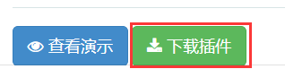

[TOC]


# 一、jQuery 介绍

> 学习目标：
>
> 能够说出什么是 jQuery 
> 能够说出 jQuery 的优点
> 能够简单使用 jQuery
> 能够说出 DOM 对象和 jQuery 对象的区别
> 能够写出常用的 jQuery 选择器 
> 能够操作 jQuery 样式
> 能够写出常用的 jQuery 动画 
> 能够操作  jQuery 属性 能够操作 
> jQuery 元素能够操作
> jQuery 元素尺寸、位置
> 能够说出4种常见的注册事件 
> 能够说出 on 绑定事件的优势
> 能够说出 jQuery 事件委派的优点以及方式
> 能够说出绑定事件与解绑事件
> 能够说出 jQuery 对象的拷贝方法
> 能够说出 jQuery 多库共存的2种方法
> 能够使用 jQuery 插件


## 1、JavaScript 库 

`JavaScript库`：即 library，是一个封装好的特定的集合（方法和函数）。从封装一大堆函数的角度理解库，就是在这个库中，封装了很多预先定义好的函数在里面，比如:  动画animate、hide、show，比如获取元素等。

> 简单理解： 就是一个JS 文件，里面对我们原生js代码进行了封装，存放到里面。这样我们可以快速高效的使用这些封装好的功能了。
>
> 比如 jQuery，就是为了快速方便的操作DOM，里面基本都是函数（方法）。


常见的JavaScript 库：jQuery、Prototype、YUI、Dojo、Ext JS、移动端的zepto等，这些库都是对原生 JavaScript 的封装，内部都是用 JavaScript 实现的，我们主要学习的是 jQuery。


##2、jQuery的概念 

**jQuery总体概况如下 :** 

- jQuery 是一个快速、简洁的 JavaScript 库，其设计的宗旨是“write Less，Do More”，即倡导写更少的代码，做更多的事情。

- j 就是 JavaScript；   Query 查询； 意思就是查询js，把js中的DOM操作做了封装，我们可以快速的查询使用里面的功能。

- jQuery 封装了 JavaScript 常用的功能代码，优化了 DOM 操作、事件处理、动画设计和 Ajax 交互。

- 学习jQuery本质： 就是学习调用这些函数（方法）。

- jQuery 出现的目的是加快前端人员的开发速度，我们可以非常方便的调用和使用它，从而提高开发效率。

  

## 3、jQuery的优点 


1. 轻量级。核心文件才几十kb，不会影响页面加载速度。
2. 跨浏览器兼容，基本兼容了现在主流的浏览器。
3. 链式编程、隐式迭代。
4. 对事件、样式、动画支持，大大简化了DOM操作。
5. 支持插件扩展开发。有着丰富的第三方的插件，例如：树形菜单、日期控件、轮播图等。
6. 免费、开源。


# 二、 jQuery 的基本使用


## 1、jQuery 的下载

jQuery的官网地址： https://jquery.com/，官网即可下载最新版本。

>  各个版本的下载：https://code.jquery.com/


版本介绍：

> 1x ：兼容 IE 678 等低版本浏览器， 官网不再更新
>
> 2x ：不兼容 IE 678 等低版本浏览器， 官网不再更新
>
> 3x ：不兼容 IE 678 等低版本浏览器， 是官方主要更新维护的版本


## 2、体验jQuery 

​	步骤：

- 引入jQuery文件。
- 在文档最末尾插入 script 标签，书写体验代码。
- $('div').hide() 可以隐藏盒子。


## 3、jQuery的入口函数

### 1、jQuery的入口函数（２种方式）

jQuery中常见的两种入口函数：


#### 1、方式1: `$(function(){})`

```
// 第一种: 简单易用。
$(function () {   
    ...  // 此处是页面 DOM 加载完成的入口
}) ; 
```


####　2、方式2:`$(document).ready()` 

```javascript
// 第二种: 繁琐，但是也可以实现
$(document).ready(function(){
   ...  //  此处是页面DOM加载完成的入口
});
```

​	

### 3、jQuery入口函数总结(原理)

1. 等着 DOM 结构渲染完毕即可执行内部代码，不必等到所有外部资源加载完成，jQuery 帮我们完成了封装。
2. 相当于原生 js 中的 `DOMContentLoaded`。 
3. 不同于原生 js 中的` load`  事件是等`页面文档、外部的 js 文件、css文件、图片` 加载完毕才执行内部代码。
4. 更推荐使用第一种方式`$(function(){})`。  


## 4、jQuery中的顶级对象`##  ##  


1.  `$`是` jQuery`  的别称，在代码中可以使用 `jQuery`  代替，但一般为了方便，通常都直接使用 `$`  。
2.  `$`是`jQuery` 的顶级对象，相当于原生JavaScript中的 window。把元素利用`$`包装成`jQuery对象`，就可以调用jQuery 的方法。


##5、jQuery 对象和 DOM 对象 

**使用 jQuery 方法和原生JS获取的元素是不一样的，总结如下 : ** 

1. 用原生 JS 获取来的对象就是 DOM 对象
2. jQuery 方法获取的元素就是 jQuery 对象。
3. jQuery 对象本质是： 利用$对DOM 对象包装后产生的对象（伪数组形式存储）。


> 注意：
>
> 只有 jQuery 对象才能使用 jQuery 方法，DOM 对象则使用原生的 JavaScirpt 方法。


## 6、jQuery 对象和 DOM 对象转换


DOM 对象与 jQuery 对象之间是可以相互转换的。因为原生js 比 jQuery 更大，原生的一些属性和方法 jQuery没有给我们封装. 要想使用这些属性和方法需要把jQuery对象转换为DOM对象才能使用。


- DOM对象转换成jQuery对象的方式就只有一种, 使用`$()` 包裹

  ```
  // 1.DOM对象转换成jQuery对象，方法只有一种
  var box = document.getElementById('box');  // 获取DOM对象
  var jQueryObject = $(box);  // 把DOM对象转换为 jQuery 对象
  ```

- jQuery对象转换为DOM对象的方式2种:

  - 方式1: 通过索引直接获取

    ```
    //jQuery对象[索引值]
    var domObject1 = $('div')[0]   // 获取jQuery对象中的第一个DOM对象
    ```

  - 方式2: 通过get(索引号)获取

    ```
    //jQuery对象.get(索引值)
    var domObject2 = $('div').get(0)
    ```

> 总结：
>
> 实际开发比较常用的是把DOM对象转换为jQuery对象，这样能够调用功能更加强大的jQuery中的方法。


## 7、jQuery 选择器

原生 JS 获取元素方式很多，很杂，而且兼容性情况不一致，因此 jQuery 给我们做了封装，使获取元素统一标准。


### 1、基础选择器

```js
$("选择器")   //  里面选择器直接写 CSS 选择器即可，但是要加引号 
```

​	

| 名称    | 用法                | 描述            |
| ----- | ----------------- | ------------- |
| ID选择器 | `$('#id')`        | 获取指定ID的元素     |
| 全选选择器 | `$('*')`          | 匹配所有元素        |
| 类选择器  | `$('.类名')`        | 获取同一类class的元素 |
| 标签选择器 | `$('标签名)`         | 获取同一类标签的所有元素  |
| 并集选择器 | `$('div, p,li)`   | 获取多个元素        |
| 交集选择器 | `$('li.current')` | 获取交集元素        |


 

### 2、层级选择器

层级选择器最常用的两个分别为：后代选择器和子代选择器。

| 名称    | 用法           | 描述                                       |
| ----- | ------------ | ---------------------------------------- |
| 子代选择器 | `$('ul>li)`  | 使用`>` 号, 获取亲儿子层级的元素<br />注意: 并不会获取孙子层级的元素 |
| 后代选择器 | `$('ul li')` | 使用空格, 代表后代选择器, 获取`ul` 下的所有`li` 元素, 包括孙子等 |


**基础选择器和层级选择器案例代码**

```javascript
<body>
    <div>我是div</div>
    <div class="nav">我是nav div</div>
    <p>我是p</p>
    <ul>
        <li>我是ul 的</li>
        <li>我是ul 的</li>        
        <li>我是ul 的</li>
    </ul>
    <script>
        $(function() {
            console.log($(".nav"));
            console.log($("ul li"));
        })
    </script>
</body>
```


### 3、筛选选择器 (伪类选择器)

**筛选选择器** ，顾名思义就是在所有的选项中选择满足条件的进行筛选选择。常见如下 :

| 语法           | 用法              | 描述                                       |
| ------------ | --------------- | ---------------------------------------- |
| `:first`     | `$('li:first')` | 获取第一个`li` 元素                             |
| `:last`      | `$('li:last')`  | 获取最后一个`li` 元素                            |
| `:eq(index)` | `$('li:eq(2)')` | 获取到的`li` 元素中, 选择索引号为`2` 的元素, 索引号`index` 从`0` 开始 |
| `:odd`       | `$('li:odd')`   | 获取到的`li` 元素中, 选择索引号为奇数的元素                |
| `:even`      | `$('li:even')`  | 获取到的`li` 元素中, 选择索引号为偶数的元素                |

 

**案例代码**

```js
<body>
    <ul>
        <li>多个里面筛选几个</li>
        <li>多个里面筛选几个</li>
        <li>多个里面筛选几个</li>
        <li>多个里面筛选几个</li>
        <li>多个里面筛选几个</li>
        <li>多个里面筛选几个</li>
    </ul>
    <ol>
        <li>多个里面筛选几个</li>
        <li>多个里面筛选几个</li>
        <li>多个里面筛选几个</li>
        <li>多个里面筛选几个</li>
        <li>多个里面筛选几个</li>
        <li>多个里面筛选几个</li>
    </ol>
    <script>
        $(function() {
            $("ul li:first").css("color", "red");
            $("ul li:eq(2)").css("color", "blue");
            $("ol li:odd").css("color", "skyblue");
            $("ol li:even").css("color", "pink");
        })
    </script>
</body>
```


**另:  jQuery中还有一些筛选方法， 类似DOM中的通过一个节点找另外一个节点，父、子、兄以外有所加强。**

| 语法                    | 用法                               | 说明                                       |
| --------------------- | -------------------------------- | ---------------------------------------- |
| `parent()`            | `$('li').parent()`               | 查找父级元素                                   |
| `children(selector)`  | `$('ul').children('li')`         | 相当于`$('ul>li')`, 最近一级(亲儿子)               |
| `find(selector)`      | `$('ul').find('li')`             | 相当于`$('ul li')`, 后代选择器                   |
| `siblings('selector)` | `$('.first').siblings('li')`     | 查找兄弟节点, 不包括自身                            |
| `nextAll([expr])`     | `$('.first').nextAll()`          | 查找当前元素之后所有的同辈元素                          |
| `hasClass(class)`     | `$('div').hasClass('protected')` | 检查当前的元素是否含有某个特定的类, 如果有, 则返回true          |
| `eq(index)`           | `$('li').eq(2)`                  | 相当于`$('li:eq(2)')` 找第二个 `li` , index 从`0` 开始. |

 

偏重于记忆，演示代码略。


### 4、知识铺垫

- **jQuery 设置样式** 

```javascript
$('div').css('属性', '值')    
```


- **jQuery 里面的排他思想** 
  - 当前元素设置样式，其余的兄弟元素清除样式

```javascript
// 想要多选一的效果，排他思想：当前元素设置样式，其余的兄弟元素清除样式。
$(this).css(“color”,”red”);
$(this).siblings(). css(“color”,””);
```


- **隐式迭代** 
  - 遍历内部 DOM 元素（伪数组形式存储）的过程就叫做隐式迭代

```javascript
// 遍历内部 DOM 元素（伪数组形式存储）的过程就叫做隐式迭代。
// 简单理解：给匹配到的所有元素进行循环遍历，执行相应的方法，而不用我们再进行循环，简化我们的操作，方便我们调用。
$('div').hide();  // 页面中所有的div全部隐藏，不用循环操作
```

> 页面中所有的div全部隐藏，不用循环操作


- **链式编程**

```javascript
// 链式编程是为了节省代码量，看起来更优雅。
$(this).css('color', 'red').sibling().css('color', ''); 
```

  


## 8、jQuery 样式操作

​	jQuery中常用的样式操作有两种：`css() `和 `设置类样式方法` 


### 1、方法1: 操作 css 方法

jQuery 可以使用 css 方法来修改简单元素样式； 也可以操作类，修改多个样式。

常用以下三种形式 : 

```
// 1.参数只写属性名，则是返回属性值
var strColor = $(this).css('color');

// 2.  参数是属性名，属性值，逗号分隔，是设置一组样式，属性必须加引号，值如果是数字可以不用跟单位和引号
$(this).css(''color'', ''red'');

// 3.  参数可以是对象形式，方便设置多组样式。属性名和属性值用冒号隔开， 属性可以不用加引号
$(this).css({ "color":"white","font-size":"20px"});
```


>  注意：
>
>  css() 多用于样式少时操作，多了则不太方便。
>
>  样式多了,我们一般直接修改类


### 2、方法2: 设置类样式方法

作用等同于以前H5中的的 `classList` ，可以操作类样式， 注意操作类里面的参数不要加点。

#### 1、添加类

```
// 1.添加类
$("div").addClass("current");
```


#### 2、删除类

```
// 2.删除类
$("div").removeClass("current");
```


####3、切换类

```
// 3.切换类
$("div").toggleClass("current");
```


####4、检查包含类

```
// 判断 div 元素是否有 cls1 类
console.log($('div').hasClass('cls1'));
```

> 注意：
>
> - 设置类样式方法比较适合样式多时操作，可以弥补css()的不足。
> - 原生 JS 中 className 会覆盖元素原先里面的类名，jQuery 里面类操作只是对指定类进行操作，不影响原先的类名。


## 9、jQuery 动画效果

jQuery 给我们封装了很多动画效果，最为常见的如下：

- **显示隐藏**：`show()`   ` hide()`   ` toggle()` ;  
- **划入画出**：`slideDown()`  `slideUp()`  `slideToggle()` ; 
- **淡入淡出**：`fadeIn()`   `fadeOut()`   `fadeToggle() ` ` fadeTo()`  ; 
- **自定义动画**：`animate()` ; 

> 注意：
>
> 动画或者效果一旦触发就会执行，如果多次触发，就造成多个动画或者效果排队执行。
>
> jQuery为我们提供另一个方法，可以停止动画排队：stop() ;


### 1、 显示隐藏

显示隐藏动画，常见有三个方法：`show()`   `hide() `  `toggle() ` ;

语法规范如下:

- 显示语法规范

  ```
  show([speed, [easing],[fn]])
  ```

- 显示参数

  - 参数都可以省略, 无动画直接显示
  - `speed` : 三种预定速度之一的字符串`slow` `normal` `fast` , 或表示动画时长的毫秒数值(eg: 1000)
  - `easing`: 用来指定切换效果, 默认是`swing` , 可用参数`linear` 
  - `fn` : 回调函数, 在动画完成时执行的函数, 每个元素执行一次


- 隐藏语法规范

  ```
  hide([speed, [easing], [fn]])
  ```

- 隐藏参数

  - 参数都可以省略, 无动画直接隐藏
  - `speed` : 三种预定速度之一的字符串`slow` `normal` `fast` , 或表示动画时长的毫秒数值(eg: 1000)
  - `easing`: 用来指定切换效果, 默认是`swing` , 可用参数`linear` 
  - `fn` : 回调函数, 在动画完成时执行的函数, 每个元素执行一次


- 切换语法规范

  ```
  toggle([speed, [easing], [fn]])
  ```

- 切换参数

  - 参数都可以省略, 无动画直接隐藏或显示
  - `speed` : 三种预定速度之一的字符串`slow` `normal` `fast` , 或表示动画时长的毫秒数值(eg: 1000)
  - `easing`: 用来指定切换效果, 默认是`swing` , 可用参数`linear` 
  - `fn` : 回调函数, 在动画完成时执行的函数, 每个元素执行一次


**代码演示**

```javascript
<body>
    <button>显示</button>
    <button>隐藏</button>
    <button>切换</button>
    <div></div>
    <script>
        $(function() {
            $("button").eq(0).click(function() {
                $("div").show(1000, function() {
                    alert(1);
                });
            })
            $("button").eq(1).click(function() {
                $("div").hide(1000, function() {
                    alert(1);
                });
            })
            $("button").eq(2).click(function() {
              $("div").toggle(1000);
            })
            // 一般情况下，我们都不加参数直接显示隐藏就可以了
        });
    </script>
</body>
```


### 2、滑入滑出

滑入滑出动画，常见有三个方法：`slideDown()`  ` slideUp() `  `slideToggle()`  ; 

语法规范如下:

- 下滑效果语法规范

  ```
  slideDown(speed, [easing], [fn]])
  ```

- 下滑效果参数

  - 参数都可以省略, 无动画直接隐藏或显示
  - `speed` : 三种预定速度之一的字符串`slow` `normal` `fast` , 或表示动画时长的毫秒数值(eg: 1000)
  - `easing`: 用来指定切换效果, 默认是`swing` , 可用参数`linear` 
  - `fn` : 回调函数, 在动画完成时执行的函数, 每个元素执行一次


- 上滑效果语法规范

  ```
  slideUp(speed, [easing], [fn]])
  ```

- 上滑效果参数

  - 参数都可以省略, 无动画直接隐藏或显示
  - `speed` : 三种预定速度之一的字符串`slow` `normal` `fast` , 或表示动画时长的毫秒数值(eg: 1000)
  - `easing`: 用来指定切换效果, 默认是`swing` , 可用参数`linear` 
  - `fn` : 回调函数, 在动画完成时执行的函数, 每个元素执行一次


- 滑动效果切换语法规范

  ```
  slideToggle(speed, [easing], [fn]])
  ```

- 滑动效果切换参数

  - 参数都可以省略, 无动画直接隐藏或显示
  - `speed` : 三种预定速度之一的字符串`slow` `normal` `fast` , 或表示动画时长的毫秒数值(eg: 1000)
  - `easing`: 用来指定切换效果, 默认是`swing` , 可用参数`linear` 
  - `fn` : 回调函数, 在动画完成时执行的函数, 每个元素执行一次

**代码演示**

```javascript
<body>
    <button>下拉滑动</button>
    <button>上拉滑动</button>
    <button>切换滑动</button>
    <div></div>
    <script>
        $(function() {
            $("button").eq(0).click(function() {
                // 下滑动 slideDown()
                $("div").slideDown();
            })
            $("button").eq(1).click(function() {
                // 上滑动 slideUp()
                $("div").slideUp(500);
            })
            $("button").eq(2).click(function() {
                // 滑动切换 slideToggle()
                $("div").slideToggle(500);
            });
        });
    </script>
</body>
```

> 小案例：下拉菜单略（详情参看源码）。


### 3、 淡入淡出

淡入淡出动画，常见有四个方法：`fadeIn()`  `fadeOut() `  `fadeToggle()`  ` fadeTo()`  ; 

- 淡入效果语法规范

  ```
  fadeIn(speed, [easing], [fn]])
  ```

- 淡入效果参数

  - 参数都可以省略, 无动画直接隐藏或显示
  - `speed` : 三种预定速度之一的字符串`slow` `normal` `fast` , 或表示动画时长的毫秒数值(eg: 1000)
  - `easing`: 用来指定切换效果, 默认是`swing` , 可用参数`linear` 
  - `fn` : 回调函数, 在动画完成时执行的函数, 每个元素执行一次


- 淡出效果语法规范

  ```
  fadeOut(speed, [easing], [fn]])
  ```

- 淡出效果参数

  - 参数都可以省略, 无动画直接隐藏或显示
  - `speed` : 三种预定速度之一的字符串`slow` `normal` `fast` , 或表示动画时长的毫秒数值(eg: 1000)
  - `easing`: 用来指定切换效果, 默认是`swing` , 可用参数`linear` 
  - `fn` : 回调函数, 在动画完成时执行的函数, 每个元素执行一次


- 淡入效果切换语法规范

  ```
  fadeToggle(speed, [easing], [fn]])
  ```

- 淡入效果切换语法规范

  - 参数都可以省略, 无动画直接隐藏或显示
  - `speed` : 三种预定速度之一的字符串`slow` `normal` `fast` , 或表示动画时长的毫秒数值(eg: 1000)
  - `easing`: 用来指定切换效果, 默认是`swing` , 可用参数`linear` 
  - `fn` : 回调函数, 在动画完成时执行的函数, 每个元素执行一次

```
<body>
    <button>淡入效果</button>
    <button>淡出效果</button>
    <button>淡入淡出切换</button> 
    <div></div>
    <script>
        $(function() {
            $("button").eq(0).click(function() {
                // 淡入 fadeIn()
                $("div").fadeIn(1000);
            })
            $("button").eq(1).click(function() {
                // 淡出 fadeOut()
                $("div").fadeOut(1000);
            })
            $("button").eq(2).click(function() {
                // 淡入淡出切换 fadeToggle()
                $("div").fadeToggle(1000);
            }); 
        });
    </script>
</body>
```


 

### 4、渐进方式调整指定的不透明度

- 语法规范

  ```
  fadeTo([[speed], opacity,[easing],[fn]])
  ```

- 效果参数

  - `opacity`:  透明度必须写, 取值 0~1 之间
  - `speed`: 三种预定速度之一的字符串`slow` `normal` `fast` , 或表示动画时长的毫秒数值(eg: 1000), 必须写
  - `easing`: 用来指定切换效果, 默认是`swing` , 可用参数`linear` 
  - `fn` : 回调函数, 在动画完成时执行的函数, 每个元素执行一次


**代码演示**

```javascript
<body> 
    <button>修改透明度</button>
    <div></div>
    <script>
        $(function() { 
            $("button").eq(0).click(function() {
                //  修改透明度 fadeTo() 这个速度和透明度要必须写
                $("div").fadeTo(1000, 0.5);
            });
        });
    </script>
</body>
```


### 5、自定义动画

自定义动画非常强大，通过参数的传递可以模拟以上所有动画，方法为：animate() ;

- 语法规范如下:

  ```
  animate(params, [speed], [easing],[fn])
  ```

- 参数

  - `params` :想要更改的样式属性，　以对象形式传递，必须写．　属性名可以不带引号
    - 如果是复合属性则需要采用驼峰命名方法，eg: `borderLeft`. 其它参数可以省略
  - `speed`: 三种预定速度之一的字符串`slow` `normal` `fast` , 或表示动画时长的毫秒数值(eg: 1000) 
  - `easing`: 用来指定切换效果, 默认是`swing` , 可用参数`linear` 
  - `fn` : 回调函数, 在动画完成时执行的函数, 每个元素执行一次


**代码演示**

```javascript
<body>
    <button>动起来</button>
    <div></div>
    <script>
        $(function() {
            $("button").click(function() {
                $("div").animate({
                    left: 500,
                    top: 300,
                    opacity: .4,
                    width: 500
                }, 500);
            })
        })
    </script>
</body>
```


### 6、 停止动画排队

动画或者效果一旦触发就会执行，如果多次触发，就造成多个动画或者效果排队执行。

​停止动画排队的方法为：stop() ; 

- stop() 方法用于停止动画或效果。
- stop() 写到动画或者效果的前面， 相当于停止结束上一次的动画。


> 总结:
>
>  每次使用动画之前，先调用 stop() ,在调用动画。


### 7、事件切换

jQuery中为我们添加了一个新事件` hover()  `; 功能类似 css 中的`伪类 :hover`  。

介绍如下

- **语法**  

  ```
  hover([over,]out)     // 其中over和out为两个函数
  ```

  - over:鼠标移到元素上要触发的函数（相当于mouseenter）
  - out:鼠标移出元素要触发的函数（相当于mouseleave）
  - **如果只写一个函数，则鼠标经过和离开都会触发它** 

  ​

**hover事件和停止动画排列案例**

```javascript
<body>
    <ul class="nav">
        <li>
            <a href="#">微博</a>
            <ul><li><a href="">私信</a></li><li><a href="">评论</a></li><li><a href="">@我</a></li></ul>
        </li>
        <li>
            <a href="#">微博</a>
            <ul><li><a href="">私信</a></li><li><a href="">评论</a></li><li><a href="">@我</a></li></ul>
        </li>
    </ul>
    <script>
        $(function() {
            // 鼠标经过
            // $(".nav>li").mouseover(function() {
            //     // $(this) jQuery 当前元素  this不要加引号
            //     // show() 显示元素  hide() 隐藏元素
            //     $(this).children("ul").slideDown(200);
            // });
            // // 鼠标离开
            // $(".nav>li").mouseout(function() {
            //     $(this).children("ul").slideUp(200);
            // });
            // 1. 事件切换 hover 就是鼠标经过和离开的复合写法
            // $(".nav>li").hover(function() {
            //     $(this).children("ul").slideDown(200);
            // }, function() {
            //     $(this).children("ul").slideUp(200);
            // });
            // 2. 事件切换 hover  如果只写一个函数，那么鼠标经过和鼠标离开都会触发这个函数
            $(".nav>li").hover(function() {
                // stop 方法必须写到动画的前面
                $(this).children("ul").stop().slideToggle();
            });
        })
    </script>
</body>
```


# 三、 jQuery 属性操作

jQuery 常用属性操作有三种：`prop()`  ` attr()`  `data()`  


##1、元素固有属性值 prop()

**所谓元素固有属性就是元素本身自带的属性，比如 <a> 元素里面的 href ，比如 <input> 元素里面的 type。 **  

原生的`js` 获取固有属性, 可以使用`点语法`  `[]` 语法 也能使用`attribute` 方法, 但是自定义的属性只能使用`attribute` 方法

### 1、获取属性值

```
$('input`).eq(0).prop('type')
```


### 2、设置属性值

```
$('input').eq(0).prop('type', 'text');
```

> 注意:
>
> `prop() ` 除了普通属性操作, 更适合操作表单属性`disabled` `checked` `selected` 等


## 2、元素自定义属性值 attr()

**用户自己给元素添加的属性，我们称为自定义属性。 比如给 div 添加 index =“1”。 ** 

- 获取自定义属性语法:

  ```
  // 类似原生的  document.querySelector('div').getAttribute('index')
  $('div').eq(1).attr('index')
  ```

- 设置自定义属性语法:

  ```
  // 类似原生的 document.querySelector('div').setAttribute('index', 100)
  $('div').eq(1).attr('index',100)   // 与设置相比, 多一个参数
  ```

> 注意：
>
> attr() 除了普通属性操作，更适合操作自定义属性。（该方法也可以获取 H5 自定义属性）


## 3、数据缓存 data()

**data() 方法可以在指定的元素上存取数据，并不会修改 DOM 元素结构。一旦页面刷新，之前存放的数据都将被移除。 ** 

- **附加数据语法: **

  ```
  data('name', 'value') // 向被选元素附加数据
  ```

- **获取数据语法:**

  ```
  data('name') // 向被选元素获取数据
  ```


> 注意：
>
> 同时，还可以读取 HTML5 自定义属性  data-index ，得到的是数字型。

**演示代码**

```javascript
<body>
    <a href="http://www.itcast.cn" title="都挺好">都挺好</a>
    <input type="checkbox" name="" id="" checked>
    <div index="1" data-index="2">我是div</div>
    <span>123</span>
    <script>
        $(function() {
            //1. element.prop("属性名") 获取元素固有的属性值
            console.log($("a").prop("href"));
            $("a").prop("title", "我们都挺好");
            $("input").change(function() {
                console.log($(this).prop("checked"));
            });
            // console.log($("div").prop("index"));
            // 2. 元素的自定义属性 我们通过 attr()
            console.log($("div").attr("index"));
            $("div").attr("index", 4);
            console.log($("div").attr("data-index"));
            // 3. 数据缓存 data() 这个里面的数据是存放在元素的内存里面
            $("span").data("uname", "andy");
            console.log($("span").data("uname"));
            // 这个方法获取data-index h5自定义属性 第一个 不用写data-  而且返回的是数字型
            console.log($("div").data("index"));
        })
    </script>
</body>
```


## 4、案例：购物车案例模块-全选

> 1.全选思路：里面3个小的复选框按钮（j-checkbox）选中状态（checked）跟着全选按钮（checkall）走。
> 2.因为checked 是复选框的固有属性，此时我们需要利用prop()方法获取和设置该属性。
> 3.把全选按钮状态赋值给3小复选框就可以了。
> 4.当我们每次点击小的复选框按钮，就来判断：
> 5.如果小复选框被选中的个数等于3 就应该把全选按钮选上，否则全选按钮不选。
> 6.:checked 选择器      :checked 查找被选中的表单元素。

​	代码实现略。(详情参考源代码)


## 5、 jQuery 文本属性值

`jQuery` 的文本属性值常见操作有三种：`html()`  `text()`   `val()`  ; 

分别对应`JS` 中的` innerHTML`  、`innerText` 和 ` value`  属性。


### 1、 jQuery内容文本值

常见操作有三种：`html()` `text()`    `val() ` ; 分别对应`JS` 中的` innerHTML`  、`innerText`  和 `value 属性` ，主要针对元素的内容还有表单的值操作。

- **语法**

  - 普通元素内容`html()` , 相当于原生的`innerHTML

    ```
    // 获取元素内容
    $('div').eq(1).html()

    // 设置元素内容
    $('div').eq(1).html('html内容')
    ```

  - 普通元素文本内容

    ```
    // 获取元素文本内容
    $('div').eq(0).text()

    // 设置元素文本内容
    $('div').eq(2).text('恭喜发财')
    ```

  - 表单的值val() , 相当于原生的value

    ```
    // 获取表单的值
    $('input').eq(1).val()

    // 设置表单的值
    $('input').eq(0).val('请输入密码')
    ```

> 注意：
>
> `html()`  可识别标签， 即设置的文本内容会先检查有没有标签, 有标签就当成标签处理
>
> `text()` 不识别标签, 全部文本内容当成纯文本操作


**演示代码**

```javascript
<body>
    <div>
        <span>我是内容</span>
    </div>
    <input type="text" value="请输入内容">
    <script>
        // 1. 获取设置元素内容 html()
        console.log($("div").html());
        // $("div").html("123");
        // 2. 获取设置元素文本内容 text()
        console.log($("div").text());
        $("div").text("123");
        // 3. 获取设置表单值 val()
        console.log($("input").val());
        $("input").val("123");
    </script>
</body>
```


### 2、 案例：购物车案例模块-增减商品数量

> 1.核心思路：首先声明一个变量，当我们点击+号（increment），就让这个值++，然后赋值给文本框。
> 2.注意1： 只能增加本商品的数量， 就是当前+号的兄弟文本框（itxt）的值。 
> 3.修改表单的值是val() 方法
> 4.注意2： 这个变量初始值应该是这个文本框的值，在这个值的基础上++。要获取表单的值
> 5.减号（decrement）思路同理，但是如果文本框的值是1，就不能再减了。

​	代码实现略。(详情参考源代码)


### 3、 案例：购物车案例模块-修改商品小计

> 1.核心思路：每次点击+号或者-号，根据文本框的值 乘以 当前商品的价格  就是 商品的小计
> 2.注意1： 只能增加本商品的小计， 就是当前商品的小计模块（p-sum）  
> 3.修改普通元素的内容是text() 方法
> 4.注意2： 当前商品的价格，要把￥符号去掉再相乘 截取字符串 substr(1)
> 5.parents(‘选择器’) 可以返回指定祖先元素  
> 6.最后计算的结果如果想要保留2位小数 通过 toFixed(2)  方法
> 7.用户也可以直接修改表单里面的值，同样要计算小计。 用表单change事件
> 8.用最新的表单内的值 乘以 单价即可  但是还是当前商品小计

​	代码实现略。(详情参考源代码)


## 6、 jQuery 元素操作

jQuery 元素操作主要讲的是用jQuery方法，操作标签的`遍历`、`创建`、`添加`、`删除` 等操作。


### 1、遍历元素(方式1)

**jQuery 隐式迭代是对同一类元素做了同样的操作 。 如果想要给同一类元素做不同操作，就需要用到遍历。**

> 这是与原生的JS的一个很大的区别

- 语法: 

  ```
  $('div').each(function(index,domEle){
    console.log(index)
    console.log(domEle)
  })
  ```

  - `each()` 方法遍历匹配每一个元素, 遍历获取到的是`DOM` 元素

  - `each()` , 内的参数是一个回调函数, 回调函数有2个参数, 参数1 表示的是索引, 参数2是遍历到的DOM元素(不是jquery对象)

  - 所以在遍历的方法里面想要继续使用`jquery` 的方法, 需要使用`$()` 包裹转换DOM对象

    > 注意：
    >
    > 此方法用于遍历 jQuery 对象中的每一项，回调函数中元素为 DOM 对象，想要使用 jQuery 方法需要转换。

    ​

### 2、遍历元素(方式2)

- 语法:

  ```
  $.each(obj, function(index, domEle){
    console.log(index)
    console.log(domEle)
  })
  ```

  - `$.each(obj,function(index,domEle){ })` , 方法可用于遍历任何对象, 可以是`jQuery对象` `原生JS对象(数组, json)` 
  - 回调函数里面有2个参数
    - 如果遍历的是数组, 第一个参数返回的是索引, 如果是对象, 返回的是keyname
    - 第二个参数是DOM元素或者对象的value, 反正不会是`jquery` 对象

>  注意：此方法用于遍历 jQuery 对象中的每一项，回调函数中元素为 DOM 对象，想要使用 jQuery 方法需要转换。

**演示代码**

```javascript
<body>
    <div>1</div>
    <div>2</div>
    <div>3</div>
    <script>
        $(function() {
            // 如果针对于同一类元素做不同操作，需要用到遍历元素（类似for，但是比for强大）
            var sum = 0;
            var arr = ["red", "green", "blue"];
            // 1. each() 方法遍历元素 
            $("div").each(function(i, domEle) {
                // 回调函数第一个参数一定是索引号  可以自己指定索引号号名称
                // console.log(i);
                // 回调函数第二个参数一定是 dom 元素对象，也是自己命名
                // console.log(domEle);  // 使用jQuery方法需要转换 $(domEle)
                $(domEle).css("color", arr[i]);
                sum += parseInt($(domEle).text());
            })
            console.log(sum);
            // 2. $.each() 方法遍历元素 主要用于遍历数据，处理数据
            // $.each($("div"), function(i, ele) {
            //     console.log(i);
            //     console.log(ele);
            // });
            // $.each(arr, function(i, ele) {
            //     console.log(i);
            //     console.log(ele);
            // })
            $.each({
                name: "andy",
                age: 18
            }, function(i, ele) {
                console.log(i); // 输出的是 name age 属性名
                console.log(ele); // 输出的是 andy  18 属性值
            })
        })
    </script>
</body>
```


### 3、创建、添加、删除

`jQuery` 方法操作元素的`创建`、`添加`、`删除` 方法很多，则重点使用部分，如下：

**语法总和**

#### 1、创建元素 (jQuery元素)

- 动态创建一个`li` 元素

  ```
  // 动态创建一个 li 元素, 返回值是一个jQuery对象
  $('<li></li>`)
  ```


#### 2、添加元素 (内部前面和内部后面) `父子关系` 

- 把内容放入匹配元素内部的后面, 类似原生的`appendChild`

  - 参数可以是一个`DOM元素` , `一个字符串` , `一个jquery对象` 
  - 如果参数是一个字符串, 且这个字符串内容中包含有`html` 标签, 那么HTML标签会被识别成HTML元素

  ```
  // 这三个操作等价
  $('ul').append($('<li>我是小里</li>'))
  $('ul').append('<li>我是小里</li>')
  $('ul').append($('<li>我是小里</li>')[0])

  $('p').append('最后一段内容')
  ```

- 把内容放入匹配元素内部的前面 , 相当于在前面插入

  ```
  // 这三个操作等价
  $('ul').prepend($('<li>我是小里</li>'))
  $('ul').prepend('<li>我是小里</li>')
  $('ul').prepend($('<li>我是小里</li>')[0])

  $('p').prepend('第一段内容')
  ```

  ​

#### 3、添加元素(外部前面和外部后面)`兄弟关系` 

- 把元素放在目标元素的后面

  - 参数可以是一个`DOM元素` , `一个字符串` , `一个jquery对象` 
  - 如果参数是一个字符串, 且这个字符串内容中包含有`html` 标签, 那么HTML标签会被识别成HTML元素

  ```
  // 这三个操作等价
  $('ul').after($('<li>我是小里</li>'))
  $('ul').after('<li>我是小里</li>')
  $('ul').after($('<li>我是小里</li>')[0])

  $('p').after('最后一段之后内容')
  ```

- 把元素放在目标元素的前面

  - 参数可以是一个`DOM元素` , `一个字符串` , `一个jquery对象` 

  - 如果参数是一个字符串, 且这个字符串内容中包含有`html` 标签, 那么HTML标签会被识别成HTML元素

    ```
    // 这三个操作等价
    $('ul').before($('<li>我是小里</li>'))
    $('ul').before('<li>我是小里</li>')
    $('ul').before($('<li>我是小里</li>')[0])

    $('p').before('第一段之前内容')
    ```


#### 4、删除元素 

- 删除匹配的元素本身

  ```
  element.remove()
  ```

- 删除匹配的元素集合中所有的子节点

  ```
  element.empty()
  ```

- 清空匹配的元素内容

  ```
  element.html('')
  ```

  > - remove() 删除的是元素本身
  > - empty() 和 html('') 作用等价, 都可以删除元素里面的内容, 事不过html() 还可以设置内容

**注意：** 

以上只是元素的创建、添加、删除方法的常用方法，其他方法请参详API。

**案例代码**

```js
<body>
    <ul>
        <li>原先的li</li>
    </ul>
    <div class="test">我是原先的div</div>
    <script>
        $(function() {
            // 1. 创建元素
            var li = $("<li>我是后来创建的li</li>");
      
            // 2. 添加元素
            // 	2.1 内部添加
            // $("ul").append(li);  内部添加并且放到内容的最后面 
            $("ul").prepend(li); // 内部添加并且放到内容的最前面
            //  2.2 外部添加
            var div = $("<div>我是后妈生的</div>");
            // $(".test").after(div);
            $(".test").before(div);
      
            // 3. 删除元素
            // $("ul").remove(); 可以删除匹配的元素 自杀
            // $("ul").empty(); // 可以删除匹配的元素里面的子节点 孩子
            $("ul").html(""); // 可以删除匹配的元素里面的子节点 孩子
        })
    </script>
</body>
```

 

## 7、jQuery 宽高、位置操作

**jQuery中分别为我们提供了两套快速获取和设置元素尺寸和位置的API，方便易用，内容如下。** 


### 1、jQuery 宽高操作(很方便)

jQuery 尺寸操作包括`元素宽高的获取和设置` ，且不一样的API对应不一样的盒子模型。

**语法**

| 语法                                     | 用法                                       |
| -------------------------------------- | ---------------------------------------- |
| `width()`  `height()`                  | 获取匹配元素的宽度和高度值, 只算`width` `height`        |
| `innerWidth()` `innerHeight()`         | 获取匹配元素的宽度和高度值, 包含`padding`               |
| `outerWidth()` `outerHeight()`         | 获取匹配元素的宽度和高度值, 包含`padding` `border`      |
| `outerWidth(true)` `outerHeight(true)` | 获取匹配元素的宽度和高度值, 包含`padding` `border` `margin` |

- 以上参数为空, 则是获取相应的值,返回值为数字
- 如果参数为数字, 则修改相应的值
- 参数可以不必写单位


**代码演示**

```javascript
<body>
    <div></div>
    <script>
        $(function() {
            // 1. width() / height() 获取设置元素 width和height大小 
            console.log($("div").width());
            // $("div").width(300);

            // 2. innerWidth() / innerHeight()  获取设置元素 width和height + padding 大小 
            console.log($("div").innerWidth());

            // 3. outerWidth()  / outerHeight()  获取设置元素 width和height + padding + border 大小 
            console.log($("div").outerWidth());

            // 4. outerWidth(true) / outerHeight(true) 获取设置 width和height + padding + border + margin
            console.log($("div").outerWidth(true));
        })
    </script>
</body>
```

​	

> 注意：
>
> 有了这套 API 我们将可以快速获取和设置盒子的宽高，至于其他属性想要获取和设置，还要使用 css() 等方法配合。


### 2、jQuery 位置操作

jQuery的位置操作主要有三个：` offset()`、`position()`、`scrollTop()`  `scrollLeft()`  , 具体介绍如下: 


#### 1、offset() 设置或者获取元素的偏移

- `offset()` 方法设置或者返回被选元素相对于**文档** 的偏移坐标, 跟父元素没有关系
- 该方法有2个属性`left`  `top` 
  - `offset().top` 用于获取文档顶部的距离
  - `offset().left` 用于获取距离文档左侧的距离
  - 可以设置元素的偏移: `offset({left: 10, top:20})` 

#### 2、position() 获取元素偏移

- `position()` 方法用于返回被选元素相对于**带定位的父级元素** 的偏移坐标, 如果父级没有定位, 则以文档为准
- 该方法2个属性`left` `top` 
  - `position().left`  用于获取距离定位父元素左边的距离
  - `position().top` 用于获取距离定位父元素顶部的距离

    > **该方法只能获取值, 不能设置** , 即: 只读方法和属性 


#### 3、scrollTop() / scrollleft() 设置或者获取元素被卷去的头部和左侧

- `scrollTop()` 设置或者返回元素被卷去的头部
- 不跟参数是获取
- 带参数(不带单位)是设置 

**代码演示**

```javascript
<body>
    <div class="father">
        <div class="son"></div>
    </div>
        
    <div class="back">返回顶部</div>
    <div class="container"></div>
   
    <script>
        $(function() {
            // 1. 获取设置距离文档的位置（偏移） offset
            console.log($(".son").offset());
            console.log($(".son").offset().top);
            // $(".son").offset({
            //     top: 200,
            //     left: 200
            // });
      
            // 2. 获取距离带有定位父级位置（偏移） position   如果没有带有定位的父级，则以文档为准
            // 这个方法只能获取不能设置偏移
            console.log($(".son").position());
            // $(".son").position({
            //     top: 200,
            //     left: 200
            // });
      
      		// 3. 被卷去的头部
      		$(document).scrollTop(100);
            // 被卷去的头部 scrollTop()  / 被卷去的左侧 scrollLeft()
            // 页面滚动事件
            var boxTop = $(".container").offset().top;
            $(window).scroll(function() {
                // console.log(11);
                console.log($(document).scrollTop());
                if ($(document).scrollTop() >= boxTop) {
                    $(".back").fadeIn();
                } else {
                    $(".back").fadeOut();
                }
            });
            // 返回顶部
            $(".back").click(function() {
                // $(document).scrollTop(0);
                $("body, html").stop().animate({
                    scrollTop: 0
                });
                // $(document).stop().animate({
                //     scrollTop: 0
                // }); 不能是文档而是 html和body元素做动画
            })
        })
    </script>
</body>
```


#### 4、案例：带有动画的返回顶部

> 1.核心原理： 使用animate动画返回顶部。
> 2.animate动画函数里面有个scrollTop 属性，可以设置位置
> 3.但是是元素做动画，因此 $(“body,html”).animate({scrollTop: 0})

​	代码实现略。(详情参考源代码)

 


# 四、jQuery 事件


## 1、jQuery 事件注册(1) 

**jQuery 为我们提供了方便的事件注册机制，优缺点如下：** 

- **优点: ** 
  - 操作简单，且不用担心事件覆盖等问题。

- **缺点: ** (*)
  - 普通的事件注册不能做事件委托，且无法实现事件解绑，需要借助其他方法。

- **语法:**

  ```
  ele.事件(function(){})

  // eg:
  $('div').click(function(){
    console.log('你 点我试试')
  })
  ```

  > 其它, 事件和原生基本一致
  >
  > eg: `mouseover` `mouseout` `blur` `focus` `change` `keydown` `keyup` `keypress` `resize` `scroll` 等

  **演示代码**

  ```
  <body>
      <div></div>
      <script>
          $(function() {
              // 1. 单个事件注册
              $("div").click(function() {
                  $(this).css("background", "purple");
              });
              $("div").mouseenter(function() {
                  $(this).css("background", "skyblue");
              });
          })
      </script>
  </body>
  ```

  ​

## 2、jQuery 事件注册(2)

因为普通注册事件方法的不足，jQuery又开发了多个处理方法，重点讲解如下：

- `on()`: 用于事件绑定，目前最好用的事件绑定方法
- `off()`: 事件解绑
- `trigger()`   ` triggerHandler()` : 事件触发


### 1、on() 绑定事件

因为普通注册事件方法的不足，jQuery又创建了多个新的事件绑定方法`bind()`   `live()`   `delegate()`   `on()`等，其中最好用的是: `on()` 

- **on()语法**

  - 可以同时绑定多个事件 **(优势1)**

    ```
    $('div').on({
      mouseover: function(){
        // mouseover 事件回调函数
      },
      mouseout:function(){
        // mouseout 事件回调函数
      },
      click:function(){
        // 点击事件回调函数
      }
    })
    ```

    ​

  - 如果事件处理,程序相同 **(优势2)**

    ```
    $('div').on('mouseover mouseout', function(){
      // mouseover 事件 和 mouseout 的事件处理回调函数可以是同一个
    })
    ```

  ​

  - 可以事件委派操作**(优势3)**  有坑

    > 事件委派定义是, 把原来加在子元素身上的事件绑定在父元素身上, 就把事件委派给父元素了.
    >
    > 子元素的事件都会冒泡到父元素上, 触发父元素的事件回调函数

     ```
    // 只有鼠标在 ul 标签 内的 li 标签上点击了才会触发这个点击事件
    // 只要点击的不在 li 的范围内就不会 触发事件
    $('ul').on('click', 'li', function(e){
      console.log(e)
    })

    // 下面这个事件和上面的事件是有差别的, 下面这个只要是点击在ul 内点击都可以触发
    $('ul').on('click', function(e){
      console.log(e)
    })
     ```


    ​```
    <body>
        <div></div>
        <ul>
            <li>我们都是好孩子</li>
            <li>我们都是好孩子</li>
            <li>我们都是好孩子</li>
        </ul>
        <ol></ol>
    
        <script>
            $(function() {
                // (1) on可以绑定1个或者多个事件处理程序
                // $("div").on({
                //     mouseenter: function() {
                //         $(this).css("background", "skyblue");
                //     },
                //     click: function() {
                //         $(this).css("background", "purple");
                //     }
                // });
                $("div").on("mouseenter mouseleave", function() {
                    $(this).toggleClass("current");
                });
      
                // (2) on可以实现事件委托（委派）
                // click 是绑定在ul 身上的，但是 触发的对象是 ul 里面的小li
                // $("ul li").click();
                $("ul").on("click", "li", function() {
                    alert(11);
                });
    
                // (3) on可以给未来动态创建的元素绑定事件
                $("ol").on("click", "li", function() {
                    alert(11);
                })
                var li = $("<li>我是后来创建的</li>");
                $("ol").append(li);
            })
        </script>
    </body>
    ​```
    
    ​


### 2、off() 解绑事件

**当某个事件上面的逻辑，在特定需求下不需要的时候，可以把该事件上的逻辑移除，这个过程我们称为事件解**

绑。jQuery 为我们提供 了多种事件解绑方法：`die()`   `undelegate() `  `off()`  等，甚至还有只触发一次的事件绑定方法 `one()`，在这里我们重点讲解一下 `off()` ;

- **语法**

  - `off()` 方法可以移除通过`on()` 方法添加的事件处理程序

    ```
    // 解除, 移除 p元素上所有的事件处理程序
    $('p').off()

    // 解除, 移除 p元素上的所有click点击事件
    $('p'),off('click')

    // 解除, 移除 p元素上的指定 点击事件, fn 是添加事件时的回调函数名
    $('p').off('click', fn)

    // 解除, 移除事件委托
    $('p').off('click','li')
    ```

  ​

### 3、one() 一次性事件

如果事件只想处理一次, 可以使用`one()` 来绑定

```
$('div').one('click', function(){
  console.log('这个点击事件只执行一次')
})
```

 

**演示代码**

```javascript
<body>
    <div></div>
    <ul>
        <li>我们都是好孩子</li>
        <li>我们都是好孩子</li>
        <li>我们都是好孩子</li>
    </ul>
    <p>我是一个P标签</p>
	<script>
        $(function() {
  			// 事件绑定
            $("div").on({
                click: function() {
                    console.log("我点击了");
                },
                mouseover: function() {
                    console.log('我鼠标经过了');
                }
            });
            $("ul").on("click", "li", function() {
                alert(11);
            });
  
            // 1. 事件解绑 off 
            // $("div").off();  // 这个是解除了div身上的所有事件
            $("div").off("click"); // 这个是解除了div身上的点击事件
            $("ul").off("click", "li");
  
            // 2. one() 但是它只能触发事件一次
            $("p").one("click", function() {
                alert(11);
            })
        })
    </script>
</body>
```


### 4、trigger() 自动触发事件

####１、什么是自动触发事件?

说白了, 可以这样理解:

我们给`button` 元素添加了一个点击事件, 用户点击这个元素时会触发对应的回调函数, 在这个回调函数中我们可以获取到点击事件的对象`event` , 但是如果用户不点击这个元素, 而是由我们直接调用这个事件的回调函数时, 我们在这个事件回调函数中是拿不到事件对象`event` 的, 也不会触发系统的默认行为. 此时我们就有一个需求, 页面上有个按钮我们希望页面打开5秒内用户去点击一下, 如果用户在 超过5秒没有点击这个按钮, 我们就通过代码出触发这个按钮的点击事件, 这使就会使用到 **自动触发事件**

> 注意: 
>
> 虽然从表面上看, 我们拿到事件回调函数直接调用, 和通过自动触发事件触发回调函数都是回调函数被执行了一次, 但是他们是有本质的区别的, 是不一样的, 这一点需要注意
>
> 一句话, **自动触发事件** 就相当于是用代码触发代替用户鼠标操作产生事件
>
> 

**jQuery 为我们提供了两个自动触发事件 `trigger()` 和` triggerHandler()` ** 


#### 2、自动触发事件的使用

- 方式1:` ele.事件名()`  

  - eg: `ele.click()` , 就相当于用户点击元素触发点击事件.

  ```
  <body>

  <p> 点击我click</p>
  <p> 鼠标移动 mouseover</p>
  <button>点击 触发配 p元素的click 自动事件</button>
  <button>点击 触发配 mouseover 自动事件</button>

  <script>

    $('p').eq(0).on('click',fn1)
    $('p').eq(1).on('mouseover',fn2)

    $('button').eq(0).on('click',function () {
      $('p').eq(0).click()
    })

    $('button').eq(1).on('click',function () {
      $('p').eq(1).mouseover()
    })

    function fn1(e) {
      console.log('fn1-click',e);
    }

    function fn2(e) {
      console.log('fn2-mouseover',e);
    }

  </script>
  </body>
  ```

- 方式2: `ele.trigger(事件名)`

  - 自动触发元素绑定的指定事件, 相当于对应的事件被用户触发了

    ```
    <body>

    <p> 点击我click</p>
    <p> 鼠标移动 mouseover</p>
    <button>点击 触发配 p元素的click 自动事件</button>
    <button>点击 触发配 mouseover 自动事件</button>

    <script>

      $('p').eq(0).on('click',fn1)
      $('p').eq(1).on('mouseover',fn2)

      $('button').eq(0).on('click',function () {
        $('p').eq(0).trigger('click')
      })

      $('button').eq(1).on('click',function () {
        $('p').eq(1).trigger('mouseover')
      })
    ```


      function fn1(e) {
        console.log('fn1-click',e);
      }
    
      function fn2(e) {
        console.log('fn2-mouseover',e);
      }
    
    </script>
    </body>
    ​```


- 方式3: `ele.triggerHandle(事件名)`

  - 自动触发元素绑定的指定事件, 相当于对应的事件被用户触发了
  - 与`trigger()` 的区别是不会触发元素的默认行为, 比如`input` 标签的聚焦, 其它方面一样

**演示代码**

```javascript
<body>
    <div></div>
    <input type="text">
      
    <script>
    $(function() {
      // 绑定事件
      $("div").on("click", function() {
        alert(11);
      });

      // 自动触发事件
      // 1. 元素.事件()
      // $("div").click();会触发元素的默认行为
      
      // 2. 元素.trigger("事件")
      // $("div").trigger("click");会触发元素的默认行为
      $("input").trigger("focus");
      
      // 3. 元素.triggerHandler("事件") 就是不会触发元素的默认行为
      $("input").on("focus", function() {
        $(this).val("你好吗");
      });
      // 一个会获取焦点，一个不会
      $("div").triggerHandler("click");
      // $("input").triggerHandler("focus");
    });
    </script>
</body>
```


## 3、jQuery 事件对象

jQuery 对DOM中的事件对象 event 进行了封装，兼容性更好，获取更方便，使用变化不大。事件被触发，就会有事件对象的产生。

**演示代码**

```javascript
<body>
    <div></div>

	<script>
        $(function() {
            $(document).on("click", function() {
                console.log("点击了document");
            })
            $("div").on("click", function(event) {
                // console.log(event);
                console.log("点击了div");
                event.stopPropagation();
            })
        })
    </script>
</body>
```

> 注意：
>
> jQuery中的 event 对象使用，可以借鉴 API 和 DOM 中的 event 。


# 五、jQuery 拷贝对象

jQuery中分别为我们提供了两套快速获取和设置元素尺寸和位置的API，方便易用，内容如下。

- **语法**

  ```
  $.extend([deep],target,obj1,[objN])
  ```

  - `deep` : 如果设置为`true` 为深拷贝, 默认为`false` 浅拷贝
  - `target`: 要拷贝的目标对象
  - `obj1`: 待拷贝的第一个对象
  - `objN`: 待拷贝的第N个对象
  - 浅拷贝时, 修改目标对象和拷贝对应中的引用对象时会相互影响 (浅拷贝相当于是地址复制)
  - 深拷贝时, 拷贝对象和目标对象是相互独立的,互不影响.


**演示代码**

```javascript
 <script>
        $(function() {
   			// 1.合并数据
            var targetObj = {};
            var obj = {
                id: 1,
                name: "andy"
            };
            // $.extend(target, obj);
            $.extend(targetObj, obj);
            console.log(targetObj);
   
   			// 2. 会覆盖 targetObj 里面原来的数据
            var targetObj = {
                id: 0
            };
            var obj = {
                id: 1,
                name: "andy"
            };
            // $.extend(target, obj);
            $.extend(targetObj, obj);
            console.log(targetObj); 
        })
    </script>
```


#六、jQuery 多库共存

实际开发中，很多项目连续开发十多年，jQuery版本不断更新，最初的 jQuery 版本无法满足需求，这时就需要保证在旧有版本正常运行的情况下，新的功能使用新的jQuery版本实现，这种情况被称为，jQuery 多库共存。

- **jQuery解决方案**:

  - 把里面的`$` 符号统一改为`jQuery`. 比如: jQuery('div')

  - jQuery变量规定新的名称 (说白了, 就是给$ 取别名)

    ```
    var YR$ = $.noConflict();
    // 在后续的代码中使用 YR$ 代替 $ 符号
    ```

    ​


**演示代码**

```javascript
<script>
	$(function() {
  		// 让jquery 释放对$ 控制权 让用自己决定
  		var YR$ = jQuery.noConflict();
  		console.log(YR$("span"));
	})
</script>
```


# 七 、jQuery 插件

​	jQuery 功能比较有限，想要更复杂的特效效果，可以借助于 jQuery 插件完成。 这些插件也是依赖于jQuery来完成的，所以必须要先引入

jQuery文件，因此也称为 jQuery 插件。

​	jQuery 插件常用的网站：

1.  jQuery 插件库  http://www.jq22.com/     
2.  jQuery 之家   http://www.htmleaf.com/ 

   jQuery 插件使用步骤：

3.  引入相关文件。（jQuery 文件 和 插件文件）    
4.  复制相关html、css、js (调用插件)。


##1、 瀑布流插件（重点讲解）

​	我们学习的第一个插件是jQuery之家的开源插件，瀑布流。我们将重点详细讲解，从找到插件所在网页，然后点击下载代码，到插件的使用等，后面的插件使用可参考瀑布流插件的使用。

**下载位置**




**代码演示**

​	插件的使用三点：   1. 引入css.           2.引入JS            3.引入html。 （有的简单插件只需引入html和js，甚至有的只需引入js）

- 1.引入css.

```javascript
<link rel="stylesheet" href="css/normalize.css">
<link rel="stylesheet" type="text/css" href="css/default.css">
  
<!-- 下面的样式代码为页面布局，可以引入，也可以自己写，自己设计页面样式，一般为直接引入，方便 -->
<style type="text/css">
  #gallery-wrapper {
    position: relative;
    max-width: 75%;
    width: 75%;
    margin: 50px auto;
  }

  img.thumb {
    width: 100%;
    max-width: 100%;
    height: auto;
  }

  .white-panel {
    position: absolute;
    background: white;
    border-radius: 5px;
    box-shadow: 0px 1px 2px rgba(0, 0, 0, 0.3);
    padding: 10px;
  }

  .white-panel h1 {
    font-size: 1em;
  }

  .white-panel h1 a {
    color: #A92733;
  }

  .white-panel:hover {
    box-shadow: 1px 1px 10px rgba(0, 0, 0, 0.5);
    margin-top: -5px;
    -webkit-transition: all 0.3s ease-in-out;
    -moz-transition: all 0.3s ease-in-out;
    -o-transition: all 0.3s ease-in-out;
    transition: all 0.3s ease-in-out;
  }
</style>
```

- 2.引入js.

```javascript
<!-- 前两个必须引入 -->
<script src="js/jquery-1.11.0.min.js"></script>
<script src="js/pinterest_grid.js"></script>
<!-- 下面的为启动瀑布流代码，参数可调节属性，具体功能可参考readme.html -->
<script type="text/javascript">
	$(function() {
      $("#gallery-wrapper").pinterest_grid({
          no_columns: 5,
          padding_x: 15,
          padding_y: 10,
          margin_bottom: 50,
          single_column_breakpoint: 700
      });
	});
</script>
```

- 3.引入html.

```javascript
	<!-- html结构一般为事先写好，很难修改结构，但可以修改内容及图片的多少（article标签） -->
	<section id="gallery-wrapper">
        <article class="white-panel">
            
            <h1><a href="#">我是轮播图片1</a></h1>
            <p>里面很精彩哦</p>
        </article>
        <article class="white-panel">
            
            <h1><a href="#">我是轮播图片1</a></h1>
            <p>里面很精彩哦</p>
        </article>
        <article class="white-panel">
            
            <h1><a href="#">我是轮播图片1</a></h1>
            <p>里面很精彩哦</p>
        </article>
        <article class="white-panel">
            
            <h1><a href="#">我是轮播图片1</a></h1>
            <p>里面很精彩哦</p>
        </article>
    </section>
```

总结：jQuery插件就是引入别人写好的：html 、css、js  （有时也可以只引入一部分，读懂后也可以修改部分内容）


##2、 图片懒加载插件

​	图片的懒加载就是：当页面滑动到有图片的位置，图片才进行加载，用以提升页面打开的速度及用户体验。（下载略）

**代码演示**

​	懒加载只需引入html 和 js操作 即可，此插件不涉及css。

- 1.引入js

```javascript
<script src="js/EasyLazyload.min.js"></script>
<script>
   	lazyLoadInit({
   		showTime: 1100,
   		onLoadBackEnd: function(i, e) {
     		console.log("onLoadBackEnd:" + i);
   		},
   		onLoadBackStart: function(i, e) {
     		console.log("onLoadBackStart:" + i);
   		}
 	});
</script>
```

- 2.引入html

```javascript
 
```


##3、全屏滚动插件 

​	全屏滚动插件比较大，所以，一般大型插件都会有帮助文档，或者网站。全屏滚动插件介绍比较详细的网站为：

http://www.dowebok.com/demo/2014/77/

**代码演示**

​	全屏滚动因为有多重形式，所以不一样的风格html和css也不一样，但是 js 变化不大。所以下面只演示js的引入，html和css引入根据自己实际

项目需要使用哪种风格引入对应的HTML和CSS。

```javascript
<script src="js/jquery.min.js"></script>
<script src="js/fullpage.min.js"></script>
<script>
  	$(function() {
  		$('#dowebok').fullpage({
    		sectionsColor: ['pink', '#4BBFC3', '#7BAABE', '#f90'],
    		navigation: true
  		});
	});
</script>
```

注意：实际开发，一般复制文件，然后在文件中进行修改和添加功能。


##4、 bootstrap组件

​	Bootstrap是 Twitter 公司设计的基于HTML、CSS、JavaScript开发的简洁、直观、强悍的前端开发框架，他依靠jQuery实现，且支持响应式

布局，使得 Web 开发更加方便快捷。

​	**凡是在软件开发中用到了软件的复用，被复用的部分都可以称为组件，凡是在应用程序中已经预留接口的组件就是插件**。Bootstrap组件使

用非常方便:  1.引入bootstrap相关css和js        2.去官网复制html

**代码演示**

1. 引入bootstrap相关css和js

```javascript
<link rel="stylesheet" href="bootstrap/css/bootstrap.min.css">
<script src="bootstrap/js/jquery.min.js"></script>
<script src="bootstrap/js/bootstrap.min.js"></script>
```

2. 去官网复制html的功能模块

```javascript
    <div class="container">
        <!-- Single button -->
        <div class="btn-group">
            <button type="button" class="btn btn-default dropdown-toggle" data-toggle="dropdown" aria-haspopup="true" aria-expanded="false">
      		Action <span class="caret"></span>
    		</button>
            <ul class="dropdown-menu">
                <li><a href="#">Action</a></li>
                <li><a href="#">Another action</a></li>
                <li><a href="#">Something else here</a></li>
                <li role="separator" class="divider"></li>
                <li><a href="#">Separated link</a></li>
            </ul>
     	</div>
	</div>
```


##5、bootstrap插件（JS）

​	bootstrap中的js插件其实也是组件的一部分，只不过是需要js调用功能的组件，所以一般bootstrap的js插件一般会伴随着js代码（有的也可以

省略js，用属性实现）。

​	步骤： 1.引入bootstrap相关css和js        2.去官网复制html        3.复制js代码，启动js插件。

**代码演示**

1. 引入bootstrap相关css和js

```javascript
<link rel="stylesheet" href="bootstrap/css/bootstrap.min.css">
<script src="bootstrap/js/jquery.min.js"></script>
<script src="bootstrap/js/bootstrap.min.js"></script>
```

2. 去官网复制html的功能模块

```javascript
<!-- 模态框 -->
<!-- Large modal -->
<button type="button" class="btn btn-primary" data-toggle="modal" data-target=".bs-example-modal-lg">Large modal</button>
<div class="modal fade bs-example-modal-lg" tabindex="-1" role="dialog" aria-labelledby="myLargeModalLabel">
    <div class="modal-dialog modal-lg" role="document">
        <div class="modal-content">
            里面就是模态框
        </div>
    </div>
</div>
```

3. 复制js代码，启动js插件。

```javascript
<script>
	// 当我们点击了自己定义的按钮，就弹出模态框
	$(".myBtn").on("click", function() {
		// alert(11);
		$('#btn').modal()
	})
</script>

```


### 1、bootstrap案例-阿里百秀

> 1.通过调用组件实现导航栏
> 2.通过调用插件实现登录
> 3.通过调用插件标签页实现 tab 栏

​	代码实现略。(详情参考源代码)


## 6、综合案例: toDoList案例分析（代码略）

### 1、 案例：案例介绍

```javascript
// 1. 文本框里面输入内容，按下回车，就可以生成待办事项。
// 2. 点击待办事项复选框，就可以把当前数据添加到已完成事项里面。
// 3. 点击已完成事项复选框，就可以把当前数据添加到待办事项里面。
// 4. 但是本页面内容刷新页面不会丢失。
```

### 2、 案例：toDoList 分析

```javascript
// 1. 刷新页面不会丢失数据，因此需要用到本地存储 localStorage
// 2. 核心思路： 不管按下回车，还是点击复选框，都是把本地存储的数据加载到页面中，这样保证刷新关闭页面不会丢失数据
// 3. 存储的数据格式：var todolist =  [{ title : ‘xxx’, done: false}]
// 4. 注意点1： 本地存储 localStorage 里面只能存储字符串格式 ，因此需要把对象转换为字符串 JSON.stringify(data)。
// 5. 注意点2： 获取本地存储数据，需要把里面的字符串转换为对象格式JSON.parse() 我们才能使用里面的数据。
```

### 3、 案例：toDoList 按下回车把新数据添加到本地存储里面 

```javascript
// 1.切记： 页面中的数据，都要从本地存储里面获取，这样刷新页面不会丢失数据，所以先要把数据保存到本地存储里面。
// 2.利用事件对象.keyCode判断用户按下回车键（13）。
// 3.声明一个数组，保存数据。
// 4.先要读取本地存储原来的数据（声明函数 getData()），放到这个数组里面。
// 5.之后把最新从表单获取过来的数据，追加到数组里面。
// 6.最后把数组存储给本地存储 (声明函数 savaDate())
```

### 1.7.4 案例：toDoList 本地存储数据渲染加载到页面

```javascript
// 1.因为后面也会经常渲染加载操作，所以声明一个函数 load，方便后面调用
// 2.先要读取本地存储数据。（数据不要忘记转换为对象格式）
// 3.之后遍历这个数据（$.each()），有几条数据，就生成几个小li 添加到 ol 里面。
// 4.每次渲染之前，先把原先里面 ol 的内容清空，然后渲染加载最新的数据。
```

### 4、案例：toDoList 删除操作

```javascript
// 1.点击里面的a链接，不是删除的li，而是删除本地存储对应的数据。
// 2.核心原理：先获取本地存储数据，删除对应的数据，保存给本地存储，重新渲染列表li
// 3.我们可以给链接自定义属性记录当前的索引号
// 4.根据这个索引号删除相关的数据----数组的splice(i, 1)方法
// 5.存储修改后的数据，然后存储给本地存储
// 6.重新渲染加载数据列表
// 7.因为a是动态创建的，我们使用on方法绑定事件
```

### 5、案例：toDoList  正在进行和已完成选项操作

```javascript
// 1.当我们点击了小的复选框，修改本地存储数据，再重新渲染数据列表。
// 2.点击之后，获取本地存储数据。
// 3.修改对应数据属性 done 为当前复选框的checked状态。
// 4.之后保存数据到本地存储
// 5.重新渲染加载数据列表
// 6.load 加载函数里面，新增一个条件,如果当前数据的done为true 就是已经完成的，就把列表渲染加载到 ul 里面
// 7.如果当前数据的done 为false， 则是待办事项，就把列表渲染加载到 ol 里面
```
### 6、案例：toDoList 统计正在进行个数和已经完成个数

```javascript
// 1.在我们load 函数里面操作
// 2.声明2个变量 ：todoCount 待办个数  doneCount 已完成个数   
// 3.当进行遍历本地存储数据的时候， 如果 数据done为 false， 则 todoCount++, 否则 doneCount++
// 4.最后修改相应的元素 text() 
```


