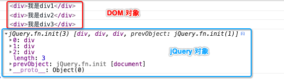

# jQuery


jQuery 框架版本相关介绍

开源许可协议: MIT许可证

官方网址: http://jquery.com

托管仓库: https://github.com/jquery/jquery


版本情况:

jQuery目前分成 1.x版、2.x版、3.x版

从`2.0.0 开始不再支持IE678` 2.0.0 版本之前通过 jQueryMigrateplugin 先前版本保持兼容

`最新版本: 3.3.1` 


# 一、jQuery和js加载对比


## 1、 书写方式的对比


- js 加载的书写方法

  ```
  <script>
      // 监听DOM加载, 等页面加载完再执行JS代码
       window.onload = function () {
           var oDiv = document.getElementsByTagName('button')[0]
           console.log(oDiv);
       }
  </script>
  ```

- jQuery加载的书写方法

  ```
  <script>
      $(document).ready(function () {
          console.log($('div'));
      })
  </script>
  ```

  

## 2、加载时机对比

- **js监听的时机** 

  监听DOM的加载, 等所有的资源(JS/CSS/img...)都加载完才执行函数中的代码

  - 页面的加载顺序是, 先加载DOM再加载其它资源

  ```
  <script>
      // 监听DOM加载, 等所有资源加载才执行JS代码
       window.onload = function () {
           var oDiv = document.getElementsByTagName('button')[0]
           console.log(oDiv);
       }
  </script>
  ```

- **jQuery的监听时机**

  监听DOM加载完毕之后执行回调函数中的代码

  ```
  <script>
  		// 监听到DOM加载完毕就会执行回调函中的代码
      $(document).ready(function () {
          console.log($('div'));
      })
  </script>
  ```

  

## 3、监听方法调用次数对比

- 如果我们使用原生的JS方法监听页面的加载, 如果监听的代码写了多次, 那么后面的会覆盖前面, 如下:

  ```
  <script>
      // 监听DOM加载, 等所有资源加载才执行JS代码
       window.onload = function () {
           var oDiv = document.getElementsByTagName('button')[0]
           console.log('1', oDiv);
       }
       window.onload = function () {
           var oDiv = document.getElementsByTagName('button')[0]
           console.log('1', oDiv);
       }
       
       // 最后的这个onload 会把前面的所有的onload监听覆盖
       window.onload = function () {
           var oDiv = document.getElementsByTagName('button')[0]
           console.log('1', oDiv);
       }
  </script>
  ```

- 如果使用 `jQuery` 的方式监听页面的加载, 监听多少次都没有问题, 不会出现覆盖问题

  ```
  <script>
  		// 监听到DOM加载完毕就会执行回调函中的代码
      $(document).ready(function () {
          console.log('1', $('div'));
      })
      $(document).ready(function () {
          console.log('2', $('div'));
      })
      $(document).ready(function () {
          console.log('2', $('div'));
      })
      
      // 以上三个页面监听都会被执行, 不会存在后面的覆盖前面的问题
  </script>
  ```

  

## 4、jQuery 页面监听加载 书写方式

- 方式1: 

  ```
  $(document).ready(function () {
      // 当监听到DOM加载完毕就会执行这里面的代码
   })
  ```

- 方式2:  `document 可以省略`

  ```
  $().ready(function () {
      // 当监听到DOM加载完毕就会执行这里面的代码
   })
  ```

- 方式3: 最简式

  ```
  $(function () {
      // 当监听到DOM加载完毕就会执行这里面的代码
   })
  ```


# 二 、jQuery 解决冲突(3种)

下面的代码会造成冲突:

```
<script src="jQuery_3.4.1.js"></script>
<script>
    var $ = '我是字符串'
    
    // 此处的 $ 已经被污染了
    $(function () {
        console.log($('div'));
    })
</script>
```

> 出入上面的代码可能造成代码污染(冲突), 我们在导入其它框架的时候也可能造成代码污染(冲突)

为了解决上面的代码污染, 冲突问题, 我们需要这样做

- 方式1: 

  其它使用 `$` 的地方全部替换掉, jQ继续使用`$` 符号

- 方式2: 

  在替换之前,jQ将这个符号让出来, 自己使用其它的符号代替

```
<script>
	var jq = jQuery.noConflict()
	console.log(jq)
	console.log(jq('div'))
</script>

或者
<script>
	var jq = $.noConflict()
	console.log(jq)
	console.log(jq('div'))
</script>
```

- 方式3: 

  如果我们已经写了很多代码了, 发现出现冲突, 我们可以使用立即函数包裹

  ```
  (function($){
  	// 在这里面放心大胆的使用$ 
  	console.log($)
  })(jQuery)
  ```


# 三、 jQuery对象和js对象转换


## 1、DOM 对象和jQuery对象的差异对比


```
<body>

<div>我是div1</div>
<div>我是div2</div>
<div>我是div3</div>

<script>
    var oDiv_dom0 = document.getElementsByTagName('div')[0]
    var oDiv_dom1 = document.getElementsByTagName('div')[1]
    var oDiv_dom2 = document.getElementsByTagName('div')[2]
    console.log(oDiv_dom0);
    console.log(oDiv_dom1);
    console.log(oDiv_dom2);


    $(function () {
        console.log($('div'));
    })

</script>

</body>
```

  


## 2、DOM 对象和jQuery对象的关系

从上图可以我们可以发现以下结论:

- DOM对象和jQuery对象是不同的对象类型
- jQuery对象对DOM对象进行了包装


## 3、DOM对象 —> jQuery对象

- `$(oDiv)`: 将DOM元素包装为 jQuery对象 

  ```
  <body>
  <div>我是div1</div> 
  <script>
      var oDiv_dom0 = document.getElementsByTagName('div')[0] 
      
      // 将 DOM 对象转换为 jQuery 对象
      var oDiv_jq = $(oDiv_dom0)
      console.log(oDiv_jq);
  </script>
  ```

## 4、将jQuery 对象转换为 DOM 对象

- `$('div').length` : 获取jQuery对象中DOM元素的个数

-  `$('div')[0]` : 获取第 0 个DOM元素

- 也可用 `$('div').get(0)`: 获取第 0 个DOM元素

  ```
  <body>
  <div>我是div1</div> 
  <script>
      var oDiv_jq = $('div')
      
      // 和获取
      var oDiv_dom = oDiv_jq[0]
      console.log(oDiv_dom);
      
      // 获取 DOM元素的个数
      console.log(oDiv_jq.length)
  </script>
  
  ```


# 四 、jQuery 操作CSS


## 1、 jQuery 主要功能介绍

- 选择器
- 操作DOM `增加` `删除` `修改` `清空` `复制` `插入` 
- 操作样式
- 事件处理
- 动画和特效
- 网络请求
- 工具方法


## 2 、操作样式

### 1、设置CSS方法(1) `jQ.css('key', 'value')`

- 语法: `jQ.css()`

  > 设置样式: jQ.css('key', 'value')

  ```
  <body>
  
  <div>我是div1</div>
  <button>按钮1</button>
  <button>按钮2</button>
  
  <script>
      $(function () {
          // 给所有的 按钮添加点击事件
          $('button').click(function () {
              // jQ.css('key', 'value')
              $('div').css('width', '200px')
              $('div').css('height', '100px')
              $('div').css('background', 'orange')
          })
      })
  
  </script> 
  </body>
  ```

  - jQuery 支持链式编程

    ```
    $('div').css('width', '200px')
    $('div').css('height', '100px')
    $('div').css('background', 'orange')
    
    // 上面的代码可以简写为 (链式编程)
    $('div').css('width', '200px').css('height', '100px').css('background', 'orange')
    ```

- 书写方法升级

  - `$('div').eq(index)`: 获取指定位置上的jQuery对象

  ```
  <body>
  
  <div>我是div1</div>
  
  <button>按钮1</button>
  <button>按钮2</button>
  <button>按钮3</button>
  
  
  <script>
      $(function () {
          // 通过 .eq(index) 获取指定索引的 jQuery 对象
          $('button').eq(0).click(function () {
              // jQ.css('key', 'value')
              $('div').css('width', '200px')
              				.css('height', '100px')
              				.css('background', 'red')
          })
  
          $('button').eq(1).click(function () {
              $('div').css('width', '200px')
              				.css('height', '100px')
              				.css('background', 'green')
          })
  
          $('button').eq(2).click(function () {
              $('div').css('width', '200px')
              				.css('height', '100px')
              				.css('background', 'blue')
          })
  
      })
  
  </script>
  
  
  </body>
  ```

  

### 2、设置CSS方法(2) `jQ.css({key1:value1})`

如果一次性要修改很多的属性, 我通过 `jQ.css('key','value')` 的方式来修改会很麻烦, 我们可以直接通过传入一个对象来一次性修改

```
 $('button').eq(0).click(function () {
            // jQ.css('key', 'value')
            $('div').css({
                        'width':'200px',
                        'height':'100px',
                        'background': 'red'
                        }) 
}) 
```


###3、  获取CSS 样式`jQ.css(key)`

```
<body>

<div>我是div1</div>  
<button>按钮1</button>  
<script>
    $(function () { 

        $('div').eq(0).css({'width':'100px',
                              'height': '30px' ,
                            "background":'red'}) 

        // 通过 .eq(index) 获取指定索引的 jQuery 对象
        $('button').eq(0).click(function () {
            // jQ.css('key', 'value')
            console.log($('div').eq(0).css("background")); 
        })

    })

</script> 
</body>
```


# 五、 jQuery 操作 class


## 1、 jQuery 操作class 主要有以下几中操作

- `addClass` : 添加样式

- `hasClass`: 检查是否拥有指定的样式

- `removeClass`: 删除样式

- `toggleClass`: 切换样式

  


## 2、jQuery 添加class: `jQ.addClass(clsName)` 

```
<html lang="en">
<head>
    <meta charset="UTF-8">
    <title>Title</title>

    <style>
        .cls1 {
            width: 100px;
            height: 100px;
            background-color: red;
        } 
        .cls2 {
            border: 1px solid #000;
        }
    </style>

    <script src="jQuery_3.4.1.js"></script>

</head>
<body>

    <div></div>
    <button>点击添加样式1</button>
    <button>点击添加样式2</button>
    <button>点击添加样式3</button>

    <script>
        $(function () {
            $('button').eq(0) .click(function () {
                $('div').addClass('cls1')
            })
            $('button').eq(1) .click(function () {
                // 可以使用链式 添加
                $('div').addClass('cls1').addClass('cls2')
            })
            $('button').eq(2) .click(function () {
                // 也可以一起添加, 单个class 之间空格分隔
                $('div').addClass('cls1 cls2')
            })
        })
    </script>
</body>
</html>
```


## 3、 jQuery检查是否有指定class

- `jQ.hasClass(cls)`: 

```
$('button').eq(1) .click(function () {
	// 判断 div 元素是否有 cls1 类
	console.log($('div').hasClass('cls1'));
})
```


## 4、 jQuery 删除class

- `jQ.removeClass (clsName)`: 

```
// 支持链式操作
$('div').removeClass('abc').removeClass('cls1')     
```


## 5 、来回切换样式class

- `$('div').toggleClass()`
  - `$('div').toggleClass('cls')`   添加 或者移除 'cls' 类

```
 $('div').toggleClass('cls1' )
```


# 六、 jQuery 操作标签的位置


## 1、`$('div').width()` `$('div').height()`

- 当使用`width()` 和 `height()`方法时没有传递参数, 那么表示的是获取宽高

  - 获取宽高的时候也可以使用 `jQ.css('width')`  获取到的是字符串有单位

- 如果在使用`width()`和`height()`方法时传递了参数, 那么表示设置宽高

  ```
   <script>
          $(function () {
              $('button').eq(0) .click(function () {
  
                  console.log($('.box').eq(0).width());
                  console.log($('.box').eq(0).height());
              })
   
              $('button').eq(1).click(function () {
                  // 支持链式编程
                  $('.box2').eq(0).width(80).height('70px')
              })
          })
      </script>
  ```

  