# 一、移动端基础常识


##1、移动端基础

###1 、浏览器现状 

- PC端常见浏览器：`360浏览器`  `谷歌浏览器` `火狐浏览器`  `QQ浏览器` `百度浏览器` `搜狗浏览器` `IE浏览器`。 
- 移动端常见浏览器：`UC浏览器` `QQ浏览器 ` `欧朋浏览器` `百度手机浏览器` `360安全浏览器` `谷歌浏览器` `搜狗手机浏览器` `猎豹浏览器` ，以及其他杂牌浏览器。

国内的UC和QQ，百度等手机浏览器都是根据Webkit修改过来的内核，国内尚无自主研发的内核，就像国内的手机操作系统都是基于Android修改开发的一样。

**总结：兼容移动端主流浏览器，处理Webkit内核浏览器即可。**


###2、手机屏幕的现状 

+ 移动端设备屏幕尺寸非常多，碎片化严重。

+ Android设备有多种分辨率：`480x800` `480x854  `  `540x960`   `720x1280` `1080x1920`等，还有传说中的2K，4k屏。

+ 近年来iPhone的碎片化也加剧了，其设备的主要分辨率有：`640x960` ` 640x1136`  `750x1334`  `1242x2208`等。 

  > 作为开发者无需关注这些分辨率，因为我们常用的尺寸单位是 px 。


###3、常见移动端屏幕尺寸  

 

 

### 4、移动端调试方法

+ Chrome DevTools（谷歌浏览器）的模拟手机调试
+ 搭建本地web服务器，手机和服务器一个局域网内，通过手机访问服务器
+ 使用外网服务器，直接IP或域名访问


##二、视口 

`视口（viewport）` 就是浏览器显示页面内容的屏幕区域。 视口可以分为:

- `布局视口` 
- `视觉视口`
- `理想视口` 


### 1、布局视口 layout viewport

**一般移动设备的浏览器都默认设置了一个布局视口，用于解决早期的PC端页面在手机上显示的问题。** 

`iOS, Android`基本都将这个视口分辨率设置为 `980px` ，所以PC上的网页大多都能在手机上呈现，**只不过元素看上去很小，一般默认可以通过手指缩放网页查看。**  

> 一句话, `ios,android` 在默认情况下, 会把名目当成`980px` 的宽度来显示, 意味着显示的内容会被压缩变小, 在屏幕的宽度内全部显示出来, 看起很别扭, 只能通过手指缩放移动才能看清楚. 

 


### 2、视觉视口 visual viewport

**字面意思，它是用户`正在看到的网站`的区域。注意：是网站的区域。** 

**我们可以通过缩放去操作视觉视口，但不会影响布局视口，布局视口仍保持原来的宽度。**

 

 

###3、理想视口 ideal viewport

**为了使网站在移动端有最理想的浏览和阅读宽度而设定** 

理想视口，对设备来讲，是最理想的视口尺寸

**需要手动添写meta视口标签通知浏览器操作** 


**meta视口标签的主要目的：**

- `布局视口`的宽度应该与`理想视口`的宽度一致.

  >  **简单理解就是设备有多宽，我们布局的视口就多宽** 

>  **总结：我们开发最终会用理想视口，而理想视口就是将布局视口的宽度修改为视觉视口**


##三、meta标签

```
// 添加了这个 meta 标签, 对视口进行描述后, 目的就是为了告诉系统你不要在把手机屏幕当成980px宽度来显示了, 文字图片也别压缩了, 屏幕多大就显示多大
<meta name='viewport'
      content='width=device-width,
           	   user-scalable=no,
               initial-scale=1.0,
               maximum-scale=1.0,
               minimum-scale=1.0'
>
```

| 属性            | 解释说明                                    |
| ------------- | --------------------------------------- |
| width         | 设置视口viewport的宽度, 可以设置`device-width` 特殊值 |
| initial-scale | 初始缩放比例, 大于0的数                           |
| maximum-scale | 最大缩放比例, 大于0的数                           |
| minimim-scale | 最小缩放比例, 大于0的数                           |
| user-scale    | 用户是否可以缩放, yes或no(1或0)                   |

最标准的viewport设置, `如果不知道怎么写, 打开一个手机页面查看即可` 

+ 视口宽度和设备保持一致
+ 视口的默认缩放比例1.0
+ 不允许用户自行缩放
+ 最大允许的缩放比例1.0
+ 最小允许的缩放比例1.0


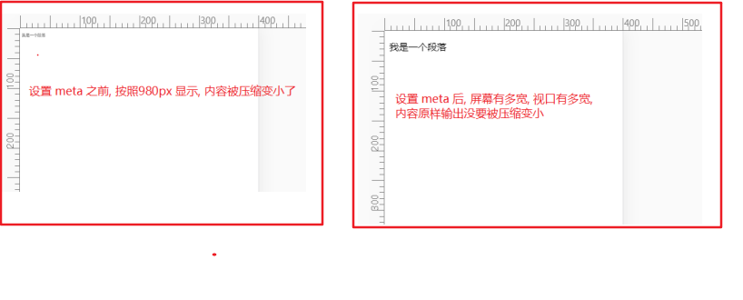 


##四、二倍图


### 1、物理像素&物理像素比

- 什么是物理像素? 

  - **物理像素点指的是屏幕显示的最小颗粒，是物理真实存在的。这是厂商在出厂时就设置好了,比如苹果6 是  750* 1334** 

- 什么是物理像素比? 

  - 我们开发时候的1px 不一定等于1个物理像素的, 但是在PC端一般1px对应一个物理像素

    **一个`px` 的能显示的物理像素点的个数，称为物理像素比或屏幕像素比**  

    简单的理解物理像素比就是, 1px 在手机屏幕上用几个物理像素来显示

  - 如果把1张`100*100`的图片放到手机里面会按照物理像素比给我们缩放显示

lRetina（视网膜屏幕）是一种显示技术，可以将把更多的物理像素点压缩至一块屏幕里，从而达到更高的分辨率，并提高屏幕显示的细腻程度。对于一张` 50px * 50px `的图片,在手机或 Retina 屏中打开，按照刚才的物理像素比会放大倍数，这样会造成图片模糊.

> 即一张`50*50px `图片会被用 `50*50` 个物理像素来显示, 图片拉伸了变模糊
>
> 比如:　`@2x` 的retina屏幕会用 `(50*2) * (50*2)`  即`100*100` 的真实物理像素来显示, 因此图片被拉伸了, 变模糊
>
> 
>
> 也就是说, 在`@2x` 的retina屏幕上, 一个px占用2个物理像素


**在标准的viewport设置中，使用倍图来提高图片质量，解决在高清设备中的模糊问题** 

通常使用二倍图， 因为iPhone 6 的影响背景图片 注意缩放问题


### 2、 什么是2倍图

- 我们需要一个`50*50(css像素)` 的图片, 直接放到`iphone8` 里面因为是retina屏幕, 图片会被放大2倍变成`100*100(物理像素)` 显示, 图片就会变模糊

- 我们的解决方案是, 放一个`100*100(物理像素)` 的图片, 然后手动把这个图片缩小到`50*50(css像素)`  , 这样显示时, 放好是1个`100*100` 的物理像素显示一个`100*100` 物理像素的图片, 不会被拉伸. 

  这样的图片技术, 我们就称为2倍图

> 现在的屏幕分辨率越来越大, 因此还有三倍图, 4倍图 等, 做法是一样的. 


###3、背景缩放 background-size 

background-size 属性规定背景图像的尺寸

```
background-size: 背景图片宽度 背景图片高度;
```

单位： 长度|百分比|cover|contain;

cover把背景图像扩展至足够大，以使背景图像完全覆盖背景区域, 可能有部分图像被裁剪掉。

```
background-size: cover;
```


 

contain把图像图像扩展至最大尺寸，以使其宽度和高度完全适应内容区域

```
background-size: contain;
```


 


### ４、多倍图，　切图神器　cutterman

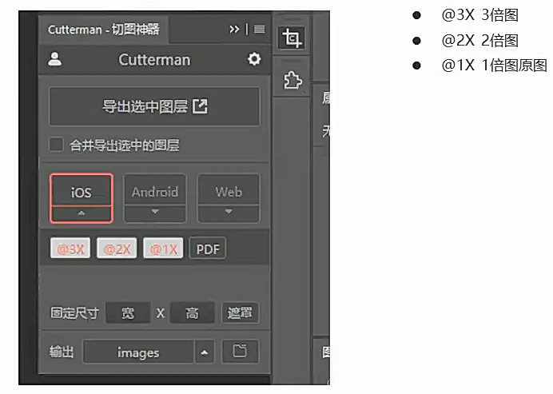 


### ５、二倍精灵图的做法

１、先将二倍的精灵图缩小为原来宽高的一半

２、在缩小尺寸后的精灵图上测量所需图标的坐标位置

３、 设置 `background-size` 为精灵图真实尺寸的一半. 


## 五、移动开发选择和技术解决方案


### 1、移动端主流方案 


#### 1、单独制作移动端页面（主流） 

**通常情况下，网址域名前面加 m(mobile)** 可以打开移动端。

通过判断设备，如果是移动设备打开，则跳到移动端页面。  

> 也就是说，PC端和移动端为两套网站，pc端是pc断的样式，移动端在写一套，专门针对移动端适配的一套网站

京东pc端：

 

 

京东移动端：

  


#### 2.响应式页面兼容移动端（其次）

 


响应式网站：即pc和移动端共用一套网站，只不过在不同屏幕下，样式会自动适配


###2、移动端技术解决方案


#### 1、移动端浏览器兼容问题

移动端浏览器基本以 webkit 内核为主，因此我们就考虑webkit兼容性问题。

我们可以放心使用 H5 标签和 CSS3 样式。

同时我们浏览器的私有前缀我们只需要考虑添加 webkit 即可


#### 2、移动端公共样式

移动端 CSS 初始化推荐使用 normalize.css/

Normalize.css：保护了有价值的默认值

Normalize.css：修复了浏览器的bug

Normalize.css：是模块化的

Normalize.css：拥有详细的文档

官网地址： <http://necolas.github.io/normalize.css/>


####3、移动端大量使用 CSS3盒子模型box-sizing

**传统模式宽度计算：** 

- 盒子的宽度 = CSS中设置的width + border + padding 

**CSS3盒子模型：**

- 盒子的宽度=  CSS中设置的宽度width 里面包含了 border 和 padding 

>  也就是说，我们的CSS3中的盒子模型， padding 和 border 不会撑大盒子了

```
/*CSS3盒子模型*/
box-sizing: border-box;
/*传统盒子模型*/
box-sizing: content-box;
```

移动端可以全部CSS3 盒子模型

> PC端如果完全需要兼容，我们就用传统模式，如果不考虑兼容性，我们就选择 CSS3 盒子模型


### 4、移动端特殊样式

```
/*CSS3盒子模型*/
box-sizing: border-box;
-webkit-box-sizing: border-box;

/*点击高亮我们需要清除清除  设置为transparent 完成透明*/
-webkit-tap-highlight-color: transparent;

/*在移动端浏览器默认的外观在iOS上加上这个属性才能给按钮和输入框自定义样式*/
-webkit-appearance: none;

/*禁用长按页面时的弹出菜单*/
img,a { -webkit-touch-callout: none; }
```


###5、移动端常见布局

移动端单独制作

+ 流式布局（百分比布局）
+ flex 弹性布局（强烈推荐）
+ less+rem+媒体查询布局
+ 混合布局

响应式

+ 媒体查询
+ bootstarp

流式布局：

流式布局，就是百分比布局，也称非固定像素布局。

通过盒子的宽度设置成百分比来根据屏幕的宽度来进行伸缩，不受固定像素的限制，内容向两侧填充。

流式布局方式是移动web开发使用的比较常见的布局方式。


#二、移动web开发——flex布局


## 1、传统布局和flex布局对比

### 1、传统布局

+ 兼容性好
+ 布局繁琐
+ 局限性，不能在移动端很好的布局


### 2、flex布局

+ 操作方便，布局极其简单，移动端使用比较广泛
+ **pc端浏览器支持情况比较差** 
+ **IE11或更低版本不支持flex或仅支持部分** 


### 3、建议

+  **如果是pc端页面布局，还是采用传统方式** 
+  **如果是移动端或者是不考虑兼容的pc则采用flex** 


## 2、flex布局 说明

- 首先,任何一个容器都可以指定为flex布局(弹性布局). 
- 给一个容器设置 `display` 属性为`flex` , 那么盒子内的内容就按照`flex` 方式来布局了, 称为弹性布局
- 被设置了`display` 属性为`flex` 的盒子称为`flex容器` , 其里面的元素称为`项目` 
- flex布局内的子元素都是按照主轴 和 侧轴 的方向来进行布局的
- flex 布局内的子元素**子元素的 float、clear 和 vertical-align 属性将失效。** 


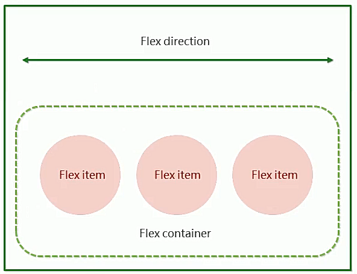  

> **总结flex布局原理**：
>
> 就是通过`给父盒子添加flex属性`，来控制子盒子的`位置`和`排列方式` 


```
// flex 布局示例代码
// 给父元素 设置 display:flex; 子元素就flex布局了

style>
  div{
    width: 800px;
    height: 300px;
    background-color: purple;
    /*给父元素设置display flex, 弹性布局*/
    display: flex;
    /*默认的主轴是x方向默认值row, 剩下的y轴就是侧轴,
    我们的元素是跟着主轴来排列的*/
    flex-direction: column;
  } 
  span {
    background-color: orange;
    margin: 10px;
  } 
</style>


<div>
  <span>1</span>
  <span>2</span>
  <span>3</span>
  <span>4</span>
  <span>5</span>
  <span>6</span>
  <span>7</span>
</div>

```


## 3、flex布局父盒子常用属性

+ `flex-direction`：设置主轴的方向 
+ `justify-content`：设置主轴上的子元素排列方式 
+ `flex-wrap`：设置子元素是否换行   
+ `align-content`：设置侧轴上的子元素的排列方式（多行） 
+ `align-items`：设置侧轴上的子元素排列方式（单行） 
+ `flex-flow`：复合属性，相当于同时设置了 flex-direction 和 flex-wrap 


### 1、flex-direction 主轴方向

- 在我们的弹性布局中有分为主轴和侧轴两个方向(即,水平方向和竖直方向)
- 我们使用属性flex-direction来控制主轴的方向, 剩下的另一个方向自然就是侧轴了(即: 主轴为水平方向, 侧轴就是竖直方向, 主轴是竖直方向, 侧轴就是水平方向)
- 主轴属性flex-direction主要有4个取值:`row` `row-reverse` `column` `column-reverse`  分别代表的是`水平方向从左至右`  `水平方向,从右至左` `竖直方向,从上往下` `竖直方向,从下往上` 
- 主轴属性flex-directtion的默认取值是row, 水平方向从左向右

  

 

| flex-direction 可能的取值 | 含义        |
| -------------------- | --------- |
| row                  | 默认值, 从左到右 |
| row-reverse          | 从右至左      |
| column               | 从上到下      |
| column-reverse       | 从下到上      |

```
 <style> 
  div{
    margin: 10px;
    width: 300px;
    height: 200px;
    background-color: purple;
    float: left;

    /*给父元素设置display flex, 弹性布局*/
    display: flex;
  } 
  span {
    background-color: orange;
    width: 30px;
    height: 40px;
    border: 1px solid #000;
  } 
  .row {
    flex-direction: row;
  } 
  .row-reverse {
    flex-direction: row-reverse;
  } 
  .column {
    flex-direction: column;
  } 
  .column-reverse {
    flex-direction: column-reverse;
  } 
  </style>
  
  <body>

<div class="row">
  <span>1</span>
  <span>2</span>
  <span>3</span>
  <span>4</span>
</div>

<div class="row-reverse">
  <span>1</span>
  <span>2</span>
  <span>3</span>
  <span>4</span>
</div>

<div class="column">
  <span>1</span>
  <span>2</span>
  <span>3</span>
  <span>4</span>
</div>

<div class="column-reverse">
  <span>1</span>
  <span>2</span>
  <span>3</span>
  <span>4</span>
</div>

</body>
```

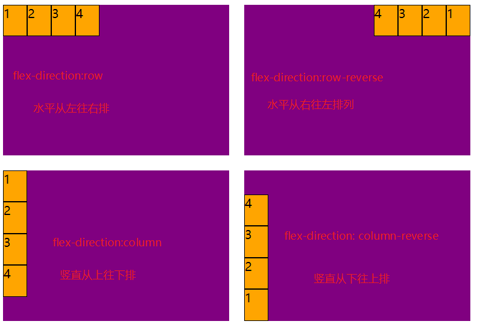 


### 2、 justify-content 主轴子元素对齐

> 在使用**justify-content** 属性时, 一定要先注意主轴的方向
>
> **justify-content** 属性是设置子元素在主轴上的对齐方式, 和侧轴没有关系

| justify-content可能的取值 | 含义                           |
| -------------------- | ---------------------------- |
| flex-start           | 默认值, 从头部开始挨着排,如果主轴是X轴, 则从左到右 |
| flex-end             | 从尾部开始排列                      |
| center               | 在主轴居中对齐(如果主轴是x轴, 则水平居中)      |
| space-around         | 平分剩余空间                       |
| space-between        | 先两边贴边, 再平分剩余空间(重要)           |

 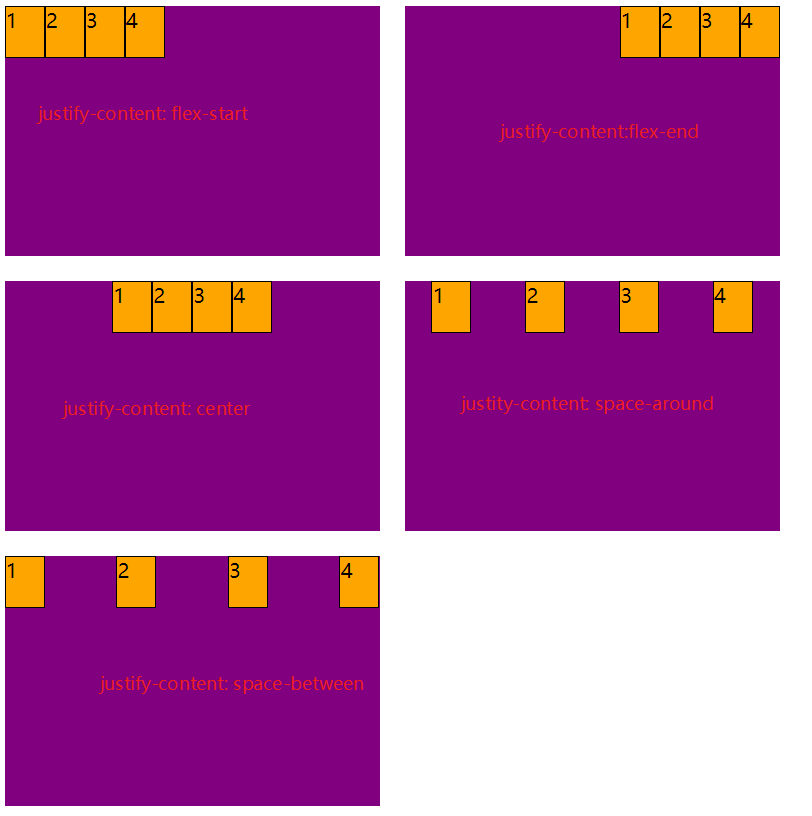  


### 3、flex-wrap主轴子元素换行

- 在flex布局中, 默认情况下子元素是沿着主轴方向排列的, 当主轴为水平方向时, 如果父元素的宽度不够放下所有的子元素时, 子元素的宽度会自动被压缩.  当主轴为竖直方向时, 同理高度会被压缩

- 父盒子的 flex-wrap 属性就是用来控制, 当父盒子一行不能显示所有的子元素时是否需要换行的, 默认是不换行,压缩子元素

- flex-wrap 主要有两个取值: `wrap` `nowrap` 

  | 属性值         | 含义                                  |
  | ----------- | ----------------------------------- |
  | nowrap(默认值) | 当父盒子一行显示不完全部子元素时, 压缩子元素的高度或者宽度, 不换行 |
  | wrap        | 当父盒子一行显示不完全部子元素时, 子元素换行显示           |

  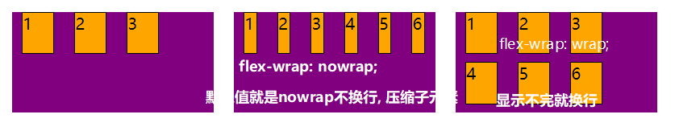 


### 4、align-items 侧轴(单行)子元素对齐 

+ 该属性是控制子项在侧轴（默认是y轴）上的排列对齐方式方式
  + flex-start  默认值, 从头部开始,
  + flex-end 从尾部开始
  + center 居中显示
  + stretch 拉伸

  ```
  <style>
  div{
    margin: 10px;
    width: 200px;
    height: 150px;
    background-color: purple;
    float: left;

    /*给父元素设置display flex, 弹性布局*/
    display: flex;
    /*设置主轴方向*/
    flex-direction: row;
    /*主轴一行显示不完子元素, 换行显示*/
    flex-wrap: wrap;
  }

  span {
    background-color: orange;
    width: 30px;
    height: 40px;
    border: 1px solid #000;
    margin-left: 10px;
    margin-right: 10px;
  }

  .flex-start {
    /*设置侧轴上子元素的对齐方式, 从前往后挨着排*/
    align-items: flex-start; /*默认值*/
  }

  .flex-end {
    /*设置侧轴上子元素的对齐方式, 从后往前挨着排*/
    align-items: flex-end;
  }

  .center{
    /*设置侧轴上子元素的对齐方式, 中间对齐挨着排*/
    align-items: center;
  }

  .stretch  {
    /*设置侧轴上子元素的对齐方式, 沿着侧轴拉伸
    侧轴是Y轴就拉伸高度, 不能设置高度
    侧轴是X轴就拉伸宽度, 不能设置宽度
    */
    align-items: stretch ;
  }

  .stretch span {
    /*相当于是清除之前设置的宽高*/
    width: auto;
    height: auto;
  } 
  </style>

  <body>
  <div class="flex-start">
    <span>1</span>
    <span>2</span>
    <span>3</span>
    <span>4</span>
    <span>5</span>
  </div>

  <div class="flex-end" >
    <span>1</span>
    <span>2</span>
    <span>3</span>
    <span>4</span>
    <span>5</span>
  </div>

  <div class="center" >
    <span>1</span>
    <span>2</span>
    <span>3</span>
    <span>4</span>
    <span>5</span>
  </div>

  <div class="stretch" >
    <span>1</span>
    <span>2</span>
    <span>3</span>
    <span>4</span>
    <span>5</span>
  </div> 
  </body>
  ```

  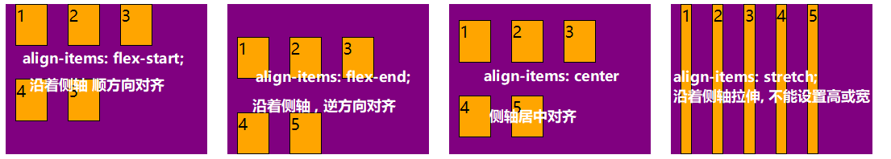  


**注意:**

`align-items` 虽然可以控制子元素在侧轴上的对齐排列方式, 但是它没有`jsutify-content`属性中的`space-around`和`space-between`的效果.  没办法做到多行的对齐效果

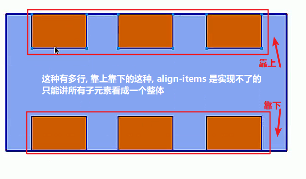 


**总结: **   

flex 布局, 子元素在主轴上的对齐方式使用`jsutify-content` 属性, 子元素在侧轴上的对齐方式使用`align-items` 属性 


### 5、align-content  侧轴(多行)子元素 对齐 

在 flex 布局中, 我们在父盒子中使用justity-content属性控制子盒子在主轴上的排列对齐方式.  在单行模式下,我们使用align-items属性控制子元素在侧轴上的对齐排列方式, align-items 的缺点是没有apace-around 和 space-between 这样2个效果, 为了解决在侧轴上多行子元素达到 space-around 和 space-between 的效果, 我们就不能在使用align-tems 属性了, 我们需要使用align-content 属性来实现. 

> 注意:
>
> align-content 属性只能用在多行, 单行无效
>
> align-items 只能用在单行

| flex-start    | 默认值在侧轴的头部开始排列        |
| ------------- | -------------------- |
| flex-end      | 在侧轴的尾部开始排列           |
| center        | 在侧轴中间显示              |
| space-around  | 子项在侧轴平分剩余空间          |
| space-between | 子项在侧轴先分布在两头, 再平分剩余空间 |
| stretch       | 设置子项元素高度平分父元素高度      |

```
<style> 
  div{
    margin: 10px;
    width: 200px;
    height: 150px;
    background-color: purple;
    float: left;

    /*给父元素设置display flex, 弹性布局*/
    display: flex;
    /*设置主轴方向*/
    flex-direction: row;
    /*主轴一行显示不完子元素, 换行显示*/
    flex-wrap: wrap;
  }

  span {
    background-color: orange;
    width: 30px;
    height: 40px;
    border: 1px solid #000;
    margin-left: 10px;
    margin-right: 10px;
  }

  .flex-start {
    /*设置侧轴上子元素的对齐方式, 从前往后挨着排*/
    align-content: flex-start; /*默认值*/
  }

  .flex-end {
    /*设置侧轴上子元素的对齐方式, 从后往前挨着排*/
    align-content: flex-end;
  }

  .center{
    /*设置侧轴上子元素的对齐方式, 中间对齐挨着排*/
    align-content: center;
  }

  .stretch  {
    /*设置侧轴上子元素的对齐方式, 沿着侧轴拉伸
    侧轴是Y轴就拉伸高度, 不能设置高度
    侧轴是X轴就拉伸宽度, 不能设置宽度
    */
    align-content: stretch ;
  }

  .stretch span {
    /*相当于是清除之前设置的宽高*/
    width: 50px;
    height: auto;
  }

  .space-around {
    /*侧轴上子元素之间平分 多余的空间*/
    align-content: space-around;
  }

  .space-between {
    /*侧轴上子元素之间平分 多余的空间, 首尾子元素两端没有空格*/
    align-content: space-between;
  }

</style>

<body>

<div class="flex-start">
  <span>1</span>
  <span>2</span>
  <span>3</span>
  <span>4</span>
  <span>5</span>
</div>

<div class="flex-end" >
  <span>1</span>
  <span>2</span>
  <span>3</span>
  <span>4</span>
  <span>5</span>
</div>

<div class="center" >
  <span>1</span>
  <span>2</span>
  <span>3</span>
  <span>4</span>
  <span>5</span>
</div>

<div class="stretch" >
  <span>1</span>
  <span>2</span>
  <span>3</span>
  <span>4</span>
  <span>5</span>
</div>

<div class="space-around" >
  <span>1</span>
  <span>2</span>
  <span>3</span>
  <span>4</span>
  <span>5</span>
</div>

<div class="space-between" >
  <span>1</span>
  <span>2</span>
  <span>3</span>
  <span>4</span>
  <span>5</span>
</div> 
</body>
```

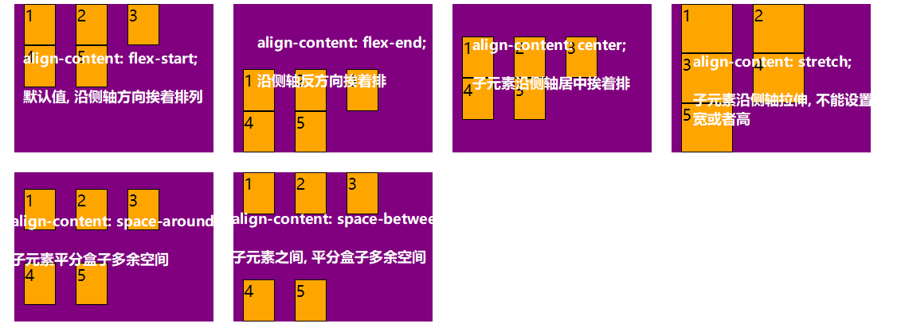 

 


### 6、 align-content 和align-items区别

+ align-items  适用于单行情况下， 只有上对齐、下对齐、居中和 拉伸
+ align-content适应于换行（多行）的情况下（单行情况下无效）， 可以设置 上对齐、下对齐、居中、拉伸以及平均分配剩余空间等属性值。 
+ 总结就是单行找align-items  多行找 align-content


### 7、flex-flow 方向和换行复合属性 

- flex-flow 属性是 flex-direction 和 flex-wrap 属性的复合属性

```
flex-flow:row wrap;
```


## 4、 flex布局子项常见属性

+ flex子项目占的份数
+ align-self控制子项自己在侧轴的排列方式
+ order属性定义子项的排列顺序（前后顺序）


### 1、flex 属性

flex 属性定义子项目分配父盒子剩余空间，用flex来表示占子项占用父盒子剩余空间多少份数。

> 说明: 
>
> - flex 说明子项在主轴方向上占用父盒子剩余空间的多少份
> - 默认值是0

```
<style>
  .box {
    width: 60%;
    height: 120px;
    background-color: pink;
    display: flex;
    padding: 15px;
  }

  .a {
    width: 100px;
    height: 50px;
    background-color: green;
  }

  .b {
    background-color: orange;
    flex: 1;
  }
  .c {
    width: 100px;
    height: 50px;
    background-color: blue;
  }
</style>

<body>
<div class="box">
  <div class="a"></div>
  <div class="b"></div>
  <div class="c"></div>
</div>
</body>
```

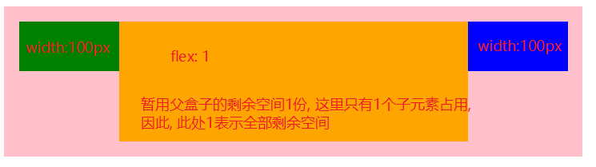 

- 所有子项平分剩余空间

  - 给每个子项都设置 flex: 1;

  ```
  <style>
    .box {
      width: 60%;
      height: 120px;
      background-color: pink;
      display: flex;
      padding: 15px;
    }

    .a {
      flex: 1;
      background-color: red;
    }

    .b {
      flex: 1;
      background-color: green;
    }

    .c {
      flex: 1;
      background-color: blue;
    }
  </style>

  <body>

    <div class="box">
      <div class="a"></div>
      <div class="b"></div>
      <div class="c"></div>
    </div>

  </body>
  ```

  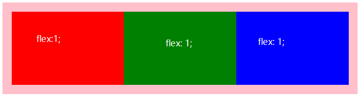  

  ​

> 总结:
>
> flex属性是从剩余空间去分份数


### 2、align-self控制某一子项自己在侧轴上的对齐方式


`justify-content`  或者`align-items`  或者 `align-content`  都是设置在父元素上, 作用在所有子元素上, 所有子元素的排列对齐方式都是一样的, 但是有时我们就是想要有个别子元素他的排列对齐方式与其他元素不同, 这时我们就可以使用`align-self` 通过元素自己来调整自己在侧轴上的对齐方式.


> 注意:
>
> align-self 是设置在子元素上的
>
> align-self 是用来调整自己在侧轴上的对齐方式的
>
> align-self 主要有以下几个取值:`flex-start`  `flex-end` `stretch` `center` 

````
<style>
  div  {
    width: 300px;
    height: 120px;
    float: left;
    margin: 10px;
    background-color: pink;
    display: flex;

  }
  
  span {
    width: 60px;
    height: 40px;
    border: 1px solid #000;
    background-color: purple;
  }
  
  .end span:nth-child(3) {
    align-self: flex-end;
  }

  .center span:nth-child(3) {
    align-self: center;
  }

  .stretch span:nth-child(3) {
    height: auto;
    align-self: stretch;
  }
 
  </style>
  
  <body>

<div  >
  <span>1</span><span>2</span><span>3</span>
</div>

<div class="end">
  <span>1</span><span>2</span><span>3</span>
</div>

<div class="center">
  <span>1</span><span>2</span><span>3</span>
</div>

<div class="stretch">
  <span>1</span><span>2</span><span>3</span>
</div>

</body>
````

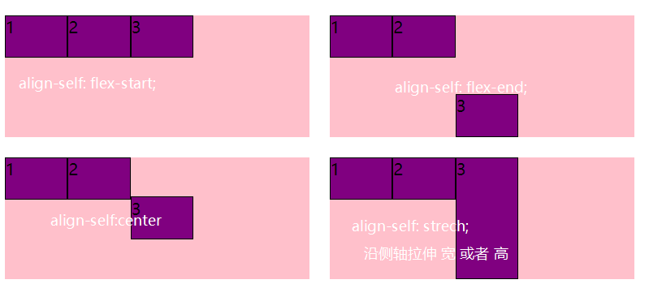   

### 3、order 属性定义项目的排列顺序

在我们使用flex布局时, 元素的排列顺序都是从前往后排的, 但是有时我们就是想要将最后一个元素显示其它位置, 原来的解决方案是修改元素在DOM中的位置, 但是有了 flex 布局中的`order` 属性后, 一切就变的不是那么麻烦了, 我们只需要修改CSS属性中`order` 的取值, 即可调整flex布局中子元素显示的位置.


> - 默认情况下, 每个元素的 `order` 属性值都是`0` 
> - `order` 属性的取值可以是正数也可以是负数, 数值越小, 排在越前面, 如果数值相同就按照DOM中的顺序排列

 

注意：和 z-index 不一样。

```
<style>
  div  {
    width: 300px;
    height: 120px;
    float: left;
    margin: 10px;
    background-color: pink;
    display: flex;
  }

  span {
    width: 60px;
    height: 40px;
    border: 1px solid #000;
    background-color: purple;
  }

  .order span:nth-child(3) {
    order: -1;
  } 
</style>

<body>
  <div>
  <span>1</span><span>2</span><span>3</span>
  </div>

  <div class="order" >
  <span>1</span><span>2</span><span>3</span>
  </div>
</body>
```

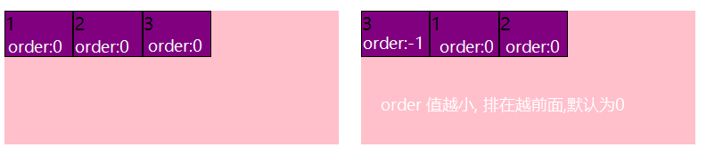

 

 

 

 

 

 

 


 

