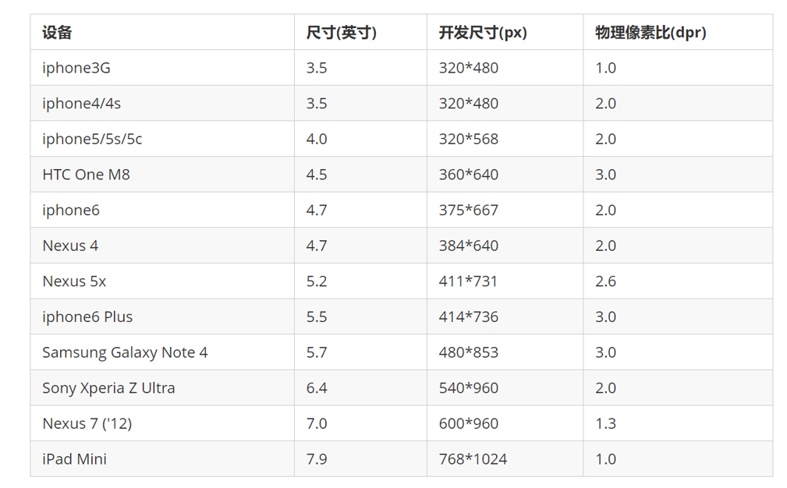
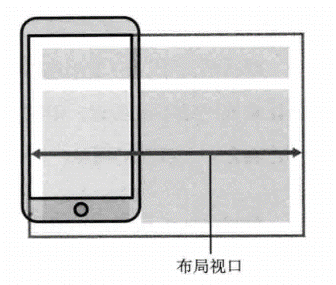

# 一、移动端基础常识


##1、移动端基础

###1 、浏览器现状 

- PC端常见浏览器：`360浏览器`  `谷歌浏览器` `火狐浏览器`  `QQ浏览器` `百度浏览器` `搜狗浏览器` `IE浏览器`。 
- 移动端常见浏览器：`UC浏览器` `QQ浏览器 ` `欧朋浏览器` `百度手机浏览器` `360安全浏览器` `谷歌浏览器` `搜狗手机浏览器` `猎豹浏览器` ，以及其他杂牌浏览器。

国内的UC和QQ，百度等手机浏览器都是根据Webkit修改过来的内核，国内尚无自主研发的内核，就像国内的手机操作系统都是基于Android修改开发的一样。

**总结：兼容移动端主流浏览器，处理Webkit内核浏览器即可。**


###2、手机屏幕的现状 

+ 移动端设备屏幕尺寸非常多，碎片化严重。

+ Android设备有多种分辨率：`480x800` `480x854  `  `540x960`   `720x1280` `1080x1920`等，还有传说中的2K，4k屏。

+ 近年来iPhone的碎片化也加剧了，其设备的主要分辨率有：`640x960` ` 640x1136`  `750x1334`  `1242x2208`等。 

  > 作为开发者无需关注这些分辨率，因为我们常用的尺寸单位是 px 。


###3、常见移动端屏幕尺寸  

 

 

### 4、移动端调试方法

+ Chrome DevTools（谷歌浏览器）的模拟手机调试
+ 搭建本地web服务器，手机和服务器一个局域网内，通过手机访问服务器
+ 使用外网服务器，直接IP或域名访问


##二、视口 

`视口（viewport）` 就是浏览器显示页面内容的屏幕区域。 视口可以分为:

- `布局视口` 
- `视觉视口`
- `理想视口` 


### 1、布局视口 layout viewport

**一般移动设备的浏览器都默认设置了一个布局视口，用于解决早期的PC端页面在手机上显示的问题。** 

`iOS, Android`基本都将这个视口分辨率设置为 `980px` ，所以PC上的网页大多都能在手机上呈现，**只不过元素看上去很小，一般默认可以通过手指缩放网页查看。**  

 


### 2、视觉视口 visual viewport

**字面意思，它是用户`正在看到的网站`的区域。注意：是网站的区域。** 

**我们可以通过缩放去操作视觉视口，但不会影响布局视口，布局视口仍保持原来的宽度。**

 

 

###3、理想视口 ideal viewport

**为了使网站在移动端有最理想的浏览和阅读宽度而设定** 

理想视口，对设备来讲，是最理想的视口尺寸

**需要手动添写meta视口标签通知浏览器操作** 


**meta视口标签的主要目的：**

- `布局视口`的宽度应该与`理想视口`的宽度一致.

  >  **简单理解就是设备有多宽，我们布局的视口就多宽** 

>  **总结：我们开发最终会用理想视口，而理想视口就是将布局视口的宽度修改为视觉视口**


##三、meta标签

```
<meta name='viewport'
      content='width=device-width,
           	   user-scalable=no,
               initial-scale=1.0,
               maximum-scale=1.0,
               minimum-scale=1.0'
>
```

| 属性            | 解释说明                                    |
| ------------- | --------------------------------------- |
| width         | 设置视口viewport的宽度, 可以设置`device-width` 特殊值 |
| initial-scale | 初始缩放比例, 大于0的数                           |
| maximum-scale | 最大缩放比例, 大于0的数                           |
| minimim-scale | 最小缩放比例, 大于0的数                           |
| user-scale    | 用户是否可以缩放, yes或no(1或0)                   |

最标准的viewport设置

+ 视口宽度和设备保持一致
+ 视口的默认缩放比例1.0
+ 不允许用户自行缩放
+ 最大允许的缩放比例1.0
+ 最小允许的缩放比例1.0


##四、二倍图


### 1、物理像素&物理像素比

**物理像素点指的是屏幕显示的最小颗粒，是物理真实存在的。这是厂商在出厂时就设置好了,比如苹果6 是  750* 1334** 


我们开发时候的1px 不是一定等于1个物理像素的

**一个px的能显示的物理像素点的个数，称为物理像素比或屏幕像素比** 

如果把1张`100*100`的图片放到手机里面会按照物理像素比给我们缩放

lRetina（视网膜屏幕）是一种显示技术，可以将把更多的物理像素点压缩至一块屏幕里，从而达到更高的分辨率，并提高屏幕显示的细腻程度。

对于一张 50px * 50px 的图片,在手机或 Retina 屏中打开，按照刚才的物理像素比会放大倍数，这样会造成图片模糊

**在标准的viewport设置中，使用倍图来提高图片质量，解决在高清设备中的模糊问题** 

通常使用二倍图， 因为iPhone 6 的影响背景图片 注意缩放问题


###2、背景缩放 background-size

background-size 属性规定背景图像的尺寸

```
background-size: 背景图片宽度 背景图片高度;
```

单位： 长度|百分比|cover|contain;

cover把背景图像扩展至足够大，以使背景图像完全覆盖背景区域。

contain把图像图像扩展至最大尺寸，以使其宽度和高度完全适应内容区域


## 五、移动开发选择和技术解决方案


### 1、移动端主流方案 


#### 1、单独制作移动端页面（主流） 

**通常情况下，网址域名前面加 m(mobile)** 可以打开移动端。

通过判断设备，如果是移动设备打开，则跳到移动端页面。  

> 也就是说，PC端和移动端为两套网站，pc端是pc断的样式，移动端在写一套，专门针对移动端适配的一套网站

京东pc端：

 

 

京东移动端：

  


#### 2.响应式页面兼容移动端（其次）

 


响应式网站：即pc和移动端共用一套网站，只不过在不同屏幕下，样式会自动适配


###2、移动端技术解决方案


#### 1、移动端浏览器兼容问题

移动端浏览器基本以 webkit 内核为主，因此我们就考虑webkit兼容性问题。

我们可以放心使用 H5 标签和 CSS3 样式。

同时我们浏览器的私有前缀我们只需要考虑添加 webkit 即可


#### 2、移动端公共样式

移动端 CSS 初始化推荐使用 normalize.css/

Normalize.css：保护了有价值的默认值

Normalize.css：修复了浏览器的bug

Normalize.css：是模块化的

Normalize.css：拥有详细的文档

官网地址： <http://necolas.github.io/normalize.css/>


####3、移动端大量使用 CSS3盒子模型box-sizing

**传统模式宽度计算：** 

- 盒子的宽度 = CSS中设置的width + border + padding 

**CSS3盒子模型：**

- 盒子的宽度=  CSS中设置的宽度width 里面包含了 border 和 padding 

>  也就是说，我们的CSS3中的盒子模型， padding 和 border 不会撑大盒子了

```
/*CSS3盒子模型*/
box-sizing: border-box;
/*传统盒子模型*/
box-sizing: content-box;
```

移动端可以全部CSS3 盒子模型

> PC端如果完全需要兼容，我们就用传统模式，如果不考虑兼容性，我们就选择 CSS3 盒子模型


### 4、移动端特殊样式

```
/*CSS3盒子模型*/
box-sizing: border-box;
-webkit-box-sizing: border-box;

/*点击高亮我们需要清除清除  设置为transparent 完成透明*/
-webkit-tap-highlight-color: transparent;

/*在移动端浏览器默认的外观在iOS上加上这个属性才能给按钮和输入框自定义样式*/
-webkit-appearance: none;

/*禁用长按页面时的弹出菜单*/
img,a { -webkit-touch-callout: none; }
```


###5、移动端常见布局

移动端单独制作

+ 流式布局（百分比布局）
+ flex 弹性布局（强烈推荐）
+ less+rem+媒体查询布局
+ 混合布局

响应式

+ 媒体查询
+ bootstarp

流式布局：

流式布局，就是百分比布局，也称非固定像素布局。

通过盒子的宽度设置成百分比来根据屏幕的宽度来进行伸缩，不受固定像素的限制，内容向两侧填充。

流式布局方式是移动web开发使用的比较常见的布局方式。


#二、移动web开发——flex布局


## 1、传统布局和flex布局对比

### 1、传统布局

+ 兼容性好
+ 布局繁琐
+ 局限性，不能再移动端很好的布局


### 2、flex布局

+ 操作方便，布局极其简单，移动端使用比较广泛
+ **pc端浏览器支持情况比较差** 
+ **IE11或更低版本不支持flex或仅支持部分** 


### 3、建议

+  **如果是pc端页面布局，还是采用传统方式** 
+  **如果是移动端或者是不考虑兼容的pc则采用flex** 


## 2、flex布局原理

+ `flex` 是 `flexible Box` 的缩写，意为`"弹性布局"`，用来为盒状模型提供最大的灵活性，**任何一个容器都可以指定为 flex 布局。 ** 
+ 当我们为父盒子设为` flex 布局` 以后，**子元素的 float、clear 和 vertical-align 属性将失效。** 
+ `flex`布局又叫`伸缩布局` 、`弹性布局` 、`伸缩盒布局` 、`弹性盒布局 ` 
+ 采用 `Flex` 布局的元素，称为 `Flex 容器`（flex container），简称"容器"。它的所有子元素自动成为容器成员，称为` Flex 项目`（flex item），简称"项目"。

> **总结**：
>
> 就是通过给父盒子添加flex属性，来控制子盒子的位置和排列方式


## 3、父项常见属性

+ `flex-direction`：设置主轴的方向 
+ `justify-content`：设置主轴上的子元素排列方式 
+ `flex-wrap`：设置子元素是否换行   
+ `align-content`：设置侧轴上的子元素的排列方式（多行） 
+ `align-items`：设置侧轴上的子元素排列方式（单行） 
+ `flex-flow`：复合属性，相当于同时设置了 flex-direction 和 flex-wrap 


### 1、flex-direction设置主轴的方向

+ 在 flex 布局中，是分为主轴和侧轴两个方向，同样的叫法有 ： 行和列、x 轴和y 轴
  + 默认主轴方向就是 x 轴方向，水平向右

  + 默认侧轴方向就是 y 轴方向，水平向下

      

 

>  注意：
>
> - 主轴和侧轴是会变化的，就看` flex-direction ` 设置谁为主轴，剩下的就是侧轴。
> - 而我们的子元素是跟着主轴来排列的


| flex-direction 可能的取值 | 含义        |
| -------------------- | --------- |
| row                  | 默认值, 从左到右 |
| row-reverse          | 从右至左      |
| column               | 从上到下      |
| column-reverse       | 从下到上      |


### 2、 justify-content 设置主轴上的子元素排列方式

| justify-content可能的取值 | 含义                        |
| -------------------- | ------------------------- |
| flex-start           | 默认值, 从头部开始,如果主轴是X轴, 则从左到右 |
| flex-end             | 从尾部开始排列                   |
| center               | 在主轴居中对齐(如果主轴是x轴, 则水平居中)   |
| space-around         | 平分剩余空间                    |
| space-between        | 先两边贴边, 再平分剩余空间(重要)        |

 

### 3、 justify-content 设置主轴上的子元素排列方式 flex-wrap设置是否换行

+ 默认情况下，项目都排在一条线（又称”轴线”）上。flex-wrap属性定义，**flex布局中默认是不换行的。** 
+ nowrap 不换行
+ wrap 换行


### 4、align-items 设置侧轴上的子元素排列方式（单行 ）

+ 该属性是控制子项在侧轴（默认是y轴）上的排列方式  在子项为单项（单行）的时候使用
+ flex-start 从头部开始
+ flex-end 从尾部开始
+ center 居中显示
+ stretch 拉伸


### 5、align-content  设置侧轴上的子元素的排列方式（多行）

设置子项在侧轴上的排列方式 并且只能用于子项出现 换行 的情况（多行），在单行下是没有效果的。

| flex-start    | 默认值在侧轴的头部开始排列        |
| ------------- | -------------------- |
| flex-end      | 在侧轴的尾部开始排列           |
| center        | 在侧轴中间显示              |
| space-around  | 子项在侧轴平分剩余空间          |
| space-between | 子项在侧轴先分布在两头, 再平分剩余空间 |
| stretch       | 设置子项元素高度平分父元素高度      |


 


### 6、 align-content 和align-items区别

+ align-items  适用于单行情况下， 只有上对齐、下对齐、居中和 拉伸
+ align-content适应于换行（多行）的情况下（单行情况下无效）， 可以设置 上对齐、下对齐、居中、拉伸以及平均分配剩余空间等属性值。 
+ 总结就是单行找align-items  多行找 align-content


### 7、 flex-flow 属性是 flex-direction 和 flex-wrap 属性的复合属性

```
flex-flow:row wrap;
```


## 4、 flex布局子项常见属性

+ flex子项目占的份数
+ align-self控制子项自己在侧轴的排列方式
+ order属性定义子项的排列顺序（前后顺序）


### 1、flex 属性

flex 属性定义子项目分配剩余空间，用flex来表示占多少份数。

```
.item {
    flex: <number>; /* 默认值 0 */
}

```


### 2、align-self控制子项自己在侧轴上的排列方式

align-self 属性允许单个项目有与其他项目不一样的对齐方式，可覆盖 align-items 属性。

默认值为 auto，表示继承父元素的 align-items 属性，如果没有父元素，则等同于 stretch。

````
span:nth-child(2) {
      /* 设置自己在侧轴上的排列方式 */
      align-self: flex-end;
}

````


### 3、order 属性定义项目的排列顺序

数值越小，排列越靠前，默认为0。

注意：和 z-index 不一样。

```
.item {
    order: <number>;
}
```


## 5、 携程网首页案例制作

携程网链接：http://m.ctrip.com

1.技术选型

方案：我们采取单独制作移动页面方案

技术：布局采取flex布局

2.搭建相关文件夹


3.设置视口标签以及引入初始化样式

```
<meta name="viewport" content="width=device-width, user-scalable=no,initial-scale=1.0, maximum-scale=1.0, minimum-scale=1.0">

<link rel="stylesheet" href="css/normalize.css">
<link rel="stylesheet" href="css/index.css">
```

4.常用初始化样式

```
body {
  max-width: 540px;
  min-width: 320px;
  margin: 0 auto;
  font: normal 14px/1.5 Tahoma,"Lucida Grande",Verdana,"Microsoft Yahei",STXihei,hei;
  color: #000;
  background: #f2f2f2;
  overflow-x: hidden;
  -webkit-tap-highlight-color: transparent;
}

```

5.模块名字划分


 

