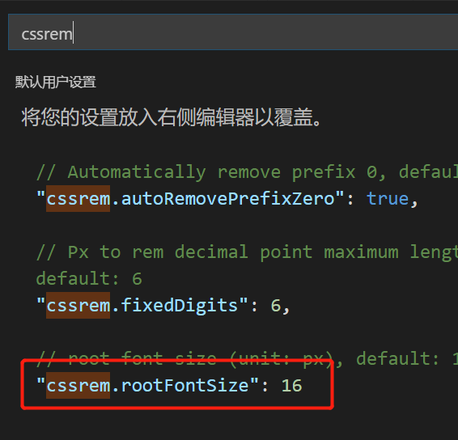

# 移动web开发之rem布局


## 移动端适配方案探讨:

1. 页面布局文字能否随着屏幕大小变化而变化? 
2. 流式布局和flex布局主要针对宽度布局, 那高度如何设置呢? 
   1. 流式布局和flex布局主要都是针对宽度来适配的, 高度一般是不会变化的. 
3. 怎么样让屏幕发生变化的时候元素高度和宽度等比例缩放? 


#一、rem基础


## 1、什么是rem 

**rem (root em)是一个相对单位，类似于em。 em是当前元素字体大小，不同的是rem的基准是相对于html元素的字体大小。** 

> 比如:
>
> 根元素（html）设置font-size=12px; 
>
> 非根元素设置width:2rem,换成px表示就是24px。 就是说当前 `2rem == 24px` 
>
> 在html文档中, `html` 标签是怎个元素的根标签
>
> ```
> <!DOCTYPE html>
> <html lang="en">
> <head>
>   <meta charset="UTF-8">
>   <title>Title</title> 
>   <style> 
>   	/* 根html 为 12px */
> 	html {
>    		font-size: 12px;
> 	}	
>     /* 此时 div 的字体大小就是 24px */       
> 	div {
>     	font-size: 2rem; // 等价于24px
> 	}		
>   </style> 
> </head>
> <body> 
> 	<div></div>
> </body>
> </html>
> ```

```
 
```


## 2、rem的优势 

在一个HTML文档中, 可能有很多的父元素标签, 但是只有一个html根标签. 如果布局的时候子元素时参考父元素字体大小来定义, 那么整个网站的布局就会变得很混乱而且不易维护, 但是所有的子元素都参考html标签的字体大小来定义, 那么整个网站元素的大小将变得易于维护, 因为html元素只有一个. 我们可以根据不同的情况来调整html元素的字体大小达到一改全改的适配效果. 


# 二、媒体查询 

## 1、什么是媒体查询

**媒体查询（Media Query）是CSS3新语法。** 

+ 使用` @media` 查询，可以针对不同的媒体类型定义不同的样式
+ `@media`  可以针对不同的屏幕尺寸设置不同的样式
+ 当你重置浏览器大小的过程中，页面也会根据浏览器的宽度和高度重新渲染页面 
+ 目前针对很多苹果手机、Android手机，平板等设备都用得到多媒体查询


## 2、媒体查询语法规范

+ 语法规范:

  ```
  @media 媒体类型 关键字 (特征值) {
      //css 代码
     body {
          background-color: blue;
        }
  }
  ```

  > - 1. `@media` 是关键字, 固定写法
  >
  > - 2. 媒体类型 , 可以取值主要有3个:`all` `print` `screen` 
  >      - `all`:　表示用于所有的设备
  >      - `print`：表示用于打印设备和打印预览
  >      - `screen`:  表示用于电脑屏幕, 平板电脑, 智能手机等
  >
  > - 3. 关键字主要有3个: `and`  `not`  `only` 
  >
  >      - `and`:  表示媒体类型与特征值是且的关系
  >
  >      - `not`: 表示媒体类型与特征值是非的关系
  >
  >      - `only`:　 表示媒体类型与特征值是有且仅有的关系
  >
  >        ​
  >
  > - 4. 特征值, 主要有3种`width` `max-width` `min-width` ,书写时特征值有括号, 
  >
  >      eg: (width: 300px) , 表示宽度为300px


## 3、媒体查询一句话理解

 简单的说, 媒体查询就有点像我们变成语言中的 `if(表达式){}`  语句, 当满足条件时执行里面的css 代码, 示例如下

```
<style>
 	// 含义:　当屏幕的宽度不超过　1200px 时, 执行里面的css代码
    @media screen and (max-width: 1200px){
      body {
        background-color: red;
      }
    }

	// 含义:　当屏幕的宽度不超过　800px 时, 执行里面的css代码
    @media screen  and (max-width: 800px) {
      body {
        background-color: green;
      }
    }
    
	// 含义:　当屏幕的宽度不超过　600px 时, 执行里面的css代码
    @media screen  and (max-width: 600px) {
      body {
        background-color: blue;
      }
    }
  </style>
```


上面的媒体查询可以理解成下面的伪代码

```
if(屏幕<=1200px){
  body 显示red 色
}

if(屏幕<=800px){
  body 显示green 色
}

if(屏幕<=600px){
  body 显示蓝色
}
```


 

##4、媒体查询书写规则 

因为html 中的代码是从上往下执行的, 因此媒体查询一般按照从大到小或者从下到大的规则来书写, 避免属性顺序混乱

```
<style>
 	// 含义:　当屏幕的宽度不超过　1200px 时, 执行里面的css代码
    @media screen and (max-width: 1200px){  // 大
      body {
        background-color: red;
      }
    }

	// 含义:　当屏幕的宽度不超过　800px 时, 执行里面的css代码
    @media screen  and (max-width: 800px) { // 中
      body {
        background-color: green;
      }
    }
    
	// 含义:　当屏幕的宽度不超过　600px 时, 执行里面的css代码
    @media screen  and (max-width: 600px) { // 小
      body {
        background-color: blue;
      }
    }
  </style>
```


## 5、媒体查询的主要应用场景


媒体查询的主要应用场景是根据屏幕宽度的不同, 动态的调整一些CSS属性,表现出不同的样式. 其中一个最重要的应用场景就是, 根据屏幕屏幕尺寸的变化动态的调整 `html`  元素的字体大小. 


```
@dedia screen and (max-width: 530px){
  body {
    backgroundColor: red;
  }
}

@media screen and (min-width : 540px) and (max-width: 969){
  body {
    backgroundColor: green;
  }
}
@media screen and (min-width: 970px){
  body {
     backgroundColor: blue;
  }
}
```


## 6、CSS 引入资源

是这样的, 有时我们可能有这样的需求,  当大屏幕时我们显示一套样式, 当小屏幕时我们显示另外一套样式. 这时我们就可以使用媒体查询引入外部资源的特点, 在不同大小的屏幕情况下引入不同的CSS文件, 将不同样式的文件单独书写, 这样方便后期维护. 

即: 

- 大屏幕时, 样式是单独一套, 使用媒体查询单独引用

- 小屏幕时, 样式是另一套单独的, 使用媒体查询单独引用

  > 不同的样式单独书写, 便于程序的维护和解耦


媒体查询, 引入资源的原理就是, 针对不同的媒体(屏幕尺寸、设备类型)使用不同的`Stylesheet(CSS样式表)` , 在`link` 中判断设备的类型, 然后引入不同的`css文件` 


**示例:**

```
<link rel="stylesheet" href="style320.css" media="screen and (min-width: 320px)">   //当320屏幕时执行这个
<link rel="stylesheet" href="style640.css" media="screen and (min-width: 640px)"> //当640屏幕时执行这个
```


# 三、less 基础 


## 1、维护css弊端 

CSS 是一门非程序式语言，没有`变量`、`函数`、`SCOPE（作用域）` 等概念。

+ CSS 需要书写大量看似没有逻辑的代码，CSS 冗余度是比较高的。

+ 不方便维护及扩展，不利于复用。

+ CSS 没有很好的计算能力

+ 非前端开发工程师来讲，往往会因为缺少 CSS 编写经验而很难写出组织良好且易于维护的 CSS 代码项目。


## 2、Less介绍

**Less（LeanerStyle Sheets 的缩写）是一门` CSS扩展语言` ，也称为CSS预处理器。**  

做为 CSS的一种形式的扩展，它并没有减少CSS的功能，而是在现有的CSS语法上，为CSS加入程序式语言的特性。

它在CSS 的语法基础之上，引入了`变量`，`Mixin（混入）`，`运算`以及`函数`等功能，大大简化了 CSS 的编写，并且降低了 CSS的维护成本，就像它的名称所说的那样，Less可以让我们用更少的代码做更多的事情。


Less中文网址：[http://](http://lesscss.cn/)[less](http://lesscss.cn/)[css.cn/](http://lesscss.cn/)

常见的CSS预处理器：`Sass`、`Less`、`Stylus` 

> 一句话：Less是一门 CSS 预处理语言，它扩展了CSS的动态特性。


## 3、Less安装

①安装nodejs，可选择版本(8.0)，网址：<http://nodejs.cn/download/>

②检查是否安装成功，使用cmd命令（win10是window+r 打开运行输入cmd）  ---输入`node –v` 查看版本即可

③基于nodejs在线安装Less，使用cmd命令`npm install -g less`即可 

④检查是否安装成功，使用cmd命令` lessc -v `查看版本即可 


## 4、Less 使用基础


1、首先我们需要新建一个后缀为`.less` 的文件, 在这个`.less` 文件里面书写`less` 


## 5、Less 变量


### 1、Less 变量语法

变量是指没有固定的值，可以改变的。在传统的css 中我们在不同的选择器中可能使用相同的值, 比如: red (红色), 需要修改这个值时, 整个页面中都需要查找替换很麻烦,  这时我们就可以使用一个变量接收它, 其它地方使用这个变量即可, 这样可以做到一改全改. 

```
// less 变量的格式
@变量名:值;
```

+ **必须有`@`为前缀 **
+ **不能包含特殊字符**
+ **不能以数字开头**
+ **大小写敏感   ** 


### 2、Less 变量示例

```
// 定义less 变量

// 定义导航条背景色
@navBackGroudColor: white;
// 定义文字颜色
@textColor: gray;
// 定义边框颜色
@borderColor: orange;


// 在选择器中使用 less变量
.nav {
  //在选择器中直接使用定义好的变量, 替代原来直接书写值
  background-color: @navBackGroudColor;
  color: @textColor;
  border: 1px solid @borderColor;
}
```

> 如果以后想要修改选择其中的值, 只需要修改变量的值就可, 无需一个个的查找替换

## 6、Less 编译 


### 1、Less 转换为css

本质上, Less 包含一套自定义的语法即一个解析器, 用户根据这些语法定义自己的样式规则, 这些规则最终会通过解释器, 编译生成对应的CSS文件. 

所以,我们需要把我们的less文件, 编译生成css文件, 这样我们的html页面才能使用. `Easy LESS`   插件就是用来把`less文件`编译为`css文件`  的一个VS Code 插件


### 2、安装Easy Less插件

 


`Easy Less` 插件安装好后, 只要保存一下Less文件，会自动生成一个与`less文件` 同名的`CSS文件` 。


## 6、Less 嵌套选择器(`后代` `伪类` `伪元素` `交集` ) 

### 1、less 后代选择器

```
// 定义less变量
@bgColor: red;
@textColor:purple;

div {
	background-color: @bgColor;
	a {
      color: @textColor;
	}
}

// 下面是Less 转换后的css 代码
div {
  background-color: red;
}
div a {
  color: purple;
}
```


### 2、less伪类选择器

```
// 定义less变量
@bgColor: red;
@textColor:purple;

a {
    &:hover {
        color: @textColor;
    }
}

// 下面是Less 转换后的css 代码
a:hover {
  color: purple;
}
```


```
// 定义less变量
@bgColor: red;
@textColor:purple;

a {
    &:nth-child(1){
        color: @textColor;
    }
}

// 下面是Less 转换后的css 代码
a:nth-child(1) {
  color: purple;
}
```


###3、less交集选择器

```
// 定义less变量
@bgColor: red;
@textColor:purple;

div {
    &.nav {
        color: @textColor;
    }
}

// 下面是Less 转换后的css 代码
div.nav {
  color: purple;
}

```


###4、伪元素选择器

```
// 定义less变量
@bgColor: red;
@textColor:purple;

div { 
    &::before {
        content:'';
        display: block;
        width: 100px;
        height: 100px;
        background-color: @bgColor;
    }
}

// 下面是Less 转换后的css 代码
div::before {
  content: '';
  display: block;
  width: 100px;
  height: 100px;
  background-color: red;
}
```


## 8、Less 运算 


### 1、less 运算符的简单使用

**任何`数字`、`颜色`或者`变量`都可以参与运算。** 

就是Less提供了加`（+）`、`减（-）` 、`乘（*）`、`除（/）`算术运算。 

```
// 定义less变量 
@bgColor: red;
@textColor:purple;
@boxWidth: 200px;
@boxHeight: @boxWidth * 0.5;
 
.box{
    width: @boxWidth;
    height: @boxHeight;
    background-color: @bgColor;
}

.box2 {
    width: @boxWidth * 0.5;
    height: @boxHeight * 0.5;
    background-color: @bgColor * 0.3;
}

.box3 {
    width: (@boxWidth + 2) * 0.5;
    height: @boxHeight * 0.5;
    background-color: @bgColor * 0.3;
}

.box4 {
    background-color: #fff * 0.5;
    color: #fff - #222;
}


 // 下面是Less 转换后的css 代码
.box {
  width: 200px;
  height: 100px;
  background-color: red;
}
.box2 {
  width: 100px;
  height: 50px;
  background-color: #4d0000;
}
.box3 {
  width: 101px;
  height: 50px;
  background-color: #4d0000;
}
.box4 {
  background-color: #808080;
  color: #dddddd;
}

```

> - 乘号（*）和除号（/）的写法
> - 运算符中间左右有个空格隔开 `1px + 5` , **不能写成`1px+5` ** 
> - 对于两个不同的单位的值之间的运算，运算结果的值取第一个值的单位 
> - 如果两个值之间只有一个值有单位，则运算结果就取该单位


### 2、less运算符单位的转换

- 当在less 中使用表达式计算式, 如果计算符号左右的单位不一样,那么以最前面为准, 示例如下:

  ```
  .box1 {
       width: 10px * 2rem; // 结果的单位是 px
   }
   
   .box2 {
       width: 10 * 10px; // 单位为px
   }

   .box3 {
       width: 10rem * 10px; // 单位为rem
   }
   
   
   // 下面是Less 转换后的css 代码
  .box1 {
    width: 20px;
  }
  .box2 {
    width: 100px;
  }
  .box3 {
    width: 100rem;
  }
  ```

  ​


##9、less文件导入其它的less 文件

- 语法格式:

  ```
  // 在less文件中输入写下这句话, 即可将外部的 `common.less` 文件导入当前less 文件
  @import 'common' 
  ```

  ​

  - **common.less 文件内容** 

    ```
    // 定义less 变量
    @count: 15;  // 整个屏幕划分成count份

    html { // 如果是PC端就限定死 50px, 太大了不好看
    	font-size:  50px;
    }

    @media screen and (min-width: 320px){
        html {
            font-size: 320PX / @count;
        }
    }

    ```

  - **index.less 文件内容**  

    ```
    @bgColor: red;
    @import 'common';

    div {
        background-color: @bgColor;
    }
    ```

  - **转换后的index.css文件内容** 

    ```
    html {
      font-size: 50px;
    }
    @media screen and (min-width: 320px) {
      html {
        font-size: 21.33333333PX;
      }
    }
    div {
      background-color: red;
    }
    ```

    ​

  ​

#四、rem适配方案1(rem + media) 


## 1、什么是rem适配? 

1.让一些不能等比自适应的元素，达到当设备尺寸发生改变的时候，等比例适配当前设备。

2.使用媒体查询根据不同设备按比例设置html的字体大小，然后页面元素使用rem做尺寸单位，当html字体大小变化元素尺寸也会发生变化，从而达到等比缩放的适配。


##2、rem适配技术方案：

1、`less` + `rem` + `媒体查询` 

2、 `lflexible.js` +  `rem` 

> 总结： 
>
> - 两种方案现在都存在。
> - 方案2 更简单，现阶段大家无需了解里面的js代码。

 


##3、rem实际开发适配方案1

①假设设计稿是750px 

②假设我们把整个屏幕划分为15等份（划分标准不一,可以是20份也可以是10等份）

③每一份作为html字体大小，这里就是50px

④那么在320px设备的时候，字体大小为320/15就是  21.33px

⑤用我们页面元素的大小除以不同的 html字体大小会发现他们比例还是相同的

⑥比如我们以750为标准设计稿

⑦一个`100*100` 像素的页面元素在  750屏幕下，  就是 `100/ 50 `  转换为rem  是  `2rem*2rem`  比例是1比1 

⑧320屏幕下，  html字体大小为21.33   则 2rem=  42.66px  此时宽和高都是 42.66  但是宽和高的比例还是 1比1

⑨但是已经能实现不同屏幕下  页面元素盒子等比例缩放的效果

```
<style>
  @media screen and (min-width: 320px){
  	html { 
      font-size: 21.33px;  /* 320px / 15,  屏幕宽度15等分为1个rem */
    }
  }

  @media screen and (min-width: 750px){
    html { 
      font-size: 50px;  /* 750px / 15,  屏幕宽度15等分为1个rem */
    }
  }
  
  	// 我们以6s屏幕做参考来布局, 1个rem 相当于50px来度量
	// 那么我们要表示6s 下的一个 100 * 100 的盒子就 是2rem * 2rem

  div {
    width : 2rem;
    height: 2rem;
  }
</style>

<div> </div>
```

> 总结:
>
> 我们把1个rem按照50px来布局页面, 1个 rem当成50px用, 后面不同的屏幕修改rem的大小就动态适配


## 4、less + rem 适配小公式

- 结论:

  - `总份数` * `rem`  表示的是最宽宽度
  - `rem`  /  `remFont`  表示的是 `1px` , remFont表示的是1个rem代表的字体大小, eg: 750px / 15 = 50px
  - 表示任意宽度, 比如表示 97px, 可以写为: `97rem / 每份宽度` 

  ```
   @count : 15;  // 屏幕总共分为15份
   @remFont: 750 / @count; // 每一份的宽度

   html {
       font-size: 50px;  // 规定屏幕最宽的标准不能超过750, 超过按750标准算
   }

   @media screen and (min-width: 320px){
      html {
          font-size: 320PX / @count;
      }
  }

  @media screen and (min-width: 375px){
      html {
          font-size: 375PX / @count;
      }
  }
   
  @media screen and (min-width: 720pxx){
      html {
          font-size:  720px / @count;
      }
  }


  // 下面是重点
  .box1 {
      width:  count * 1rem; // 表示可以接受的最大宽度
  }
   
  .box2 {
      width: 88rem / @remFont; // 表示的是标准设计文档 750px 尺寸下的 88px
      // rem / @remFont 表示的就是 1px
  }
  ```

  ​

## 5、less 下的媒体查询 (rem + less + 媒体查询) 

 

```
//common.less 文件内容

// 定义less 变量
@count: 15;  // 整个屏幕划分成count份

html { // 如果是PC端就限定死 50px, 太大了不好看
	font-size: 50px;
}
// 通常关注的屏幕尺寸有: 320px 360px 375px 384px 400px 414px 424px 480px 540px 720px 
@media screen and (min-width: 320px){
    html {
        font-size: 320PX / @count;
    }
}

@media screen and (min-width: 360px){
    html {
        font-size: 360PX / @count;
    }
}

@media screen and (min-width: 375px){
    html {
        font-size: 375PX / @count;
    }
}

@media screen and (min-width: 384px){
    html {
        font-size: 384PX / @count;
    }
}

@media screen and (min-width: 400px){
    html {
        font-size: 400px / @count;
    }
}

@media screen and (min-width: 414px){
    html {
        font-size:  414px / @count;
    }
}

@media screen and (min-width: 424px){
    html {
        font-size:  424px / @count;
    }
}

@media screen and (min-width: 480px){
    html {
        font-size:  480px / @count;
    }
}

@media screen and (min-width: 540px){
    html {
        font-size:  540px / @count;
    }
}

@media screen and (min-width: 720pxx){
    html {
        font-size:  720px / @count;
    }
}
```


# 五、rem 适配方案2 (rem + flexible.js)


## 1、flexible.js 库介绍 

**`flexible.js` 是手机淘宝团队出的简洁高效 移动端适配库**, 有了`flexible.js` 后我们再也不需要写不同屏幕的媒体查询，因为里面js做了处理


- flexible.js 库的原理:
  - flexible.js 库的原理是把屏幕划分成10等分,不同宽度设备下比例是一致的. 
- 使用`flexible.js` 代替自己手动写不同屏幕的媒体查询后, 我们要做的就是确定好当前设备的html字体大小就可以了. 
  - 比如当前设计稿是 750px， 那么我们只需要把 html 文字大小设置为 75px(750px / 10) 就可以


github地址：[https://github.com/amfe/lib-flexible](https://link.jianshu.com/?t=https://github.com/amfe/lib-flexible)


##2、cssrem 插件

### 1、什么是cssrem插件?

- `cssrem` 插件是一个能够将 `px` 单位动态转换为`rem` 单位的插件, 有了这个`cssrem` 插件后, 我们利用`flexible.js 框架` + `cssrem插件` 就能很轻松的写出适配屏幕宽度的网页出来. 

   


### 2、为什么要使用cssrem插件


我们在使用 `less + rem + 媒体查询` 时,我们是可以使用变量`@baseFont`  来表示1个rem的字体大小的. 如下: 

```
 @count : 15;  // 屏幕总共分为15份
 @perWidth: 750 / @count; // 每一份的宽度
```

这样我们就可以很容易的表示出 1px 与 rem之间的关系, 可以直观的写出表示元素宽高的表达式, 如下示例.

```
 @count : 15;  // 屏幕总共分为15份
 @perWidth: 750 / @count; // 每一份的宽度
 
 html {
     font-size: 50px;  // 规定屏幕最宽的标准不能超过750, 超过按750标准算
 }

 @media screen and (min-width: 320px){
    html {
        font-size: 320PX / @count;
    }
}

@media screen and (min-width: 375px){
    html {
        font-size: 375PX / @count;
    }
}

// 下面是重点
.box1 {
    width:  count * 1rem; // 表示可以接受的最大宽度
}

.box2 {
    width: 88rem / @perWidth; // 表示的是标准设计文档 750px 尺寸下的 88px
    // rem / @perWidth 表示的就是 1px
}
```

但是, 当我们使用`flexible.js` 库时, 虽然不需要我们在繁琐的写各种设备的媒体查询, 我们知道`flexible.js` 内部是将整个屏幕宽度划分为1份来表示, 但是我们没办法知道一个rem具体用什么来表示他的大小, 即, 我们使用`flexible.js` 时不知道 `@baseFont`  , 且在CSS中也不支持表达式. 因此要借助于 `cssrem` 插件的帮助. 


### 3、cssrem 插件的详细使用

VSCode  px 转换rem 插件 cssrem 

因为cssrem中css自动转化为rem是参照默认插件的16转换的所以需要自己配置




