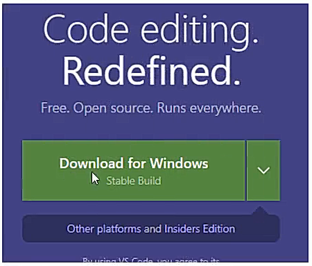
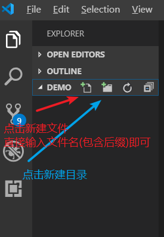
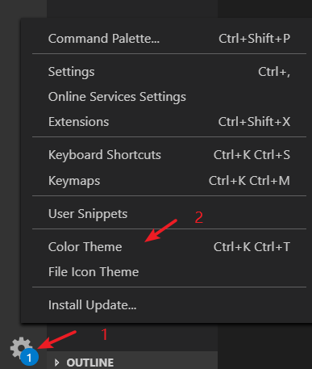
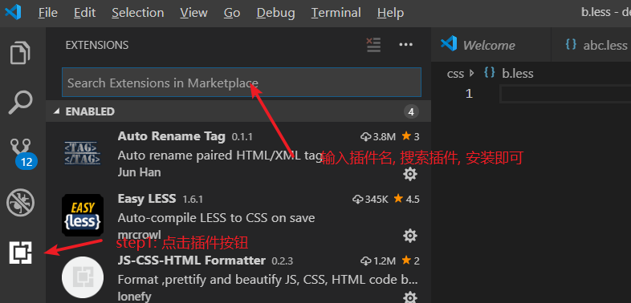

# VS Code

# 一、VS Code 简介

Visual Studio Code (简称 VS Code / VSC) 是微软公司推出的一款免费开源的现代化轻量级代码编辑器，支持几乎所有主流的开发语言的语法高亮、智能代码补全、GIT 等特性，支持插件扩展等等。

推荐理由：

- 比 sublime 开源，比 webstorm 更轻
- 智能提示很强大
- 自带 emmet (HTML速写)
- 插件安装非常方便
- 自带强大的调试功能
- 软件跨平台支持 Win、Mac 以及 Linux。

> VS Code 使用node 开发的

# 二、 VS Code 安装

官网下载地址： <https://code.visualstudio.com/>

  

下载完成后, 直接双击安装即可

# 三、 VS Code 使用

## 1、文件目录(或者工程目录)管理

###1、打开工程项目目录或者文件夹

`file`  -> `Open Folder` 

- 当前目录是一个 `html 网站的工程目录` 就可以直接打开编辑了
- 如果当前目录是一个空目录, 就可以打开,创建文件开始编辑

 

### 2、新建文件或者文件夹

- 点击新建文件图标创建文件
  - 输入文件名时, 需要包含后缀名
- 点击新建目录图标, 新建目录

 

## 2、颜色主题设置

 

# 四、VS Code 插件安装

## 1、搜索安装插件

 

## 2、推荐安装插件

| 插件                                       | 作用                       |
| ---------------------------------------- | ------------------------ |
| Chinese (Simplified) Language Pack for VS Code | 中文简体语言包                  |
| Open in Browser                          | 右击选择浏览器打开HTML            |
| JS-CSS-HTML Formatter                    | 每次保存都会自动格式化 HTML 和CSS 代码 |
| Auto Rename Tag                          | 自动重命名配对的HTML/XML标签       |
| CSS Peek                                 | 追踪至样式                    |
| Easy Less                                | 自动将less 装换成对应的css        |

